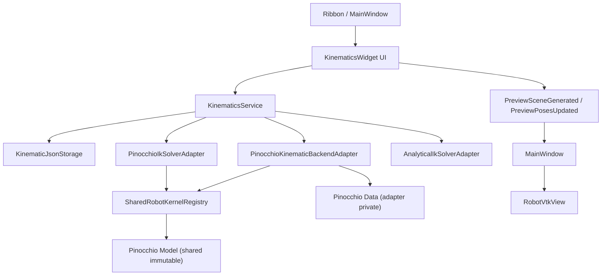
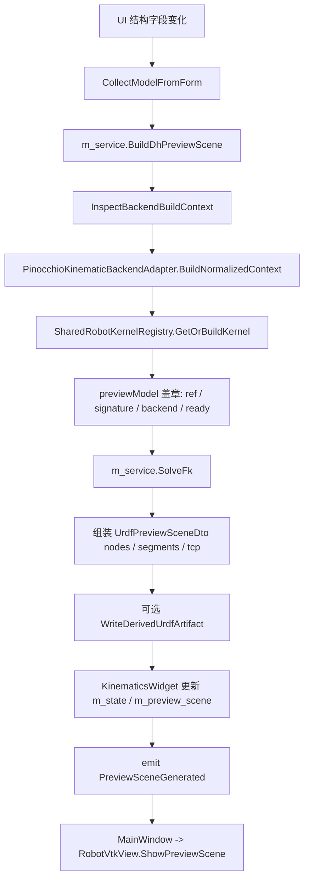
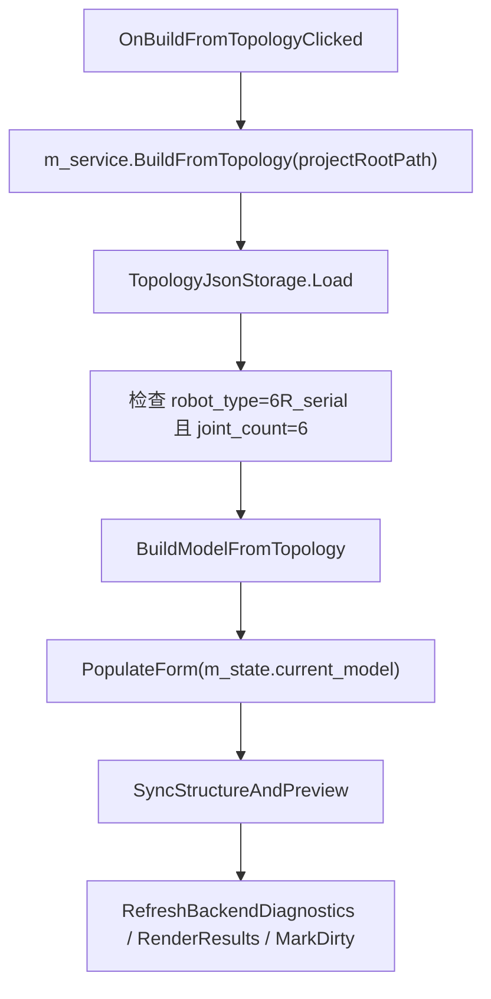

# RoboSDP 运动学模块程序流程说明

本文档用于快速掌握 `modules/kinematics` 运动学模块的整体程序流程、关键数据结构、UI 事件流、Service 主链、Pinocchio 共享内核接入、URDF/DH 双主模型状态机、持久化与测试入口。

适用代码范围：

- `modules/kinematics/**`
- `core/kinematics/SharedRobotKernelRegistry.*`
- `apps/desktop-qt/MainWindow.*` 中与 Kinematics 相关的信号路由
- `apps/desktop-qt/widgets/vtk/RobotVtkView.*` 中与运动学预览相关的入口
- `tests/unit/kinematics/**`

## 1. 总览

运动学模块负责把上游拓扑或外部 URDF 转换成可求解、可预览、可保存、可下游复用的统一机器人运动学模型。

核心职责：

- 从 Topology 生成 DH/MDH 参数化运动学模型。
- 导入 URDF 工程模型，并生成中央 3D 骨架/mesh 预览。
- 支持 DH/MDH 主模型与 URDF 主模型之间的状态切换。
- 执行 FK、IK、Workspace、Jacobian、奇异区、可达性分析。
- 将预览场景和轻量位姿更新发送给中央 VTK 视图。
- 保存/加载 `kinematics/kinematic-model.json` 和 `kinematics/workspace-cache.json`。
- 生成统一机器人主链快照，供 Dynamics / Planning / Scheme 下游模块共享。

一句话心智模型：

> `KinematicsWidget` 收集表单状态，`KinematicsService` 编排业务流程，`Pinocchio*Adapter` 执行数值计算，`SharedRobotKernelRegistry` 缓存不可变 Pinocchio Model，`RobotVtkView` 只消费场景 DTO 或位姿 DTO 进行显示。

## 2. 文件结构

```text
modules/kinematics/
  dto/
    KinematicModelDto.h
    KinematicSolverResultDto.h
    KinematicBackendBuildContextDto.h
    UnifiedRobotModelSnapshotDto.h
    UrdfPreviewSceneDto.h

  service/
    KinematicsService.h
    KinematicsService.cpp
    KinematicsService.Model.cpp
    KinematicsService.Persistence.cpp
    KinematicsServiceInternal.h

  adapter/
    IKinematicBackendAdapter.h
    IKinematicBackendDiagnosticsAdapter.h
    IIkSolverAdapter.h
    PinocchioKinematicBackendAdapter.h
    PinocchioKinematicBackendAdapter.cpp
    PinocchioKinematicBackendAdapter_Analysis.cpp
    PinocchioKinematicBackendAdapterInternal.h
    PinocchioIkSolverAdapter.h
    PinocchioIkSolverAdapter.cpp
    AnalyticalIkSolverAdapter.h
    AnalyticalIkSolverAdapter.cpp
    ComputeSvdMetrics.h
    ComputeSvdMetrics.cpp

  persistence/
    KinematicJsonStorage.h
    KinematicJsonStorage.cpp

  ui/
    KinematicsWidget.h
    KinematicsWidget.cpp

core/kinematics/
  SharedRobotKernelRegistry.h
  SharedRobotKernelRegistry.cpp
```

注意：

- 当前 `modules/kinematics/CMakeLists.txt` 只把 `service/KinematicsService.cpp` 编入 `robosdp_kinematics`。
- `KinematicsService.Model.cpp`、`KinematicsService.Persistence.cpp` 存在于目录中，但当前 CMake 源列表没有纳入。若未来拆分 Service 实现，需要同步更新 CMake。

## 3. 编译与依赖边界

目标库：

```cmake
add_library(robosdp_kinematics STATIC ...)
```

链接依赖：

- `Qt::Widgets`
- `robosdp_errors`
- `robosdp_logging`
- `robosdp_infrastructure`
- `robosdp_repository`
- `robosdp_topology`
- 可选 `pinocchio::pinocchio`
- 可选 `Eigen3::Eigen`

Pinocchio 开关：

- CMake 找到 Pinocchio 后，为核心 cpp 设置 `ROBOSDP_HAVE_PINOCCHIO=1`。
- 未启用 Pinocchio 时，URDF 导入、共享内核、FK/IK 主链会返回明确错误。

MinGW 特殊处理：

- 运动学 adapter / service 编译时使用 `-Wa,-mbig-obj`。
- 定义 `WIN32=1` 和 `__FUNCSIG__=__PRETTY_FUNCTION__`，兼容 Pinocchio/coal 相关头文件。

## 4. 模块分层



分层职责：

- `dto`：纯数据结构，不做复杂行为。
- `ui`：Qt 页面、表单收集、按钮事件、信号发射、轻量状态展示。
- `service`：业务编排、模型校验、拓扑映射、URDF 导入、主模型状态机、保存加载。
- `adapter`：隔离 Pinocchio / IK / Jacobian / Workspace 等算法细节。
- `persistence`：JSON 读写与旧字段兼容推断。
- `core/kinematics`：共享机器人内核注册表，负责跨 Kinematics / Dynamics 复用 Pinocchio Model。

## 5. 关键 DTO

### 5.1 `KinematicModelDto`

位置：`modules/kinematics/dto/KinematicModelDto.h`

它是整个运动学模块的核心模型，字段分为几类。

基础元信息：

- `meta.kinematic_id`
- `meta.name`
- `meta.topology_ref`
- `meta.requirement_ref`
- `meta.status`

主模型状态：

- `master_model_type`
- `derived_model_state`
- `dh_editable`
- `urdf_editable`
- `conversion_diagnostics`
- `dh_draft_extraction_level`
- `dh_draft_readonly_reason`

建模语义：

- `modeling_mode`
- `parameter_convention`
- `model_source_mode`
- `backend_type`
- `joint_count`
- `joint_order_signature`
- `frame_semantics_version`

共享内核与统一主链：

- `unified_robot_model_ref`
- `pinocchio_model_ready`
- `unified_robot_snapshot`
- `urdf_source_path`
- `original_imported_urdf_path`
- `urdf_master_source_type`
- `mesh_search_directories`

运动学参数：

- `base_frame`
- `links`
- `joint_limits`
- `flange_frame`
- `tool_frame`
- `workpiece_frame`
- `tcp_frame`
- `ik_solver_config`

### 5.2 `KinematicsWorkspaceStateDto`

位置：`modules/kinematics/dto/KinematicSolverResultDto.h`

保存 UI 工作态：

- `current_model`
- `last_fk_result`
- `last_ik_result`
- `last_workspace_result`
- `backend_summary`

这个 DTO 是保存草稿时的顶层状态对象。

### 5.3 求解结果 DTO

FK：

- `FkRequestDto.joint_positions_deg`
- `FkResultDto.success`
- `FkResultDto.message`
- `FkResultDto.joint_positions_deg`
- `FkResultDto.tcp_pose`
- `FkResultDto.link_poses`
- `FkResultDto.tcp_transform_matrix`

IK：

- `IkRequestDto.target_pose`
- `IkRequestDto.seed_joint_positions_deg`
- `IkResultDto.success`
- `IkResultDto.joint_positions_deg`
- `IkResultDto.position_error_mm`
- `IkResultDto.orientation_error_deg`
- `IkResultDto.iteration_count`
- `IkResultDto.all_solutions_deg`
- `IkResultDto.solver_id`

Workspace：

- `WorkspaceRequestDto.sample_count`
- `WorkspaceResultDto.sampled_points`
- `WorkspaceResultDto.min_position_m`
- `WorkspaceResultDto.max_position_m`
- `WorkspaceResultDto.max_radius_m`

Jacobian / 可达性：

- `JacobianAnalysisDto`
- `ReachabilityCheckResultDto`
- `OrientationReachabilityResultDto`
- `SingularityAnalysisRequestDto`

### 5.4 `UrdfPreviewSceneDto`

位置：`modules/kinematics/dto/UrdfPreviewSceneDto.h`

这是中央 VTK 视图消费的预览场景 DTO：

- `model_name`
- `urdf_file_path`
- `nodes`
- `segments`
- `visual_geometries`
- `collision_geometries`

节点：

- `UrdfPreviewNodeDto.link_name`
- `position_m`
- `world_pose`

线段：

- `UrdfPreviewSegmentDto.joint_name`
- `joint_type`
- `parent_link_name`
- `child_link_name`
- `joint_axis_xyz`
- `start_position_m`
- `end_position_m`

几何体：

- `GeometryObjectDto.link_name`
- `geometry_type`
- `absolute_file_path`
- `local_pose`
- `scale`
- `resource_available`
- `status_message`

### 5.5 `UnifiedRobotModelSnapshotDto`

位置：`modules/kinematics/dto/UnifiedRobotModelSnapshotDto.h`

它是下游 Dynamics / Planning / Scheme 判断当前机器人主链状态的轻量快照。

关键字段：

- `unified_robot_model_ref`
- `source_kinematic_id`
- `master_model_type`
- `modeling_mode`
- `parameter_convention`
- `backend_type`
- `joint_order_signature`
- `pinocchio_model_ready`
- `frame_semantics_version`
- `model_source_mode`
- `conversion_diagnostics`
- `derived_artifact_relative_path`
- `derived_artifact_state_code`
- `derived_artifact_exists`
- `derived_artifact_fresh`

## 6. UI 初始化流程

入口：

- `MainWindow::CreatePropertyDock()`
- `new KinematicsWidget(&m_logger, m_propertyStack)`
- `KinematicsWidget::KinematicsWidget(...)`

构造流程：

```text
KinematicsWidget::KinematicsWidget
  -> BuildUi()
  -> PopulateForm(m_state.current_model)
  -> RefreshBackendDiagnostics()
  -> RenderResults()
  -> ConnectDirtyTracking()
  -> MarkClean()
```

成员初始化：

```text
m_repository
m_topology_storage(m_repository)
m_kinematic_storage(m_repository)
m_service(m_kinematic_storage, m_topology_storage, m_logger)
m_state(m_service.CreateDefaultState())
```

UI 页面结构：

```text
KinematicsWidget
  operation_label
  validation_label
  QTabWidget
    设计输入
      CreateModelGroup()
      CreateDhTableGroup()
      CreateJointLimitGroup()
    求解验证
      CreateSolverGroup()
        solver config
        interactive FK/IK
        advanced analysis
    结果诊断
      CreateResultGroup()
```

## 7. MainWindow 与 Kinematics 的信号路由

Ribbon 到 Kinematics：

```text
signalKinematicsImportUrdf          -> KinematicsWidget::TriggerImportUrdf()
signalKinematicsBuildFromTopology   -> TriggerBuildFromTopology()
signalKinematicsPromoteToDhMaster   -> TriggerPromoteToDhMaster()
signalKinematicsSwitchToUrdfMaster  -> TriggerSwitchToUrdfMaster()
signalKinematicsRunFk               -> TriggerRunFk()
signalKinematicsRunIk               -> TriggerRunIk()
signalKinematicsSampleWorkspace     -> TriggerSampleWorkspace()
signalKinematicsSaveDraft           -> TriggerSaveDraft()
```

Kinematics 到 MainWindow / VTK：

```text
LogMessageGenerated      -> MainWindow::AppendLogLine()
TelemetryStatusGenerated -> MainWindow::ShowTelemetryStatus()
StatusChanged            -> MainWindow 刷新 Ribbon 按钮状态
PreviewSceneGenerated    -> RobotVtkView::ShowPreviewScene()
PreviewPosesUpdated      -> RobotVtkView::UpdatePreviewPoses()
WorkspacePointCloudGenerated -> RobotVtkView::ShowWorkspacePointCloud()
SingularityPointCloudGenerated -> RobotVtkView::ShowColoredWorkspacePointCloud()
```

VTK 反向驱动 Kinematics：

```text
RobotVtkView::signalJointAngleScrolled -> KinematicsWidget::HandleJointAngleScrolled()
RobotVtkView::signalTcpPoseDragged     -> KinematicsWidget::HandleTcpPoseDragged()
```

## 8. A/B 双通道设计

运动学 UI 有两个核心刷新通道。

### 8.1 通道 A：结构重建 `SyncStructureAndPreview()`

触发条件：

- DH/MDH 参数表变化。
- 参数约定 DH/MDH 切换。
- Base / Flange / TCP 坐标系变化。
- 从 Topology 生成模型后。
- 提升 DH 主模型后。
- 加载 DH/MDH 草稿后。

核心目标：

- 重建共享 Pinocchio 内核。
- 生成完整中央骨架预览场景。
- 更新统一主链快照。
- 必要时写出派生 URDF 文件。

流程：



UI 实现位置：

- `KinematicsWidget::SyncStructureAndPreview()`

Service 实现位置：

- `KinematicsService::BuildDhPreviewScene()`
- `KinematicsService::InspectBackendBuildContext()`
- `KinematicsService::WriteDerivedUrdfArtifact()`

### 8.2 通道 B：姿态轻量刷新 `SyncPoseOnly()`

触发条件：

- FK 关节 spinbox / slider 改变。
- VTK 中滚轮反向驱动关节角。
- URDF 导入后初始化姿态。
- 加载 URDF 主模型后刷新姿态。

核心目标：

- 不重建场景。
- 不重新解析 URDF。
- 只更新现有 VTK Actor 的 transform。

DH/MDH 主模型流程：

```text
SyncPoseOnly()
  -> CollectJointInputs(m_fk_joint_spins)
  -> liveModel = CollectModelFromForm()
  -> liveModel 继承 m_state.current_model 的 unified_robot_model_ref / joint_order_signature
  -> m_service.SolveFk(liveModel, request)
  -> 组装 PreviewPoseMap
  -> emit PreviewPosesUpdated(poseMap)
  -> RobotVtkView::UpdatePreviewPoses()
```

URDF 主模型流程：

```text
SyncPoseOnly()
  -> CollectJointInputs(m_fk_joint_spins)
  -> m_service.UpdatePreviewPoses(m_state.current_model, angles)
  -> SharedRobotKernelRegistry 复用已存在内核
  -> Pinocchio FK
  -> link_name -> CartesianPoseDto
  -> emit PreviewPosesUpdated()
```

UI 实现位置：

- `KinematicsWidget::SyncPoseOnly()`

Service 实现位置：

- `KinematicsService::UpdatePreviewPoses()`

## 9. 从 Topology 构建 Kinematics

用户入口：

```text
Ribbon -> TriggerBuildFromTopology() -> OnBuildFromTopologyClicked()
```

流程：



`BuildModelFromTopology()` 做的事：

- 继承 topology 元信息。
- 设置 `master_model_type = dh_mdh`。
- 设置 `modeling_mode = DH`。
- 设置 `model_source_mode = topology_derived`。
- 将拓扑尺寸映射为 6R DH 参数。
- 根据 `base_mount_type` 注入 base 姿态补偿。
- 根据 `hollow_wrist_required` 调整腕部和 TCP 偏移。
- 根据 topology joint motion range 生成 hard/soft limit。
- 生成 `joint_order_signature`。

拓扑尺寸到 DH 映射：

```text
d1 = base_height_m
a1 = shoulder_offset_m
a2 = upper_arm_length_m
a3 = elbow_offset_m
d4 = forearm_length_m
d6 = wrist_offset_m
```

默认 6R DH 表：

```text
link_1: a=a1, alpha= 90, d=d1, theta_offset=0
link_2: a=a2, alpha=  0, d=0,  theta_offset=90
link_3: a=a3, alpha= 90, d=0,  theta_offset=90
link_4: a=0,  alpha=-90, d=d4, theta_offset=0
link_5: a=0,  alpha= 90, d=0,  theta_offset=0
link_6: a=0,  alpha=  0, d=d6, theta_offset=0
```

## 10. URDF 导入流程

用户入口：

```text
Ribbon -> TriggerImportUrdf() -> OnImportUrdfClicked()
```

UI 流程：

```text
OnImportUrdfClicked()
  -> QFileDialog 选择 URDF
  -> m_service.ImportUrdfPreview(urdfFilePath)
  -> m_state.current_model = importResult.preview_model
  -> 记录 original_imported_urdf_path / urdf_source_path / urdf_master_source_type
  -> m_preview_scene = importResult.preview_scene
  -> m_preview_model = importResult.preview_model
  -> m_preview_source_mode = "urdf_preview"
  -> PopulateForm()
  -> RefreshBackendDiagnostics()
  -> RenderResults()
  -> emit PreviewSceneGenerated(m_preview_scene)
  -> SyncPoseOnly()
  -> MarkDirty()
```

Service 流程：

```text
ImportUrdfPreview()
  -> ImportUrdfPreviewWithSharedKernel()
  -> BuildUrdfPreviewModel()
  -> SharedRobotKernelRegistry.GetOrBuildKernel()
  -> 从 metadata.preview_nodes / preview_segments 组装 UrdfPreviewSceneDto
  -> 从 metadata.visual_geometries / collision_geometries 组装 mesh 信息
  -> ExtractDhDraftFromUrdfModel()
  -> preview_model 主模型仍是 URDF，DH 草案用于诊断展示
```

URDF 主模型关键状态：

```text
master_model_type = "urdf"
modeling_mode = "URDF"
parameter_convention = "URDF" 或兼容状态
dh_editable = false
urdf_editable = true 或语义占位
urdf_source_path = 外部 URDF 绝对路径
original_imported_urdf_path = 初次导入路径
urdf_master_source_type = "original_imported"
dh_draft_extraction_level = "diagnostic_only" / "partial" / "full"
```

URDF 导入会使用共享内核元数据来保证：

- 骨架节点位置来自 Pinocchio 零位 FK。
- mesh 几何挂载到同一份 link/frame 语义。
- 后续拖动关节只走 `UpdatePreviewPoses()`，不重新读 URDF。

## 11. URDF -> DH 草案

入口：

- `KinematicsService::ExtractDhDraftFromUrdf()`
- `ImportUrdfPreviewWithSharedKernel()` 内部也会尝试提取。

流程：

```text
ReadUrdfDraftModel()
  -> Qt XML 读取 link / joint / origin / axis / limit
  -> ExtractUrdfDraftTrunk()
  -> 选择可动关节最多、总 joint 最多的主干链
  -> ExtractDhDraftFromUrdfModel()
  -> 生成只读 DH/MDH 草案模型
```

限制：

- 只服务诊断展示。
- 不承诺复杂 URDF 可无损转换为 DH/MDH。
- 对非标准 Z 轴、分支、多 fixed 链等情况会通过 diagnostics 给出提示。
- 当前 UI 在 URDF 主模型下会将 DH 表设置为只读，避免用户误以为修改 DH 会反写 URDF。

## 12. 提升为 DH 主模型

用户入口：

```text
TriggerPromoteToDhMaster() -> OnPromoteDhDraftToMasterClicked()
```

适用场景：

- 当前模型是 URDF 主模型。
- 页面已有可展示的 DH/MDH 草案。
- 用户确认后将参数化 DH/MDH 作为新的主模型。

主要动作：

- `m_state.current_model = CollectModelFromForm()`
- 切换：
  - `master_model_type = dh_mdh`
  - `dh_editable = true`
  - `urdf_editable = false`
  - 清理 `dh_draft_extraction_level`
  - 清理 `dh_draft_readonly_reason`
  - 清理或降级 `urdf_source_path`
- `PopulateForm()`
- `SyncStructureAndPreview()`
- `MarkDirty()`

提升后，DH/MDH 参数成为事实主链，后续保存会写出派生 URDF。

## 13. 切回 URDF 主模型

用户入口：

```text
TriggerSwitchToUrdfMaster() -> OnSwitchToUrdfMasterClicked()
```

候选 URDF 来源：

- `original_imported_urdf_path`
- 项目派生 URDF：`kinematics/derived/<kinematic_id>.urdf`

主要流程：

```text
选择 URDF 来源
  -> m_service.ImportUrdfPreview(sourcePath)
  -> 设置 master_model_type = urdf
  -> 设置 urdf_source_path / urdf_master_source_type
  -> PopulateForm()
  -> RenderResults()
  -> emit PreviewSceneGenerated()
  -> SyncPoseOnly()
  -> MarkDirty()
```

## 14. FK 流程

用户入口：

```text
TriggerRunFk() -> OnRunFkClicked()
```

UI 流程：

```text
OnRunFkClicked()
  -> m_state.current_model = CollectModelFromForm()
  -> RefreshBackendDiagnostics()
  -> request.joint_positions_deg = CollectJointInputs(m_fk_joint_spins)
  -> resize 到 joint_count
  -> m_service.SolveFk()
  -> m_state.last_fk_result = result
  -> 若成功，ComputeJacobianAnalysis()
  -> RenderResults()
  -> SetOperationMessage()
  -> EmitTelemetryStatus()
  -> emit StatusChanged()
```

Service 流程：

```text
KinematicsService::SolveFk()
  -> ValidateModel(model)
  -> m_backend_adapter->SolveFk(model, request)
```

Adapter 流程：

```text
PinocchioKinematicBackendAdapter::SolveFk()
  -> BuildNormalizedContext(model)
  -> 检查 shared_robot_kernel_ready
  -> 检查 native Model/Data ready
  -> 检查 request.joint_positions_deg.size == model->nq
  -> q = deg + native_position_offsets_deg
  -> pinocchio::forwardKinematics()
  -> pinocchio::updateFramePlacements()
  -> 读取 link_frame_ids 生成 LinkPoseDto
  -> 读取 tcp_frame_id 生成 tcp_pose 和 tcp_transform_matrix
```

## 15. IK 流程

用户入口：

```text
TriggerRunIk() -> OnRunIkClicked()
```

UI 流程：

```text
OnRunIkClicked()
  -> m_state.current_model = CollectModelFromForm()
  -> RefreshBackendDiagnostics()
  -> 读取 IK seed joint spins
  -> 读取 IK target pose spins
  -> m_service.SolveIk()
  -> m_state.last_ik_result = result
  -> MarkDirty()
  -> 若成功，将 IK 解写入 FK spinbox
  -> RenderResults()
  -> SetOperationMessage()
  -> EmitTelemetryStatus()
  -> emit StatusChanged()
```

Service 分发：

```text
KinematicsService::SolveIk()
  -> ValidateModel(model)
  -> if solver_type == "analytical_closed_form":
       lazy create AnalyticalIkSolverAdapter
       try analytical IK
       if failed and total_solutions_found == 0:
           fallback numeric IK
     else:
       PinocchioIkSolverAdapter
```

数值 IK：

```text
PinocchioIkSolverAdapter::SolveIk()
  -> SyncNativeModel(model)
  -> BuildSeedJointPositionsDeg()
  -> 迭代 max_iterations:
       backend.EvaluateNativeFkDryRun(model, qDeg)
       backend.EvaluateNativeJacobianDryRun(model, qDeg)
       error = [position_error, orientation_axis_angle_error]
       if error <= tolerance: success
       delta_q = J^T * (J J^T + damping I)^-1 * error
       qDeg += step_gain * delta_q
       clamp 到 hard_limit
  -> 返回最终误差和迭代次数
```

闭式 IK：

```text
AnalyticalIkSolverAdapter::SolveIk()
  -> CheckPieperCriterion()
  -> ComputeTargetFlangeTransform()
  -> SolveArm(theta1, theta2, theta3)
  -> SolveWrist(theta4, theta5, theta6)
  -> 过滤 joint limits
  -> 按 branch_policy 选择最接近 seed 的解
```

闭式 IK 的适用假设：

- 6 轴。
- 最后三轴满足近似球腕条件。
- 当前实现重点适合标准 6R 球腕机械臂。

## 16. Workspace 采样流程

用户入口：

```text
TriggerSampleWorkspace() -> OnSampleWorkspaceClicked()
```

流程：

```text
OnSampleWorkspaceClicked()
  -> m_state.current_model = CollectModelFromForm()
  -> RefreshBackendDiagnostics()
  -> request.sample_count = m_workspace_sample_count_spin->value()
  -> m_service.SampleWorkspace()
  -> m_state.last_workspace_result = result
  -> MarkDirty()
  -> 若成功，提取 sampled_points 的 tcp_pose.position_m
  -> emit WorkspacePointCloudGenerated()
  -> RenderResults()
```

Service：

```text
KinematicsService::SampleWorkspace()
  -> ValidateModel()
  -> m_backend_adapter->SampleWorkspace()
```

Adapter：

```text
PinocchioKinematicBackendAdapter::SampleWorkspace()
  -> BuildNormalizedContext()
  -> 确定性伪随机生成每个 joint 的 hard_limit 区间采样
  -> Pinocchio FK
  -> 记录 TCP 点
  -> 更新 min/max bounding box 和 max_radius
```

## 17. 奇异区与 Jacobian 分析

FK 后自动分析：

```text
OnRunFkClicked()
  -> if FK success:
       m_last_jacobian_analysis = m_service.ComputeJacobianAnalysis()
```

显式奇异区采样：

```text
OnSingularityAnalysisClicked()
  -> m_service.SampleWorkspaceWithSingularity()
  -> 每个采样点计算 Jacobian condition_number / manipulability
  -> emit SingularityPointCloudGenerated(tcpPositions, isSingular)
```

底层：

```text
PinocchioKinematicBackendAdapter_Analysis.cpp
  -> computeJointJacobians()
  -> updateFramePlacements()
  -> getFrameJacobian(..., LOCAL_WORLD_ALIGNED, ...)
  -> ComputeSvdMetrics()
```

输出指标：

- singular values
- condition number
- manipulability
- min/max singular value
- is_singular

## 18. 关键工位可达性

用户入口：

```text
OnCheckReachabilityClicked()
```

流程：

```text
读取 m_reach_target_spins
读取 seedCount
m_service.CheckReachability(model, targetPose, seedCount)
  -> ValidateModel()
  -> 第一个 seed 使用软限位中点
  -> 后续 seed 使用确定性伪随机分布
  -> 多次调用 m_ik_solver_adapter->SolveIk()
  -> 任一成功则 reachable=true
UI 显示 converged_count / total_seeds / best error
```

## 19. 姿态可达性

用户入口：

```text
OnOrientationReachabilityClicked()
```

流程：

```text
读取固定 TCP position
读取 steps 和 range
m_service.CheckOrientationReachability(model, pos, steps, range)
  -> 对 roll/pitch/yaw 做网格采样
  -> 每个姿态调用 IK
  -> 统计 reachable_count / total_samples
UI 显示可达率
```

## 20. 模型校验

Service 硬校验：

```text
ValidateModel()
  -> parameter_convention 必须 DH 或 MDH
  -> ValidatePoseFrame(Base)
  -> ValidatePoseFrame(Flange)
  -> ValidatePoseFrame(Tool optional)
  -> ValidatePoseFrame(Workpiece optional)
  -> ValidateTcpFrame()
  -> ValidateJointLimits()
```

Pose 校验：

- 所有数值必须 finite。
- position 绝对值不超过 `10 m`。
- RPY 绝对值不超过 `360 deg`。

Joint limit 校验：

- `links` 不为空。
- `joint_count == links.size()`。
- `joint_limits.size() == links.size()`。
- `joint_id` 不为空且不重复。
- soft/hard limit 数值 finite。
- velocity / acceleration > 0。
- min <= max。
- soft limit 必须落在 hard limit 内。

UI 软校验：

- `RefreshValidationState()`
- `BuildValidationIssues()`
- `RefreshValidationHighlights()`

UI 校验会在 label 和表格背景中显示问题，但真正阻断保存/求解的是 Service `ValidateModel()`。

## 21. 持久化流程

保存入口：

```text
Ribbon -> TriggerSaveDraft() -> OnSaveDraftClicked()
Global Save -> SaveCurrentDraft()
```

`SaveCurrentDraft()`：

```text
m_state.current_model = CollectModelFromForm()
projectRootPath = ProjectManager::instance().getCurrentProjectPath()
m_service.SaveDraft(projectRootPath, m_state)
if success: MarkClean()
return ProjectSaveItemResult
```

`KinematicsService::SaveDraft()`：

```text
检查 projectRootPath
ValidateModel(state.current_model)
if master_model_type != "urdf":
    WriteDerivedUrdfArtifact()
m_storage.SaveModel(projectRootPath, persistedState)
m_storage.SaveWorkspaceCache(projectRootPath, last_workspace_result)
```

保存文件：

```text
kinematics/kinematic-model.json
kinematics/workspace-cache.json
kinematics/derived/<kinematic_id>.urdf
```

加载入口：

```text
OnLoadClicked()
  -> m_service.LoadDraft(projectRootPath)
  -> m_state = loadResult.state
  -> PopulateForm()
  -> if master_model_type == dh_mdh:
       SyncStructureAndPreview()
     else:
       emit PreviewSceneGenerated()
       SyncPoseOnly()
  -> RenderResults()
  -> MarkClean()
```

`KinematicJsonStorage` 的兼容逻辑：

- 旧 JSON 缺失 `joint_order_signature` 时，从 `joint_limits` 生成。
- 缺失 `modeling_mode` 时，根据 `parameter_convention` 或 `urdf_source_path` 推断。
- 缺失 `backend_type` 时默认 `pinocchio_kinematic_backend`。
- 缺失统一快照时，根据当前主模型字段补齐。
- URDF 主模型下自动补齐 `urdf_master_source_type` 和只读草案原因。

## 22. 共享机器人内核

位置：

- `core/kinematics/SharedRobotKernelRegistry.h`
- `core/kinematics/SharedRobotKernelRegistry.cpp`

核心原则：

- Registry 缓存不可变 Pinocchio `Model`。
- Adapter 各自维护 Pinocchio `Data`。
- 避免 Kinematics / Dynamics 重复建树。
- 避免共享 `Data` 带来的线程/状态污染。

请求对象：

```text
SharedRobotKernelRequest
  kinematic_model
  dynamic_model
  unified_robot_model_ref
  modeling_mode
  joint_order_signature
  inertial_hash
  allow_structural_alias
```

缓存键：

```text
structuralKey = unified_robot_model_ref + modeling_mode + joint_order_signature + 结构字段
inertialHash = dynamic inertia hash 或 placeholder
cacheKey = structuralKey + inertialHash
```

结构别名：

- `allow_structural_alias = true` 时，如果结构一致但惯量不同，可复用已有结构模型。
- 运动学高频预览通常允许结构别名。

DH/MDH 建树：

```text
for each link:
  if MDH:
      pre placement = Tx(a) * Rx(alpha)
      joint placement = pre
      post frame = Rz(theta_offset) * Tz(d)
  else DH:
      joint placement = identity
      post frame = Rz(theta_offset) * Tz(d) * Tx(a) * Rx(alpha)
  add JointModelRZ
  add body/link frame
add flange frame
add tcp frame
```

URDF 建树：

```text
Read minimal URDF model
  -> link / joint / origin / axis / geometry
Extract main trunk
  -> choose longest movable chain
for each ordered joint:
  fixed joint: accumulate placement
  revolute/continuous: add JointModelRevoluteUnaligned(axis)
  add preview node / segment metadata
collect visual/collision geometry metadata
```

返回对象：

```text
SharedRobotKernelAcquireResult
  success
  cache_hit
  model
  metadata
```

metadata 里包含：

- `cache_key`
- `structural_key`
- `model_name`
- `status_code`
- `status_message`
- `warning_message`
- `base_frame_id`
- `flange_frame_id`
- `tcp_frame_id`
- `link_frame_ids`
- `preview_nodes`
- `preview_segments`
- `visual_geometries`
- `collision_geometries`
- `native_position_offsets_deg`
- `native_joint_count`
- `native_frame_count`
- `registry_build_count`

## 23. 后端 build-context

入口：

```text
KinematicsService::InspectBackendBuildContext()
  -> dynamic_cast<IKinematicBackendDiagnosticsAdapter*>
  -> ValidateBuildContext()
```

Adapter 主流程：

```text
PinocchioKinematicBackendAdapter::BuildContextInternal()
  -> BuildUnifiedRobotModelContext()
  -> BuildFrameSemanticMapping()
  -> BuildJointOrderMapping()
  -> SyncNativeModel()
  -> EvaluateBuildStatus()
  -> ToPublicBuildContext()
  -> ToPublicBuildStatus()
```

build-context 解决的问题：

- 当前模型到底是 DH、MDH 还是 URDF。
- 当前 joint 数量与签名是否可靠。
- base/flange/tcp frame 是否完整。
- 当前共享内核是否已成功构建。
- 原生 Pinocchio model 是否命中缓存。
- 原生 joint/frame 数量是否符合预期。

## 24. 中央 VTK 视图数据流

完整场景重建：

```text
KinematicsWidget::PreviewSceneGenerated(scene)
  -> MainWindow lambda
  -> RobotVtkView::ShowPreviewScene(scene, resetCamera)
  -> VtkSceneBuilder 根据 display options 创建 actor
```

轻量姿态刷新：

```text
KinematicsWidget::PreviewPosesUpdated(map)
  -> MainWindow lambda
  -> RobotVtkView::UpdatePreviewPoses(map)
  -> 更新 link actor transform / TCP axes
```

工作空间点云：

```text
WorkspacePointCloudGenerated(points)
  -> RobotVtkView::ShowWorkspacePointCloud(points)

SingularityPointCloudGenerated(points, flags)
  -> RobotVtkView::ShowColoredWorkspacePointCloud(points, flags)
```

## 25. 按钮可用性

由 `KinematicsWidget::CanXxx()` 决定，MainWindow 在 `StatusChanged` 后刷新 Ribbon。

常见判断：

- `CanImportUrdf()`：通常始终 true。
- `CanBuildFromTopology()`：需要当前项目存在。
- `CanPromoteToDhMaster()`：当前是 URDF 主模型、DH 草案可提升。
- `CanSwitchToUrdfMaster()`：存在原始或派生 URDF。
- `CanRunFk()`：当前模型有 links / joint limits。
- `CanRunIk()`：同 FK，且目标输入可用。
- `CanSampleWorkspace()`：模型可用。
- `CanSaveDraft()`：通常需要项目路径和可保存状态。

## 26. 测试入口

位置：

```text
tests/unit/kinematics/
```

主要测试：

- `KinematicsSmokeTest.cpp`
- `KinematicsUrdfImportSmokeTest.cpp`
- `KinematicsUrdfGeometrySmokeTest.cpp`
- `KinematicsRefactorPreparationSmokeTest.cpp`
- `KinematicsBuildContextSmokeTest.cpp`
- `KinematicsIkSwitchSmokeTest.cpp`
- `KinematicsWorkspaceSwitchSmokeTest.cpp`
- `KinematicsSignalRoutingTest.cpp`

测试覆盖方向：

- 默认模型创建和基础求解。
- URDF 导入和几何读取。
- build-context 诊断。
- IK 求解器切换。
- Workspace 采样切换。
- Widget / Topology / Dynamics 信号和按钮状态路由。

运行模式通常通过 CTest：

```powershell
cmake --build build-verify --target robosdp_kinematics_smoke
ctest -R kinematics
```

具体 build 目录和环境变量以当前本机 CMake 配置为准。

## 27. 当前模块的几个高风险点

### 27.1 UI 与 Service 都有校验

UI 的 `RefreshValidationState()` 只是提示；Service 的 `ValidateModel()` 会阻断保存和求解。

改代码时不要只改 UI 校验，否则保存/FK/IK 仍可能被 Service 拦截。

### 27.2 关节数量仍有 6 轴历史假设

虽然 UI 里有 `AdjustJointInputCount()`，但很多 DTO 默认值、拓扑映射、闭式 IK、Topology 构建仍默认 6R。

如果要支持非 6 轴，需要系统性检查：

- `KinematicModelDto::CreateDefault()`
- `BuildFromTopology()`
- `BuildModelFromTopology()`
- `GenerateSkeletonPreview()`
- `AnalyticalIkSolverAdapter`
- UI 中 `std::array<QDoubleSpinBox*, 6>`

### 27.3 DH/URDF 主模型状态必须一致

以下字段要一起维护：

- `master_model_type`
- `modeling_mode`
- `parameter_convention`
- `dh_editable`
- `urdf_editable`
- `urdf_source_path`
- `original_imported_urdf_path`
- `urdf_master_source_type`
- `dh_draft_extraction_level`
- `dh_draft_readonly_reason`
- `unified_robot_snapshot`

只改其中一个字段，很容易造成 UI 可编辑状态、保存状态、共享内核状态互相打架。

### 27.4 `joint_order_signature` 是防错核心

FK/IK/Jacobian 的关节数组必须和 `joint_order_signature` 一致。

当修改 joint limit 表、导入 URDF、从 Topology 生成模型、保存加载旧 JSON 时，都要保证签名被生成或刷新。

### 27.5 `unified_robot_model_ref` 决定共享内核复用

结构变化时，如果 ref/cache key 没变，可能错误复用旧模型。

当前 `SyncStructureAndPreview()` 会生成带时间戳的 `dh_preview::<id>_<ms>`，目的就是强制结构变动时重建物理内核。

姿态变化时不要改 ref，否则会破坏通道 B 的高频复用。

### 27.6 不要共享 Pinocchio Data

Registry 只缓存 Model，Adapter 持有自己的 Data。

如果未来为了性能想缓存 Data，要非常小心，因为 FK/Jacobian 调用会不断写入 Data。

### 27.7 `KinematicsService.cpp` 很大

当前 Service cpp 同时包含：

- 校验
- DH 矩阵工具
- URDF 草案 XML 解析
- URDF 导入预览
- 保存加载编排
- 派生 URDF 写出
- Topology 映射
- 骨架预览生成

如果后续维护成本上升，建议优先拆分而不是继续堆。

## 28. 推荐阅读顺序

如果只想掌握主流程，按这个顺序读：

1. `modules/kinematics/ui/KinematicsWidget.h`
2. `KinematicsWidget::KinematicsWidget`
3. `KinematicsWidget::BuildUi`
4. `KinematicsWidget::CollectModelFromForm`
5. `KinematicsWidget::PopulateForm`
6. `KinematicsWidget::SyncStructureAndPreview`
7. `KinematicsWidget::SyncPoseOnly`
8. `modules/kinematics/service/KinematicsService.h`
9. `KinematicsService::BuildDhPreviewScene`
10. `KinematicsService::SolveFk`
11. `KinematicsService::SolveIk`
12. `KinematicsService::ImportUrdfPreview`
13. `PinocchioKinematicBackendAdapter::SolveFk`
14. `PinocchioIkSolverAdapter::SolveIk`
15. `core/kinematics/SharedRobotKernelRegistry::GetOrBuildKernel`
16. `KinematicJsonStorage::ToModelJsonObject`
17. `KinematicJsonStorage::FromModelJsonObject`

## 29. 常见修改任务定位

新增表单字段：

- UI：`CreateModelGroup()` 或相关 page 创建控件。
- 收集：`CollectModelFromForm()`。
- 回填：`PopulateForm()`。
- 保存：`KinematicJsonStorage::ToModelJsonObject()`。
- 加载：`KinematicJsonStorage::FromModelJsonObject()`。
- 校验：`ValidateModel()` 或 `BuildValidationIssues()`。

修改 FK 行为：

- Service 拦截：`KinematicsService::SolveFk()`。
- 后端计算：`PinocchioKinematicBackendAdapter::SolveFk()`。
- VTK 轻量刷新：`SyncPoseOnly()`。
- 结果显示：`RenderResults()`。

修改 IK 行为：

- Service 分发：`KinematicsService::SolveIk()`。
- 数值 IK：`PinocchioIkSolverAdapter::SolveIk()`。
- 闭式 IK：`AnalyticalIkSolverAdapter::SolveIk()`。
- UI 目标/种子：`CreateInteractivePage()`、`OnRunIkClicked()`。

修改 URDF 导入：

- 共享内核解析：`SharedRobotKernelRegistry.cpp`。
- Service 预览模型：`BuildUrdfPreviewModel()` / `ImportUrdfPreviewWithSharedKernel()`。
- DH 草案：`ReadUrdfDraftModel()` / `ExtractDhDraftFromUrdfModel()`。
- UI 导入入口：`OnImportUrdfClicked()`。

修改 DH 主模型预览：

- UI 触发：`SyncStructureAndPreview()`。
- Service：`BuildDhPreviewScene()`。
- build-context：`PinocchioKinematicBackendAdapter::BuildContextInternal()`。
- 共享内核 DH 建树：`SharedRobotKernelRegistry.cpp` 中 DH/MDH branch。
- VTK 场景：`RobotVtkView::ShowPreviewScene()` / `VtkSceneBuilder`。

修改保存格式：

- `KinematicJsonStorage::ToModelJsonObject()`。
- `KinematicJsonStorage::FromModelJsonObject()`。
- 旧项目兼容推断函数。
- 相关 schema / round-trip tests。

## 30. 主链流程速查

### Topology -> DH/MDH -> Preview

```text
Ribbon
  -> KinematicsWidget::OnBuildFromTopologyClicked
  -> KinematicsService::BuildFromTopology
  -> KinematicsService::BuildModelFromTopology
  -> KinematicsWidget::PopulateForm
  -> KinematicsWidget::SyncStructureAndPreview
  -> KinematicsService::BuildDhPreviewScene
  -> PinocchioKinematicBackendAdapter::BuildNormalizedContext
  -> SharedRobotKernelRegistry::GetOrBuildKernel
  -> KinematicsService::SolveFk
  -> PreviewSceneGenerated
  -> RobotVtkView::ShowPreviewScene
```

### FK

```text
Ribbon
  -> KinematicsWidget::OnRunFkClicked
  -> CollectModelFromForm
  -> CollectJointInputs
  -> KinematicsService::SolveFk
  -> PinocchioKinematicBackendAdapter::SolveFk
  -> RenderResults
```

### IK

```text
Ribbon
  -> KinematicsWidget::OnRunIkClicked
  -> CollectModelFromForm
  -> read target pose / seed
  -> KinematicsService::SolveIk
  -> AnalyticalIkSolverAdapter or PinocchioIkSolverAdapter
  -> if success write result to FK spinboxes
  -> RenderResults
```

### URDF Import

```text
Ribbon
  -> KinematicsWidget::OnImportUrdfClicked
  -> KinematicsService::ImportUrdfPreview
  -> SharedRobotKernelRegistry::GetOrBuildKernel
  -> build preview scene + visual/collision geometry
  -> PopulateForm
  -> PreviewSceneGenerated
  -> SyncPoseOnly
```

### Save

```text
Ribbon / Global Save
  -> KinematicsWidget::SaveCurrentDraft
  -> CollectModelFromForm
  -> KinematicsService::SaveDraft
  -> ValidateModel
  -> optional WriteDerivedUrdfArtifact
  -> KinematicJsonStorage::SaveModel
  -> KinematicJsonStorage::SaveWorkspaceCache
```

## 31. 一句话结论

运动学模块的控制权在 UI，业务边界在 Service，数值事实在 Pinocchio Adapter，跨模块事实在 SharedRobotKernelRegistry 和 UnifiedRobotModelSnapshot。改这个模块时，必须同时关注四条线：表单状态、主模型状态、共享内核状态、VTK 预览状态。
