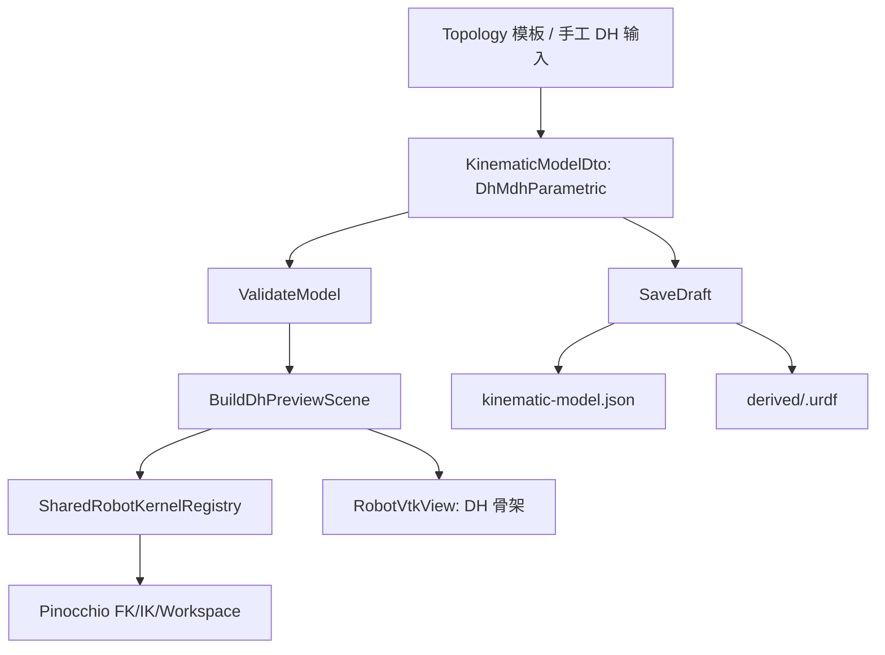
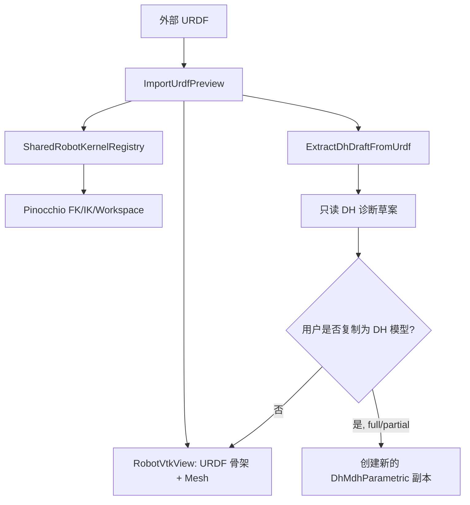

# 运动学模块 URDF / DH 建模逻辑梳理与优化建议

本文档聚焦 RoboSDP 运动学模块中两类输入源的逻辑关系：

- URDF 输入：来自外部 CAD / ROS / 工程模型文件。
- DH/MDH 输入：来自 Topology 模板、手工参数表或由 URDF 尝试提取出的草案。

当前代码已经同时支持 URDF 主模型、DH/MDH 主模型、URDF 提取 DH 草案、DH 派生 URDF、中央 3D 预览、Pinocchio 共享内核和保存/回切逻辑。这些能力方向是有价值的，但现阶段组合方式偏复杂，容易让用户误解“修改 DH 表是否会影响 URDF”“切换主模型后骨架由谁驱动”“保存时到底保存哪一种模型”。

## 1. 当前核心结论

当前运动学模块存在两条建模主线：

```text
Topology / DH 表
  -> DH/MDH 主模型
  -> Pinocchio 共享内核
  -> FK / IK / Workspace / Jacobian
  -> DH 骨架预览
  -> 保存时可派生最小 URDF

外部 URDF
  -> URDF 主模型
  -> Pinocchio 共享内核
  -> FK / IK / Workspace / Jacobian
  -> URDF 骨架 + Visual / Collision 预览
  -> 尝试提取只读 DH/MDH 草案
```

设计意图上，URDF 和 DH/MDH 都可以成为“主模型”。这在架构上可行，但对现阶段 RoboSDP 来说过早复杂化了。更合理的产品策略是：

```text
短期：DH/MDH 参数化设计为主，URDF 导入只作为工程参考/预览/校核。
中期：允许从 DH/MDH 一键导出最小 URDF，供下游仿真或外部工具使用。
长期：再考虑 URDF 反向转换为可编辑参数化模型，但必须作为“转换副本”，不能让用户误以为能无损反写原 URDF。
```

## 2. 当前关键数据结构

运动学模块的核心 DTO 是 `KinematicModelDto`，位置：

```text
modules/kinematics/dto/KinematicModelDto.h
```

其中最容易造成理解混乱的是这些字段：

| 字段 | 当前含义 | 风险 |
|---|---|---|
| `master_model_type` | 当前主模型：`dh_mdh` 或 `urdf` | 字符串状态，容易拼写不一致 |
| `modeling_mode` | 底层建模语义：`DH` / `MDH` / `URDF` | 与 `master_model_type` 有重叠 |
| `parameter_convention` | 参数表约定：`DH` / `MDH`，URDF 时可能为 `URDF` | Service 校验通常只接受 DH/MDH，URDF 链路要特殊处理 |
| `dh_editable` | DH 表是否允许编辑 | 必须和主模型状态保持一致 |
| `urdf_editable` | URDF 是否允许编辑 | 当前更多是状态表达，实际 UI 不开放 URDF 编辑 |
| `urdf_source_path` | 当前 URDF 文件路径 | DH 主模型时应清空，否则可能误导后端 |
| `original_imported_urdf_path` | 最初导入的外部 URDF | 用于回切 URDF 主模型 |
| `urdf_master_source_type` | URDF 来源：原始导入 / 项目派生 / 无 | 回切逻辑依赖它 |
| `dh_draft_extraction_level` | URDF 提取 DH 草案级别：`full` / `partial` / `diagnostic_only` | 决定能否提升为 DH 主模型 |
| `unified_robot_model_ref` | 共享内核缓存引用 | 结构变更时必须刷新 |
| `joint_order_signature` | 关节顺序签名 | FK/IK 输入向量必须与它一致 |
| `unified_robot_snapshot` | 给 Dynamics / Planning / Scheme 的统一模型快照 | 下游依赖的事实来源 |

这些字段本身都有用，但现在缺少一个“单一状态对象”统一管理，导致 UI、Service、Persistence 都在维护同一组状态。

## 3. 当前实际流程

### 3.1 从 Topology 构建 DH/MDH 模型

入口：

```text
Ribbon
  -> KinematicsWidget::TriggerBuildFromTopology()
  -> KinematicsWidget::OnBuildFromTopologyClicked()
```

实际流程：

```text
OnBuildFromTopologyClicked()
  -> KinematicsService::BuildFromTopology(projectRootPath)
  -> TopologyJsonStorage::Load()
  -> BuildModelFromTopology()
  -> m_state = buildResult.state
  -> PopulateForm(m_state.current_model)
  -> SyncStructureAndPreview()
```

生成的模型状态：

```text
master_model_type = "dh_mdh"
modeling_mode = "DH"
parameter_convention = "DH" 或 "MDH"
dh_editable = true
urdf_editable = false
model_source_mode = "topology_derived"
urdf_source_path = ""
```

后续结构刷新走：

```text
KinematicsWidget::SyncStructureAndPreview()
  -> CollectModelFromForm()
  -> 强制生成新的 unified_robot_model_ref
  -> KinematicsService::BuildDhPreviewScene()
  -> InspectBackendBuildContext()
  -> SharedRobotKernelRegistry::GetOrBuildKernel()
  -> SolveFk()
  -> 组装 UrdfPreviewSceneDto
  -> emit PreviewSceneGenerated()
```

这条链路是当前 RoboSDP 最稳定、最符合“参数化设计软件”定位的主线。

### 3.2 修改 DH/MDH 参数表

触发源：

```text
DH 表格 cellChanged
Base / Flange / TCP spinbox valueChanged
参数约定 DH/MDH 下拉框变化
```

流程：

```text
UI 结构参数变化
  -> SyncStructureAndPreview()
  -> BuildDhPreviewScene()
  -> 重建共享 Pinocchio 内核
  -> 重绘中央骨架
```

这里的设计是合理的：结构参数变化属于重量级事件，必须重建后端模型。

当前已优化点：

- 实时预览不再每次写出派生 URDF。
- 派生 URDF 只在保存时写出，避免“改一格参数就改工程文件”。
- DH 表变更后会刷新模型校验和表格高亮。

### 3.3 FK 关节角变化

触发源：

```text
FK spinbox / slider
3D 视图滚轮驱动关节
```

流程：

```text
SyncPoseOnly()
  -> CollectJointInputs()
  -> 如果是 DH/MDH 主模型：
       liveModel = CollectModelFromForm()
       继承当前 unified_robot_model_ref / joint_order_signature
       SolveFk()
       emit PreviewPosesUpdated()
  -> 如果是 URDF 主模型：
       UpdatePreviewPoses(m_state.current_model, angles)
       emit PreviewPosesUpdated()
```

这条轻量刷新链路是合理的：姿态变化不应该重建模型，只应更新 Actor transform。

### 3.4 导入 URDF

入口：

```text
Ribbon
  -> KinematicsWidget::TriggerImportUrdf()
  -> KinematicsWidget::OnImportUrdfClicked()
```

实际流程：

```text
OnImportUrdfClicked()
  -> QFileDialog 选择 URDF
  -> KinematicsService::ImportUrdfPreview(urdfFilePath)
  -> ImportUrdfPreviewWithSharedKernel()
  -> BuildUrdfPreviewModel()
  -> SharedRobotKernelRegistry::GetOrBuildKernel()
  -> 从 Pinocchio 零位 FK 生成 preview_scene
  -> 尝试 ExtractDhDraftFromUrdfModel()
  -> 返回 preview_model
  -> m_state.current_model = preview_model
  -> PopulateForm()
  -> emit PreviewSceneGenerated()
  -> SyncPoseOnly()
```

URDF 主模型状态：

```text
master_model_type = "urdf"
modeling_mode = "URDF"
parameter_convention = "URDF" 或被草案修正为 "DH"/"MDH"
dh_editable = false
urdf_editable = true
urdf_source_path = 外部 URDF 绝对路径
original_imported_urdf_path = 外部 URDF 绝对路径
urdf_master_source_type = "original_imported"
```

导入 URDF 时，系统会尝试提取 DH/MDH 草案。但这个草案在当前设计里只应理解为：

```text
只读诊断视图，不是可靠的参数化设计来源。
```

原因是 URDF 到 DH/MDH 不是普遍可逆转换：

- URDF 允许任意 joint axis，DH 默认关节绕本地 Z 轴。
- URDF 可以有复杂 fixed joint 链、分支、mesh offset、非标准 frame。
- DH/MDH 是串联链参数化表达，无法无损表达所有 URDF 结构。

### 3.5 URDF 提取 DH/MDH 草案

Service 入口：

```text
KinematicsService::ExtractDhDraftFromUrdf()
ImportUrdfPreviewWithSharedKernel() 内部也会尝试提取
```

提取结果级别：

| 级别 | 含义 | 当前建议 |
|---|---|---|
| `full` | 结构较规整，可完整提取 | 可作为参数化起点，但仍需用户确认 |
| `partial` | 有近似映射 | 只能作为参考，谨慎允许转换 |
| `diagnostic_only` | 仅诊断展示 | 不允许提升为 DH 主模型 |

当前 UI 已经拦截 `diagnostic_only` 直接提升为 DH 主模型，这是正确的。

### 3.6 点击“切换为 DH/MDH 主模型”

入口：

```text
KinematicsWidget::OnPromoteDhDraftToMasterClicked()
```

当前允许条件：

```text
当前 master_model_type == "urdf"
dh_editable == false
links 非空
joint_limits 非空
links.size == joint_limits.size
dh_draft_extraction_level != "diagnostic_only"
```

切换动作：

```text
m_state.current_model = CollectModelFromForm()
master_model_type = "dh_mdh"
derived_model_state = "stale"
dh_editable = true
urdf_editable = false
modeling_mode = parameter_convention
model_source_mode = "manual_seed"
清空 dh_draft_extraction_level
清空 dh_draft_readonly_reason
urdf_master_source_type = "none"
urdf_source_path.clear()
pinocchio_model_ready = false
unified_robot_model_ref.clear()
joint_order_signature.clear()
unified_robot_snapshot = {}
ClearPreviewContext()
PopulateForm()
SyncStructureAndPreview()
```

问题在于：这个动作从用户视角看像“把 URDF 转成 DH 模型”，但实际上它只是在使用一份可能近似的 DH 草案创建新的参数化主链。这个功能很容易被误解。

更好的命名应该是：

```text
从 URDF 草案复制为可编辑 DH 模型
```

而不是：

```text
切换为 DH/MDH 主模型
```

### 3.7 点击“切换回 URDF 主模型”

入口：

```text
KinematicsWidget::OnSwitchToUrdfMasterClicked()
```

当前可用来源：

```text
original_imported_urdf_path
或
unified_robot_snapshot.derived_artifact_relative_path 对应的派生 URDF
```

当前逻辑会让用户在“原始导入 URDF”和“项目派生 URDF”之间选择。

这个能力技术上可行，但产品上会增加理解负担：

- 原始 URDF 是外部工程模型，可能有 mesh。
- 派生 URDF 是 DH/MDH 主模型写出的最小运动学链，通常没有真实 visual/collision/inertial。
- 两者都叫 URDF，但语义完全不同。

建议在 UI 文案中明确区分：

```text
回到原始工程 URDF
加载当前 DH 派生的最小 URDF
```

不要都叫“URDF 主模型”。

## 4. 当前逻辑为什么会显得乱

### 4.1 “输入源”和“主模型”混在了一起

现在 URDF 和 DH 既是输入源，又可能成为主模型，还可能互相派生产物：

```text
Topology -> DH 主模型 -> 派生 URDF
外部 URDF -> URDF 主模型 -> 提取 DH 草案 -> 可能提升 DH 主模型
DH 主模型 -> 可回切 原始 URDF 或 派生 URDF
```

这导致用户很难回答：

```text
我现在编辑的是谁？
保存时保存的是谁？
三维视图显示的是谁？
FK/IK 计算用的是谁？
修改 DH 表会不会改变 URDF？
```

### 4.2 `KinematicModelDto` 同时承载太多角色

一个 DTO 同时表达：

- 用户表单草稿。
- 当前主模型状态。
- URDF 导入路径。
- DH 草案。
- Pinocchio 内核缓存身份。
- 下游统一模型快照。
- 派生 URDF 产物状态。

这让很多字段必须“成组一致”，只改其中一个就容易出错。

### 4.3 URDF -> DH 反向转换不应作为主流程

URDF 到 DH/MDH 不存在通用无损转换。它只能作为辅助诊断，最多作为“创建一个可编辑 DH 副本”的来源。

如果把它设计成“主模型切换”，用户自然会期待它是可靠的双向同步，这是不成立的。

### 4.4 UI 文案没有充分表达“只读草案”和“派生副本”

当前界面已经有只读提示，但按钮名称仍然容易让用户误解。尤其是：

```text
切换为 DH/MDH 主模型
切换回 URDF 主模型
```

这两个按钮听起来像两个等价模型之间的无损切换，但实际不是。

## 5. 是否有必要支持当前这种双主模型逻辑

### 5.1 从长期架构看：有必要，但不应放在当前主流程

支持 URDF 主模型有价值：

- 导入外部机器人模型。
- 查看真实 visual/collision mesh。
- 基于真实 URDF 做 FK/IK/Workspace 检查。
- 后续与 MuJoCo、Gazebo、ROS 工具链联动。

支持 DH/MDH 主模型也有价值：

- 参数化设计。
- 从 Topology 模板快速生成。
- 做标准 6R 结构设计、IK、可达性、奇异性分析。
- 给动力学、选型、规划提供可控的工程参数。

因此二者都值得保留。

但是当前阶段不建议让二者在 UI 上成为“可随时双向切换的等价主模型”。这样做收益不高，认知成本和 bug 风险很高。

### 5.2 当前阶段最合理的产品策略

建议采用“一主两辅”的策略：

```text
主流程：DH/MDH 参数化设计
辅助 1：URDF 导入预览与校核
辅助 2：DH/MDH 保存时导出最小 URDF
```

也就是：

```text
RoboSDP 内部设计真源 = DH/MDH + Topology 几何参数
URDF 外部工程真源 = 只读参考模型
派生 URDF = 交换格式，不反向驱动参数设计
```

## 6. 推荐的新逻辑方案

### 6.1 核心原则

建议确立以下规则：

```text
规则 1：任何时刻只有一个 Active Model 用于 FK/IK/Workspace。
规则 2：URDF 导入默认是只读工程参考，不自动成为参数化设计模型。
规则 3：DH/MDH 表是 RoboSDP 参数化设计的主输入。
规则 4：从 URDF 提取 DH 只能生成“可编辑副本”，不能承诺反写原 URDF。
规则 5：保存时保存 RoboSDP 内部模型；导出 URDF 是派生产物。
规则 6：3D 视图必须明确显示当前来源：DH 骨架、原始 URDF、派生 URDF。
```

### 6.2 推荐状态模型

用明确枚举替换当前字符串组合：

```cpp
enum class KinematicModelSource
{
    ManualDh,
    TopologyDh,
    ImportedUrdf,
    DhCopyFromUrdf,
    DerivedUrdfPreview
};

enum class ActiveModelKind
{
    DhMdhParametric,
    ImportedUrdfReadonly
};

enum class DhDraftTrustLevel
{
    None,
    Full,
    Partial,
    DiagnosticOnly
};
```

现有字段可以逐步映射：

```text
master_model_type       -> ActiveModelKind
model_source_mode       -> KinematicModelSource
dh_draft_extraction_level -> DhDraftTrustLevel
```

短期不一定要立刻改 DTO，但文档和 UI 逻辑应按这个状态机理解。

### 6.3 推荐 UI 流程

#### A. 参数化设计入口

```text
从 Topology 生成 DH 模型
手工编辑 DH/MDH 表
运行 FK / IK / Workspace
保存 RoboSDP 运动学模型
导出 / 派生 URDF
```

按钮建议：

```text
从拓扑生成参数化模型
保存参数化模型
导出最小 URDF
```

#### B. URDF 工程参考入口

```text
导入 URDF
显示 URDF 骨架 + Mesh
运行 FK / IK / Workspace 校核
显示只读 DH 草案
```

按钮建议：

```text
导入工程 URDF
查看 DH 诊断草案
复制为可编辑 DH 模型
```

其中“复制为可编辑 DH 模型”只有在 `full` 或用户强确认 `partial` 时可用。

#### C. 不建议保留的按钮文案

不建议继续使用：

```text
切换为 DH/MDH 主模型
切换回 URDF 主模型
```

建议替换为：

```text
复制 URDF 草案为 DH 模型
回到原始 URDF 参考模型
加载 DH 派生 URDF 预览
```

## 7. 推荐代码结构调整

### 7.1 拆出主模型状态管理器

建议新增：

```text
modules/kinematics/domain/KinematicModelStateMachine.h
modules/kinematics/domain/KinematicModelStateMachine.cpp
```

职责：

- 统一设置 DH 主模型状态。
- 统一设置 URDF 主模型状态。
- 统一生成“复制为 DH 模型”的状态。
- 统一维护 `master_model_type`、`modeling_mode`、`parameter_convention`、`dh_editable`、`urdf_editable`、`urdf_source_path`、`dh_draft_extraction_level` 等字段。

这样 UI 不再手动改一串字段。

### 7.2 拆出 URDF 导入与 DH 草案提取服务

当前 `KinematicsService.cpp` 很大，建议拆分：

```text
service/KinematicsService.cpp                 // 对外编排入口
service/KinematicsTopologyBuilder.cpp          // Topology -> DH
service/KinematicsUrdfImporter.cpp             // URDF -> preview model / scene
service/KinematicsDhPreviewBuilder.cpp         // DH -> preview scene
service/KinematicsDerivedUrdfWriter.cpp        // DH -> derived URDF
service/KinematicsModelValidator.cpp           // ValidateModel
```

好处：

- URDF 逻辑和 DH 逻辑边界更清楚。
- 反向转换逻辑不会污染主流程。
- 单元测试更容易写。

### 7.3 区分三种 URDF

建议代码中明确命名：

```text
ImportedUrdf      原始导入工程 URDF
DerivedDhUrdf     DH/MDH 参数化模型派生出的最小 URDF
PreviewUrdf       只用于当前预览的临时 URDF / 场景
```

不要只用 `urdf_source_path` 表达所有含义。

可以逐步增加字段：

```text
imported_urdf_path
derived_urdf_path
active_urdf_path
active_urdf_kind
```

或者把它们收进一个子结构：

```cpp
struct UrdfModelRefs
{
    QString imported_urdf_path;
    QString derived_urdf_relative_path;
    QString active_urdf_path;
    QString active_urdf_kind;
};
```

## 8. 推荐的简化后数据流

### 8.1 DH/MDH 参数化设计流



### 8.2 URDF 工程参考流



### 8.3 不推荐的隐式双向流

不推荐把下面这条作为默认体验：

```text
URDF 主模型 <-> DH 主模型 <-> 派生 URDF <-> 回切 URDF 主模型
```

因为这会暗示“模型等价且可无损同步”，实际并不成立。

## 9. 当前是否需要立刻重构

### 9.1 不建议立刻大拆

当前代码已经修复了几个关键故障：

- URDF 主模型下 DH 表只读。
- `diagnostic_only` 草案不能提升为 DH 主模型。
- DH 结构变化会重建骨架预览。
- 预览不再频繁写派生 URDF。
- 模型校验和单元格高亮已经补齐。

因此不建议马上做大规模重构，否则容易重新引入视图消失、缓存错用、保存失败等问题。

### 9.2 建议分阶段优化

#### 阶段 A：先改文案和入口

低风险，推荐优先做：

- 将“切换为 DH/MDH 主模型”改名为“复制 URDF 草案为 DH 模型”。
- 将“切换回 URDF 主模型”拆成两个明确动作：
  - “回到原始 URDF 参考模型”
  - “加载 DH 派生 URDF 预览”
- 在 URDF 导入后，DH 表标题明确显示“只读诊断草案”。
- 在 DH 主模型下，URDF 区域明确显示“派生产物，仅用于交换/预览”。

#### 阶段 B：收拢状态字段

中风险：

- 新增状态机 helper。
- UI 不再直接手写状态字段组合。
- Service 统一调用状态机生成合法模型状态。

#### 阶段 C：拆分 Service

中高风险，但长期必要：

- 拆 URDF importer。
- 拆 DH preview builder。
- 拆 derived URDF writer。
- 拆 validator。

#### 阶段 D：重新定义 URDF 反向转换能力

高风险，建议晚做：

- `full` 可一键复制。
- `partial` 需要用户确认并在模型中留下 “approximate_from_urdf” 标记。
- `diagnostic_only` 永远不可复制为主设计模型。
- 支持转换报告：哪些 joint 精确、哪些近似、哪些丢失。

## 10. 是否有更好的总体方案

有。建议把 RoboSDP 的建模哲学明确为：

```text
RoboSDP 是参数化机器人设计软件，不是 URDF 编辑器。
```

因此最好的总体方案不是让 URDF 和 DH 平权，而是：

```text
内部真源：Topology + DH/MDH + 坐标系 + 关节限位 + 动力学参数
外部真源：URDF 只作为导入参考和导出交换格式
计算真源：Pinocchio 共享内核
显示真源：PreviewSceneDto / PreviewPoseMap
下游真源：UnifiedRobotModelSnapshot
```

这套方案更符合当前项目目标：

- 对机械臂研发工程师更直观。
- 参数表和拓扑模板能形成可控设计闭环。
- URDF 不承担它不擅长的“参数化编辑”职责。
- 后续接 MuJoCo / ROS / Gazebo 时，URDF/MJCF 可以作为导出格式，而不是内部主数据。

## 11. 最终建议

### 保留

- DH/MDH 主模型。
- 从 Topology 生成 DH/MDH。
- URDF 导入预览。
- URDF 只读 DH 草案展示。
- DH 保存时派生最小 URDF。
- Pinocchio 共享内核。
- A/B 双通道预览：结构重建 + 姿态轻量刷新。

### 弱化

- “URDF 与 DH 主模型随时双向切换”的产品表达。
- URDF 草案直接变成主模型的默认入口。

### 删除或隐藏

- 普通用户界面中不应强调 `master_model_type`、`derived_model_state`、`urdf_master_source_type` 这类内部字段。
- `diagnostic_only` 草案下的“切换为 DH 主模型”按钮应隐藏或禁用，而不仅是点击后提示失败。

### 新增

- “复制 URDF 草案为 DH 模型”向导。
- “转换可信度报告”。
- “当前视图来源”大标签：DH 骨架 / 原始 URDF / 派生 URDF。
- 状态机 helper，统一维护主模型字段。

一句话总结：

```text
当前逻辑技术上能跑，但产品语义过复杂。
更好的方案是以 DH/MDH 参数化设计为主线，URDF 作为只读工程参考和导出交换格式；URDF -> DH 只作为显式的“复制/转换副本”功能，而不是默认主模型切换。
```

