# RoboSDP 软件主流程梳理：打开软件、任务需求、构型设计、运动学模块

本文面向阅读源码、调试流程、交接开发和编写测试用例。内容以当前代码实现为准，重点梳理软件从启动到进入项目，再到任务需求、构型设计、运动学分析三段主链的详细逻辑。

涉及的核心范围：

- 桌面端入口：`apps/desktop-qt/main.cpp`
- 启动装配：`apps/desktop-qt/AppBootstrap.*`
- 主窗口与信号路由：`apps/desktop-qt/MainWindow.*`
- 项目上下文与保存：`core/infrastructure/*`
- JSON 仓储：`core/repository/*`
- 任务需求模块：`modules/requirement/**`
- 构型设计模块：`modules/topology/**`
- 运动学模块：`modules/kinematics/**`
- 中央三维视图：`apps/desktop-qt/widgets/vtk/**`

---

## 1. 软件打开后的总控流程

### 1.1 一句话总览

软件启动后先完成 Qt/VTK 图形环境与默认配置装配，然后创建 `MainWindow`。主窗口负责搭建顶部 Ribbon、左侧项目树、中央三维视图、右侧属性面板和底部日志面板。只有新建或打开项目后，业务模块才正式进入可操作状态。

### 1.2 启动流程图

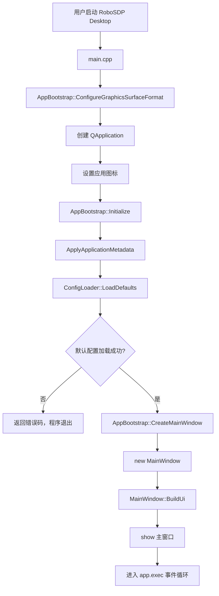

### 1.3 启动装配细节

`main.cpp` 的职责很薄：

1. 创建 `AppBootstrap`。
2. 如果编译启用了 VTK，先设置 Qt/VTK 共用的 OpenGL surface format。
3. 创建 `QApplication`。
4. 设置窗口与任务栏图标。
5. 调用 `AppBootstrap::Initialize()` 加载默认配置。
6. 调用 `CreateMainWindow()` 创建主窗口。
7. 显示主窗口并进入事件循环。

`AppBootstrap::Initialize()` 的职责：

```text
Initialize
  -> ApplyApplicationMetadata
  -> ConfigLoader::LoadDefaults
  -> 成功后缓存 AppConfig
  -> 标记 m_isInitialized = true
  -> 记录启动日志
```

`CreateMainWindow()` 的保护逻辑：

```text
if 未 Initialize:
    记录错误
    return nullptr
else:
    return std::make_unique<MainWindow>
```

---

## 2. MainWindow 的工作台构建流程

### 2.1 主窗口构造

`MainWindow::MainWindow()` 只调用 `BuildUi()`。

```text
MainWindow::BuildUi
  -> setWindowTitle / resize
  -> CreateRibbonBar
  -> CreateCentralView
  -> CreateProjectTreeDock
  -> CreatePropertyDock
  -> CreateLogDock
  -> 监听 ProjectManager::projectPathChanged
  -> 监听项目树 currentItemChanged
  -> ShowEmptyProjectState
```

### 2.2 主界面五大区域

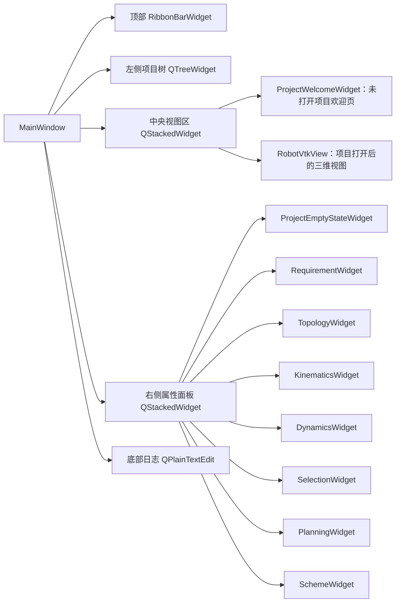

### 2.3 Ribbon 信号路由原则

Ribbon 本身不做复杂业务，只发出用户意图信号。`MainWindow` 负责把这些信号转发给具体模块。

```text
Ribbon 文件类命令
  signalCreateNewProject      -> MainWindow::HandleCreateNewProjectRequested
  signalOpenProject           -> MainWindow::HandleOpenProjectRequested
  signalGlobalSaveRequested   -> MainWindow::HandleGlobalSaveRequested

Ribbon Requirement 命令
  signalRequirementValidate   -> RequirementWidget::TriggerValidate
  signalRequirementSaveDraft  -> RequirementWidget::SaveCurrentDraft

Ribbon Topology 命令
  signalTopologyRefreshTemplates -> TopologyWidget::TriggerRefreshTemplates
  signalTopologyGenerate         -> TopologyWidget::TriggerGenerate
  signalTopologyValidate         -> TopologyWidget::TriggerValidate
  signalTopologySaveDraft        -> TopologyWidget::TriggerSaveDraft

Ribbon Kinematics 命令
  signalKinematicsImportUrdf         -> KinematicsWidget::TriggerImportUrdf
  signalKinematicsBuildFromTopology  -> KinematicsWidget::TriggerBuildFromTopology
  signalKinematicsPromoteToDhMaster  -> KinematicsWidget::TriggerPromoteToDhMaster
  signalKinematicsSwitchToUrdfMaster -> KinematicsWidget::TriggerSwitchToUrdfMaster
  signalKinematicsRunFk              -> KinematicsWidget::TriggerRunFk
  signalKinematicsRunIk              -> KinematicsWidget::TriggerRunIk
  signalKinematicsSampleWorkspace    -> KinematicsWidget::TriggerSampleWorkspace
  signalKinematicsSaveDraft          -> KinematicsWidget::TriggerSaveDraft
```

### 2.4 业务页创建与全局保存注册

`MainWindow::CreatePropertyDock()` 会一次性创建七个业务页面，并加入右侧 `m_propertyStack`。

```text
CreatePropertyDock
  -> new RequirementWidget
  -> new TopologyWidget
  -> new KinematicsWidget
  -> new DynamicsWidget
  -> new SelectionWidget
  -> new PlanningWidget
  -> new SchemeWidget
  -> m_propertyStack->addWidget(...)
  -> ProjectSaveCoordinator::RegisterParticipant(...)
```

注册顺序就是项目主链顺序：

```text
Requirement
  -> Topology
  -> Kinematics
  -> Dynamics
  -> Selection
  -> Planning
  -> Scheme
```

这个顺序后续会被全局保存和脏依赖判断复用。

---

## 3. 项目新建、打开与工作状态切换

### 3.1 未打开项目状态

启动后默认进入空项目状态。

```text
ShowEmptyProjectState
  -> 中央区显示 ProjectWelcomeWidget
  -> 项目树显示“未打开项目”
  -> 右侧属性面板显示 ProjectEmptyStateWidget
  -> 状态栏提示用户新建或打开项目
```

此时业务页对象已经创建，但没有有效项目路径，保存、加载、生成等依赖项目目录的操作会失败或提示先打开项目。

### 3.2 新建项目流程

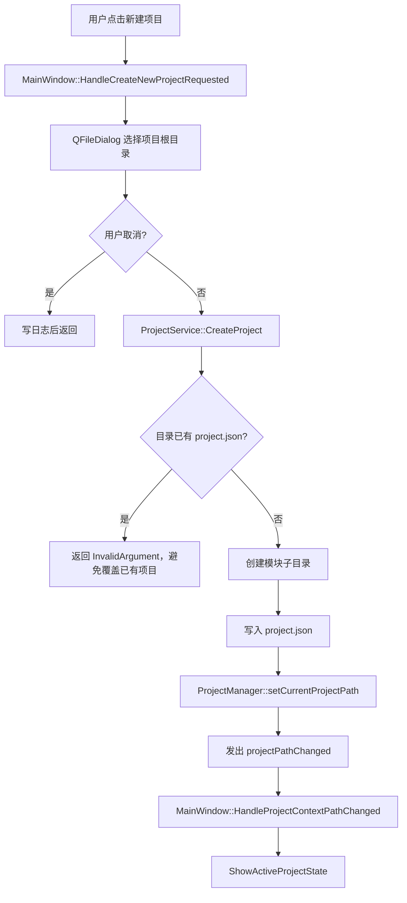

新建项目会创建的目录：

```text
requirements/
topology/
kinematics/
dynamics/
selection/
planning/
snapshots/
exports/
```

`project.json` 中维护当前项目名、创建时间、更新时间和模块文件索引，例如：

```text
requirements/requirement-model.json
topology/topology-model.json
kinematics/kinematic-model.json
kinematics/workspace-cache.json
...
```

### 3.3 打开项目流程

```text
HandleOpenProjectRequested
  -> QFileDialog 选择目录
  -> 检查 <目录>/project.json 是否存在
  -> 不存在：弹窗提示“不是有效 RoboSDP 项目”
  -> 存在：ProjectManager::setCurrentProjectPath
  -> projectPathChanged
  -> ShowActiveProjectState
```

### 3.4 ProjectManager 的作用

`ProjectManager` 是当前进程内项目根目录的唯一事实来源。

```text
ProjectManager::setCurrentProjectPath(path)
  -> 如果路径与当前值不同
  -> 更新 m_currentProjectPath
  -> emit projectPathChanged(path)
```

各业务模块保存、加载时都通过 `ProjectManager::instance().getCurrentProjectPath()` 获取当前项目根目录，而不是各自维护项目路径。

### 3.5 打开项目后的项目树

```text
项目根节点
  ├─ 任务需求
  ├─ 构型设计
  ├─ 运动学分析
  ├─ 动力学分析
  ├─ 驱动选型
  ├─ 规划与分析
  └─ 结果与导出
```

项目打开后默认选中“任务需求”。

### 3.6 项目树导航流程

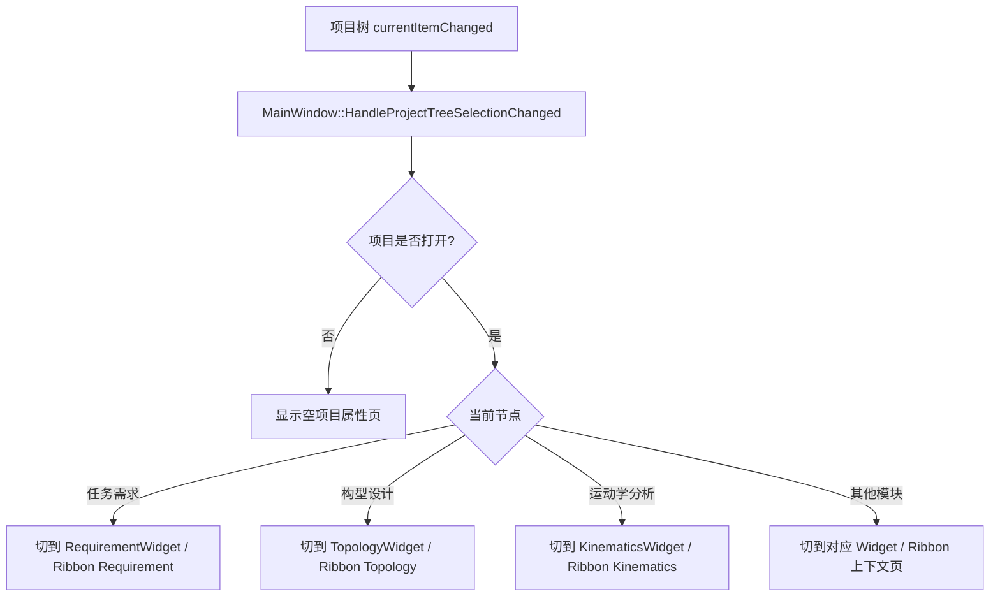

构型页面有一个额外细节：

```text
第一次进入 Topology 页面
  -> m_shouldResetNextPreview = true
  -> TopologyWidget::ForceEmitPreview
  -> RobotVtkView::ShowPreviewScene(scene, resetCamera=true)
  -> 后续实时预览不再反复重置相机
```

---

## 4. 任务需求模块详细流程

### 4.1 模块定位

任务需求模块负责录入项目需求草稿，并保存为下游可读取的 JSON。构型设计模块会读取其中的部分字段，用于模板候选生成和推荐。

核心文件：

```text
modules/requirement/dto/RequirementModelDto.h
modules/requirement/ui/RequirementWidget.*
modules/requirement/service/RequirementService.*
modules/requirement/persistence/RequirementJsonStorage.*
modules/requirement/validator/RequirementValidator.*
```

持久化文件：

```text
requirements/requirement-model.json
```

### 4.2 RequirementWidget 初始化流程

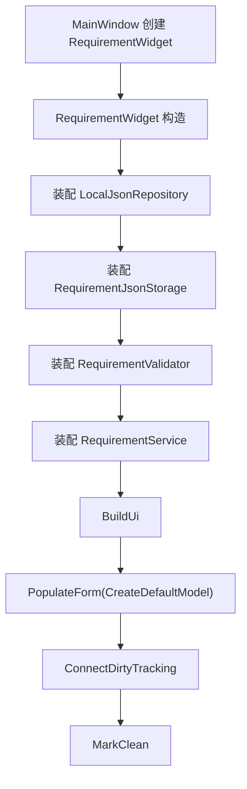

### 4.3 Requirement 页面结构

页面使用 `QTabWidget` 按业务域拆分：

```text
RequirementWidget
  -> 项目信息
     - project_name
     - scenario_type
     - description
  -> 负载需求
     - rated_payload
     - max_payload
     - tool_mass
     - fixture_mass
     - payload_cog
     - payload_inertia
     - off_center_load
     - cable_drag_load
  -> 工作空间
     - max_radius / min_radius
     - max_height / min_height
     - base_constraints
       - base_mount_type
       - hollow_wrist_required
       - reserved_channel_diameter_mm
     - key_poses
  -> 运动性能
  -> 精度需求
  -> 可靠性
  -> 校验结果
```

### 4.4 Requirement 主 DTO

`RequirementModelDto` 的主结构：

```text
RequirementModelDto
  project_meta
  load_requirements
  workspace_requirements
  motion_requirements
  accuracy_requirements
  reliability_requirements
  derived_conditions
```

其中被 Topology 直接消费的关键字段：

```text
project_meta.project_name
project_meta.scenario_type
workspace_requirements.base_constraints.base_mount_type
workspace_requirements.base_constraints.hollow_wrist_required
workspace_requirements.base_constraints.reserved_channel_diameter_mm
```

### 4.5 关键工位编辑流程

关键工位在 DTO 中是数组，但 UI 使用列表 + 单条编辑器。

```text
新增工位
  -> SaveCurrentKeyPoseEdits
  -> 生成 pose_XXX / 工位X 默认对象
  -> push_back 到 key_poses
  -> RefreshKeyPoseList
  -> 选中新工位
  -> LoadCurrentKeyPoseToEditor
  -> MarkDirty

切换工位
  -> OnKeyPoseSelectionChanged
  -> 保存旧工位编辑值
  -> 更新 m_current_key_pose_index
  -> 加载新工位到右侧编辑器

删除工位
  -> 至少保留 1 个工位
  -> erase 当前工位
  -> 修正当前索引
  -> RefreshKeyPoseList
  -> MarkDirty
```

### 4.6 Dirty 追踪

`RequirementWidget::ConnectDirtyTracking()` 会遍历子控件：

```text
QLineEdit.textEdited      -> MarkDirty
QComboBox.currentChanged  -> MarkDirty
QDoubleSpinBox.valueChanged -> MarkDirty
QSpinBox.valueChanged     -> MarkDirty
QCheckBox.toggled         -> MarkDirty
```

Dirty 状态用于：

- 顶部保存按钮状态。
- 全局保存是否跳过该模块。
- 关闭项目或退出软件时是否弹出未保存提示。

### 4.7 校验流程

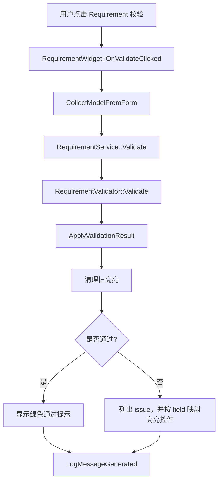

字段高亮依赖：

```text
Validator issue.field
  -> RequirementWidget::m_field_widgets[fieldPath]
  -> 设置红框/黄框和 tooltip
```

### 4.8 保存草稿流程

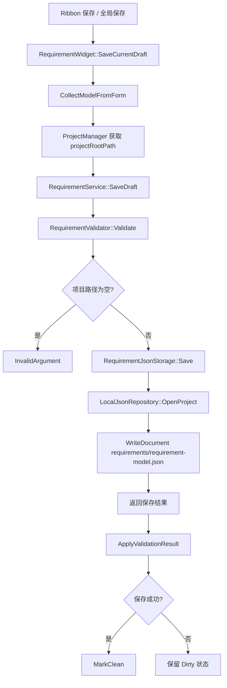

注意：当前保存会同时返回校验结果。即使存在校验问题，只要仓储写盘成功，草稿仍可落盘，UI 会提示“已保存但仍有校验问题”。

### 4.9 加载草稿流程

```text
RequirementWidget::OnLoadClicked
  -> ProjectManager 获取项目路径
  -> RequirementService::LoadDraft
  -> RequirementJsonStorage::Load
  -> ReadDocument requirements/requirement-model.json
  -> FromJsonObject
  -> Validate
  -> PopulateForm
  -> ApplyValidationResult
  -> MarkClean
```

---

## 5. 构型设计模块详细流程

### 5.1 模块定位

构型设计模块把 Requirement 中的约束，映射为可编辑、可推荐、可预览、可保存的 6R 串联机器人构型。它是 Requirement 和 Kinematics 之间的结构桥梁。

核心文件：

```text
modules/topology/dto/RobotTopologyModelDto.h
modules/topology/dto/TopologyRecommendationDto.h
modules/topology/ui/TopologyWidget.*
modules/topology/service/TopologyService.*
modules/topology/service/TopologyTemplateLoader.*
modules/topology/persistence/TopologyJsonStorage.*
modules/topology/validator/TopologyValidator.*
resources/topology/templates/*.json
```

持久化文件：

```text
topology/topology-model.json
```

### 5.2 TopologyWidget 初始化流程

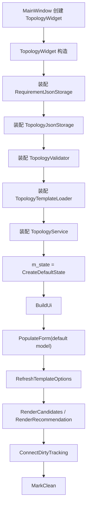

### 5.3 Topology 页面结构

```text
TopologyWidget
  -> 顶部模板下拉框
     - 全部模板（推荐）
     - resources/topology/templates/*.json
  -> 构型骨架
     - 构型名称
     - DH 关键尺寸
       d1: base_height_m
       a1: shoulder_offset_m
       a2: upper_arm_length_m
       a3: elbow_offset_m
       d4: forearm_length_m
       d6: wrist_offset_m
     - 基座安装和 J1 行程
     - 走线预留与中空腕
  -> 候选方案
  -> 校验结果
```

### 5.4 Topology 主 DTO

```text
RobotTopologyModelDto
  meta
    topology_id
    name
    source
    status
    template_id
    requirement_ref
  robot_definition
    robot_type = 6R_serial
    joint_count = 6
    base_mount_type
    base_orientation
    j1_rotation_range_deg
    base_height_m
    shoulder_offset_m
    upper_arm_length_m
    elbow_offset_m
    forearm_length_m
    wrist_offset_m
  layout
    internal_routing_required
    hollow_joint_ids
    hollow_wrist_required
    reserved_channel_diameter_mm
    seventh_axis_reserved
  joints
  axis_relations
  topology_graph
```

当前默认 6R 主链：

```text
base_link --joint_1--> link_1
link_1    --joint_2--> link_2
link_2    --joint_3--> link_3
link_3    --joint_4--> link_4
link_4    --joint_5--> link_5
link_5    --joint_6--> tool_link
```

### 5.5 模板加载流程

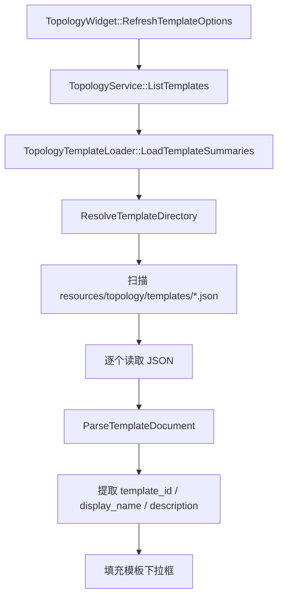

模板下拉框会额外加入：

```text
全部模板（推荐） -> "__all__"
```

这个值在服务层会归一化为空字符串，表示遍历所有模板。

### 5.6 从 Requirement 生成候选构型

用户入口：

```text
Ribbon 生成构型
  -> MainWindow 转发
  -> TopologyWidget::TriggerGenerate
  -> TopologyWidget::OnGenerateClicked
```

完整流程：

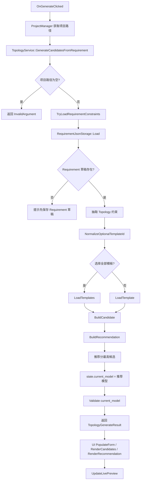

### 5.7 Requirement 到 Topology 的约束映射

`TryLoadRequirementConstraints()` 从 Requirement 中提取：

```text
project_meta.project_name
  -> constraints.requirement_name

project_meta.scenario_type
  -> constraints.scenario_type

workspace_requirements.base_constraints.base_mount_type
  -> preferred_base_mount_type
  -> base_mount_specified

workspace_requirements.base_constraints.hollow_wrist_required
  -> hollow_wrist_required
  -> hollow_wrist_specified

workspace_requirements.base_constraints.reserved_channel_diameter_mm
  -> reserved_channel_diameter_mm
  -> reserved_channel_specified
```

### 5.8 候选构型评分规则

`BuildCandidate()` 对每个模板生成一个候选：

```text
复制模板模型
  -> candidate_id = candidate_<template_id>
  -> topology_id = topology_<template_id>
  -> source = template
  -> status = draft
  -> requirement_ref = Requirement 项目名
  -> 应用 Requirement 约束
  -> 评分
  -> Validator 校验
  -> 校验通过则 candidate.matches_requirement = true
```

评分逻辑：

| 条件 | 分值 | 说明 |
| --- | ---: | --- |
| 候选来自已登记模板 | +20 | 基础分 |
| Requirement 指定基座且模板匹配 | +35 | 如 floor/wall/ceiling/pedestal |
| Requirement 未指定基座 | +20 | 模板默认方案可参与比较 |
| 中空腕约束满足 | +25 | 不要求中空腕或模板支持中空腕 |
| Requirement 未指定中空腕 | +10 | 保留模板默认腕部方案 |
| 场景标签匹配 | +20 | 模板 application_tags 包含 scenario_type |
| 拓扑校验通过 | +10 | `TopologyValidator::Validate` 无错误 |

推荐逻辑：

```text
BuildRecommendation
  -> 若候选为空：无推荐
  -> 遍历 candidates
  -> 选择 score 最大的候选
  -> 写入 recommended_candidate_id / recommended_template_id / combined_score
  -> 复制候选推荐理由
```

当前同分时保留先出现的候选。模板读取按文件名排序，因此同分结果会受模板文件名顺序影响。

### 5.9 Topology 实时三维预览

Topology 阶段没有真实 mesh，只有参数化骨架。因此它复用 Kinematics 的轻量骨架生成工具，生成 `UrdfPreviewSceneDto` 给中央 VTK 视图。

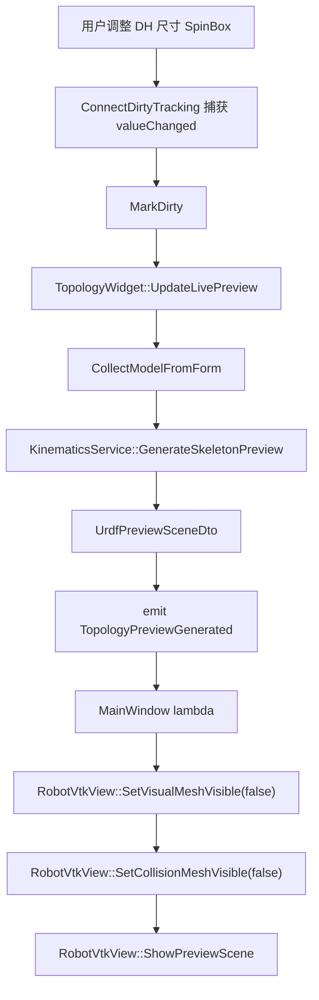

预览刷新触发点：

- 页面初始化 `PopulateForm()` 之后。
- 用户调整 DH 关键尺寸。
- 生成候选并填表后。
- 加载草稿并填表后。
- 第一次进入构型页面时 `ForceEmitPreview()`。

### 5.10 Topology 校验流程

```text
OnValidateClicked
  -> CollectModelFromForm
  -> TopologyService::Validate
  -> TopologyValidator::Validate
  -> ApplyValidationResult
  -> issue.field 映射到 UI 控件并高亮
  -> LogMessageGenerated
  -> StatusChanged
```

校验重点：

```text
robot_definition.robot_type == "6R_serial"
robot_definition.joint_count == 6
DH 尺寸合法
base_mount_type 合法
joints 数量与 joint_count 一致
joint_id 唯一
motion_range_deg min < max
axis_relations 引用的 joint 必须存在
topology_graph.links 至少 2 个
topology_graph.joints_graph 数量等于 joint_count
```

### 5.11 Topology 保存与加载

保存流程：

```text
TopologyWidget::SaveCurrentDraft
  -> CollectModelFromForm
  -> ProjectManager 获取项目路径
  -> TopologyService::SaveDraft
  -> TopologyValidator::Validate
  -> TopologyJsonStorage::Save
  -> LocalJsonRepository::WriteDocument("topology/topology-model.json")
  -> ApplyValidationResult
  -> 成功则 MarkClean
```

加载流程：

```text
TopologyWidget::OnLoadClicked
  -> TopologyService::LoadDraft
  -> TopologyJsonStorage::Load
  -> FromJsonObject
  -> Validate
  -> m_state = loaded state
  -> PopulateForm
  -> RenderCandidates
  -> RenderRecommendation
  -> ApplyValidationResult
  -> MarkClean
```

### 5.12 Topology 到 Kinematics 的交接

Topology 不直接调用 Kinematics 的“构建运动学模型”主流程。它通过保存后的文件交接：

```text
topology/topology-model.json
  -> KinematicsService::BuildFromTopology(projectRootPath)
```

交接关键数据：

```text
robot_type / joint_count
DH 关键尺寸 d1 / a1 / a2 / a3 / d4 / d6
joints 中的 joint_id / role / parent_link / child_link
motion_range_deg
base_mount_type / base_orientation
hollow_wrist_required / reserved_channel_diameter_mm
```

---

## 6. 运动学模块详细流程

### 6.1 模块定位

运动学模块把上游 Topology 生成的构型草稿，或者外部导入的 URDF 工程模型，转换为可求解、可预览、可保存、可供下游复用的运动学工作状态。

核心文件：

```text
modules/kinematics/dto/KinematicModelDto.h
modules/kinematics/dto/KinematicSolverResultDto.h
modules/kinematics/dto/UrdfPreviewSceneDto.h
modules/kinematics/dto/UnifiedRobotModelSnapshotDto.h
modules/kinematics/ui/KinematicsWidget.*
modules/kinematics/service/KinematicsService.*
modules/kinematics/adapter/*
modules/kinematics/persistence/KinematicJsonStorage.*
core/kinematics/SharedRobotKernelRegistry.*
```

持久化文件：

```text
kinematics/kinematic-model.json
kinematics/workspace-cache.json
kinematics/derived/<kinematic_id>.urdf
```

### 6.2 Kinematics 模块分层

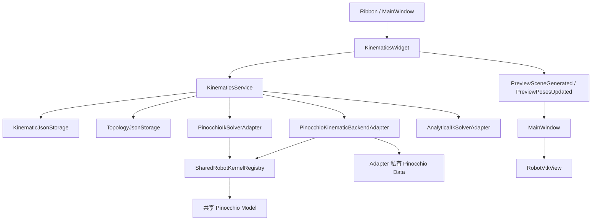

职责边界：

```text
KinematicsWidget
  -> 表单、按钮、用户事件、结果展示、信号发射、Dirty 状态

KinematicsService
  -> 从 Topology 构建、URDF 导入、FK/IK/Workspace 编排、保存加载、预览场景生成

Adapter
  -> 隔离 Pinocchio / IK / Jacobian / Workspace 等算法细节

SharedRobotKernelRegistry
  -> 缓存共享的不可变 Pinocchio Model
  -> 不共享 Pinocchio Data

RobotVtkView
  -> 只消费场景 DTO 和位姿 DTO，不理解业务模块
```

### 6.3 KinematicModelDto 关键状态

```text
KinematicModelDto
  meta
    kinematic_id
    name
    source
    topology_ref
    requirement_ref

  主模型状态
    master_model_type        = dh_mdh / urdf
    derived_model_state      = fresh / stale / not_available
    dh_editable
    urdf_editable
    conversion_diagnostics
    dh_draft_extraction_level
    dh_draft_readonly_reason

  建模语义
    modeling_mode            = DH / MDH / URDF
    parameter_convention     = DH / MDH / URDF
    model_source_mode        = manual_seed / topology_derived / urdf_imported
    backend_type
    joint_count
    joint_order_signature
    frame_semantics_version

  共享模型与 URDF
    unified_robot_model_ref
    pinocchio_model_ready
    unified_robot_snapshot
    urdf_source_path
    original_imported_urdf_path
    urdf_master_source_type
    mesh_search_directories

  运动学参数
    base_frame
    links
    joint_limits
    flange_frame
    tool_frame
    workpiece_frame
    tcp_frame
    ik_solver_config
```

### 6.4 运动学模块的两条建模入口

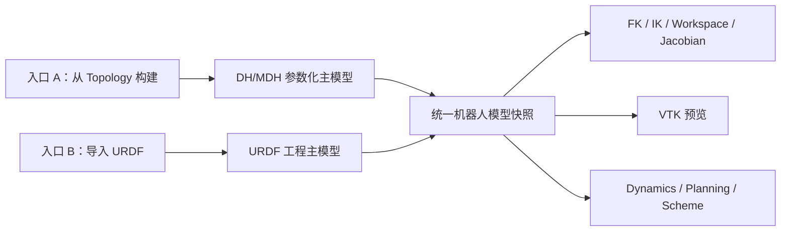

#### 入口 A：从 Topology 构建

用户入口：

```text
Ribbon: 从构型构建
  -> MainWindow
  -> KinematicsWidget::TriggerBuildFromTopology
  -> KinematicsWidget::OnBuildFromTopologyClicked
```

流程：

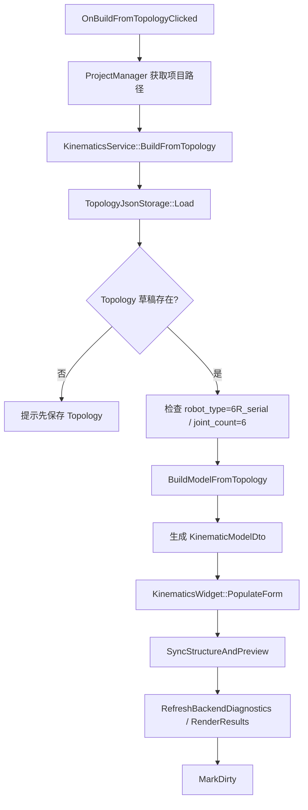

`BuildModelFromTopology()` 的核心映射：

```text
Topology meta
  -> Kinematic meta.topology_ref / requirement_ref

Topology DH 关键尺寸
  d1 = base_height_m
  a1 = shoulder_offset_m
  a2 = upper_arm_length_m
  a3 = elbow_offset_m
  d4 = forearm_length_m
  d6 = wrist_offset_m

Topology joints motion_range_deg
  -> Kinematic joint_limits hard/soft limit

Topology base_mount_type / base_orientation
  -> Kinematic base_frame

模型状态
  master_model_type = dh_mdh
  modeling_mode = DH
  parameter_convention = DH
  model_source_mode = topology_derived
```

典型 6R DH 表：

```text
link_1: a=a1, alpha= 90, d=d1, theta_offset=0
link_2: a=a2, alpha=  0, d=0,  theta_offset=90
link_3: a=a3, alpha= 90, d=0,  theta_offset=90
link_4: a=0,  alpha=-90, d=d4, theta_offset=0
link_5: a=0,  alpha= 90, d=0,  theta_offset=0
link_6: a=0,  alpha=  0, d=d6, theta_offset=0
```

#### 入口 B：导入 URDF

用户入口：

```text
Ribbon: 导入 URDF
  -> MainWindow
  -> KinematicsWidget::TriggerImportUrdf
  -> KinematicsWidget::OnImportUrdfClicked
```

流程：

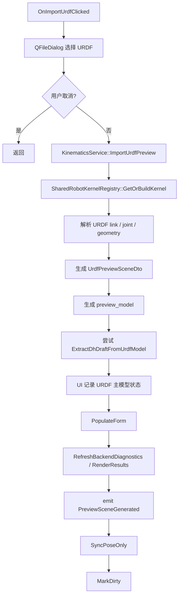

URDF 主模型状态：

```text
master_model_type = "urdf"
modeling_mode = "URDF"
parameter_convention = "URDF"
dh_editable = false
urdf_editable = true
urdf_source_path = 外部 URDF 绝对路径
original_imported_urdf_path = 首次导入路径
urdf_master_source_type = "original_imported"
dh_draft_extraction_level = diagnostic_only / partial / full
```

### 6.5 双通道预览刷新机制

运动学 UI 里有两类刷新，分工很重要。

#### 通道 A：结构重建 `SyncStructureAndPreview`

适用场景：

- DH/MDH 参数表变化。
- 从 Topology 构建模型后。
- 提升 DH 草案为主模型后。
- 加载 DH/MDH 草稿后。
- 主模型结构发生变化，需要重新生成骨架、签名和共享内核。

流程：

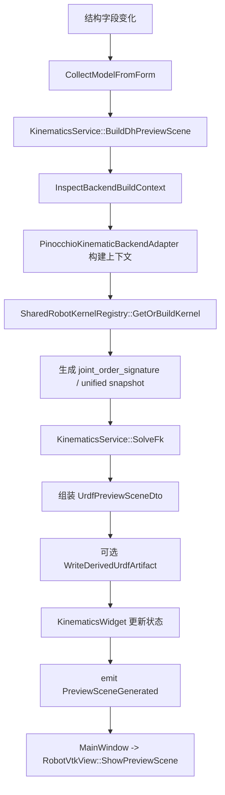

结果：

- 中央视图重建场景。
- VTK actor 缓存会随场景重建。
- 可能写出 `kinematics/derived/<kinematic_id>.urdf`。
- `unified_robot_snapshot` 被刷新。

#### 通道 B：轻量姿态刷新 `SyncPoseOnly`

适用场景：

- FK 关节输入框变化。
- VTK 中滚轮调整关节角。
- URDF 主模型已导入后只改变关节角。
- 不想重新解析 URDF 或重建 VTK 场景，只想更新现有 actor 位姿。

流程：

```text
SyncPoseOnly
  -> CollectJointInputs
  -> 如果 DH/MDH 主模型：
       复用当前模型签名
       KinematicsService::SolveFk
       link pose -> PreviewPoseMap
       emit PreviewPosesUpdated
  -> 如果 URDF 主模型：
       KinematicsService::UpdatePreviewPoses
       SharedRobotKernelRegistry 复用已有内核
       Pinocchio FK 输出 link_world_poses
       emit PreviewPosesUpdated
  -> RobotVtkView::UpdatePreviewPoses
```

结果：

- 不重建场景。
- 不读取 mesh。
- 不写磁盘。
- 适合高频交互。

### 6.6 FK 正运动学流程

用户入口：

```text
Ribbon / 页面按钮
  -> KinematicsWidget::OnRunFkClicked
```

流程：

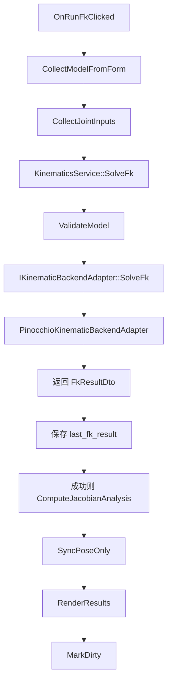

输出包括：

```text
success / message
joint_positions_deg
tcp_pose
link_poses
tcp_transform_matrix
```

### 6.7 IK 逆运动学流程

用户入口：

```text
Ribbon / 页面按钮
  -> KinematicsWidget::OnRunIkClicked
```

流程：

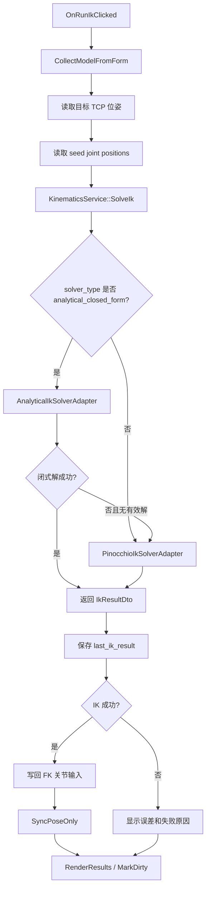

数值 IK 大致逻辑：

```text
循环 max_iterations:
  -> EvaluateNativeFkDryRun
  -> EvaluateNativeJacobianDryRun
  -> 计算 position/orientation error
  -> 若误差小于容差：成功
  -> 阻尼最小二乘或 Jacobian 迭代得到 delta_q
  -> 按 step_gain 更新 q
  -> clamp 到 hard_limit
```

闭式 IK 适用假设：

```text
6R
近似球腕
最后三轴满足腕部解析求解条件
按 branch_policy 选择最接近 seed 的解
```

### 6.8 Workspace 工作空间采样流程

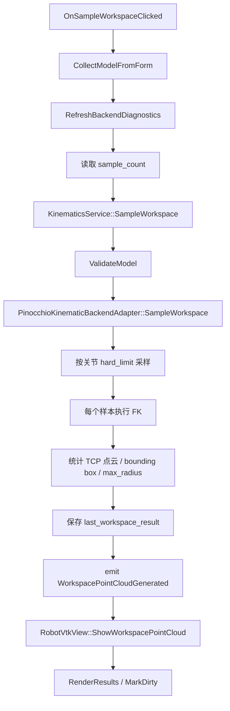

带奇异区识别时，会额外计算 Jacobian 条件数和可操作度：

```text
SampleWorkspaceWithSingularity
  -> 每个采样点计算 Jacobian
  -> condition_number > threshold 标记为奇异
  -> emit SingularityPointCloudGenerated(points, flags)
  -> RobotVtkView::ShowColoredWorkspacePointCloud
```

### 6.9 可达性和姿态可达性

关键工位可达性：

```text
CheckReachability(targetPose, seedCount)
  -> 第一个 seed 使用关节软限位中点
  -> 后续 seed 使用确定性伪随机分布
  -> 多次调用 IK
  -> 任一 seed 收敛则 reachable=true
  -> 记录 best error / converged_count
```

姿态可达性：

```text
CheckOrientationReachability(position, stepsPerAxis, rangeDeg)
  -> 固定 TCP 位置
  -> 在 roll/pitch/yaw 范围内网格采样
  -> 每个姿态调用 IK
  -> 统计 reachable_count / total_samples / reachability_ratio
```

### 6.10 URDF 与 DH 主模型切换

#### 提升 DH 草案为主模型

适用场景：

- 当前是 URDF 主模型。
- 页面存在可展示的 DH/MDH 草案。
- 用户确认用参数化 DH/MDH 作为新的设计真源。

流程：

```text
OnPromoteDhDraftToMasterClicked
  -> CollectModelFromForm
  -> master_model_type = dh_mdh
  -> modeling_mode = DH/MDH
  -> dh_editable = true
  -> urdf_editable = false
  -> 清理 dh_draft_readonly_reason
  -> PopulateForm
  -> SyncStructureAndPreview
  -> MarkDirty
```

#### 切回 URDF 主模型

候选 URDF 来源：

```text
original_imported_urdf_path
kinematics/derived/<kinematic_id>.urdf
```

流程：

```text
OnSwitchToUrdfMasterClicked
  -> 选择可用 URDF 来源
  -> KinematicsService::ImportUrdfPreview
  -> 回到 URDF 主模型状态
  -> PreviewSceneGenerated
  -> SyncPoseOnly
  -> MarkDirty
```

### 6.11 Kinematics 保存流程

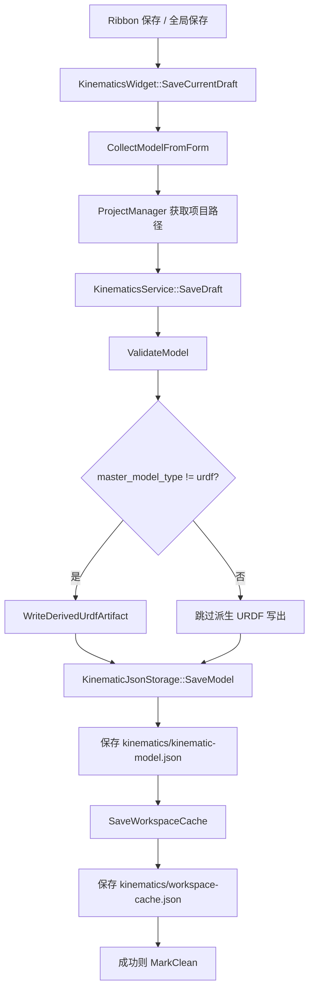

### 6.12 Kinematics 加载流程

```text
KinematicsWidget::OnLoadClicked
  -> KinematicsService::LoadDraft
  -> KinematicJsonStorage::LoadModel
  -> KinematicJsonStorage::LoadWorkspaceCache
  -> m_state = loadResult.state
  -> PopulateForm
  -> 如果 master_model_type == dh_mdh:
       SyncStructureAndPreview
     否则:
       emit PreviewSceneGenerated
       SyncPoseOnly
  -> RenderResults
  -> MarkClean
```

### 6.13 Kinematics 与中央三维视图的信号

```text
KinematicsWidget -> MainWindow -> RobotVtkView

PreviewSceneGenerated
  -> RobotVtkView::ShowPreviewScene

PreviewPosesUpdated
  -> RobotVtkView::UpdatePreviewPoses

WorkspacePointCloudGenerated
  -> RobotVtkView::ShowWorkspacePointCloud

SingularityPointCloudGenerated
  -> RobotVtkView::ShowColoredWorkspacePointCloud
```

中央视图反向驱动 Kinematics：

```text
RobotVtkView::signalJointAngleScrolled
  -> KinematicsWidget::HandleJointAngleScrolled
  -> 修改 FK 关节输入
  -> SyncPoseOnly

RobotVtkView::signalLinkPicked
  -> KinematicsWidget::HandlePreviewLinkPicked

RobotVtkView::signalTcpPoseDragged
  -> KinematicsWidget::HandleTcpPoseDragged
  -> 填入 IK 目标位姿
  -> 自动触发 IK
```

---

## 7. 三个模块的主链数据流

### 7.1 总体主链

```mermaid
flowchart TD
    A["任务需求 Requirement"] --> B["requirements/requirement-model.json"]
    B --> C["构型设计 Topology"]
    C --> D["topology/topology-model.json"]
    D --> E["运动学 Kinematics"]
    E --> F["kinematics/kinematic-model.json"]
    E --> G["kinematics/workspace-cache.json"]
    E --> H["kinematics/derived/<kinematic_id>.urdf"]
    F --> I["后续 Dynamics / Selection / Planning / Scheme"]
    H --> I
```

### 7.2 用户典型操作流程

```text
1. 打开软件
2. 新建或打开项目
3. 进入“任务需求”
4. 填写项目场景、负载、工作空间、基座约束、中空腕、关键工位
5. 校验 Requirement
6. 保存 Requirement 草稿
7. 进入“构型设计”
8. 选择“全部模板（推荐）”或指定模板
9. 点击“生成构型”
10. Topology 读取 Requirement 并生成候选
11. UI 展示推荐方案和理由
12. 用户微调 DH 关键尺寸，中央三维视图实时刷新
13. 校验 Topology
14. 保存 Topology 草稿
15. 进入“运动学分析”
16. 点击“从 Topology 构建”
17. Kinematics 读取 topology-model.json 并生成 DH/MDH 模型
18. 中央三维视图显示运动学骨架
19. 用户执行 FK / IK / Workspace / Jacobian / 可达性分析
20. 保存 Kinematics 草稿和工作空间缓存
```

### 7.3 关键状态从上游到下游的传递

```text
Requirement
  project_name
  scenario_type
  base_mount_type
  hollow_wrist_required
  reserved_channel_diameter_mm

    ↓

Topology
  template_id
  topology_id
  6R joint topology
  DH key sizes: d1 / a1 / a2 / a3 / d4 / d6
  joint motion ranges
  layout routing constraints

    ↓

Kinematics
  KinematicModelDto
  DH/MDH link parameters
  joint_limits
  joint_order_signature
  unified_robot_model_ref
  unified_robot_snapshot
  FK / IK / Workspace results
```

---

## 8. 全局保存、关闭保护与脏依赖

### 8.1 全局保存入口

```text
Ribbon 保存
  -> MainWindow::HandleGlobalSaveRequested
  -> ProjectSaveCoordinator::SaveAll
```

### 8.2 SaveAll 流程

```mermaid
flowchart TD
    A["ProjectSaveCoordinator::SaveAll"] --> B["ProjectManager 获取项目路径"]
    B --> C{"项目路径为空?"}
    C -- "是" --> C1["返回无法保存"]
    C -- "否" --> D["收集所有 participant 的 ModuleName / HasUnsavedChanges"]
    D --> E["ProjectDirtyDependencyGraph::Evaluate"]
    E --> F["按注册顺序遍历模块"]
    F --> G{"当前模块 Dirty?"}
    G -- "否" --> H{"是否有 Dirty 上游?"}
    H -- "是" --> H1["跳过写盘，但标记需要刷新"]
    H -- "否" --> H2["跳过写盘"]
    G -- "是" --> I["participant->SaveCurrentDraft"]
    I --> J{"是否有 Dirty 上游?"}
    J -- "是" --> J1["保存结果追加刷新提醒"]
    J -- "否" --> K["记录成功/失败"]
    J1 --> K
    H1 --> K
    H2 --> K
    K --> L["生成 ProjectSaveSummary"]
    L --> M["MainWindow 显示日志和结果对话框"]
```

### 8.3 脏依赖图

当前主链是线性的：

```text
Requirement -> Topology -> Kinematics -> Dynamics -> Selection -> Planning -> Scheme
```

规则：

```text
如果某模块的上游存在未保存变更：
  当前模块即使自己没改，也会被提示“需要刷新或重算”

如果当前模块自己 Dirty：
  仍会尝试保存
  但结果消息会附加“上游已变更，建议刷新或重算”
```

示例：

```text
Requirement Dirty
  -> Topology / Kinematics / Dynamics / ... 都会被认为有 dirty upstream

Topology Dirty
  -> Kinematics / Dynamics / ... 需要刷新或重算

Kinematics Dirty
  -> Dynamics / Selection / Planning / Scheme 需要刷新或重算
```

### 8.4 关闭项目与退出软件保护

关闭项目或关闭主窗口时：

```text
PromptForUnsavedChanges
  -> 检查所有业务模块 HasUnsavedChanges
  -> 如果都干净：直接放行
  -> 如果有未保存：
       弹出 Save / Discard / Cancel
       Save:
         ProjectSaveCoordinator::SaveAll
         保存失败则阻止关闭
       Discard:
         放行
       Cancel:
         阻止关闭
```

---

## 9. 关键文件速查

### 9.1 启动与主窗口

```text
apps/desktop-qt/main.cpp
apps/desktop-qt/AppBootstrap.cpp
apps/desktop-qt/MainWindow.cpp
apps/desktop-qt/widgets/ribbon/RibbonBarWidget.cpp
apps/desktop-qt/widgets/vtk/RobotVtkView.cpp
```

### 9.2 项目与仓储

```text
core/infrastructure/ProjectManager.*
core/infrastructure/ProjectSaveCoordinator.*
core/infrastructure/ProjectDirtyDependencyGraph.*
core/repository/ProjectService.*
core/repository/LocalJsonRepository.*
```

### 9.3 任务需求

```text
modules/requirement/dto/RequirementModelDto.h
modules/requirement/ui/RequirementWidget.*
modules/requirement/service/RequirementService.*
modules/requirement/persistence/RequirementJsonStorage.*
modules/requirement/validator/RequirementValidator.*
```

### 9.4 构型设计

```text
modules/topology/dto/RobotTopologyModelDto.h
modules/topology/dto/TopologyRecommendationDto.h
modules/topology/ui/TopologyWidget.*
modules/topology/service/TopologyService.*
modules/topology/service/TopologyTemplateLoader.*
modules/topology/persistence/TopologyJsonStorage.*
modules/topology/validator/TopologyValidator.*
resources/topology/templates/*.json
```

### 9.5 运动学

```text
modules/kinematics/dto/KinematicModelDto.h
modules/kinematics/dto/KinematicSolverResultDto.h
modules/kinematics/dto/UrdfPreviewSceneDto.h
modules/kinematics/dto/UnifiedRobotModelSnapshotDto.h
modules/kinematics/ui/KinematicsWidget.*
modules/kinematics/service/KinematicsService.*
modules/kinematics/adapter/*
modules/kinematics/persistence/KinematicJsonStorage.*
core/kinematics/SharedRobotKernelRegistry.*
```

---

## 10. 维护和调试时的定位建议

### 10.1 想看“软件怎么打开”

阅读顺序：

```text
main.cpp
AppBootstrap.cpp
MainWindow::BuildUi
MainWindow::CreateRibbonBar
MainWindow::CreatePropertyDock
MainWindow::ShowEmptyProjectState
MainWindow::ShowActiveProjectState
```

### 10.2 想看“为什么构型生成失败”

优先检查：

```text
requirements/requirement-model.json 是否存在
Requirement 的 base_constraints 是否保存
TopologyService::TryLoadRequirementConstraints
TopologyTemplateLoader 是否能找到 resources/topology/templates
TopologyService::BuildCandidate
TopologyValidator::Validate
```

### 10.3 想看“为什么运动学从构型构建失败”

优先检查：

```text
topology/topology-model.json 是否存在
Topology 中 robot_type 是否为 6R_serial
joint_count 是否为 6
DH 关键尺寸是否合理
KinematicsService::BuildFromTopology
KinematicsService::BuildModelFromTopology
KinematicsWidget::SyncStructureAndPreview
```

### 10.4 想看“三维视图为什么不刷新”

分场景检查：

```text
Topology 实时骨架
  -> TopologyWidget::UpdateLivePreview
  -> TopologyPreviewGenerated
  -> MainWindow 对 TopologyPreviewGenerated 的 connect
  -> RobotVtkView::ShowPreviewScene

Kinematics 结构重建
  -> KinematicsWidget::SyncStructureAndPreview
  -> PreviewSceneGenerated
  -> MainWindow 对 PreviewSceneGenerated 的 connect
  -> RobotVtkView::ShowPreviewScene

Kinematics 关节角轻量刷新
  -> KinematicsWidget::SyncPoseOnly
  -> PreviewPosesUpdated
  -> RobotVtkView::UpdatePreviewPoses
```

### 10.5 想看“保存为什么跳过或提示上游变更”

阅读顺序：

```text
ProjectSaveCoordinator::SaveAll
ProjectDirtyDependencyGraph::Evaluate
各 Widget::HasUnsavedChanges
各 Widget::SaveCurrentDraft
```

---

## 11. 总结

当前软件主链可以理解为：

```text
MainWindow 搭工作台
  -> ProjectManager 提供项目上下文
  -> RequirementWidget 录入需求并保存 JSON
  -> TopologyWidget 读取需求、匹配模板、生成 6R 构型并实时预览
  -> KinematicsWidget 读取构型或导入 URDF，生成可求解模型
  -> KinematicsService + Adapter + SharedRobotKernelRegistry 执行 FK/IK/Workspace/Jacobian
  -> RobotVtkView 只负责消费预览场景、姿态和点云
  -> ProjectSaveCoordinator 按主链顺序保存并提示下游刷新
```

最关键的工程事实是：模块之间不是直接互相持有复杂业务状态，而是通过项目路径、DTO、JSON 草稿和 Qt 信号连接起来。读这条主线时，只要抓住三个文件交接点：

```text
requirements/requirement-model.json
topology/topology-model.json
kinematics/kinematic-model.json
```

再配合中央 VTK 的两个预览信号：

```text
PreviewSceneGenerated
PreviewPosesUpdated
```

就能把从需求录入到构型推荐，再到运动学求解和三维预览的完整逻辑串起来。

