# RoboSDP 构型设计模块程序流程说明

本文档用于快速掌握 `modules/topology` 构型设计模块的整体程序流程、关键数据结构、模板生成链路、Requirement 约束接入、候选推荐、UI 事件流、实时三维骨架预览、校验、持久化，以及向 Kinematics 模块的交接方式。

适用代码范围：

- `modules/topology/**`
- `resources/topology/templates/**`
- `apps/desktop-qt/MainWindow.*` 中与 Topology 相关的信号路由
- `apps/desktop-qt/widgets/ribbon/RibbonBarWidget.*` 中与构型工具按钮相关的入口
- `apps/desktop-qt/widgets/vtk/RobotVtkView.*` 中与构型骨架预览相关的入口
- `modules/kinematics/service/KinematicsService.*` 中被 Topology 复用的骨架预览与从构型生成运动学模型逻辑
- `tests/unit/topology/**`

## 1. 总览

构型设计模块负责把上游 Requirement 中的安装方式、场景、中空腕、走线通道等约束，转换成可编辑、可校验、可预览、可保存、可交给 Kinematics 使用的 6R 串联机器人构型。

当前实现不是任意拓扑编辑器，而是一个模板化 6R 串联构型的最小闭环：

- 从 `resources/topology/templates/*.json` 读取候选构型模板。
- 从 Requirement 草稿读取构型约束。
- 按最小规则给模板候选打分，选出推荐构型。
- 在 UI 表单中编辑 DH 关键尺寸、基座安装、走线和扩展信息。
- 通过 `TopologyValidator` 做基础一致性校验。
- 通过 `KinematicsService::GenerateSkeletonPreview()` 把构型尺寸实时转换成中央 VTK 视图可显示的骨架预览。
- 保存和加载 `topology/topology-model.json`。
- 为 Kinematics 模块的“从 Topology 构建运动学模型”提供输入。

一句话心智模型：

> `TopologyWidget` 负责界面输入和事件触发，`TopologyService` 编排模板、Requirement、校验和保存，`TopologyTemplateLoader` 读取模板 JSON，`TopologyValidator` 保证 6R 构型数据一致，`TopologyJsonStorage` 负责落盘，中央 VTK 预览则借用 Kinematics 的骨架生成能力。

## 2. 文件结构

```text
modules/topology/
  CMakeLists.txt

  dto/
    RobotTopologyModelDto.h
    TopologyRecommendationDto.h

  persistence/
    TopologyJsonStorage.h
    TopologyJsonStorage.cpp

  service/
    TopologyService.h
    TopologyService.cpp
    TopologyTemplateLoader.h
    TopologyTemplateLoader.cpp

  ui/
    TopologyWidget.h
    TopologyWidget.cpp

  validator/
    TopologyValidator.h
    TopologyValidator.cpp

resources/topology/templates/
  6r-floor-general.json
  6r-hollow-wrist.json
  6r-wall-compact.json

tests/unit/topology/
  CMakeLists.txt
  TopologyValidationSmokeTest.cpp
```

核心分工：

- `RobotTopologyModelDto.h` 定义构型主模型、关节、布局、拓扑图、轴线关系。
- `TopologyRecommendationDto.h` 定义候选构型、推荐结果、页面工作态。
- `TopologyService.cpp` 是业务主链：默认模型、模板列表、Requirement 读取、候选生成、推荐、保存、加载。
- `TopologyTemplateLoader.cpp` 负责模板目录解析、JSON 文件读取、模板 JSON 到 DTO 的转换。
- `TopologyValidator.cpp` 负责基础字段、6R 约束、关节集合、拓扑图引用、轴线关系引用校验。
- `TopologyJsonStorage.cpp` 负责 `topology/topology-model.json` 的序列化和反序列化。
- `TopologyWidget.cpp` 负责 UI 页面、按钮响应、脏检查、字段映射、校验提示、实时预览。

## 3. 编译与依赖边界

构型模块编译为静态库：

```cmake
add_library(robosdp_topology STATIC ...)
```

主要源码被直接纳入 `robosdp_topology`：

```text
dto/RobotTopologyModelDto.h
dto/TopologyRecommendationDto.h
persistence/TopologyJsonStorage.*
service/TopologyService.*
service/TopologyTemplateLoader.*
ui/TopologyWidget.*
validator/TopologyValidator.*
```

链接依赖：

- `Qt::Widgets`
- `robosdp_errors`
- `robosdp_logging`
- `robosdp_infrastructure`
- `robosdp_repository`
- `robosdp_requirement`

编译定义：

```cmake
ROBOSDP_SOURCE_DIR="${PROJECT_SOURCE_DIR}"
```

这个定义用于 `TopologyTemplateLoader::ResolveTemplateDirectory()`，让程序在开发环境中可以直接定位源码目录下的：

```text
resources/topology/templates
```

## 4. 模块分层

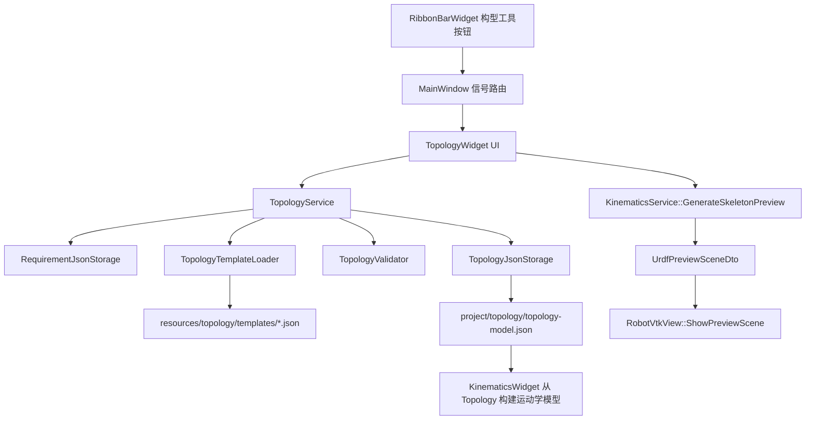

分层原则：

- UI 不直接解析模板 JSON。
- UI 不直接读 Requirement 文件。
- Service 不负责控件显示。
- Validator 不读文件，只校验内存 DTO。
- Storage 不做业务推断，只做 JSON 与 DTO 转换。
- VTK 视图不理解 Topology 业务，只消费 Kinematics 预览 DTO。

## 5. 主数据模型

### 5.1 RobotTopologyModelDto

`RobotTopologyModelDto` 是构型模块的主模型，定义在：

```text
modules/topology/dto/RobotTopologyModelDto.h
```

结构如下：

```cpp
struct RobotTopologyModelDto
{
    TopologyMetaDto meta;
    RobotDefinitionDto robot_definition;
    TopologyLayoutDto layout;
    std::vector<TopologyJointDto> joints;
    std::vector<TopologyAxisRelationDto> axis_relations;
    TopologyGraphDto topology_graph;
};
```

各部分含义：

- `meta`：构型 ID、名称、版本、来源、状态、模板 ID、Requirement 引用。
- `robot_definition`：机器人类型、关节数、应用标签、基座安装、J1 行程、DH 关键尺寸。
- `layout`：内部走线、中空关节、中空腕、预留通道直径、第七轴预留。
- `joints`：六个关节的 ID、轴序号、角色、父子连杆、轴方向、运动范围。
- `axis_relations`：关节轴线关系，例如平行、垂直、相交、偏置、共面。
- `topology_graph`：连杆节点和关节边组成的拓扑图。

### 5.2 当前阶段固定支持 6R 串联

校验器强制：

```text
robot_definition.robot_type == "6R_serial"
robot_definition.joint_count == 6
```

默认构型包含 7 个 link：

```text
base_link
link_1
link_2
link_3
link_4
link_5
tool_link
```

默认构型包含 6 个 joint：

```text
joint_1: base
joint_2: shoulder
joint_3: elbow
joint_4: wrist_roll
joint_5: wrist_pitch
joint_6: wrist_yaw
```

默认父子链：

```text
base_link --joint_1--> link_1
link_1    --joint_2--> link_2
link_2    --joint_3--> link_3
link_3    --joint_4--> link_4
link_4    --joint_5--> link_5
link_5    --joint_6--> tool_link
```

### 5.3 DH 关键尺寸

`RobotDefinitionDto` 中保存构型阶段最重要的几何尺寸：

```text
base_height_m          d1: 基座高度
shoulder_offset_m      a1: 肩部偏置
upper_arm_length_m     a2: 大臂长度
elbow_offset_m         a3: 肘部偏移
forearm_length_m       d4: 小臂延伸长度
wrist_offset_m         d6: 腕部法兰偏置
```

这些字段同时服务三个方向：

- UI 表单编辑。
- Topology 基础校验。
- Kinematics 骨架预览和后续从 Topology 生成 DH/MDH 运动学模型。

### 5.4 工作态 DTO

`TopologyWorkspaceStateDto` 定义在：

```text
modules/topology/dto/TopologyRecommendationDto.h
```

结构如下：

```cpp
struct TopologyWorkspaceStateDto
{
    RobotTopologyModelDto current_model;
    std::vector<TopologyCandidateDto> candidates;
    TopologyRecommendationDto recommendation;
};
```

页面运行时不只保存当前模型，还保存候选列表和推荐结果。这样保存草稿后重新打开项目，候选与推荐解释也能恢复。

## 6. 默认构型创建流程

入口：

```cpp
TopologyService::CreateDefaultModel()
TopologyService::CreateDefaultState()
RobotTopologyModelDto::CreateDefault()
TopologyWorkspaceStateDto::CreateDefault()
```

流程：

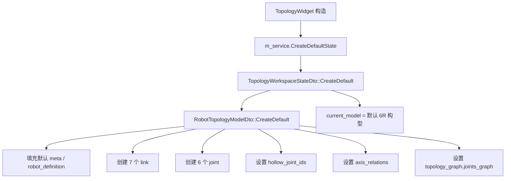

默认值用于三类场景：

- 页面刚打开时，避免空模型导致控件无数据。
- 模板 JSON 缺字段时，`TopologyTemplateLoader::ParseModelObject()` 以默认模型为底板，再覆盖 JSON 中存在的字段。
- 通用落地式模板特殊处理时，`ApplyFloorGeneralTemplateDefaults()` 会用默认模型恢复固定关节角色、轴线关系和拓扑图。

## 7. 模板加载流程

模板文件目录：

```text
resources/topology/templates/
```

当前模板：

```text
tpl_6r_floor_general  -> 6r-floor-general.json
tpl_6r_hollow_wrist   -> 6r-hollow-wrist.json
tpl_6r_wall_compact   -> 6r-wall-compact.json
```

### 7.1 模板目录解析

入口：

```cpp
TopologyTemplateLoader::ResolveTemplateDirectory()
```

解析优先级：

1. 构造函数显式传入的 `templateDirectory`。
2. `ROBOSDP_SOURCE_DIR/resources/topology/templates`。
3. 当前工作目录下的 `resources/topology/templates`。
4. 可执行程序目录的 `../resources/topology/templates`。

这样设计兼容源码运行、构建目录运行、安装后运行三种场景。

### 7.2 模板列表加载

入口：

```cpp
TopologyService::ListTemplates()
TopologyTemplateLoader::LoadTemplateSummaries()
TopologyTemplateLoader::LoadTemplates()
```

流程：

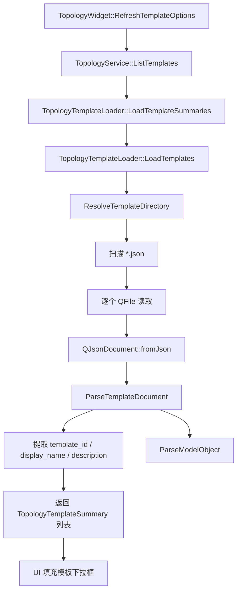

模板下拉框中固定添加一个特殊选项：

```text
全部模板（推荐） -> "__all__"
```

当选中 `__all__` 时，生成候选会遍历全部模板；当选中特定模板时，只生成该模板对应的候选。

### 7.3 模板 JSON 到 DTO

入口：

```cpp
TopologyTemplateLoader::ParseModelObject()
```

解析字段：

- `meta`
- `robot_definition`
- `layout`
- `axis_relations`
- `joints`
- `topology_graph.links`
- `topology_graph.joints_graph`

注意点：

- 解析时先创建 `RobotTopologyModelDto::CreateDefault()`，再用 JSON 覆盖。
- 如果模板 `meta.template_id` 为空，会用外层 `template_id` 补齐。
- 如果模板 `meta.name` 为空，会用外层 `display_name` 补齐。
- 当前 loader 已经不再解析旧的 `shoulder_type`、`elbow_type`、`wrist_type` 等文本字段；如果模板 JSON 中保留这些字段，它们会被忽略。

## 8. Requirement 约束接入

候选构型生成依赖已保存的 Requirement 草稿。

入口：

```cpp
TopologyService::GenerateCandidatesFromRequirement(projectRootPath, selectedTemplateId)
TopologyService::TryLoadRequirementConstraints(...)
```

读取文件路径由 Requirement 存储类决定：

```cpp
m_requirement_storage.BuildAbsoluteFilePath(projectRootPath)
```

构型模块从 Requirement 中提取的字段：

```text
project_meta.project_name
project_meta.scenario_type
workspace_requirements.base_constraints.base_mount_type
workspace_requirements.base_constraints.hollow_wrist_required
workspace_requirements.base_constraints.reserved_channel_diameter_mm
```

对应到内部约束对象：

```text
requirement_name
scenario_type
preferred_base_mount_type
base_mount_specified
hollow_wrist_required
hollow_wrist_specified
reserved_channel_diameter_mm
reserved_channel_specified
```

失败分支：

- `projectRootPath` 为空：返回 `InvalidArgument`。
- Requirement 文件读取失败：返回 `RepositoryDocumentNotFound`，并提示先在 Requirement 页面保存草稿。

## 9. 候选生成与推荐流程

主入口：

```cpp
TopologyService::GenerateCandidatesFromRequirement()
```

完整流程：

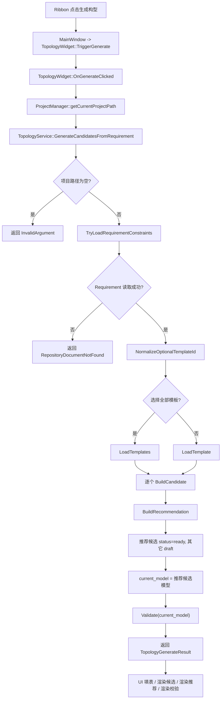

### 9.1 模板选择归一化

函数：

```cpp
NormalizeOptionalTemplateId(selectedTemplateId)
```

规则：

- 空字符串：表示全部模板。
- `__all__`：表示全部模板。
- 其它值：表示指定模板 ID。

### 9.2 BuildCandidate 规则

入口：

```cpp
TopologyService::BuildCandidate(templateRecord, constraints)
```

构建过程：

1. 复制模板模型到 `candidate.model`。
2. 设置候选 ID：

```text
candidate_{template_id}
```

3. 设置当前模型元信息：

```text
meta.topology_id = topology_{template_id}
meta.name = 模板 display_name
meta.source = "template"
meta.template_id = 模板 template_id
meta.status = "draft"
meta.requirement_ref = Requirement 项目名称
```

4. 如果 Requirement 有场景标签，且模板 `application_tags` 不包含该标签，则追加进去。
5. 如果 Requirement 指定了更大的预留通道直径，则抬高模板的 `layout.reserved_channel_diameter_mm`。
6. 根据规则评分。
7. 调用 `TopologyValidator::Validate()` 校验候选。
8. 校验通过则 `matches_requirement = true` 且 `meta.status = "ready"`，否则 `meta.status = "invalid"`。

### 9.3 评分规则

当前评分是最小规则，不是优化器。

| 条件 | 分数 | 说明 |
| --- | ---: | --- |
| 基础分 | +20 | 候选来自已登记的 6R 串联模板 |
| Requirement 指定基座且模板匹配 | +35 | `base_mount_type` 匹配 |
| Requirement 未指定基座 | +20 | 默认模板可参与比较 |
| Requirement 指定中空腕且满足 | +25 | 不要求中空腕或模板本身支持中空腕 |
| Requirement 未指定中空腕 | +10 | 按模板默认腕部形式保留 |
| 场景标签匹配 | +20 | `application_tags` 包含 `scenario_type` |
| 拓扑校验通过 | +10 | `TopologyValidator::Validate()` 无 Error |

不会加分但会记录推荐理由的情况：

- 基座安装方式与 Requirement 偏好不一致。
- 当前模板不满足 Requirement 的中空腕需求。
- 拓扑结构存在校验问题。
- 根据 Requirement 抬高预留通道直径。

### 9.4 BuildRecommendation 规则

入口：

```cpp
TopologyService::BuildRecommendation(candidates, true, true)
```

规则：

- 候选为空：返回无推荐结果，并写入“当前没有可推荐的候选构型”。
- 候选非空：选取 `score` 最大的候选。
- 写入：

```text
recommended_candidate_id
recommended_topology_id
recommended_template_id
combined_score
recommendation_reason
requirement_loaded = true
requirement_constraints_applied = true
```

如果多个候选同分，当前代码保留先出现的候选。由于模板文件按文件名排序读取，这意味着同分时推荐结果受模板文件名顺序影响。

## 10. UI 初始化流程

入口：

```cpp
TopologyWidget::TopologyWidget(...)
```

初始化顺序：

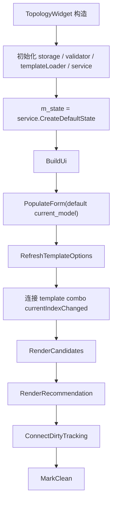

页面包含三个页签：

- `构型骨架`
- `候选方案`
- `校验结果`

顶部保留模板下拉框，操作按钮已经迁移到 Ribbon 构型工具页签。

## 11. 构型骨架表单

表单创建入口：

```cpp
TopologyWidget::CreateTopologyGroup()
```

主要控件：

```text
构型名称

运动学关键尺寸:
  基座高度 d1
  肩部偏置 a1
  大臂长度 a2
  肘部偏移 a3
  小臂长度 d4
  腕法兰偏置 d6

附加机械与安装配置:
  基座安装方式 floor / wall / ceiling / pedestal
  基座 RX / RY / RZ
  J1 行程最小 / 最大

走线预留与扩展:
  内部走线
  中空腕
  预留通道直径
  中空关节 ID
  预留第七轴
```

字段到控件映射：

```cpp
RegisterFieldWidget(fieldPath, widget)
```

用途：

- 校验失败时，`ApplyValidationResult()` 能根据 `issue.field` 找到对应控件。
- 对错误字段画红框。
- 对警告字段画橙框。
- 设置控件 tooltip 显示错误说明。

已注册字段包括：

```text
meta.name
robot_definition.base_height_m
robot_definition.shoulder_offset_m
robot_definition.upper_arm_length_m
robot_definition.elbow_offset_m
robot_definition.forearm_length_m
robot_definition.wrist_offset_m
robot_definition.base_mount_type
robot_definition.j1_rotation_range_deg[0]
robot_definition.j1_rotation_range_deg[1]
layout.reserved_channel_diameter_mm
layout.hollow_joint_ids
```

## 12. DTO 与 UI 双向转换

### 12.1 从 UI 收集模型

入口：

```cpp
TopologyWidget::CollectModelFromForm()
```

流程：

1. 以 `m_state.current_model` 为底板。
2. 从控件读取构型名称。
3. 从模板下拉框读取当前模板 ID。
4. 从 spinbox 读取 DH 关键尺寸。
5. 从 combo 读取基座安装方式。
6. 从 spinbox 读取基座姿态和 J1 行程。
7. 从 checkbox 读取走线、中空腕、第七轴预留。
8. 从 line edit 解析中空关节 ID 列表。
9. 如果当前模板是通用落地式模板，则应用固定默认值。

中空关节 ID 解析函数：

```cpp
ParseJointIdList(text)
```

支持分隔符：

```text
英文逗号
中文逗号
英文分号
中文分号
空白字符
```

### 12.2 从模型填充 UI

入口：

```cpp
TopologyWidget::PopulateForm(model)
```

流程：

1. 写入构型名称。
2. 设置基座安装方式 combo。
3. 设置 DH 尺寸 spinbox。
4. 设置基座姿态和 J1 行程。
5. 设置走线、中空腕、通道直径、第七轴。
6. 把 `hollow_joint_ids` 拼成一行文本。
7. 调用 `UpdateTemplateDrivenUiState()`。
8. 调用 `UpdateLivePreview()` 发送一次初始三维骨架预览。

## 13. 模板驱动 UI 状态

特殊模板 ID：

```text
tpl_6r_floor_general
```

判断函数：

```cpp
IsFloorGeneralTemplate(templateId)
```

应用函数：

```cpp
ApplyFloorGeneralTemplateDefaults(model)
UpdateTemplateDrivenUiState()
```

通用落地式模板的处理逻辑：

- 强制 `meta.template_id = "tpl_6r_floor_general"`。
- 强制 `base_mount_type = "floor"`。
- 强制 `base_orientation = {0, 0, 0}`。
- 恢复默认 J1 行程。
- 恢复默认关节角色、关节轴方向、父子连杆关系。
- 恢复默认轴线关系。
- 恢复默认拓扑图。
- UI 隐藏基座安装方式、基座姿态、J1 行程等安装语义字段。

这个设计的意思是：通用落地式模板只允许用户调核心尺寸和走线扩展，不让用户把模板语义改成半手工状态。

## 14. 脏检查与按钮状态

脏检查入口：

```cpp
TopologyWidget::ConnectDirtyTracking()
TopologyWidget::MarkDirty()
TopologyWidget::MarkClean()
```

监听控件：

- `QLineEdit::textEdited`
- `QComboBox::currentIndexChanged`
- `QDoubleSpinBox::valueChanged`
- `QCheckBox::toggled`
- 非只读 `QPlainTextEdit::textChanged`

特殊点：

- `QDoubleSpinBox::valueChanged` 不只标记 dirty，还会立即调用 `UpdateLivePreview()`。
- 这意味着 DH 尺寸每次变化，中央三维骨架都会实时刷新。

Ribbon 按钮状态查询：

```cpp
CanRefreshTemplates()
CanGenerate()
CanValidate()
CanSaveDraft()
```

当前逻辑：

- `CanGenerate()`：模板下拉框存在且当前索引有效。
- `CanValidate()`：构型名称非空。
- `CanSaveDraft()`：存在未保存修改。
- `CanRefreshTemplates()` 在头文件中是常开语义。

`MainWindow` 监听 `TopologyWidget::StatusChanged` 后调用：

```cpp
RibbonBarWidget::SetTopologyButtonsEnabled(...)
```

同时也会刷新 Kinematics 按钮状态，因为 Topology 保存状态会影响 Kinematics 是否可以从 Topology 构建模型。

## 15. Ribbon 到 Widget 的事件流

MainWindow 中的构型工具信号路由：

```cpp
signalTopologyRefreshTemplates -> TopologyWidget::TriggerRefreshTemplates()
signalTopologyGenerate         -> TopologyWidget::TriggerGenerate()
signalTopologyValidate         -> TopologyWidget::TriggerValidate()
signalTopologySaveDraft        -> TopologyWidget::TriggerSaveDraft()
```

事件流程：

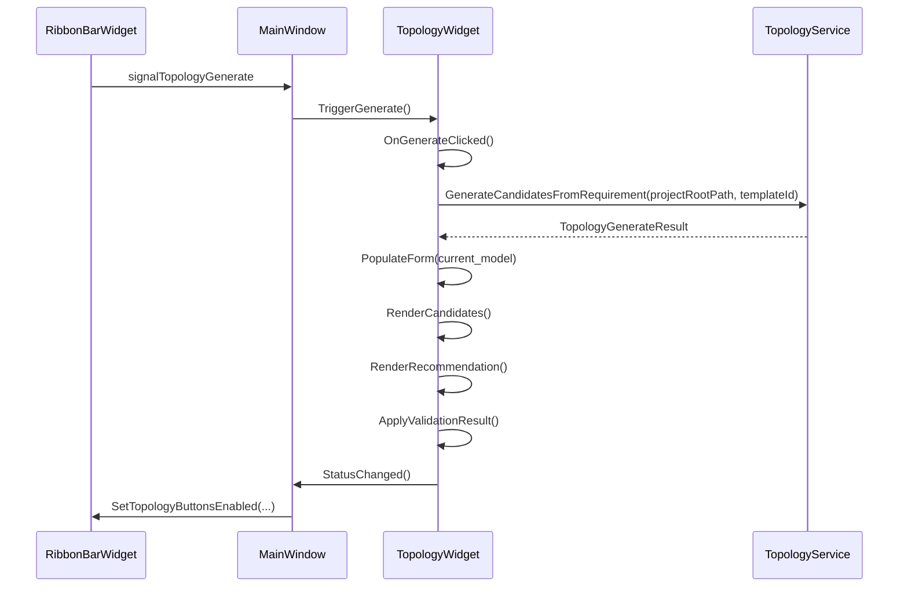

## 16. 生成候选 UI 流程

入口：

```cpp
TopologyWidget::OnGenerateClicked()
```

流程：

1. 从 `ProjectManager::instance().getCurrentProjectPath()` 获取项目根目录。
2. 从模板下拉框读取 `selectedTemplateId`。
3. 调用 `m_service.GenerateCandidatesFromRequirement(projectRootPath, selectedTemplateId)`。
4. 如果成功：
   - `m_state = generateResult.state`
   - `PopulateForm(m_state.current_model)`
   - `RenderCandidates()`
   - `RenderRecommendation()`
   - `ApplyValidationResult(generateResult.validation_result)`
   - `MarkDirty()`
5. 更新顶部操作提示。
6. 发出日志信号。
7. 发出 `StatusChanged()` 刷新 Ribbon 按钮。

生成成功后只标记 dirty，不自动保存。用户需要通过保存草稿或全局保存落盘。

## 17. 候选与推荐渲染

候选渲染入口：

```cpp
TopologyWidget::RenderCandidates()
```

展示信息：

```text
标题 | 模板=template_id | 评分=score | 推荐
```

候选推荐理由被拼到 `QListWidgetItem` 的 tooltip 中。

推荐渲染入口：

```cpp
TopologyWidget::RenderRecommendation()
```

展示信息：

```text
推荐模板：recommended_template_id，综合评分 combined_score。
```

推荐理由逐条显示在列表中。

## 18. 实时三维骨架预览流程

入口：

```cpp
TopologyWidget::UpdateLivePreview()
```

触发时机：

- `PopulateForm()` 结束后立即触发一次。
- 任意 `QDoubleSpinBox` 值变化时触发，主要是 DH 尺寸和姿态参数。

流程：

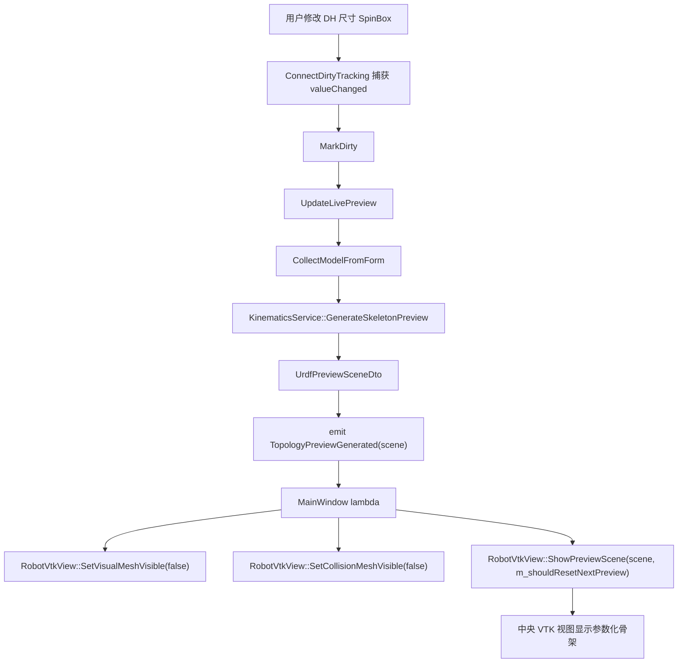

设计含义：

- Topology 本身不直接操作 VTK。
- Topology 也不自己生成 VTK 几何。
- Topology 只把当前表单构型交给 Kinematics 的骨架预览函数。
- 中央视图只接收通用的 `UrdfPreviewSceneDto`。

`MainWindow` 中还维护：

```cpp
m_shouldResetNextPreview
```

首次显示或需要重置时相机会重置；后续尺寸微调导致的预览刷新不会反复重置相机，避免用户视角被打断。

## 19. 校验流程

入口：

```cpp
TopologyWidget::OnValidateClicked()
TopologyService::Validate()
TopologyValidator::Validate()
```

UI 流程：

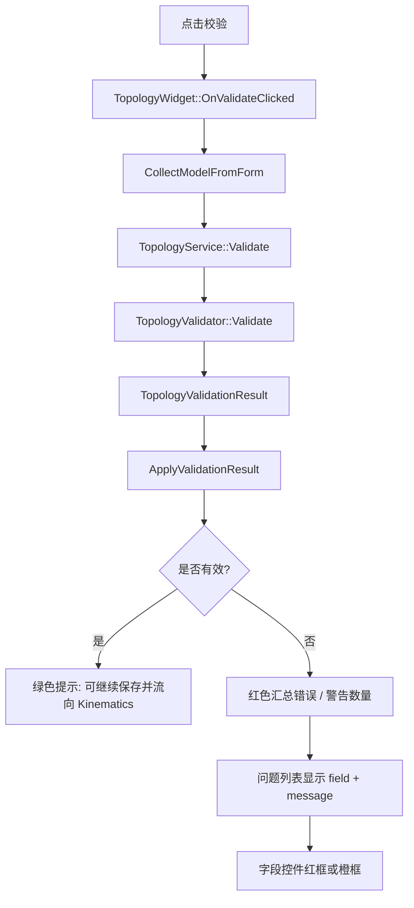

### 19.1 校验结果结构

`TopologyValidationResult` 包含：

```text
issues
IsValid()
ErrorCount()
WarningCount()
```

`IsValid()` 的判定：

```text
ErrorCount() == 0
```

Warning 不会阻止有效性。

### 19.2 校验级别

```text
Info
Warning
Error
```

转换显示函数：

```cpp
ToString(ValidationSeverity)
```

### 19.3 当前校验规则

元信息：

- `meta.topology_id` 不能为空。
- `meta.name` 不能为空。
- `meta.source` 必须是 `manual`、`template`、`imported`。
- `meta.status` 必须是 `draft`、`ready`、`invalid`、`archived`。
- 如果 `meta.source == "template"` 且 `meta.template_id` 为空，产生 Warning。

机器人定义：

- `robot_definition.robot_type` 必须是 `6R_serial`。
- `robot_definition.joint_count` 必须是 `6`。
- `base_mount_type` 必须是 `floor`、`wall`、`ceiling`、`pedestal`。
- `base_height_m >= 0`。
- `j1_rotation_range_deg[0] < j1_rotation_range_deg[1]`。

DH 尺寸：

- `shoulder_offset_m >= 0`。
- `upper_arm_length_m > 0`。
- `elbow_offset_m >= 0`。
- `forearm_length_m > 0`。
- `wrist_offset_m >= 0`。

布局：

- `reserved_channel_diameter_mm >= 0`。
- `hollow_joint_ids` 中的关节 ID 必须存在于 `joints` 集合中。

关节集合：

- `joints.size()` 必须等于 `joint_count`。
- `joint_id` 不能为空且唯一。
- `axis_index > 0`。
- `role` 不能为空。
- `parent_link_id` 和 `child_link_id` 不能为空。
- `motion_range_deg[0] < motion_range_deg[1]`。

轴线关系：

- `joint_pair[0]` 和 `joint_pair[1]` 不能为空。
- 两个关节都必须存在于 `joints` 集合。
- 两个关节不能相同。
- `relation_type` 必须是 `parallel`、`perpendicular`、`intersecting`、`offset`、`coplanar`。

拓扑图：

- `topology_graph.links.size() >= 2`。
- `topology_graph.joints_graph.size()` 必须等于 `joint_count`。
- link ID 不能为空且唯一。
- graph joint 的 `joint_id` 必须存在于 `joints`。
- graph joint 的父子 link 必须存在于 `links`。

## 20. 保存草稿流程

入口：

```cpp
TopologyWidget::OnSaveDraftClicked()
TopologyWidget::SaveCurrentDraft()
TopologyService::SaveDraft()
TopologyJsonStorage::Save()
```

流程：

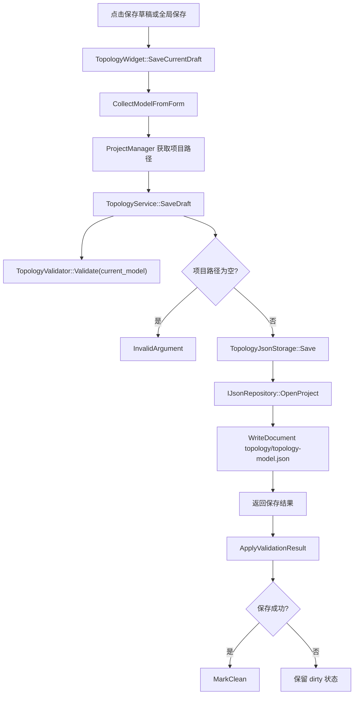

保存文件相对路径：

```text
topology/topology-model.json
```

绝对路径由：

```cpp
TopologyJsonStorage::BuildAbsoluteFilePath(projectRootPath)
```

生成。

注意：

- `SaveDraft()` 会先校验当前模型，但当前实现即使存在校验错误也会继续调用 storage 保存，保存是否成功主要取决于项目路径和仓储写入。
- UI 会展示校验结果，用户能看到不合法字段。

## 21. 加载草稿流程

入口：

```cpp
TopologyWidget::OnLoadClicked()
TopologyService::LoadDraft()
TopologyJsonStorage::Load()
```

流程：

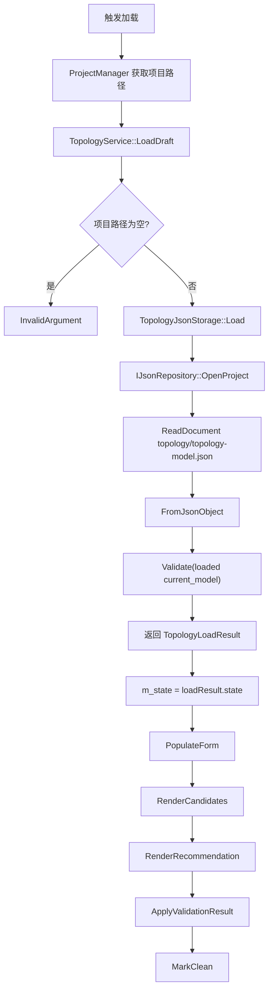

## 22. JSON 持久化格式

保存入口：

```cpp
TopologyJsonStorage::ToJsonObject(state)
```

根对象以 `current_model` 的模型字段为主体，然后外挂：

```text
candidates
recommendation
```

整体结构：

```json
{
  "meta": {},
  "robot_definition": {},
  "layout": {},
  "axis_relations": [],
  "joints": [],
  "topology_graph": {},
  "candidates": [],
  "recommendation": {}
}
```

`meta`：

```json
{
  "topology_id": "topology_tpl_6r_floor_general",
  "name": "通用落地式 6R 串联",
  "version": 1,
  "source": "template",
  "status": "ready",
  "remarks": "",
  "template_id": "tpl_6r_floor_general",
  "requirement_ref": "项目名称"
}
```

`robot_definition`：

```json
{
  "robot_type": "6R_serial",
  "joint_count": 6,
  "application_tags": ["handling", "assembly"],
  "base_mount_type": "floor",
  "base_orientation": [0.0, 0.0, 0.0],
  "j1_rotation_range_deg": [-185.0, 185.0],
  "base_height_m": 0.35,
  "shoulder_offset_m": 0.15,
  "upper_arm_length_m": 0.5,
  "elbow_offset_m": 0.0,
  "forearm_length_m": 0.4,
  "wrist_offset_m": 0.12
}
```

`layout`：

```json
{
  "internal_routing_required": false,
  "hollow_joint_ids": ["joint_4", "joint_5", "joint_6"],
  "hollow_wrist_required": false,
  "reserved_channel_diameter_mm": 20.0,
  "seventh_axis_reserved": false
}
```

`candidate`：

```json
{
  "candidate_id": "candidate_tpl_6r_floor_general",
  "title": "通用落地式 6R 串联",
  "template_id": "tpl_6r_floor_general",
  "score": 100.0,
  "matches_requirement": true,
  "recommendation_reason": [],
  "model": {}
}
```

`recommendation`：

```json
{
  "recommended_candidate_id": "candidate_tpl_6r_floor_general",
  "recommended_topology_id": "topology_tpl_6r_floor_general",
  "recommended_template_id": "tpl_6r_floor_general",
  "combined_score": 100.0,
  "requirement_loaded": true,
  "requirement_constraints_applied": true,
  "recommendation_reason": []
}
```

反序列化入口：

```cpp
TopologyJsonStorage::FromJsonObject()
TopologyJsonStorage::FromModelObject()
```

读取时同样以默认 DTO 为底板，缺字段会保留默认值。

## 23. MainWindow 集成流程

### 23.1 页面创建

入口：

```cpp
MainWindow::CreatePropertyDock()
```

构型页面被创建并加入右侧属性面板：

```cpp
m_topologyWidget = new RoboSDP::Topology::Ui::TopologyWidget(&m_logger, m_propertyStack);
m_propertyStack->addWidget(m_topologyWidget);
```

同时注册到全局保存协调器：

```cpp
m_projectSaveCoordinator.RegisterParticipant(m_topologyWidget);
```

这意味着全局保存会调用 `TopologyWidget::SaveCurrentDraft()`。

### 23.2 日志

```cpp
TopologyWidget::LogMessageGenerated -> MainWindow::AppendLogLine
```

构型模块刷新模板、生成、校验、保存、加载时都会发日志。

### 23.3 Ribbon 状态刷新

```cpp
TopologyWidget::StatusChanged -> MainWindow lambda
```

MainWindow 收到后会刷新：

- Topology 按钮状态。
- Kinematics 按钮状态。

这点很关键：构型保存后，运动学模块的“从 Topology 构建”按钮可能需要启用。

### 23.4 中央三维预览

```cpp
TopologyWidget::TopologyPreviewGenerated
    -> MainWindow lambda
    -> RobotVtkView::ShowPreviewScene
```

MainWindow 处理时会先关闭：

```cpp
SetVisualMeshVisible(false)
SetCollisionMeshVisible(false)
```

原因：Topology 阶段只有参数化骨架，没有真实 mesh 文件。

## 24. Topology 到 Kinematics 的交接

构型模块的结果主要通过保存的：

```text
topology/topology-model.json
```

交给 Kinematics 模块使用。

典型下游入口：

```text
Ribbon: signalKinematicsBuildFromTopology
MainWindow: KinematicsWidget::TriggerBuildFromTopology()
KinematicsWidget: 从项目路径读取 Topology 草稿
KinematicsService: 基于 RobotTopologyModelDto 构建 KinematicModelDto
```

交接重点字段：

- 机器人类型和关节数：决定当前是否可按 6R 串联处理。
- DH 关键尺寸：决定后续 DH/MDH 参数。
- 关节角色和轴方向：决定关节语义。
- 父子连杆：决定链式结构。
- 运动范围：决定 FK/IK、工作空间采样、可达性分析边界。
- 中空腕和走线字段：可能影响后续结构、选型、方案输出。

概念链路：

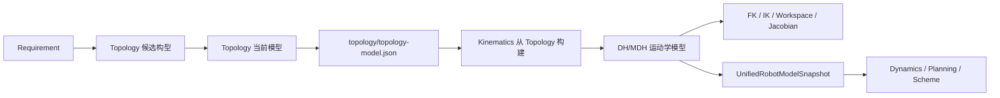

## 25. 常见用户操作程序流

### 25.1 第一次生成构型

```text
1. 在 Requirement 页面填写并保存需求草稿。
2. 进入 Topology 页面。
3. 选择“全部模板（推荐）”或指定模板。
4. 点击 Ribbon 的“生成构型”。
5. TopologyService 读取 Requirement。
6. TemplateLoader 读取模板 JSON。
7. Service 为每个模板构建候选并打分。
8. 推荐分最高候选。
9. UI 自动填入推荐构型。
10. 候选页显示评分和推荐理由。
11. 校验页显示当前推荐构型校验结果。
12. 中央 VTK 显示参数化骨架。
13. 用户保存草稿。
```

### 25.2 手工微调尺寸

```text
1. 用户修改 d1/a1/a2/a3/d4/d6。
2. SpinBox valueChanged 触发。
3. MarkDirty 标记未保存。
4. UpdateLivePreview 收集临时模型。
5. KinematicsService 生成骨架预览 DTO。
6. MainWindow 把预览 DTO 发给 RobotVtkView。
7. 中央视图更新骨架长度。
8. 用户校验。
9. 用户保存草稿。
```

### 25.3 校验失败修正

```text
1. 用户点击校验。
2. CollectModelFromForm 收集当前表单。
3. Validator 返回 issues。
4. ApplyValidationResult 清空旧状态。
5. 校验失败字段显示红框或橙框。
6. 问题列表显示字段路径、级别、中文说明。
7. 用户根据提示修正字段。
8. 再次校验。
```

### 25.4 项目重新打开后恢复构型

```text
1. 用户打开已有项目。
2. 触发 Topology 加载。
3. TopologyJsonStorage 读取 topology/topology-model.json。
4. FromJsonObject 恢复 current_model、candidates、recommendation。
5. UI 填表。
6. 候选和推荐面板恢复。
7. 校验结果重新计算。
8. MarkClean 标记无未保存修改。
```

## 26. 单元测试入口

测试目录：

```text
tests/unit/topology
```

测试目标：

```text
robosdp_topology_validation_smoke
```

测试文件：

```text
TopologyValidationSmokeTest.cpp
```

覆盖内容：

- 默认 `CreateDefault()` 的 6R 构型应通过校验。
- 空 `topology_id` 应产生错误。
- `joint_count != 6` 应产生错误。
- `joints` 数量与 `joint_count` 不一致应产生错误。
- `upper_arm_length_m <= 0` 应产生错误。
- 错误的基座安装方式应产生错误。
- 默认构型应包含 7 个 link 和 6 个 joint。

运行方式取决于构建目录，典型形式：

```powershell
ctest -R robosdp_topology_validation_smoke --output-on-failure
```

如果只想直接运行测试可执行文件，需要确保 Qt runtime 在 `PATH` 中。CMake 测试里已经通过 `cmake -E env "PATH=..."` 做了处理。

## 27. 常见修改位置

新增或调整构型模板：

```text
resources/topology/templates/*.json
```

新增 DTO 字段：

```text
modules/topology/dto/RobotTopologyModelDto.h
modules/topology/service/TopologyTemplateLoader.cpp
modules/topology/persistence/TopologyJsonStorage.cpp
modules/topology/validator/TopologyValidator.cpp
modules/topology/ui/TopologyWidget.cpp
```

新增 Requirement 约束接入：

```text
modules/topology/service/TopologyService.h
modules/topology/service/TopologyService.cpp
modules/requirement/dto/RequirementModelDto.h
```

调整候选评分：

```text
TopologyService::BuildCandidate()
TopologyService::BuildRecommendation()
```

调整 UI 字段：

```text
TopologyWidget::CreateTopologyGroup()
TopologyWidget::CollectModelFromForm()
TopologyWidget::PopulateForm()
TopologyWidget::RegisterFieldWidget()
```

调整校验规则：

```text
TopologyValidator::Validate()
tests/unit/topology/TopologyValidationSmokeTest.cpp
```

调整实时预览：

```text
TopologyWidget::UpdateLivePreview()
KinematicsService::GenerateSkeletonPreview()
MainWindow 中 TopologyPreviewGenerated 的连接
RobotVtkView::ShowPreviewScene()
```

调整保存格式：

```text
TopologyJsonStorage::ToJsonObject()
TopologyJsonStorage::FromJsonObject()
TopologyJsonStorage::ToModelObject()
TopologyJsonStorage::FromModelObject()
```

## 28. 维护风险与注意事项

### 28.1 当前是 6R 专用实现

`TopologyValidator`、默认 DTO、模板、Kinematics 交接都默认 6R 串联。若要支持 SCARA、Delta、7R、移动轴等结构，不应只改模板 JSON，还需要同步改：

- DTO 表达能力。
- Validator 规则。
- TemplateLoader 字段解析。
- UI 表单。
- Kinematics 从 Topology 构建逻辑。
- 预览生成逻辑。
- 单元测试。

### 28.2 模板 JSON 中存在被忽略的旧字段

部分模板 `layout` 中仍可见：

```text
shoulder_type
elbow_type
wrist_type
wrist_intersection
wrist_offset
```

当前 `TopologyTemplateLoader` 已不解析这些字段，`TopologyJsonStorage` 也不保存这些字段。若以后需要恢复结构类型语义，应先明确 DTO 字段，再补齐 loader、storage、UI 和校验。

### 28.3 保存不等于校验通过

`SaveDraft()` 会生成校验结果并展示，但当前代码没有用校验失败阻止写文件。这个行为对“允许保存草稿”友好，但对“只允许合格数据进入下游”不够严格。

如果后续要阻止不合法构型流向 Kinematics，更合适的位置是：

- Kinematics 从 Topology 构建前重新校验。
- 或在 Topology 保存成功但校验失败时设置 `meta.status = "invalid"`。
- 或增加“发布/确认构型”与“保存草稿”的状态区分。

### 28.4 同分推荐受模板文件名顺序影响

模板读取使用 `QDir::Name` 排序，`BuildRecommendation()` 只在 `candidate.score > best.score` 时替换最佳候选。同分时保留先出现的候选。

如果推荐稳定性需要更强，建议加入显式 tie-breaker：

- 模板优先级字段。
- 更小尺寸或更高刚度偏好。
- Requirement 场景权重。
- 用户历史选择。

### 28.5 UI 字段映射要和 Validator field 保持一致

红框提示依赖：

```cpp
issue.field -> m_field_widgets[fieldPath]
```

如果 Validator 新增字段路径，但 UI 没有注册对应 widget，校验列表仍会显示问题，但控件不会高亮。

### 28.6 Topology 预览依赖 Kinematics

`TopologyWidget::UpdateLivePreview()` 直接调用：

```cpp
KinematicsService::GenerateSkeletonPreview(currentTopologyModel)
```

这让 Topology 阶段能复用统一骨架 DTO，但也意味着 Kinematics 预览接口变更会影响 Topology 页面。修改 Kinematics 预览 DTO 时，需要回归 Topology 的实时尺寸预览。

### 28.7 通用落地式模板有特殊 UI 逻辑

`tpl_6r_floor_general` 会隐藏安装配置，并在收集表单时恢复模板固定语义。修改这个模板的含义时，要同步检查：

```text
kFloorGeneralTemplateId
IsFloorGeneralTemplate()
ApplyFloorGeneralTemplateDefaults()
UpdateTemplateDrivenUiState()
```

否则 UI 显示和底层模型可能不一致。

## 29. 建议阅读顺序

如果要快速掌握整个模块，建议按这个顺序读：

1. `modules/topology/dto/RobotTopologyModelDto.h`
2. `modules/topology/dto/TopologyRecommendationDto.h`
3. `resources/topology/templates/6r-floor-general.json`
4. `modules/topology/service/TopologyTemplateLoader.cpp`
5. `modules/topology/service/TopologyService.cpp`
6. `modules/topology/validator/TopologyValidator.cpp`
7. `modules/topology/persistence/TopologyJsonStorage.cpp`
8. `modules/topology/ui/TopologyWidget.cpp`
9. `apps/desktop-qt/MainWindow.cpp` 中 Topology 相关 connect
10. `modules/kinematics/service/KinematicsService.cpp` 中 Topology 预览和从 Topology 构建逻辑
11. `tests/unit/topology/TopologyValidationSmokeTest.cpp`

读代码时的主线问题：

- 当前模型从哪里来？
- 哪些字段可由用户编辑？
- 哪些字段由模板固定？
- 生成候选时从 Requirement 读取了什么？
- 推荐分数怎么来？
- 校验失败会不会阻止保存？
- 保存的 JSON 是否能被 Kinematics 正确读取？
- 实时预览是否和最终 Kinematics 构建使用同一套尺寸语义？

## 30. 一页流程速记

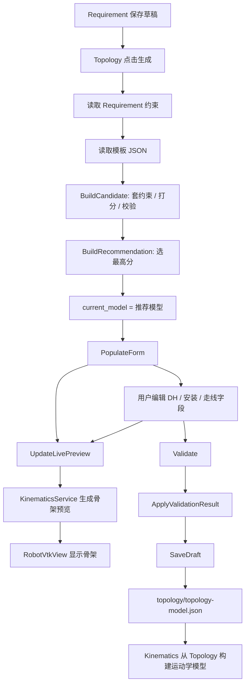

掌握这个模块时，可以把它理解成一个“模板约束匹配器 + 6R 构型编辑器 + 骨架预览桥”。

真正影响下游的关键数据不是 UI 控件本身，而是保存到 `topology/topology-model.json` 中的 `RobotTopologyModelDto`：它决定了后续 Kinematics 的 DH 参数、关节链、运动范围和三维骨架初始形态。
