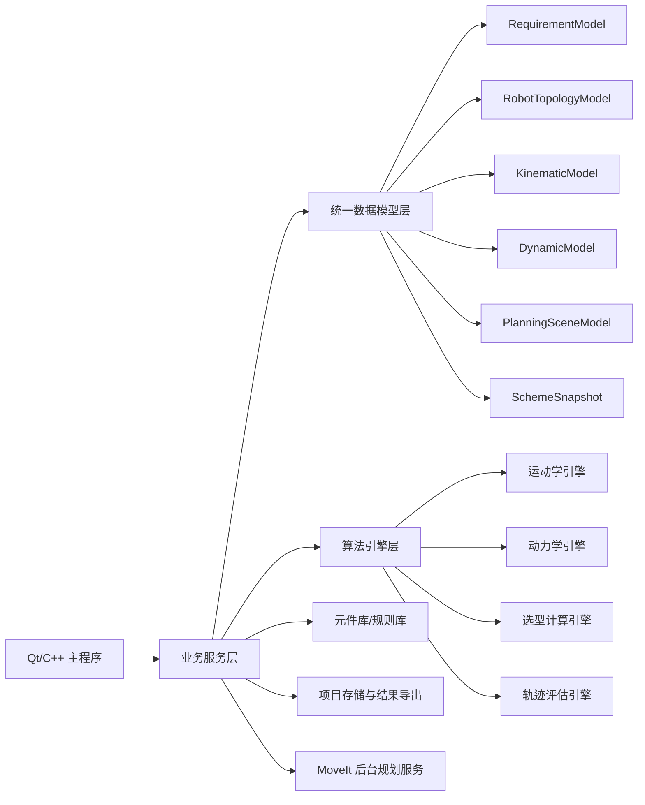
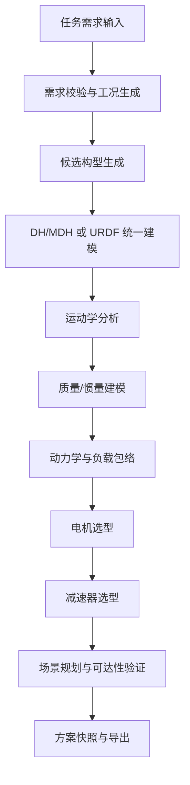
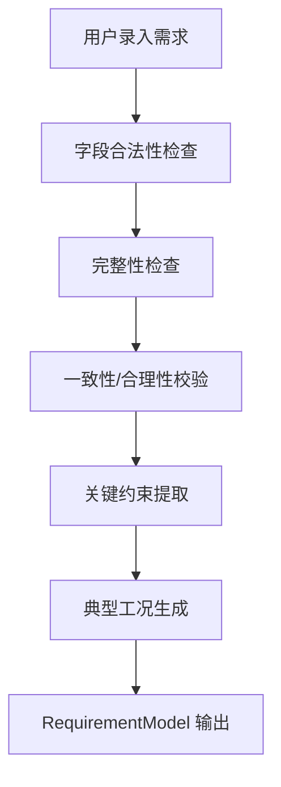
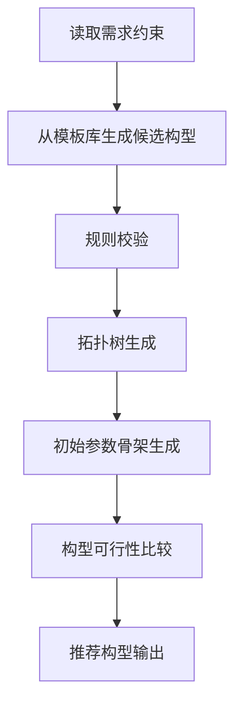
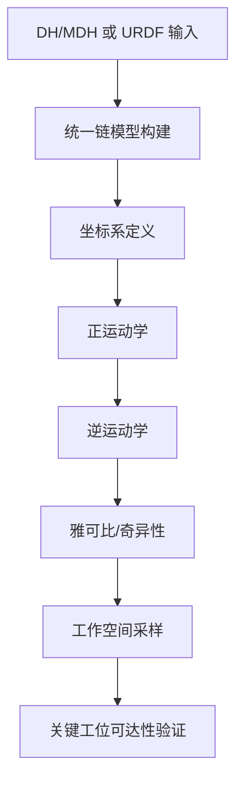
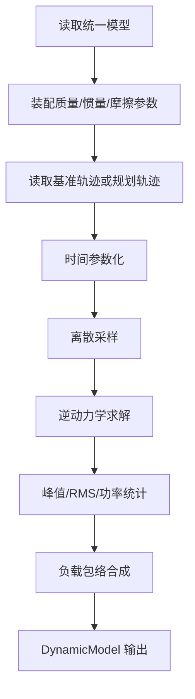
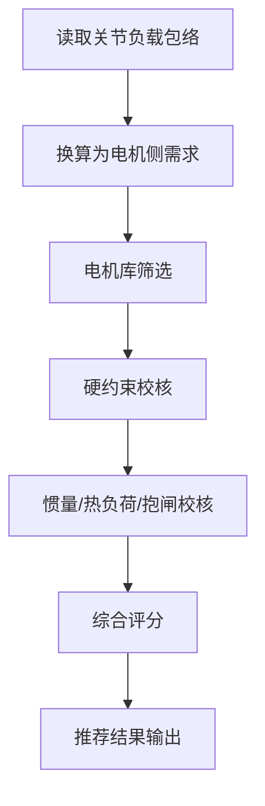
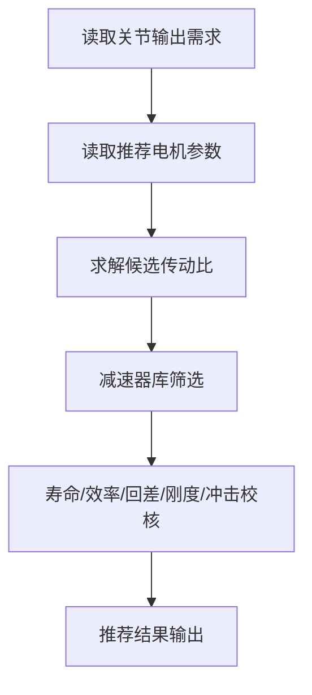
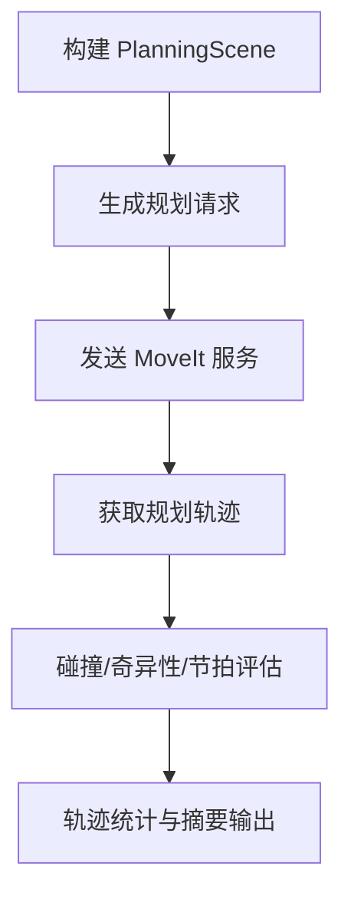

# 机械臂设计与仿真验证软件详细设计文档

**文件名**：`robot-design-platform-codex-final.md`  
**文档类型**：软件详细设计文档（面向 Codex 实施）  
**适用阶段**：第一阶段实施设计，兼顾二期与后续迭代扩展  
**适用对象**：产品经理、系统架构师、算法工程师、Qt 桌面端开发、后台服务开发、Codex 代码生成  
**编写目的**：将机械臂设计与仿真验证软件的业务讨论结果收敛为一份可直接指导实现的软件工程文档。

---

## 1. 文档目标与使用方式

本文档不是需求原文的拼接，也不是会议纪要的堆叠，而是面向实现的工程化设计文档。文档目标如下：

1. 将业务目标转化为清晰的软件架构、模块边界与数据流；
2. 将模块需求转化为统一数据对象、接口、流程、规则与校验口径；
3. 明确第一阶段的交付边界、非目标与实施顺序；
4. 为结构件、精度、刚度、模态、安全、优化等后续模块预留扩展路径；
5. 为 Codex 生成项目骨架、DTO、Service、Adapter、测试代码提供稳定依据；
6. 明确代码开发要求，保证生成代码可读、可维护、可扩展。

本文档应按以下方式使用：

- **架构设计阶段**：重点阅读第 3 章、第 4 章、第 5 章；
- **模块开发阶段**：重点阅读第 8 章、第 9 章、第 10 章；
- **Codex 生成阶段**：重点阅读第 11 章、第 12 章、第 13 章；
- **测试与验收阶段**：重点阅读第 14 章、第 15 章。

---

## 2. 项目背景、定位与建设边界

### 2.1 项目背景

本系统定位为**工业级 6DOF 串联机械臂设计与仿真验证平台**。系统面向研发设计阶段，目标是建立从任务需求到方案验证的闭环，而不是一次性建设完整执行级数字样机。

系统应支持以下主链：

> 任务需求定义 → 总体构型设计 → 运动学参数设计 → 动力学与负载分析 → 电机/减速器选型 → 轨迹规划与仿真验证 → 方案快照与导出

并为后续扩展以下方向预留统一接口：

- 连杆与结构件设计
- 轴承与支撑连接设计
- 末端执行器与工具接口设计
- 精度与误差计算
- 刚度、强度与模态分析
- 安全与可靠性设计
- 选型推荐与方案优化
- 标准报告与 BOM 自动生成

### 2.2 总体建设目标

系统需实现以下总体目标：

1. 支持 6R 串联工业机械臂的新建设计与已有模型导入复用；
2. 支持任务需求、构型、运动学、动力学、驱动选型和规划验证的主链闭环；
3. 支持多工况、多轨迹、多方案对比；
4. 支持运动学、动力学、结构、精度、刚度、安全等能力按阶段迭代增强；
5. 支持元件库、规则库、算法引擎和结果导出能力持续扩充；
6. 保证项目结果可追踪、可回写、可对比、可扩展。

### 2.3 第一阶段交付目标

第一阶段聚焦“**主链闭环跑通**”，核心要求是：

- 可运行
- 可计算
- 可比选
- 可输出
- 可持续扩展

第一阶段最小闭环如下：

> 需求输入 → 构型设计 → 运动学建模 → 动力学计算 → 电机选型 → 减速器选型 → 场景级轨迹验证 → 方案导出

### 2.4 第一阶段非目标

为控制复杂度，第一阶段以下内容不作为硬性交付：

- 不交付完整执行级数字样机；
- 不交付 Gazebo / 控制器闭环仿真；
- 不深度实现高保真有限元、疲劳、热分析；
- 不要求覆盖全部机器人类型；
- 不要求建立全量工业元件库；
- 不要求实现高级自动优化器，但需预留接口。

---

## 3. 核心设计原则

### 3.1 统一模型优先

所有模块必须围绕统一的数据对象工作。禁止模块之间通过 UI 状态、全局变量、临时文件或非标准结构直接传值。

### 3.2 分层解耦优先

桌面主程序、算法引擎、外部规划服务、元件库、项目存储和导出模块应分层设计，避免 Qt UI 与算法内核、主程序与 MoveIt 服务强耦合。

### 3.3 第一阶段闭环优先

首期优先保证主链路闭环、结果可解释和项目可保存，不追求一次性完成全部模块或过深仿真。

### 3.4 双入口统一归一

系统支持两类建模入口：

1. **DH/MDH 参数化新建设计**
2. **URDF 模型导入复用**

两类输入必须归一为统一内部模型，再供后续模块消费。

### 3.5 结果可追踪、可回写、可比选

所有关键分析结果应具备：

- 来源可追踪；
- 对上游参数可回溯；
- 对下游模块可复用；
- 可保存为方案快照；
- 可与其他方案对比；
- 字段允许前向扩展。

### 3.6 模块化与可扩展性优先

本系统必须尽量模块化设计，便于后期不断扩展功能、完善功能并进行软件迭代。为实现这一点，必须满足以下要求：

1. **业务模块边界清晰**：需求、构型、运动学、动力学、选型、规划验证、结构、精度、刚度、安全等模块职责不可混淆；
2. **共享模型、独立实现**：模块通过标准 DTO 和 Service 接口交互，内部算法和 UI 实现独立演进；
3. **新增能力可插拔接入**：后续新增模块应尽量以新增 Service、Adapter、规则集、页面和结果对象的方式接入；
4. **算法内核可替换**：IK 求解器、动力学引擎、规划器、评分器应可替换；
5. **元件库与规则库外置化**：型号、阈值、评分权重、风险规则不得深度硬编码在页面逻辑中；
6. **项目文件前向兼容**：模型对象新增字段时，旧项目应可平滑升级；
7. **避免巨型模块**：不允许出现一个页面、一个 Service 或一个 God Object 包办多个业务域的情况；
8. **共享公共能力下沉**：日志、配置、DTO 校验、快照、导出、规则引擎等公共能力必须下沉到公共层；
9. **模块可单独测试**：每个核心模块至少应支持 DTO 层测试、服务层测试和最小集成测试。

### 3.7 代码可读性优先

系统定位为长期演进的软件平台，因此代码必须追求可读、可维护，而不是短期拼装。

### 3.8 中文注释强制要求

为了方便团队理解和后续维护，生成代码和人工编写代码必须满足以下要求：

1. **核心类、核心方法、复杂逻辑必须有中文注释**；
2. **DTO 字段定义应有中文说明**；
3. **算法步骤和关键公式位置必须用中文解释输入、输出与限制条件**；
4. **接口层、适配层和转换逻辑必须说明上下游对象语义**；
5. **禁止仅保留空泛注释**，例如“处理数据”“执行逻辑”这类无效注释；
6. **代码标识符建议保持英文命名**，但注释、文档字符串和字段说明使用中文；
7. **自动生成代码必须可直接阅读，不依赖额外口头解释。**

---

## 4. 总体建设范围与模块规划

### 4.1 总体模块规划

系统总体规划覆盖以下业务模块：

1. 任务需求定义模块
2. 总体构型设计模块
3. 运动学参数设计模块
4. 动力学与负载分析模块
5. 电机选型模块
6. 减速器选型模块
7. 连杆与结构件设计模块
8. 轴承与支撑连接设计模块
9. 末端执行器与工具接口设计模块
10. 精度与误差计算模块
11. 刚度、强度与模态分析模块
12. 安全与可靠性设计模块
13. 轨迹规划与仿真验证模块
14. 选型推荐与方案优化模块
15. 数据管理与元件库模块
16. 报告生成与数据导出模块

### 4.2 第一阶段交付范围

#### 4.2.1 业务模块

1. 任务需求定义模块
2. 总体构型设计模块
3. 运动学参数设计模块
4. 动力学与负载分析模块
5. 电机选型模块
6. 减速器选型模块
7. 轨迹规划与仿真验证模块
8. 方案管理与最小导出能力

#### 4.2.2 基础能力

1. 最小项目数据底座
2. 电机库与减速器库
3. 质量/质心/惯量录入与经验估算机制
4. 标准基准测试轨迹库
5. 项目保存与结果导出能力
6. MoveIt 后台规划验证服务
7. 统一日志、配置、校验与错误码机制

### 4.3 二期及后续扩展范围

后续应逐步接入：

- 连杆与结构件设计
- 轴承与支撑连接设计
- 末端执行器与工具接口设计
- 精度与误差计算
- 刚度、强度与模态分析
- 安全与可靠性设计
- 选型推荐与方案优化
- 标准报告生成与 BOM 导出

---

## 5. 总体技术架构

### 5.1 架构概览



### 5.1A 共享机器人模型与 Pinocchio 底层策略

为避免运动学模块与动力学模块分别维护两套不一致的关节链、坐标系和刚体参数语义，第一阶段在总体架构上新增如下约束：

1. **统一机器人模型先行归一**：DH/MDH 与 URDF 两类建模入口必须先归一为统一内部机器人模型（建议命名为 `UnifiedRobotModel`）；
2. **共享底层统一加载**：`UnifiedRobotModel` 由 `Pinocchio Robot Adapter` 统一加载为底层刚体树对象，供运动学与动力学共同使用；
3. **业务模块保持分层**：`KinematicsService` 与 `DynamicsService` 继续分别承担业务编排职责，不因共享底层而合并为单一模块；
4. **IK 保持可插拔**：逆运动学继续通过 Solver 接口独立封装，避免首轮实现被底层库能力边界绑死；
5. **规划模块保持解耦**：MoveIt 规划服务继续通过标准 DTO 消费统一模型语义，不直接依赖 Pinocchio 内部对象。

### 5.2 运行架构说明

#### 5.2.1 Qt/C++ 主程序

负责：

- 项目管理
- 参数录入与编辑
- 数据模型维护
- 主链计算编排
- 结果展示与导出
- 方案管理与对比

#### 5.2.2 算法引擎层

负责：

- DH/MDH 建模
- URDF 解析
- 正逆运动学
- 雅可比与奇异性分析
- 动力学求解
- 电机/减速器选型
- 轨迹统计与结果评估

#### 5.2.3 MoveIt 后台规划服务

负责：

- PlanningScene 构建
- 点到点/连续路径规划
- 碰撞检测
- 自碰撞检测
- 可达性复核
- 节拍与轨迹质量统计

#### 5.2.4 元件库与规则库

负责：

- 电机基础库
- 减速器基础库
- 材料密度库
- 构型模板库
- 选型与校核规则库
- 风险提示与评分权重规则

#### 5.2.5 项目存储与导出

负责：

- 工程文件持久化
- 方案快照管理
- 基础结果表导出
- 阶段分析摘要导出
- 后续标准报告接口预留

### 5.3 面向持续迭代的模块化架构约束

#### 5.3.1 模块独立演进约束

- UI 页面按业务域拆分，不允许单页面承载多个复杂业务域；
- 每个业务域至少拥有独立 Service、DTO、结果对象和测试目录；
- MoveIt 规划服务保持独立服务形态；
- 新增模块应尽量通过新增 Service 与新增页面接入，而不是修改旧模块核心逻辑。

#### 5.3.2 公共能力下沉约束

以下能力必须下沉至公共层：

- DTO 校验
- 日志
- 错误码
- 规则引擎
- 文件导入导出
- 方案快照
- 图表导出
- 配置加载

#### 5.3.3 结果对象兼容约束

- 所有结果对象均应允许新增字段；
- 项目文件应带版本号；
- 旧项目读取时允许缺省字段自动补全；
- 快照对象应只引用标准对象，不引用页面私有状态。

#### 5.3.4 算法内核可替换约束

- 运动学与动力学应共享统一机器人模型，不允许分别维护两套彼此独立的关节链语义；
- 第一阶段默认采用 **Pinocchio Adapter** 作为运动学/动力学共享底层内核，用于承载统一刚体树、FK、Jacobian 与逆动力学基础能力；
- 运动学模块的 **IK 求解器应通过接口封装**，允许数值法、解析法或后续第三方 Solver 独立替换；
- 动力学模块应通过 Adapter 封装 Pinocchio，必要时为后续替换 Drake 预留兼容接口，但首轮不并行落地双实现；
- 规划器应通过 MoveIt Service Adapter 封装；
- 评分器与规则器不得耦合在 UI 控制器中。

---

## 6. 逻辑分层与职责划分

### 6.1 分层结构

```text
表示层（UI）
├─ 项目管理
├─ 参数录入/编辑
├─ 结果图表与报告预览
└─ 方案对比与导出

业务层（Application / Domain Service）
├─ RequirementService
├─ TopologyService
├─ KinematicsService
├─ DynamicsService
├─ MotorSelectionService
├─ ReducerSelectionService
├─ DriveTrainMatchingService
├─ PlanningVerificationService
└─ SchemeManagementService

模型层（Data Model / DTO）
├─ RequirementModel
├─ RobotTopologyModel
├─ KinematicModel
├─ DynamicModel
├─ MotorCandidate / MotorSelectionResult
├─ ReducerCandidate / ReducerSelectionResult
├─ PlanningSceneModel / PlanningVerificationResult
└─ SchemeSnapshot

适配层（Adapter）
├─ URDF Import Adapter
├─ Pinocchio Robot Adapter
├─ IK Solver Adapter
├─ MoveIt Service Adapter
├─ File Import/Export Adapter
├─ Library Loader Adapter
└─ Logging / Config Adapter

基础设施层（Infrastructure）
├─ Project Repository
├─ Local JSON Store
├─ Rule Engine
├─ Material & Component Library
└─ Job / Task Scheduler
```

### 6.2 分层职责边界

#### 表示层

- 不直接进行复杂计算；
- 仅负责参数采集、状态展示、命令触发、结果渲染；
- 不持有业务模型的最终真值。

#### 业务层

- 组织模块流程；
- 调用算法引擎；
- 装配 DTO；
- 维护流程状态；
- 负责模块间结果回写。

#### 模型层

- 保存标准化对象；
- 作为模块交互唯一语义载体；
- 禁止出现同一业务对象的多份不一致表示。

#### 适配层

- 屏蔽外部格式差异；
- 屏蔽 MoveIt 通信细节；
- 屏蔽文件和元件库读取细节。

#### 基础设施层

- 持久化
- 配置
- 日志
- 缓存
- 规则执行
- 作业调度

---

## 7. 核心业务闭环与参数迭代闭环

### 7.1 主业务链路



### 7.2 参数迭代闭环

系统不是一次输入、一次求解，而是必须支持以下迭代链：

```text
运动学初设
→ 动力学初算
→ 电机/减速器初选
→ 结构参数回写（后续扩展）
→ 动力学复算
→ 轨迹规划与场景验证
→ 方案收敛
```

### 7.3 需要迭代的关键参数类别

#### 7.3.1 运动学参数

- 构型
- 杆长
- 偏距
- 基座高度
- TCP 偏置
- 关节限位
- 腕部形式

#### 7.3.2 动力学参数

- 工况轨迹
- 节拍
- 速度/加速度
- 负载模型
- 摩擦与效率
- 安装姿态

#### 7.3.3 驱动传动参数

- 电机型号
- 减速器型号
- 传动比
- 抱闸配置
- 回差
- 扭转刚度

#### 7.3.4 结构参数（后续扩展）

- 截面形式
- 截面尺寸
- 壁厚
- 材料
- 轴径
- 支撑跨距

### 7.4 迭代顺序原则

1. 先运动学，后动力学；
2. 先驱动匹配，后结构收敛；
3. 结构结果必须回写动力学；
4. 最终必须通过场景仿真闭环验证。

---

## 8. 全局设计输入与设计输出

### 8.1 全局设计输入

研发人员输入给软件的内容包括：

#### 8.1.1 任务需求输入

- 负载、质心、惯量、偏载
- 工作空间
- 节拍与运动性能
- 精度目标
- 寿命与可靠性目标
- 环境与安装约束

#### 8.1.2 方案决策输入

- 构型偏好
- 中空需求
- 工具类型
- 材料或品牌偏好
- 电机/减速器约束
- 轨迹顺序与规划约束

#### 8.1.3 参数化建模输入

- DH/MDH 参数初值
- URDF 文件
- 坐标系定义
- 关节限位
- 物理参数

### 8.2 全局设计输出

软件最终输出给研发人员的内容包括：

- RequirementModel 与典型工况清单
- RobotTopologyModel 与初始骨架
- KinematicModel、工作空间、奇异性、可达性结果
- DynamicModel、扭矩/功率曲线、峰值/RMS 统计、负载包络
- 电机选型结果
- 减速器选型结果
- 电机—减速器联合驱动链推荐结果
- 场景级规划验证结果
- 方案快照、对比结果与导出文档

### 8.3 模块级输入输出总表

| 模块 | 设计输入 | 设计输出 |
|---|---|---|
| 任务需求定义 | 负载、空间、节拍、精度、寿命、环境 | RequirementModel、工况清单、约束清单 |
| 总体构型设计 | RequirementModel、构型偏好 | RobotTopologyModel、候选构型、推荐构型 |
| 运动学参数设计 | 拓扑骨架、DH/MDH、URDF、工位与姿态约束 | KinematicModel、工作空间、奇异性、可达性 |
| 动力学与负载分析 | KinematicModel、质量/惯量、工况轨迹 | DynamicModel、扭矩/功率曲线、峰值/RMS、负载包络 |
| 电机选型 | 关节负载需求、电机库、环境约束 | MotorSelectionResult |
| 减速器选型 | 输出侧需求、电机推荐、减速器库 | ReducerSelectionResult |
| 联合驱动链匹配 | 电机结果、减速器结果、传动比区间 | DriveTrainSelectionResult |
| 轨迹规划与仿真验证 | KinematicModel、关键工位、场景约束 | PlanningVerificationResult |

---

## 9. 核心数据模型设计

### 9.1 通用字段规范

所有核心对象建议具备以下基础字段：

```yaml
id: string
name: string
version: integer
created_at: datetime
updated_at: datetime
created_by: string
source: enum[manual, imported, estimated, computed]
status: enum[draft, ready, invalid, archived]
remarks: string
```

### 9.2 核心对象总览

| 对象 | 作用 | 主要生产模块 | 主要消费模块 |
|---|---|---|---|
| RequirementModel | 任务需求与设计约束统一模型 | 任务需求定义 | 构型、运动学、动力学、规划 |
| RobotTopologyModel | 机器人关节链与拓扑骨架 | 总体构型设计 | 运动学、动力学、规划 |
| KinematicModel | 统一运动学模型 | 运动学参数设计 | 动力学、规划、选型 |
| DynamicModel | 动力学与负载模型 | 动力学与负载分析 | 电机、减速器、优化 |
| MotorSelectionResult | 电机选型结果对象 | 电机选型 | 联合驱动链、导出 |
| ReducerSelectionResult | 减速器选型结果对象 | 减速器选型 | 联合驱动链、导出 |
| DriveTrainSelectionResult | 驱动链联合匹配结果 | 联合驱动链匹配 | 结构、导出、快照 |
| PlanningSceneModel | 规划场景对象 | 轨迹规划与仿真验证 | MoveIt 服务 |
| PlanningVerificationResult | 规划与验证结果对象 | 轨迹规划与仿真验证 | 导出、快照 |
| SchemeSnapshot | 方案快照对象 | 方案管理 | 对比、回滚、导出 |

### 9.3 RequirementModel

```yaml
RequirementModel:
  project_meta:
    project_name: string
    scenario_type: string
    description: string
  load_requirements:
    rated_payload: number
    max_payload: number
    tool_mass: number
    fixture_mass: number
    payload_cog: [x, y, z]
    payload_inertia: [ixx, iyy, izz, ixy, ixz, iyz]
    off_center_load: boolean
    cable_drag_load: number
    load_variants: []
  workspace_requirements:
    max_radius: number
    min_radius: number
    max_height: number
    min_height: number
    key_poses: []
    forbidden_regions: []
    obstacle_regions: []
    base_constraints: {}
  motion_requirements:
    max_linear_speed: number
    max_angular_speed: number
    max_acceleration: number
    max_angular_acceleration: number
    jerk_limit: number
    takt_time: number
  accuracy_requirements:
    absolute_accuracy: number
    repeatability: number
    tracking_accuracy: number
    orientation_accuracy: number
    tcp_position_tol: number
    tcp_orientation_tol: number
  reliability_requirements:
    design_life: number
    cycle_count: number
    duty_cycle: number
    operating_hours_per_day: number
    mtbf_target: number
  derived_conditions:
    rated_case: {}
    peak_case: {}
    continuous_case: {}
    extreme_case: {}
    selection_benchmark_case: {}
```

### 9.4 RobotTopologyModel（增强版）

```yaml
RobotTopologyModel:
  meta:
    topology_id: string
    name: string
    version: integer
    source: enum[manual, template, imported]
    status: enum[draft, ready, invalid, archived]
    remarks: string

  robot_definition:
    robot_type: enum[6R_serial]
    chain_type: enum[serial]
    dof: integer
    joint_count: integer
    application_tags: []

  base_mount:
    base_mount_type: string
    base_height_m: number
    base_orientation: [rx, ry, rz]
    j1_rotation_range_deg: [min, max]

  joint_roles:
    - joint_id: string
      role: string
      functional_group: string

  joints:
    - joint_id: string
      joint_type: enum[revolute, prismatic]
      axis_direction: [x, y, z]
      range: [min, max]
      max_velocity: number
      max_acceleration: number
      hollow: boolean
      parent_link_id: string
      child_link_id: string

  layout:
    shoulder_type: string
    elbow_type: string
    wrist_type: string
    wrist_intersection: boolean
    wrist_offset: boolean

  axis_relations:
    - joint_pair: [joint_a, joint_b]
      relation_type: string

  routing_reservation:
    internal_routing_required: boolean
    hollow_joint_ids: []
    hollow_wrist_required: boolean
    reserved_channel_diameter_mm: number

  external_axis:
    enabled: boolean
    seventh_axis_reserved: boolean

  topology_graph:
    links: []
    joints: []
```

### 9.5 KinematicModel（增强版）

```yaml
KinematicModel:
  modeling_mode: enum[DH, MDH, URDF]
  unified_robot_model_ref: string
  kinematic_kernel: enum[pinocchio]
  base_frame: {}
  flange_frame: {}
  tool_frame: {}
  workpiece_frame: {}
  tcp_frame: {}
  links:
    - link_id: L1
      a: number
      alpha: number
      d: number
      theta_offset: number
  joint_limits:
    - joint_id: J1
      soft_limit: [min, max]
      hard_limit: [min, max]
      max_velocity: number
      max_acceleration: number
  ik_solver_config:
    solver_type: string
    branch_policy: string
  fk_provider: enum[pinocchio]
  jacobian_provider: enum[pinocchio]
  jacobian_samples: []
  reachability_result: {}
  singularity_map: {}
```

### 9.6 DynamicModel（增强版）

```yaml
DynamicModel:
  unified_robot_model_ref: string
  dynamic_kernel: enum[pinocchio]
  gravity: [gx, gy, gz]
  installation_pose: {}
  links:
    - link_id: L1
      mass: number
      cog: [x, y, z]
      inertia_tensor: [ixx, iyy, izz, ixy, ixz, iyz]
      source: enum[urdf, manual, primitive_estimation, structure_feedback]
  joints:
    - joint_id: J1
      friction:
        viscous: number
        coulomb: number
        static: number
      transmission_ratio: number
      efficiency: number
  end_effector:
    mass: number
    cog: [x, y, z]
    inertia_tensor: []
  trajectories: []
  load_envelope: {}
  results:
    torque_curves: []
    power_curves: []
    peak_stats: []
    rms_stats: []
```

### 9.7 电机与减速器选型结果对象

```yaml
MotorSelectionResult:
  joint_id: string
  requirement_ref: string
  candidate_motors: []
  recommended_motor: {}
  check_results:
    peak_torque_check: string
    rms_torque_check: string
    speed_check: string
    power_check: string
    inertia_match_check: string
    thermal_check: string
    brake_check: string
```

```yaml
ReducerSelectionResult:
  joint_id: string
  requirement_ref: string
  candidate_reducers: []
  recommended_reducer: {}
  check_results:
    rated_torque_check: string
    peak_torque_check: string
    input_speed_check: string
    backlash_check: string
    stiffness_check: string
    life_check: string
    efficiency_check: string
    shock_check: string
```

```yaml
DriveTrainSelectionResult:
  joint_id: string
  motor_selection_ref: string
  reducer_selection_ref: string
  recommended_combination:
    motor_model: string
    reducer_model: string
    ratio: number
    brake_enabled: boolean
  combined_mass_kg: number
  combined_score: number
  recommendation_reason: []
```

### 9.8 PlanningSceneModel 与 PlanningVerificationResult

```yaml
PlanningSceneModel:
  robot_collision_model_ref: string
  environment_objects:
    - id: obj_001
      type: box|mesh|cylinder
      pose: {}
      size: {}
  forbidden_regions: []
  attached_objects: []
  motion_constraints:
    path_constraints: []
    orientation_constraints: []
    joint_constraints: []
  planning_config:
    planner: string
    max_time: number
    attempts: number
```

```yaml
PlanningVerificationResult:
  verification_id: string
  planning_scene_ref: string
  task_sequence_ref: string
  trajectory_results: []
  collision_results: []
  self_collision_results: []
  singularity_risk_results: []
  takt_evaluations: []
  smoothness_results: []
  feasibility_summary: {}
```

### 9.9 SchemeSnapshot

```yaml
SchemeSnapshot:
  scheme_id: string
  name: string
  based_on_requirements: string
  topology_ref: string
  kinematic_ref: string
  dynamic_ref: string
  motor_selection_ref: string
  reducer_selection_ref: string
  drive_train_selection_ref: string
  planning_verification_ref: string
  summary_metrics:
    weight_score: number
    cost_score: number
    performance_score: number
    risk_score: number
  tags: []
```

---

## 10. 数据持久化、元件库与规则库设计

### 10.1 项目持久化策略

第一阶段建议采用“**项目目录 + 结构化 JSON 文件**”方案，降低桌面应用实现复杂度并提高可调试性。

```text
<ProjectRoot>/
├─ project.json
├─ requirements/
│  └─ requirement-model.json
├─ topology/
│  └─ topology-model.json
├─ kinematics/
│  ├─ kinematic-model.json
│  └─ workspace-cache.json
├─ dynamics/
│  ├─ dynamic-model.json
│  ├─ mass-properties.json
│  └─ load-envelopes.json
├─ selection/
│  ├─ motor-selection.json
│  ├─ reducer-selection.json
│  └─ drivetrain-selection.json
├─ planning/
│  ├─ planning-scene.json
│  ├─ planning-requests.json
│  └─ planning-results.json
├─ snapshots/
│  └─ *.json
├─ exports/
│  ├─ tables/
│  └─ reports/
└─ logs/
   └─ app.log
```

### 10.2 持久化设计要求

- `project.json` 保存项目元信息、版本、当前方案、文件索引；
- 各模块对象独立保存，便于调试与比对；
- 快照独立保存，便于回滚和横向方案对比；
- 元件库不混入项目目录；
- 文件格式升级需带版本迁移逻辑。

### 10.3 元件库范围

第一阶段必须建设：

- 电机基础库
- 减速器基础库
- 材料密度基础库
- 构型模板库
- 标准基准测试轨迹库

### 10.4 元件库字段建议

#### 电机库字段

| 字段 | 说明 |
|---|---|
| brand | 品牌 |
| series | 系列 |
| model | 型号 |
| rated_torque | 额定转矩 |
| peak_torque | 峰值转矩 |
| rated_speed | 额定转速 |
| max_speed | 最高转速 |
| rated_power | 额定功率 |
| rotor_inertia | 转子惯量 |
| overload_factor | 过载倍数 |
| voltage | 电压等级 |
| cooling | 冷却方式 |
| protection_class | 防护等级 |
| mass | 质量 |
| mounting | 安装接口 |
| brake_option | 抱闸配置 |

#### 减速器库字段

| 字段 | 说明 |
|---|---|
| brand | 品牌 |
| series | 系列 |
| model | 型号 |
| reducer_type | RV / 谐波 / 行星等 |
| ratio | 传动比 |
| rated_output_torque | 额定输出转矩 |
| peak_output_torque | 峰值输出转矩 |
| max_input_speed | 最大输入转速 |
| efficiency | 传动效率 |
| backlash | 回差 |
| torsional_stiffness | 扭转刚度 |
| nominal_life | 额定寿命 |
| shock_capacity | 启停冲击能力 |
| mass | 质量 |
| mounting | 安装接口 |

### 10.5 规则库职责

规则库至少承载：

- 参数合法性规则
- 构型筛选规则
- 电机选型硬约束规则
- 减速器选型硬约束规则
- 抱闸校核规则
- 评分权重规则
- 风险提示规则

规则库必须与代码解耦，支持后续调整而不修改主流程代码。

---

## 11. 模块详细设计

### 11.1 统一数据模型与最小数据底座

#### 功能目标

建立第一阶段全部业务模块共享的数据底座，保证数据能在模块间稳定传递与回写。

#### 核心能力

1. 定义统一对象模型；
2. 定义项目存储规范；
3. 定义对象校验与状态管理；
4. 定义方案快照保存机制；
5. 建设质量/质心/惯量参数来源机制。

#### 质量/质心/惯量来源机制

必须同时支持以下三种来源：

1. **URDF 导入解析**
2. **手动录入**
3. **形状基元估算**

#### 形状基元估算范围

至少支持：

- 实心圆柱
- 空心圆管
- 实心长方体
- 空心矩形管

#### 算法要求

- 基于标准几何解析公式计算体积、质量、质心和主惯量；
- 支持局部坐标系下计算；
- 支持平行轴定理修正；
- 支持估算值人工修订；
- 修订结果可保存并回写至 `DynamicModel`。

#### 输出

- 物理参数录入界面
- 形状基元估算器
- 物理参数标准对象
- 数据回写机制
- 参数来源标识

---

### 11.2 任务需求定义模块

#### 功能目标

将用户的工程问题转化为标准化需求对象和典型工况集合。

#### 子功能

1. 需求录入界面
2. 参数合法性校验
3. 完整性检查
4. 一致性检查
5. 合理性校验
6. 关键约束提取
7. 典型工况生成
8. 设计任务书输出

#### 输入

- 负载需求
- 工作空间要求
- 运动性能要求
- 精度要求
- 寿命可靠性要求
- 安装与环境约束

#### 核心处理流程



#### 关键规则示例

- 最大负载不得小于额定负载；
- 工作半径与最大高度必须满足目标工位覆盖；
- 节拍要求与最大速度/加速度不能严重冲突；
- 精度目标与工作空间规模组合超阈值时需提示高风险。

#### 输出

- RequirementModel
- 工况定义清单
- 设计任务书
- 需求检查报告

---

### 11.3 总体构型设计模块

#### 功能目标

完成 6R 工业机械臂的自由度配置、肩肘腕布局、轴系关系与拓扑骨架生成。

#### 子功能

1. 构型模板库
2. 构型规则筛选
3. 候选构型生成
4. 拓扑树构建
5. 初始 DH/MDH 骨架生成
6. 候选构型对比

#### 输入

- RequirementModel
- 基座安装约束
- 工作空间覆盖要求
- 腕部结构要求
- 是否需要中空关节/中空腕

#### 核心处理流程



#### 输出

- RobotTopologyModel
- 候选构型列表
- 机构拓扑图
- 关节链结构图
- 推荐构型及理由

---

### 11.4 运动学参数设计模块

#### 功能目标

建立统一运动学模型，完成正逆运动学、雅可比、奇异性、工作空间与关键工位可达性分析。

#### 子功能

1. DH/MDH 参数建模器
2. URDF 解析器
3. 统一运动链构建器
4. 正逆运动学求解器
5. 雅可比计算器
6. 奇异性分析器
7. 工作空间采样分析器
8. 关键工位可达性验证器

#### 建模入口

- 新建模型：DH / MDH
- 导入模型：URDF

#### 推荐技术口径

第一阶段建议明确采用如下口径：

- 运动学模块与动力学模块**保持业务分层独立**，不合并为单一 God Module；
- DH/MDH 与 URDF 入口先归一为统一机器人模型，再由 **Pinocchio Robot Adapter** 构建共享底层模型；
- **FK 与 Jacobian 默认由 Pinocchio 提供**，以保证与动力学计算使用同一套关节顺序、坐标系和刚体树语义；
- **IK 继续保持可插拔接口**，允许解析法或数值法独立演进，不要求第一阶段完全绑定 Pinocchio；
- 工作空间、奇异性、可达性分析等仍由运动学模块编排和输出，不下沉到 UI，也不直接暴露底层库细节。

#### 关键接口输出

为后续刚度映射与末端静刚度估算预留：

1. 关键工位雅可比矩阵
2. 典型姿态集合
3. 关键工位受力方向定义接口

#### 核心处理流程



#### 输出

- KinematicModel
- DH/MDH 参数表
- 关节范围表
- 工作空间图
- 奇异区域图
- 逆解分支结果
- 关键工位可达性报告

---

### 11.5 动力学与负载分析模块

#### 功能目标

基于统一机器人模型与典型轨迹，计算关节驱动力矩、速度、加速度、功率以及多工况负载包络。

#### 定版技术方案

- 第一阶段默认采用 **Pinocchio Adapter** 作为动力学求解内核；
- 动力学模块消费的机器人结构、关节顺序、坐标系、Jacobian 语义必须与运动学模块共享同一底层模型来源；
- 第一阶段优先完成**逆动力学**主链，并复用 Pinocchio 提供的 FK / Jacobian / RNEA 基础能力；
- 正动力学、质量矩阵、非线性项可作为后续增强能力继续扩展；
- 如后续确需接入 Drake，应通过兼容 Adapter 扩展，不得在首轮并行生成双主实现。

#### 子功能

1. 质量/惯量建模
2. 轨迹导入与时间参数化
3. 离散采样
4. 逆动力学求解
5. 负载统计
6. 多工况包络合成
7. 结果可视化

#### 标准基准测试轨迹库

建议至少包含：

1. 单关节梯形速度轨迹
2. 单关节 S 曲线轨迹
3. 多关节同步点到点轨迹
4. 满展姿态启停轨迹
5. 往返循环轨迹

#### 核心处理流程



#### 输出

- 位移/速度/加速度曲线
- 驱动力矩曲线
- 输出功率曲线
- 峰值扭矩统计
- RMS 扭矩统计
- 负载包络表
- DynamicModel

---

### 11.6 电机选型模块

#### 功能目标

基于动力学负载结果完成电机侧负载换算、筛选、校核和综合推荐。

#### 子功能

1. 电机库加载
2. 电机侧负载换算
3. 容量硬约束筛选
4. 惯量匹配
5. 热负荷评估
6. 工程约束筛选
7. 抱闸需求校核
8. 综合评分与排序

#### 关键约束

- 峰值转矩
- 连续/RMS 转矩
- 额定转速
- 最高转速
- 功率需求
- 过载倍数
- 转子惯量匹配
- 安装空间
- 环境适应性
- 抱闸静态保持与动态冲击约束

#### 抱闸校核归属

抱闸力矩校核以电机选型模块为主实现，但依赖：

- 动力学模块提供最不利保持力矩；
- 减速器模块提供传动比、效率和输入侧允许冲击边界；
- 安全模块在后续做最终风险收口。

#### 核心流程



#### 输出

- 电机侧转矩/速度换算结果
- 候选电机列表
- 推荐型号
- 峰值/RMS 校核结果
- 惯量匹配分析
- 热负荷与工作制适配分析
- 抱闸校核结果
- MotorSelectionResult

---

### 11.7 减速器选型模块

#### 功能目标

基于动力学负载与电机推荐结果完成传动比匹配、候选减速器筛选、寿命/回差/刚度校核与综合推荐。

#### 子功能

1. 减速器库加载
2. 传动比区间求解
3. 电机—减速器联合匹配输入准备
4. 转矩/转速校核
5. 寿命与效率评估
6. 回差与刚度校核
7. 冲击能力校核
8. 综合推荐

#### 特殊增强能力

第一阶段可选增强实现：

- 基于减速器扭转刚度 + 雅可比矩阵的**末端静刚度估算**

#### 核心流程



#### 输出

- 候选传动比范围
- 候选减速器列表
- 推荐减速器型号
- 转矩/转速/寿命/回差/刚度校核结果
- 末端静刚度估算结果（可选增强）
- ReducerSelectionResult

---

### 11.8 联合驱动链匹配模块（第一阶段建议纳入选型层）

#### 功能目标

在电机和减速器各自筛选后，完成联合组合、联合校核和联合推荐，避免两者孤立选型。

#### 子功能

1. 联合候选组合生成
2. 电机—减速器接口兼容检查
3. 传动比、惯量、刚度、总质量联合校核
4. 联合评分与推荐

#### 输出

- DriveTrainSelectionResult
- 推荐电机—减速器组合
- 联合推荐理由

---

### 11.9 轨迹规划与仿真验证模块

#### 功能目标

在规划场景下完成可达性复核、轨迹规划、碰撞检测、自碰撞检测、奇异位形风险识别与节拍评估。

#### 模块角色界定

第一阶段该模块的角色明确为：

1. 场景级规划验证模块
2. 可达性与避障验证模块
3. 理论节拍验证模块
4. 非完整执行级数字样机模块

#### 与运动学模块的边界

- 运动学模块负责“点是否可达”；
- 规划验证模块负责“路径是否可规划、是否碰撞、是否满足节拍”。

两者共享模型，但不建议完全合并为单一业务模块。

#### 子功能

1. PlanningScene 构建
2. 关键工位规划请求生成
3. 点到点/连续路径规划
4. 环境碰撞与自碰撞检查
5. 奇异风险识别
6. 节拍评估
7. 轨迹平滑性分析
8. 可规划性结论生成

#### 核心流程



#### 输出

- 规划成功/失败结果
- 关键工位可达性复核结果
- 碰撞与自碰撞报告
- 节拍评估结果
- 轨迹平滑性统计
- 多场景规划成功率统计
- PlanningVerificationResult

---

### 11.10 方案管理与导出（第一阶段最小实现）

#### 功能目标

管理多方案版本、快照、对比和基础导出结果。

#### 最小交付内容

1. 需求参数表导出
2. 运动学结果摘要导出
3. 动力学结果摘要导出
4. 电机/减速器/联合驱动链选型摘要导出
5. 轨迹验证摘要导出
6. 方案快照保存与对比

#### 导出格式建议

- CSV：表格数据
- JSON：结构化模型
- Markdown / HTML：阶段分析摘要
- PNG / SVG：图表导出

---

## 12. 模块输入/输出 DTO 清单（面向 Codex）

### 12.1 DTO 设计要求

1. DTO 必须与业务对象解耦；
2. DTO 命名采用英文，注释采用中文；
3. DTO 不携带 UI 状态字段；
4. DTO 必须可序列化；
5. DTO 字段必须有中文说明注释；
6. DTO 变更必须版本化管理。

### 12.2 第一阶段核心 DTO 清单

#### 任务需求模块

- `RequirementCreateRequest`
- `RequirementValidationResult`
- `RequirementModelDto`
- `DerivedConditionDto`

#### 总体构型模块

- `TopologyGenerateRequest`
- `TopologyCandidateDto`
- `RobotTopologyModelDto`
- `TopologyRecommendationDto`

#### 运动学模块

- `DhBuildRequest`
- `UrdfBuildRequest`
- `UnifiedRobotModelDto`
- `KinematicModelDto`
- `FkRequest`
- `FkResultDto`
- `IkRequest`
- `IkResultDto`
- `WorkspaceRequest`
- `WorkspaceResultDto`

#### 动力学模块

- `DynamicBuildRequest`
- `DynamicModelDto`
- `InverseDynamicsRequestDto`
- `TrajectoryCaseDto`
- `DynamicAnalysisRequest`
- `DynamicAnalysisResultDto`
- `LoadEnvelopeDto`

#### 电机模块

- `MotorSelectionRequest`
- `MotorRequirementDto`
- `MotorCandidateDto`
- `MotorSelectionResultDto`
- `BrakeCheckResultDto`

#### 减速器模块

- `ReducerSelectionRequest`
- `ReducerRequirementDto`
- `ReducerCandidateDto`
- `ReducerSelectionResultDto`
- `RatioRangeResultDto`

#### 联合驱动链模块

- `DriveTrainMatchRequest`
- `DriveTrainCandidateDto`
- `DriveTrainSelectionResultDto`

#### 规划验证模块

- `PlanningSceneDto`
- `PlanningRequestDto`
- `PlanningResultDto`
- `CollisionResultDto`
- `TaktEvaluationDto`
- `PlanningVerificationResultDto`

#### 方案管理模块

- `SchemeSnapshotDto`
- `SchemeComparisonResultDto`
- `ExportRequestDto`

---

## 13. 面向 Codex 的代码开发要求与任务拆分

### 13.1 代码开发总要求

#### 13.1.1 语言与技术栈

本项目交付给 Codex 时，技术路线不再保持“建议态”，而采用**定版方案**。除非后续通过正式 RFC 或设计评审明确变更，否则 Codex 必须按本节定版方案生成代码，不得自行切换实现路线。

- 桌面端：**Qt Widgets + C++17**
- 三维视图：**VTK + Qt Widgets 集成**
- 规划服务：**Python 独立服务进程（MoveIt 侧适配）**
- 主程序与规划服务通信：**gRPC**
- 运动学/动力学共享底层内核：**Pinocchio Adapter**
- 逆运动学策略：**可插拔 Solver 接口**
- 数据格式：**JSON 优先**
- 图表组件：**QCustomPlot**
- 结果导出：**CSV / JSON / PNG / Markdown**
- 项目存储：**项目目录 + 结构化 JSON 文件**

##### 技术选型定版表

| 主题 | 定版方案 | Codex 执行要求 |
|---|---|---|
| 桌面 UI 框架 | Qt Widgets | 不使用 Qt Quick 作为第一阶段主界面框架 |
| 三维显示 | VTK + Qt 集成 | 不并行引入 Qt3D / OpenCASCADE 作为首轮主视图方案 |
| 规划服务语言 | Python | 不再生成第二套 C++ 规划服务骨架 |
| 通信方式 | gRPC | 不再同时保留 ZeroMQ / 自定义 Socket 双实现 |
| 运动学/动力学共享底层内核 | Pinocchio Adapter | FK / Jacobian / 逆动力学共用同一底层模型，不同时生成 Drake 主实现 |
| 逆运动学策略 | 可插拔 Solver 接口 | 不强制将 IK 与底层刚体库写死耦合 |
| 图表组件 | QCustomPlot | 曲线类结果优先统一到同一套组件 |
| 项目持久化 | 项目目录 + JSON | 不在首轮引入 SQLite 作为主存储 |
| 界面技术路线 | 桌面端分层 Widgets 应用 | 不生成 Web 前端或 Electron 骨架 |

#### 13.1.1A 面向 Codex 的技术路线冻结要求

1. Codex 生成代码时，必须以“单一路线落地”为原则，不得对可替代技术同时铺设多套实现；
2. 若某项能力暂时无法完整实现，应优先生成**接口 + Stub + 明确 TODO 注释**，而不是切换技术路线；
3. 若外部依赖尚未接入完成，应保证工程骨架、接口定义、错误码、日志与最小联通路径先成立；
4. 所有新增技术选型若偏离本节定版表，必须先修改本设计文档，再驱动 Codex 执行。

#### 13.1.2 编码要求

1. **核心代码必须包含中文注释**；
2. **复杂公式、关键流程、模块边界必须写中文注释**；
3. **Service、DTO、Adapter、Rule Engine 必须职责单一**；
4. **禁止在 UI 层写复杂业务逻辑**；
5. **禁止使用难以维护的超长函数**；
6. **每个模块必须至少有单元测试骨架**；
7. **接口返回必须有明确错误码和错误信息**；
8. **代码生成时优先保证可读性，不追求过度抽象。**

#### 13.1.3 注释要求（必须执行）

- 类头注释：说明作用、输入输出、依赖模块；
- 方法注释：说明参数、返回值、前置条件；
- 关键逻辑注释：说明为什么这样做，而不是只写做了什么；
- DTO 字段注释：说明字段语义、单位、来源；
- Adapter 注释：说明上游对象与下游服务的语义映射。

#### 13.1.4 命名要求

- 类名、函数名、字段名统一英文命名；
- 禁止使用拼音命名；
- 注释、文档字符串统一中文；
- 错误码统一英文枚举，说明文本用中文。

#### 13.1.5 面向 Codex 的禁止事项

为防止首轮代码生成范围失控、技术路线分叉或出现难以维护的“占坑式代码”，Codex 必须遵守以下禁止事项：

1. **禁止**同时生成多套通信方案，例如同时实现 gRPC、ZeroMQ、自定义 Socket；
2. **禁止**同时生成多套三维主视图路线，例如同时引入 VTK、Qt3D、OpenCASCADE；
3. **禁止**在 UI 层直接调用算法库或规则引擎，必须通过 Service / Adapter；
4. **禁止**将多个业务域合并到单一 God Controller、God Service 或超大页面类中；
5. **禁止**首轮实现真实有限元、疲劳、热分析、Gazebo 闭环仿真等第一阶段非目标能力；
6. **禁止**为了“看起来完整”而一次性生成大量二期模块空页面；
7. **禁止**在主仓库中生成未接线、无入口、无测试、无 DTO 绑定的无效代码；
8. **禁止**把元件库数据、评分权重、阈值规则硬编码在界面类中；
9. **禁止**把 ViewModel、Widget 状态、Dock 布局状态写入领域 Model 或持久化 DTO；
10. **禁止**在没有统一错误码和日志上下文的情况下直接抛裸异常到 UI 层；
11. **禁止**首轮就生成“全品牌、全系列、全型号”的大而全元件库，只保留最小可运行样例库；
12. **禁止**在未明确章节约束的情况下自行扩展项目目标边界。

#### 13.1.6 Model / DTO / Result / ViewModel 边界约束

为避免生成代码后对象职责混乱，Codex 必须严格区分以下对象层次：

- **Model**：领域对象，表达系统内部稳定业务语义，可进入持久化与模块间主链流转；
- **DTO**：输入输出载体，服务于接口调用、文件读写、跨进程通信与界面提交；
- **Result**：计算结果对象，表达分析、选型、验证等输出；
- **ViewModel**：仅存在于 UI 层，用于界面展示、表单绑定、列表状态与临时交互；

必须遵守：

1. ViewModel 不得直接持久化；
2. Widget 状态不得写入 Model；
3. DTO 不承载 QWidget 指针、Dock 状态或任何 UI 私有字段；
4. Result 对象不得反向承担参数编辑主真值；
5. 模块间流转优先使用 Model / Result，不使用界面临时对象。

### 13.2 交付给 Codex 的执行边界与首批交付清单

#### 13.2.1 第一阶段 MVP 唯一主链

交付给 Codex 时，第一阶段只允许围绕以下唯一主链组织代码生成与联调：

1. Requirement
2. Topology
3. Kinematics
4. Dynamics
5. MotorSelection
6. ReducerSelection
7. PlanningVerification
8. SchemeSnapshot / ExportSummary

进一步约束如下：

- `DriveTrainMatching` 第一阶段可作为选型层内部服务存在，但不要求先独立做复杂页面；
- `SchemeComparison` 第一阶段先做表格版和基础摘要版，不要求先做复杂图表工作台；
- 界面偏好、主题、高 DPI、多屏、个性化工作区属于框架能力，第一阶段不应阻塞主链打通；
- 所有二期模块只保留接口预留与目录预留，不进入首轮主开发链。

#### 13.2.2 首批必须产出的文件清单

Codex 首轮生成必须优先产出以下文件和目录骨架，并保证这些文件能构成可编译、可扩展、可联调的最小工程：

- `CMakeLists.txt`
- `apps/desktop-qt/main.cpp`
- `apps/desktop-qt/MainWindow.h/.cpp`
- `apps/desktop-qt/AppBootstrap.h/.cpp`
- `apps/moveit-service/` 下的最小服务入口
- `core/errors/ErrorCode.h/.cpp`
- `core/infrastructure/Logger.h/.cpp`
- `core/infrastructure/ConfigLoader.h/.cpp`
- `core/infrastructure/ProjectRepository.h/.cpp`
- `core/model/` 下的基础领域对象
- `core/dto/` 下的基础 DTO 基类和模块 DTO
- `core/adapter/PinocchioRobotAdapter.h/.cpp`
- `core/adapter/IKSolverAdapter.h/.cpp`
- `modules/requirement/`
- `modules/topology/`
- `modules/kinematics/`
- `modules/dynamics/`
- `modules/motor_selection/`
- `modules/reducer_selection/`
- `modules/planning_verification/`
- `modules/scheme_management/`
- `tests/unit/` 下的最小单元测试骨架
- `tests/integration/` 下的最小集成测试骨架

#### 13.2.3 首批不要产出的内容

为控制首轮复杂度，Codex 首轮不要生成以下内容：

- 不生成完整二期模块实现；
- 不生成真实有限元求解工程；
- 不生成 Gazebo / 控制器闭环仿真链路；
- 不生成完整报告中心、BOM 系统和复杂打印模板系统；
- 不生成全量品牌元件库；
- 不生成无实际入口的多余 Demo 页面；
- 不生成与一阶段主链无关的管理后台、Web 端或移动端工程；
- 不生成未被主程序引用的大量空壳工具类。

### 13.3 Codex 代码生成阶段拆分

#### 第 0 阶段：项目骨架与基础设施

**目标**：生成项目目录、基础 CMake / Qt 工程、公共 DTO、日志、配置、Repository 接口。

**Codex 任务**：
- 生成 `apps/`, `core/`, `libraries/`, `resources/`, `tests/` 目录；
- 生成基础 DTO 基类、状态枚举、错误码枚举；
- 生成日志与配置加载器；
- 生成 JSON Repository 接口。

#### 第 1 阶段：Requirement + Topology

**目标**：打通需求输入和总体构型主链。

**Codex 任务**：
- 生成 RequirementModel / Service / Validator；
- 生成 Topology DTO / Service / Template Loader；
- 生成基础页面骨架与保存逻辑。

#### 第 2 阶段：Kinematics

**目标**：打通运动学建模、正逆解、工作空间与可达性主链。

**Codex 任务**：
- 生成 UnifiedRobotModel / KinematicModel DTO；
- 生成 Pinocchio Robot Adapter 接口；
- 生成 FK / Jacobian / IK / Workspace / Singularity Service 接口；
- 生成 DH/MDH 参数编辑器的业务骨架。

#### 第 3 阶段：Dynamics

**目标**：打通动力学、基准轨迹、负载包络主链。

**Codex 任务**：
- 生成 DynamicModel DTO；
- 生成基准轨迹对象与时间参数化接口；
- 复用 Pinocchio Robot Adapter 并生成逆动力学分析接口；
- 生成峰值/RMS/包络统计器骨架。

#### 第 4 阶段：电机 / 减速器 / 联合驱动链

**目标**：打通驱动链选型闭环。

**Codex 任务**：
- 生成电机与减速器 Candidate DTO；
- 生成电机选型、减速器选型、联合匹配 Service；
- 生成抱闸校核 Service 接口；
- 生成评分与规则过滤骨架。

#### 第 5 阶段：规划与仿真验证

**目标**：打通 MoveIt 服务调用与结果评估。

**Codex 任务**：
- 生成 PlanningScene DTO；
- 生成 MoveIt Service Adapter；
- 生成碰撞、自碰撞、节拍、平滑性评估器骨架；
- 生成规划结果摘要对象。

#### 第 6 阶段：方案管理与导出

**目标**：支持方案保存、快照、对比和导出。

**Codex 任务**：
- 生成 SchemeSnapshot DTO；
- 生成方案对比服务；
- 生成 CSV / JSON / Markdown 导出器。

#### 第 7 阶段：二期扩展接入

**目标**：在不破坏一阶段主链的前提下增加结构、精度、模态、安全等模块。

**Codex 任务**：
- 生成扩展模块 DTO 和 Service 空壳；
- 为快照对象和导出对象补充可选引用字段；
- 为规则引擎和 Library Loader 增加扩展入口。

---

## 14. 接口设计与外部服务设计

### 14.1 内部模块调用关系

| 上游模块 | 下游模块 | 传递对象 |
|---|---|---|
| 任务需求定义 | 总体构型设计 | RequirementModel |
| 总体构型设计 | 运动学参数设计 | RobotTopologyModel |
| 运动学参数设计 | 动力学与负载分析 | KinematicModel |
| 动力学与负载分析 | 电机选型 | DynamicModel / LoadEnvelope |
| 电机选型 | 减速器选型 | MotorSelectionResult |
| 电机选型 + 减速器选型 | 联合驱动链匹配 | MotorSelectionResult + ReducerSelectionResult |
| 运动学参数设计 | 轨迹规划与仿真验证 | KinematicModel / JointLimits |
| 任务需求定义 | 轨迹规划与仿真验证 | RequirementModel / Constraints |
| 所有模块 | 方案管理 | SchemeSnapshot |

### 14.2 内部接口风格建议

内部接口建议统一采用**命令式 Service 接口 + 结构化 DTO** 模式。

```cpp
// 运动学服务接口示例
class IKinematicsService {
public:
    /// 中文说明：根据 DH 参数构建统一运动学模型，并归一为共享机器人模型。
    virtual KinematicBuildResult buildFromDH(const DhBuildRequest& req) = 0;

    /// 中文说明：根据 URDF 文件构建统一运动学模型，并归一为共享机器人模型。
    virtual KinematicBuildResult buildFromUrdf(const UrdfBuildRequest& req) = 0;

    /// 中文说明：求解正运动学，默认由共享 Pinocchio 底层提供 FK 能力。
    virtual ForwardKinematicsResult solveFK(const FkRequest& req) = 0;

    /// 中文说明：计算雅可比矩阵，默认由共享 Pinocchio 底层提供。
    virtual JacobianResult solveJacobian(const JacobianRequest& req) = 0;

    /// 中文说明：求解逆运动学，输入目标位姿，输出逆解集合。IK 继续通过独立 Solver 接口实现。
    virtual InverseKinematicsResult solveIK(const IkRequest& req) = 0;
};
```

```cpp
// 动力学服务接口示例
class IDynamicsService {
public:
    /// 中文说明：基于共享机器人模型和物理参数构建动力学模型。
    virtual DynamicBuildResult buildDynamicModel(const DynamicBuildRequest& req) = 0;

    /// 中文说明：对指定轨迹工况执行动力学分析，默认通过 Pinocchio Adapter 求解逆动力学。
    virtual DynamicAnalysisResult analyzeTrajectory(const DynamicAnalysisRequest& req) = 0;
};

// 共享底层适配接口示例
class IRobotModelKernelAdapter {
public:
    /// 中文说明：将统一机器人模型加载到底层刚体库，返回可复用句柄。
    virtual RobotKernelBuildResult build(const UnifiedRobotModelDto& model) = 0;

    /// 中文说明：执行 FK 计算。
    virtual ForwardKinematicsResult solveFK(const FkRequest& req) = 0;

    /// 中文说明：执行 Jacobian 计算。
    virtual JacobianResult solveJacobian(const JacobianRequest& req) = 0;

    /// 中文说明：执行逆动力学计算。
    virtual InverseDynamicsResult solveInverseDynamics(const InverseDynamicsRequest& req) = 0;
};
```

### 14.3 Qt 主程序与 MoveIt 后台服务接口设计

#### 14.3.1 解耦原则

为保证 Codex 首轮实现收敛，Qt 主程序与规划服务的通信方案在本稿中正式定版为：

- Qt/C++ 主程序：业务主控
- MoveIt 后台服务：Python 独立服务进程
- 通信层：gRPC

Codex 不得在首轮实现中同时并行生成 ZeroMQ、自定义 Socket 或其它备用通信方案。如需更换通信方案，必须先修改本设计文档。

#### 14.3.2 规划请求示例

```json
{
  "request_id": "plan_001",
  "robot_model_ref": "robot_001",
  "scene_ref": "scene_001",
  "start_state": {},
  "goal_constraints": {},
  "path_constraints": {},
  "planner_config": {
    "planner": "RRTConnect",
    "max_time": 3.0,
    "attempts": 5
  }
}
```

#### 14.3.3 规划响应示例

```json
{
  "request_id": "plan_001",
  "success": true,
  "trajectory": {
    "joint_names": ["J1", "J2", "J3", "J4", "J5", "J6"],
    "points": []
  },
  "metrics": {
    "planning_time": 0.84,
    "path_length": 1.92,
    "min_clearance": 0.015,
    "estimated_cycle_time": 2.31
  },
  "warnings": []
}
```

#### 14.3.4 失败原因设计

必须明确返回以下失败原因：

- 不可达
- 与环境碰撞
- 自碰撞
- 约束冲突
- 超时
- 解算器异常
- 输入模型无效

---

## 15. 算法设计摘要、测试与验收

### 15.1 算法设计摘要

#### 15.1.1 运动学算法

- DH/MDH 正运动学
- 数值法 / 解析法逆运动学
- 雅可比矩阵计算
- 可操作度指标
- 奇异性判定
- 工作空间采样
- 关键工位可达性求解

#### 15.1.2 动力学算法

- 刚体多体系统建模
- 递推牛顿—欧拉逆动力学
- 轨迹离散采样
- 峰值 / RMS 统计
- 多工况包络合成

#### 15.1.3 质量与惯量估算算法

- 标准体积解析公式
- 质量 = 密度 × 体积
- 主惯量解析公式
- 平行轴定理修正

#### 15.1.4 选型算法

- 硬约束过滤
- 惯量匹配校核
- 热负荷评估
- 寿命 / 效率 / 回差 / 刚度 / 冲击校核
- 多指标加权评分

#### 15.1.5 规划评估算法

- MoveIt 规划请求封装
- 碰撞检测统计
- 轨迹平滑性指标计算
- 节拍估算
- 多工位成功率统计

### 15.2 测试设计

#### 15.2.1 建模能力验收

- 能完成 6DOF 串联机械臂 DH/MDH 建模；
- 支持 URDF 导入解析；
- 支持质量、质心与惯量手动录入；
- 支持质量和惯量经验估算初值生成。

#### 15.2.2 计算能力验收

- 能完成正逆运动学、工作空间、奇异性分析；
- 能完成基准轨迹驱动的刚体动力学计算；
- 能输出峰值 / RMS 负载结果；
- 能完成电机、减速器和联合驱动链选型。

#### 15.2.3 验证能力验收

- 能对关键工位执行轨迹规划；
- 能完成碰撞检测、自碰撞检测；
- 能完成节拍评估与轨迹平滑性分析；
- 能完成多场景轨迹成功率统计。

#### 15.2.4 工程能力验收

- 能保存项目；
- 能管理参数；
- 能读取元件库；
- 能导出基础结果表和阶段分析摘要；
- 能完成 Qt 主程序与 MoveIt 后台服务的稳定联通。

#### 15.2.5 模块完成判定表（交付 Codex 后的验收口径）

为避免“代码很多但无法判断是否完成”的情况，第一阶段各模块完成标准统一如下：

| 模块 | 完成标准 |
|---|---|
| Requirement | 能创建、校验、保存、加载 `RequirementModel`，并生成基础约束与典型工况 |
| Topology | 能基于模板生成 6R 候选构型，输出 `RobotTopologyModel`，并可保存与回读 |
| Kinematics | 能完成 DH/MDH 或 URDF 建模，完成 FK / IK / 工作空间基础分析，并输出结果对象 |
| Dynamics | 能基于统一模型与基准轨迹完成逆动力学计算，输出 6 轴峰值 / RMS / 包络结果 |
| MotorSelection | 能读取电机库，基于负载包络筛选候选并给出推荐与基础校核结果 |
| ReducerSelection | 能读取减速器库，给出传动比区间、候选筛选与推荐结果 |
| PlanningVerification | 能基于规划场景完成点到点规划、碰撞检测与基础节拍评估 |
| SchemeManagement | 能保存快照、恢复快照、导出摘要 JSON / CSV / Markdown |
| Desktop UI | 能通过主界面串起 Requirement → Topology → Kinematics → Dynamics → Selection → Planning 的主链操作 |
| MoveIt Service | 能接收最小规划请求并返回成功 / 失败、轨迹与基础指标 |

#### 15.2.6 MVP 总体验收标准

只有当以下条件同时满足时，才认为第一阶段最小闭环可交付：

1. 从新建项目开始，用户可完成需求录入、构型生成、运动学建模、动力学分析、驱动选型、规划验证与快照导出；
2. 项目可保存、关闭、再次打开，并保持核心对象一致；
3. 主链各步骤失败时，界面、日志、错误码、对象状态能统一反映；
4. 代码目录、模块边界、对象边界与本设计文档保持一致；
5. 单元测试与最小集成测试可运行，不出现“只有页面没有服务”或“只有服务没有入口”的假完成状态。

### 15.3 风险与控制设计

#### 15.3.1 模型链路不统一风险

**风险**：对象各自为政，导致链路断裂。  
**控制**：统一 DTO、统一 Service、统一 Repository、禁止私有绕行传值。

#### 15.3.2 质量/惯量输入缺失风险

**风险**：动力学主链无法成立。  
**控制**：必须建设 URDF 导入、手工录入、基元估算三通道；关键参数缺失时禁止正式选型。

#### 15.3.3 仿真范围过大风险

**风险**：首期试图做完整数字样机导致失控。  
**控制**：首期限定在 MoveIt 级场景规划验证。

#### 15.3.4 Qt 与 MoveIt 强耦合集成风险

**风险**：依赖复杂、发布困难。  
**控制**：主程序 + 后台服务解耦。

#### 15.3.5 元件库和规则库不成熟风险

**风险**：选型质量不稳定。  
**控制**：首期聚焦有限品牌、有限系列、有限规则集，先跑通闭环。

#### 15.3.6 代码可维护性风险

**风险**：自动生成代码缺注释、职责混乱、难以二次维护。  
**控制**：强制中文注释、限制 God Service、模块化拆分、单元测试骨架、代码评审准入。

---

## 16. 界面、目录结构与实施顺序

### 16.1 主界面导航与总体界面组织

系统主界面应遵循**经典工业三维设计与仿真软件**的组织方式，以**中央三维主视图**为核心工作区，围绕“顶部功能区 + 左侧资源与项目树 + 右侧属性与参数设置 + 底部输出信息面板”构建统一交互框架。

#### 16.1.1 总体界面布局

```text
┌──────────────────────────────────────────────────────────────┐
│ 顶部功能区（Ribbon / Toolbar）                              │
├───────────────┬──────────────────────────────┬──────────────┤
│ 左侧面板      │ 中央区域（3D/几何主视图）    │ 右侧面板     │
│ 资源与项目树  │                              │ 属性与参数设置│
│               │                              │              │
├───────────────┴──────────────────────────────┴──────────────┤
│ 中央底部面板（输出信息 / 日志 / 报警 / 计算状态）           │
└──────────────────────────────────────────────────────────────┘
```

#### 16.1.2 顶部功能区（Ribbon / Toolbar）

顶部功能区应按业务链条划分 Tab 页签，承载各阶段的核心工具入口。推荐至少包含以下页签：

- **文件**：新建项目、打开项目、保存、另存为、导入、导出、快照、打印；
- **建模**：需求定义、构型设计、DH/MDH 建模、URDF 导入、坐标系定义；
- **动力学**：质量/惯量定义、工况轨迹、动力学分析、负载包络；
- **驱动选型**：电机选型、减速器选型、联合驱动链匹配、抱闸校核；
- **规划与分析**：规划场景、路径规划、碰撞检测、自碰撞检测、节拍评估；
- **结果与导出**：结果详情、图表、摘要、对比、导出。

顶部功能区应满足以下要求：

1. 每个页签只放当前业务阶段最常用、最核心的按钮；
2. 复杂功能通过下拉菜单、分组按钮或次级弹窗承载，不在主工具条堆叠过多入口；
3. 顶部功能区按钮启用状态应与当前项目状态、模块依赖状态联动；
4. 工具按钮名称应与业务模块命名保持一致，避免术语不统一。


#### 16.1.2.1 Ribbon / Toolbar 按钮级功能清单

为便于后续 Qt 界面实现和功能持续扩展，顶部功能区除定义页签级组织外，还应进一步落实到按钮级功能清单。按钮布局应遵循“**按业务链条组织、按核心操作分组、按状态动态启用**”的原则，既满足一阶段主链闭环，也为二期扩展预留插入位置。

##### （1）文件 Tab

**目标**：管理项目文件、导入导出和基础保存操作。

**分组建议**：

- **项目文件**
  - 新建项目
  - 打开项目
  - 最近项目
  - 保存
  - 另存为
  - 关闭项目

- **导入**
  - 导入 URDF
  - 导入场景模型
  - 导入工位数据
  - 导入轨迹数据
  - 导入元件库数据

- **导出**
  - 导出项目包
  - 导出 JSON
  - 导出 CSV
  - 导出图片
  - 导出阶段分析摘要
  - 导出方案快照

- **打印与分享**
  - 打印预览
  - 导出 PDF 报告
  - 复制当前视图
  - 复制结果摘要

##### （2）项目 Tab

**目标**：管理项目结构、方案版本与执行状态。

**分组建议**：

- **项目管理**
  - 项目信息
  - 项目设置
  - 单位设置
  - 全局参数
  - 环境配置

- **方案管理**
  - 新建方案
  - 复制方案
  - 重命名方案
  - 删除方案
  - 设为当前方案

- **快照与版本**
  - 保存快照
  - 查看快照
  - 对比快照
  - 回滚到快照
  - 标记里程碑版本

- **状态检查**
  - 检查上游依赖
  - 检查模型完整性
  - 检查结果过期状态
  - 一键刷新状态

##### （3）建模 Tab

**目标**：承担总体构型、模型导入、结构树构建和基础建模操作。

**分组建议**：

- **新建与导入**
  - 新建 6R 机械臂
  - 从模板新建
  - 导入 URDF
  - 导入参数模型
  - 清空当前模型

- **构型设计**
  - 生成候选构型
  - 构型规则筛选
  - 查看拓扑图
  - 生成初始骨架
  - 推荐构型

- **模型编辑**
  - 添加连杆
  - 添加关节
  - 编辑关节轴线
  - 编辑基座安装
  - 编辑腕部形式
  - 编辑中空通道预留

- **资源拖拽**
  - 插入基础几何体
  - 插入工具模型
  - 插入场景对象
  - 插入障碍物
  - 插入附着物

##### （4）运动学 Tab

**目标**：完成运动学参数建模与运动学结果分析。

**分组建议**：

- **参数建模**
  - 编辑 DH 参数
  - 编辑 MDH 参数
  - 编辑关节限位
  - 编辑坐标系
  - 编辑 TCP
  - 编辑工件坐标系

- **基础求解**
  - 正运动学计算
  - 逆运动学计算
  - 逆解分支查看
  - 逆解推荐分支

- **空间分析**
  - 计算工作空间
  - 计算灵巧工作空间
  - 刷新点云
  - 生成包络视图

- **风险分析**
  - 奇异性分析
  - 雅可比分析
  - 可操作度分析
  - 姿态可达性分析
  - 关键工位可达性验证

- **结果操作**
  - 打开运动学结果详情
  - 导出运动学结果
  - 定位问题工位
  - 标记为上游基准结果

##### （5）动力学 Tab

**目标**：完成动力学建模、工况管理和负载分析。

**分组建议**：

- **物理参数**
  - 编辑质量参数
  - 编辑质心参数
  - 编辑惯量参数
  - 使用基元估算
  - 从 URDF 读取惯量
  - 回写结构质量参数

- **工况与轨迹**
  - 新建工况
  - 加载基准轨迹
  - 导入规划轨迹
  - 时间参数化
  - 设置采样步长

- **计算**
  - 构建动力学模型
  - 执行逆动力学
  - 统计峰值
  - 统计 RMS
  - 生成负载包络
  - 负载分解分析

- **结果查看**
  - 打开动力学结果详情
  - 查看关节曲线
  - 查看功率曲线
  - 查看负载包络
  - 查看关键危险工况

- **复算与联动**
  - 使用最新结构参数复算
  - 使用最新轨迹复算
  - 使用最新传动比复算
  - 标记结果过期链路

##### （6）驱动选型 Tab

**目标**：完成电机、减速器和联合驱动链的选型与校核。

**分组建议**：

- **电机选型**
  - 生成电机需求
  - 电机初筛
  - 峰值/连续校核
  - 惯量匹配分析
  - 热负荷分析
  - 抱闸校核
  - 推荐电机

- **减速器选型**
  - 生成减速器需求
  - 计算传动比区间
  - 减速器初筛
  - 寿命校核
  - 回差校核
  - 刚度校核
  - 冲击能力校核
  - 推荐减速器

- **联合匹配**
  - 生成联合候选组合
  - 联合评分
  - 推荐驱动链
  - 查看推荐理由
  - 对比候选方案

- **结果操作**
  - 打开电机结果详情
  - 打开减速器结果详情
  - 打开驱动链结果详情
  - 导出选型表
  - 导出校核摘要

##### （7）规划与分析 Tab

**目标**：完成场景构建、路径规划、碰撞验证和节拍分析。

**分组建议**：

- **场景构建**
  - 新建规划场景
  - 添加障碍物
  - 添加禁入区
  - 添加附着物
  - 配置规划器
  - 刷新碰撞模型

- **路径规划**
  - 新建规划请求
  - 点到点规划
  - 连续路径规划
  - 路径拼接
  - 重规划
  - 清除路径

- **验证分析**
  - 碰撞检测
  - 自碰撞检测
  - 奇异风险检查
  - 节拍评估
  - 轨迹平滑性分析
  - 规划成功率统计

- **结果操作**
  - 打开规划结果详情
  - 动画播放
  - 单步播放
  - 定位碰撞点
  - 导出规划结果

##### （8）结果与对比 Tab

**目标**：集中查看各模块摘要结果、进行多方案对比和导出。

**分组建议**：

- **结果工作台**
  - 打开运动学结果
  - 打开动力学结果
  - 打开电机结果
  - 打开减速器结果
  - 打开规划验证结果

- **方案对比**
  - 新建对比任务
  - 选择对比方案
  - 指标对比
  - 曲线对比
  - 表格对比
  - 结论对比

- **导出**
  - 导出摘要报告
  - 导出对比表
  - 导出图表
  - 导出原始数据
  - 导出当前工作区截图

##### （9）工具 Tab

**目标**：承载公共工具、规则库、元件库和系统辅助功能。

**分组建议**：

- **元件库**
  - 打开电机库
  - 打开减速器库
  - 打开材料库
  - 打开构型模板库
  - 打开轨迹库

- **规则与配置**
  - 规则库设置
  - 阈值设置
  - 默认单位设置
  - 默认导出设置
  - 计算精度设置

- **数据工具**
  - 数据一致性检查
  - 清理缓存
  - 重建索引
  - 项目修复
  - JSON 验证

##### （10）视图 Tab

**目标**：控制三维主视图和面板显示方式。

**分组建议**：

- **视图控制**
  - 正视图
  - 侧视图
  - 俯视图
  - 等轴测视图
  - 重置视角
  - 适配显示

- **显示对象**
  - 显示骨架
  - 显示实体
  - 显示坐标系
  - 显示 TCP
  - 显示工作空间
  - 显示轨迹
  - 显示碰撞高亮

- **面板开关**
  - 显示/隐藏左侧面板
  - 显示/隐藏右侧面板
  - 显示/隐藏底部输出面板
  - 显示/隐藏结果详情窗口
  - 重置布局

##### （11）帮助 Tab

**目标**：承载使用帮助、错误码说明和开发调试辅助信息。

**分组建议**：

- **使用帮助**
  - 快速开始
  - 模块帮助
  - 术语说明
  - 计算说明
  - 常见问题

- **调试与诊断**
  - 查看日志
  - 查看错误码说明
  - 诊断当前模型
  - 查看依赖状态
  - 查看版本信息

##### （12）按钮状态与联动规则

顶部功能区按钮不应全部常亮，建议至少支持以下状态：

- 可用
- 禁用
- 计算中
- 结果过期
- 需上游完成后可用

典型规则如下：

- “执行逆动力学”按钮：仅当 `KinematicModel` 和工况轨迹均就绪时可用；
- “推荐电机”按钮：仅当负载包络已生成时可用；
- “点到点规划”按钮：仅当关键工位和场景对象有效时可用；
- “导出结果”按钮：仅当当前模块结果存在且未失效时可用。

同时，Ribbon / Toolbar 必须与其他区域形成联动：

1. 与左侧项目树联动：选中节点后，自动高亮当前业务域相关按钮组；
2. 与中央三维主视图联动：视图类按钮直接作用于中央视图；
3. 与右侧属性面板联动：点击“编辑 DH 参数”“编辑惯量参数”等按钮时，右侧面板自动切换到对应表单组；
4. 与底部输出信息面板联动：每个计算按钮触发时，底部面板必须输出开始时间、对象版本、执行状态、成功/失败及错误码信息。

##### （13）一阶段建议优先实现的按钮集合

为降低首期复杂度，建议优先实现以下高频且闭环相关按钮：

- **文件**
  - 新建项目
  - 打开项目
  - 保存
  - 导出 JSON

- **建模**
  - 从模板新建
  - 导入 URDF
  - 生成候选构型
  - 生成初始骨架

- **运动学**
  - 编辑 DH/MDH 参数
  - 正运动学计算
  - 逆运动学计算
  - 工作空间分析
  - 奇异性分析
  - 关键工位可达性验证

- **动力学**
  - 基元估算质量/惯量
  - 加载基准轨迹
  - 执行逆动力学
  - 统计峰值/RMS
  - 生成负载包络

- **驱动选型**
  - 电机初筛
  - 推荐电机
  - 计算传动比区间
  - 推荐减速器
  - 联合推荐驱动链

- **规划与分析**
  - 新建规划场景
  - 点到点规划
  - 碰撞检测
  - 节拍评估
  - 打开规划结果详情

- **结果与导出**
  - 打开运动学结果
  - 打开动力学结果
  - 打开选型结果
  - 方案对比
  - 导出摘要报告


#### 16.1.3 左侧面板（资源与项目树）

左侧面板用于承载项目结构导航和资源库管理，应包含：

- 项目结构树
- 机器人模型节点树
- 关键工位与任务序列树
- 可复用元件库
- 基础几何体库
- 电机/减速器等选型资源库

推荐树结构如下：

```text
项目A
├─ 需求定义
├─ 构型方案
├─ 运动学模型
├─ 动力学模型
├─ 电机选型
├─ 减速器选型
├─ 规划场景
├─ 轨迹验证
└─ 方案快照

资源库
├─ 构型模板
├─ 基础几何体
├─ 电机库
├─ 减速器库
└─ 材料库
```

左侧面板应支持：

- 节点展开/折叠
- 节点右键菜单
- 拖拽到中央三维视图或右侧参数面板
- 节点选中与中央视图高亮联动
- 节点选中与右侧属性面板联动

#### 16.1.4 中央区域（3D/几何主视图）

中央区域必须占据界面最大面积，作为软件的核心工作区。该区域用于展示：

- 机械臂 DH/MDH 骨架
- 机器人三维实体渲染
- 工作空间点云
- 关键工位与坐标系
- 工具、工件与障碍物
- 轨迹仿真动画
- 碰撞与干涉高亮
- 奇异高风险姿态标记

中央主视图应支持：

- 自由旋转
- 缩放
- 平移
- 正视/俯视/侧视/等轴视图切换
- 框选与对象拾取
- 显示模式切换（骨架 / 实体 / 点云 / 轨迹）
- 局部高亮与透明显示
- 动画播放、暂停、单步回放

#### 16.1.5 右侧面板（属性与参数设置）

右侧面板用于承载对象属性展示、模块参数录入与条件配置，是用户进行正式输入和触发计算的主要区域。该面板应动态响应：

- 左侧项目树当前焦点对象
- 中央三维主视图当前选中对象
- 当前业务模块上下文

右侧面板推荐采用：

- Tab 页签
- 折叠卡片
- 分组表单
- 参数表格
- 摘要结果卡片

右侧面板应统一提供以下操作按钮：

- **保存草稿**
- **校验**
- **计算**
- **回滚**

对于复杂结果，仅在右侧展示摘要；完整结果应通过“查看详情”按钮打开独立的结果详情弹窗或结果工作台。

#### 16.1.6 底部输出信息面板

底部面板用于实时显示系统运行信息，包括：

- 系统日志
- 计算状态
- 进度信息
- 错误警告
- 报错代码
- 上游依赖检查结果
- 规则校验信息

该面板应支持：

- 信息分级显示（信息 / 警告 / 错误）
- 飘红高亮错误
- 过滤与搜索
- 复制与导出日志
- 点击错误定位到相关模块或参数项

#### 16.1.7 界面组织原则

1. 中央三维主视图始终是核心；
2. 左侧用于“找对象”，右侧用于“改参数”，底部用于“看状态”；
3. 顶部功能区负责“发起操作”，不承担大量参数录入；
4. 复杂分析结果不在主界面堆满，而应通过摘要 + 详情机制展示；
5. 所有业务模块页面应遵循相同布局和交互逻辑，避免不同模块界面风格割裂。


### 16.2 交互原则

整体界面布局需遵循经典工业三维设计与仿真软件标准，以三维可视化为核心，具体交互规范如下：

#### 16.2.1 界面空间布局

##### 左侧面板（资源与项目树）

包含项目结构导航、设备模型节点树，以及可复用的元件库（如电子目录、基础几何体、电机/减速器库等），支持拖拽交互。

##### 中央区域（3D/几何主视图）

占据屏幕最大面积，作为核心工作区。用于展示机械臂 DH/MDH 骨架、三维实体渲染、工作空间点云、轨迹仿真动画以及干涉碰撞高亮。支持自由旋转、缩放、平移及多视角切换。

##### 右侧面板（属性与参数设置）

动态响应左侧项目树或中央视图中的焦点对象。所有业务模块的参数录入、条件设置均在此面板以表单、tab 折叠卡片形式呈现；同时在此面板提供“保存草稿”“校验”“计算”“回滚”等核心操作按钮。

##### 中央底部面板（输出信息）

用于实时展示系统日志、计算输出状态、错误警告、报错代码等信息。

##### 顶部功能区（Ribbon / Toolbar）

按业务链条（如“文件”“建模”“动力学”“驱动选型”“规划与分析”）划分 Tab 页签，提供各个阶段的核心工具按钮。

#### 16.2.2 计算与流转逻辑

##### 上游依赖检查

用户在右侧面板点击“计算”或进行模块流转时，系统自动检查上游依赖是否满足；若不满足条件，则禁止执行计算，并在**底部输出信息面板**中飘红给出明确的缺失项说明。

##### 结果展示交互

对于复杂的分析结果（如动态扭矩曲线、选型对比表、轨迹成功率等），在右侧面板展示精简版摘要，并允许用户通过按钮唤出独立的结果详情弹窗（支持曲线图、统计表、结论摘要等多种视图）。

#### 16.2.3 界面联动规则

为保证交互一致性，系统必须满足以下联动规则：

1. 左侧项目树选中对象后，中央三维主视图应同步高亮对应对象；
2. 中央三维主视图选中对象后，右侧属性面板应自动定位到该对象参数；
3. 用户在右侧修改参数并保存后，中央三维主视图应在允许范围内实时刷新显示；
4. 用户执行“校验”或“计算”时，底部输出信息面板必须记录本次操作的状态、结果与错误信息；
5. 当模块计算失败时，右侧面板应保留用户已输入内容，底部面板给出错误信息，中央区域不应静默清空；
6. 复杂结果默认在右侧展示摘要，详情通过独立结果弹窗或结果工作台查看；
7. 错误信息、警告信息和成功状态应使用统一的颜色、图标和提示格式。

#### 16.2.4 结果展示与详情查看机制

结果展示应遵循“主界面摘要 + 独立详情”的原则：

- **右侧属性面板**：显示当前焦点对象或当前模块的关键结论摘要；
- **独立结果详情弹窗 / 工作台**：显示完整曲线、统计表、结论摘要、风险提示、候选方案对比等复杂结果；
- **中央三维主视图**：用于展示空间相关结果，例如工作空间点云、路径轨迹、碰撞高亮、姿态动画；
- **底部输出信息面板**：用于展示本次计算过程中的状态和日志信息，而不是承载复杂分析图表。

#### 16.2.5 模块统一交互要求

所有业务模块在交互层面应保持统一风格：

1. 参数录入尽量放在右侧面板，不在弹窗中分散大量核心输入；
2. “保存草稿”“校验”“计算”“回滚”按钮位置尽量一致；
3. 上游依赖不足时一律禁止进入正式计算；
4. 曲线、统计表和摘要结论的展示风格保持一致；
5. 不同模块的错误信息格式统一，方便用户快速理解问题来源；
6. 左树—中央视图—右侧属性—底部日志四者必须形成稳定联动闭环。


### 16.3 界面对象联动规则与状态同步机制

为保证界面一致性、可预测性和可维护性，系统必须将“左侧项目树—中央三维主视图—右侧属性面板—底部输出信息面板”视为统一交互闭环，而不是彼此独立的四块区域。界面状态同步应遵循以下规则：

#### 16.3.1 焦点对象唯一原则

任一时刻，系统应维护一个**当前焦点对象**，该对象可来自：

- 左侧项目树选中节点；
- 中央三维主视图拾取对象；
- 结果详情窗口中点击“定位对象”；
- 右侧属性面板中的对象切换器。

当前焦点对象变化后，界面联动行为应如下：

1. 左侧项目树自动展开并定位到对应节点；
2. 中央三维主视图高亮对应对象，并在需要时自动调整视角；
3. 右侧属性面板切换到该对象所属模块和对应参数页签；
4. 底部输出信息面板记录“焦点切换”日志，便于追踪用户操作路径。

#### 16.3.2 参数修改后的同步规则

当用户在右侧属性面板中修改参数并点击“保存草稿”后：

1. 对纯显示属性变化（如颜色、显示模式、命名），中央三维主视图应即时刷新；
2. 对几何参数变化（如杆长、偏距、安装位置），应触发对应几何模型的局部重建，并刷新三维显示；
3. 对分析型参数变化（如节拍、材料、惯量、传动比），若未重新计算，则仅更新模型状态，不直接覆盖现有计算结果；
4. 若修改导致当前结果失效，系统应将对应结果对象标记为“过期”或“待重算”，并在右侧摘要区和底部输出区提示用户。

#### 16.3.3 计算状态同步规则

所有“校验”“计算”“规划”“导出”等操作必须具备统一状态机，建议至少包含：

- `idle`：空闲
- `dirty`：参数已修改但未重新计算
- `checking`：正在校验
- `ready`：校验通过，可计算
- `running`：正在计算
- `success`：计算成功
- `warning`：计算成功但带风险提示
- `failed`：计算失败

状态变化后应同步到：

- 顶部功能区按钮启用状态；
- 右侧属性面板按钮状态与摘要标签；
- 底部输出信息面板日志；
- 左侧项目树节点状态图标。

#### 16.3.4 结果过期与依赖传播规则

系统必须支持“结果过期传播”。例如：

- 修改 DH 参数后，运动学结果过期，动力学、选型、规划验证结果也应同步标记为过期；
- 修改动力学中的质量/惯量参数后，电机、减速器与规划节拍评估结果应标记为待复核；
- 修改规划场景中的障碍物后，轨迹验证结果应立即过期。

建议在左侧项目树中使用统一图标标识：

- 绿色：结果已就绪且有效；
- 黄色：结果存在警告；
- 灰色：尚未计算；
- 红色：结果失败或依赖不满足；
- 蓝色小圆点：参数已改动、结果待更新。

### 16.4 各核心模块界面原型说明

为便于 Qt 界面实现和后续扩展，以下定义各核心模块在“右侧属性面板 + 中央三维主视图 + 独立结果详情窗口”中的典型组织方式。该原型说明不追求像素级 UI 设计，但应作为页面结构和交互逻辑的统一依据。

#### 16.4.1 任务需求定义模块

**右侧属性面板推荐分组**：

- 基本信息
- 负载需求
- 工作空间需求
- 运动性能需求
- 精度需求
- 寿命与可靠性需求
- 安装与环境约束
- 典型工况生成设置

**中央三维主视图展示内容**：

- 关键工位坐标系
- 工作空间边界框/圆柱/包络体
- 禁入区与障碍物的几何示意

**结果摘要区**：

- 完整性检查状态
- 一致性检查状态
- 合理性风险条目数
- 已生成工况数量

**结果详情窗口**：

- 需求检查报告
- 关键约束清单
- 典型工况明细表

#### 16.4.2 总体构型设计模块

**右侧属性面板推荐分组**：

- 构型模板选择
- 自由度与关节功能分配
- 肩肘腕布局
- 腕部形式
- 轴线关系
- 基座安装方式
- 中空与走线预留
- 候选构型对比

**中央三维主视图展示内容**：

- 机器人拓扑骨架
- 关节轴线方向
- 肩肘腕结构示意
- 基座安装位置与包络

**结果摘要区**：

- 当前推荐构型
- 构型可行性评分
- 候选构型数量

**结果详情窗口**：

- 候选构型对比表
- 推荐构型说明
- `RobotTopologyModel` 结构化预览

#### 16.4.3 运动学参数设计模块

**右侧属性面板推荐分组**：

- 建模入口（DH/MDH/URDF）
- 连杆与关节参数
- 坐标系定义
- 关节限位
- 求解器设置
- 工作空间分析设置
- 关键工位可达性设置

**中央三维主视图展示内容**：

- DH/MDH 骨架
- 坐标系与 TCP
- 工作空间点云
- 奇异高风险区域标记
- 关键工位姿态预览

**结果摘要区**：

- FK/IK 是否通过
- 工作空间覆盖率
- 奇异风险等级
- 关键工位可达数量

**结果详情窗口**：

- DH/MDH 参数表
- 逆解分支表
- 工作空间与灵巧工作空间图
- 奇异区域图
- 关键工位可达性报告

#### 16.4.4 动力学与负载分析模块

**右侧属性面板推荐分组**：

- 质量/质心/惯量参数
- 摩擦与效率参数
- 工况轨迹选择
- 时间参数化设置
- 采样与统计设置
- 负载包络设置

**中央三维主视图展示内容**：

- 工况轨迹路径
- 关键姿态动画
- 末端负载方向与工具负载示意

**结果摘要区**：

- 各关节峰值扭矩
- 各关节 RMS 扭矩
- 峰值功率
- 当前工况数

**结果详情窗口**：

- 位移/速度/加速度曲线
- 扭矩/功率曲线
- 负载包络表
- 主导载荷分解结果

#### 16.4.5 电机选型模块

**右侧属性面板推荐分组**：

- 选型目标关节
- 电机约束条件
- 品牌/系列筛选
- 惯量匹配设置
- 热负荷设置
- 抱闸校核设置

**中央三维主视图展示内容**：

- 电机安装位置示意
- 关节驱动布局示意

**结果摘要区**：

- 推荐电机型号
- 峰值/连续校核结论
- 惯量匹配等级
- 热负荷等级
- 抱闸校核结论

**结果详情窗口**：

- 候选电机对比表
- 峰值/连续/转速/功率校核结果
- 惯量匹配分析图表
- 抱闸校核结果表

#### 16.4.6 减速器选型模块

**右侧属性面板推荐分组**：

- 选型目标关节
- 传动比区间设置
- 减速器类型筛选
- 寿命参数设置
- 回差与刚度要求
- 冲击能力校核参数

**中央三维主视图展示内容**：

- 减速器安装位置示意
- 关节输入/输出关系示意

**结果摘要区**：

- 推荐减速器型号
- 推荐传动比
- 寿命校核结论
- 回差/刚度结论

**结果详情窗口**：

- 候选减速器对比表
- 传动比区间分析
- 寿命评估结果
- 回差与刚度校核结果

#### 16.4.7 联合驱动链匹配模块

**右侧属性面板推荐分组**：

- 联合筛选条件
- 电机—减速器兼容设置
- 综合评分权重

**中央三维主视图展示内容**：

- 驱动链组合安装示意
- 各关节驱动链布置高亮

**结果摘要区**：

- 推荐电机—减速器组合
- 综合评分
- 总质量
- 主要推荐理由

**结果详情窗口**：

- 联合候选组合对比表
- 评分明细
- 风险与约束说明

#### 16.4.8 轨迹规划与仿真验证模块

**右侧属性面板推荐分组**：

- 规划场景配置
- 任务序列与关键工位
- 规划器参数
- 路径约束与姿态约束
- 节拍要求
- 碰撞安全距离设置

**中央三维主视图展示内容**：

- 场景障碍物与禁入区
- 关键工位与姿态
- 规划轨迹
- 轨迹动画
- 碰撞高亮与净空可视化
- 奇异高风险段标记

**结果摘要区**：

- 规划成功/失败
- 环境碰撞结果
- 自碰撞结果
- 节拍是否满足
- 奇异风险等级

**结果详情窗口**：

- 轨迹点列表与关节轨迹曲线
- 碰撞/自碰撞明细
- 节拍评估表
- 轨迹平滑性分析
- 可规划性总结报告

#### 16.4.9 方案管理与结果对比模块

**右侧属性面板推荐分组**：

- 当前方案信息
- 快照管理
- 对比对象选择
- 导出配置

**中央三维主视图展示内容**：

- 不同方案的模型切换预览
- 关键差异对象高亮

**结果摘要区**：

- 当前方案评分摘要
- 与基准方案差异数量

**结果详情窗口**：

- 方案对比表
- 关键指标差异图表
- 导出预览


#### 16.4.10 结果详情窗口统一设计规范

为保证不同模块的复杂结果具有统一的查看体验，系统应提供“**结果详情窗口 / 结果工作台**”作为标准结果承载容器，而不是让复杂结果长期挤占右侧属性面板。右侧属性面板只负责显示结果摘要和提供“查看详情”入口。

**统一布局建议**：

- **顶部标题区**：显示结果名称、所属模块、计算时间、结果状态（成功 / 警告 / 失败 / 过期）；
- **左侧结果导航区**：按结果类型切换，如“曲线图”“统计表”“风险项”“结论摘要”“原始数据”；
- **中央主结果区**：作为主要可视化区域，用于显示图表、表格、日志、三维联动视图或风险高亮结果；
- **右侧结论与操作区**：显示核心结论、关键风险、推荐动作，并提供“定位对象”“导出图片”“导出表格”“加入方案对比”等按钮；
- **底部状态区**：显示数据来源、引用对象、是否过期、上游依赖版本等信息。

**统一交互要求**：

1. 详情窗口必须支持最大化和停靠为独立结果工作台；
2. 图表区与三维主视图应支持联动，例如点击曲线峰值点时，在中央 3D 主视图中定位到对应姿态；
3. 所有表格均应支持复制、导出 CSV、按列排序和筛选；
4. 所有结果窗口应支持“查看原始数据对象”，便于调试和追踪；
5. 若结果已过期，窗口顶部必须明显提示“当前结果已过期，请重新计算”。

#### 16.4.11 动力学结果详情窗口原型

**推荐 Tab 结构**：

1. **总览**：显示峰值扭矩、RMS 扭矩、峰值功率、关键危险关节、当前工况数量；
2. **关节曲线**：显示位移、速度、加速度、扭矩、功率曲线，并支持多关节叠加查看；
3. **负载包络**：显示多工况包络表和峰值来源工况；
4. **负载分解**：显示重力项、惯性项、科氏/离心项、摩擦项的贡献；
5. **原始数据**：显示轨迹采样点和各时刻结果表。

**推荐交互细节**：

- 支持按关节筛选；
- 支持“显示当前姿态”按钮，在三维视图中播放对应时间点姿态；
- 曲线峰值点支持点击后高亮危险姿态；
- 负载分解页应支持柱状图 + 明细表双视图。

#### 16.4.12 电机/减速器选型结果详情窗口原型

为避免界面重复，电机与减速器选型结果详情窗口可采用统一风格，但分别加载不同字段。

**电机选型详情推荐 Tab**：

1. **推荐结果**：推荐型号、主要理由、关键约束通过情况；
2. **候选对比**：候选型号表格，列出额定转矩、峰值转矩、转速、功率、惯量、质量、抱闸配置；
3. **校核结果**：峰值、连续、转速、功率、惯量匹配、热负荷、抱闸校核；
4. **风险说明**：惯量比偏大、热负荷高、抱闸力矩区间偏窄等提示；
5. **原始需求**：显示来自动力学模块的电机需求对象。

**减速器选型详情推荐 Tab**：

1. **推荐结果**：推荐型号、推荐传动比、主要理由；
2. **候选对比**：候选减速器表格，列出类型、比值、额定/峰值输出转矩、回差、扭转刚度、寿命、质量；
3. **校核结果**：转矩、输入转速、寿命、回差、刚度、效率、冲击能力校核；
4. **传动比分析**：显示可行区间与优选区间；
5. **原始需求**：显示减速器需求对象和上游电机参数。

**联合驱动链结果详情推荐 Tab**：

1. **联合推荐**：电机 + 减速器 + 传动比 + 抱闸配置；
2. **组合对比**：不同组合的评分、总质量、风险项；
3. **联合校核**：惯量匹配、刚度匹配、总质量影响、接口兼容性；
4. **推荐理由**：文本化结论和备选方案说明。

#### 16.4.13 规划验证结果详情窗口原型

**推荐 Tab 结构**：

1. **总览**：显示规划成功率、失败段数、节拍结论、奇异风险等级；
2. **轨迹结果**：显示关节轨迹曲线、路径长度、规划时间、关键点序列；
3. **碰撞分析**：显示环境碰撞、自碰撞、最小净空、碰撞对象列表；
4. **节拍评估**：显示总时长、分段时长、节拍裕量；
5. **平滑性分析**：显示速度/加速度/jerk 连续性和高 jerk 区段；
6. **失败原因**：按段统计失败原因，如不可达、环境碰撞、自碰撞、约束冲突、超时；
7. **原始规划数据**：显示服务请求和响应摘要。

**推荐交互细节**：

- 点击某个轨迹段时，中央三维视图自动回放对应段轨迹；
- 点击某个碰撞项时，在三维视图中高亮碰撞对象与机器人连杆；
- 点击某个失败原因时，底部输出信息面板同步定位到对应日志条目；
- 节拍评估页应支持分段条形图展示。

#### 16.4.14 方案对比结果窗口原型

**推荐 Tab 结构**：

1. **总览对比**：显示方案名称、版本、综合评分、风险等级；
2. **关键指标对比**：工作空间覆盖率、峰值扭矩、RMS 扭矩、总质量、节拍结果；
3. **驱动链对比**：电机、减速器、传动比、抱闸方案对比；
4. **规划验证对比**：规划成功率、碰撞风险、节拍裕量、奇异风险；
5. **导出预览**：支持生成对比表和评审摘要。

**推荐交互细节**：

- 允许用户自定义对比指标；
- 支持将任意一个方案设为“基准方案”；
- 支持高亮显示与基准方案差异最大的对象；
- 支持一键导出评审对比摘要。


#### 16.4.15 运动学结果详情窗口原型

运动学结果详情窗口用于集中展示运动学参数设计模块的核心分析结果，是研发人员查看工作空间、关键工位可达性、姿态可达性、逆解分支与奇异风险的主要界面。该窗口应与动力学、选型、规划验证等结果详情窗口采用统一布局与交互风格。

**推荐 Tab 结构**：

1. **总览**：显示建模方式、关键工位总数、可达工位数、姿态满足率、工作空间覆盖率、灵巧工作空间覆盖率、奇异风险等级；
2. **工作空间**：显示普通工作空间点云、边界包络、关键工位叠加；
3. **灵巧工作空间**：显示满足姿态要求的有效工作空间及与普通工作空间的差异；
4. **关键工位可达性**：逐点显示关键工位是否可达、逆解数量、失败原因、推荐解分支；
5. **姿态可达性**：显示工具方向要求、姿态容限、姿态通过情况与失败原因；
6. **奇异性分析**：显示奇异区域热力图、条件数分布、关键高风险姿态；
7. **雅可比与可操作度**：显示关键工位雅可比矩阵、条件数、可操作度值；
8. **逆解分支**：显示同一目标位姿下的多组逆解、关节角差异、是否推荐；
9. **原始数据**：显示 DH/MDH 参数表、关节限位表、关键工位原始结果、雅可比原始矩阵。

**推荐交互细节**：

- 点击关键工位行时，中央三维视图自动定位并高亮该工位；
- 选中某个逆解分支时，三维模型同步切换至对应姿态；
- 奇异性分析页应支持显示关键工位与奇异区域的相对位置；
- 所有表格支持导出 CSV、复制与按列筛选；
- 窗口顶部应显示当前结果是否过期，以及引用的 KinematicModel 版本。

#### 16.4.16 底部输出信息面板消息规范

底部输出信息面板不是简单日志窗口，而是系统运行状态、依赖检查、计算过程、错误诊断和用户定位问题的统一入口。其设计应满足“**看得懂、能筛选、可定位、能追溯**”四项原则。

**面板职责**：

1. 显示系统日志、模块运行信息和用户操作记录；
2. 显示参数校验、依赖检查和计算前置条件检查结果；
3. 显示计算进度、阶段状态、成功/失败结论；
4. 显示错误码、错误信息、警告信息及建议动作；
5. 支持点击消息后定位到对应模块、字段、对象或结果项。

**消息等级建议**：

- **INFO**：普通信息，如“已保存草稿”“已加载 URDF”“已完成工作空间计算”；
- **SUCCESS**：成功信息，如“逆动力学计算完成”“推荐电机已生成”；
- **WARNING**：警告信息，如“结果存在高奇异风险”“净空低于建议阈值”；
- **ERROR**：错误信息，如“缺少质量参数，无法执行动力学分析”；
- **DEBUG（可选）**：仅开发/诊断模式显示的调试信息。

**显示规范**：

1. 每条消息必须至少包含：时间戳、等级、模块、消息正文；
2. 错误和警告消息必须包含错误码或警告码；
3. 涉及具体对象时，必须包含对象定位信息，如关节 ID、工位 ID、轨迹段 ID；
4. 计算类消息应包含阶段状态，如“开始”“进行中”“完成”“失败”；
5. 支持颜色区分：
   - INFO：中性灰/白
   - SUCCESS：绿色
   - WARNING：黄色/橙色
   - ERROR：红色

**推荐消息结构**：

```text
[2026-04-11 21:35:08] [ERROR] [Dynamics] [E-DYN-001]
缺少连杆 L2 的惯量参数，无法构建 DynamicModel。
定位：动力学模块 > 质量/质心/惯量参数 > 连杆 L2
建议：请先录入惯量参数或使用基元估算。
```

**面板交互建议**：

- 支持按等级过滤；
- 支持按模块过滤；
- 支持关键字搜索；
- 支持复制、导出日志；
- 支持“仅显示当前计算任务消息”；
- 点击错误消息时，右侧属性面板应自动定位到相关字段；
- 点击碰撞、奇异风险等消息时，中央三维视图应自动定位到对应对象或路径段。

**典型消息分类**：

- 项目与文件类：打开项目、保存项目、导入 URDF、导出结果；
- 参数校验类：字段缺失、单位非法、数值越界；
- 依赖检查类：上游结果缺失、模型未就绪、结果已过期；
- 计算执行类：开始计算、阶段进度、计算结束、结果摘要；
- 风险提示类：高扭矩、高惯量比、高奇异风险、净空不足；
- 服务调用类：MoveIt 服务连接失败、规划超时、响应异常。

#### 16.4.17 错误码与消息编码规范

为保证底部输出信息面板、弹窗提示、导出日志和自动测试口径一致，系统必须建立统一的错误码与消息编码规范。错误码既是用户定位问题的入口，也是开发和测试追踪问题的依据。

**编码原则**：

1. 错误码采用英文前缀 + 模块缩写 + 三位数字；
2. 同一错误码必须唯一，禁止多个语义复用同一代码；
3. 错误码文本说明使用中文，编码保持英文；
4. 警告可使用 `W-` 前缀，错误使用 `E-` 前缀，信息类可使用 `I-` 前缀；
5. 结果导出和日志文件中必须保留错误码。

**推荐格式**：

```text
E-<MODULE>-<NNN>
W-<MODULE>-<NNN>
I-<MODULE>-<NNN>
```

示例：

- `E-REQ-001`：需求定义参数缺失
- `E-TOP-003`：无法生成合法候选构型
- `E-KIN-004`：目标位姿无逆解
- `E-DYN-001`：缺少质量/惯量参数
- `W-MOT-005`：电机惯量匹配偏差较大
- `E-RED-002`：减速器寿命不满足要求
- `E-PLN-003`：路径与环境碰撞
- `W-PLN-006`：节拍可满足但平滑性较差

**模块缩写建议**：

| 模块 | 缩写 |
|---|---|
| 任务需求定义 | REQ |
| 总体构型设计 | TOP |
| 运动学参数设计 | KIN |
| 动力学与负载分析 | DYN |
| 电机选型 | MOT |
| 减速器选型 | RED |
| 联合驱动链匹配 | DTM |
| 轨迹规划与仿真验证 | PLN |
| 方案管理与导出 | SCH |
| 文件与导入导出 | IO |
| 系统与服务连接 | SYS |

**错误消息字段建议**：

- `code`：错误码
- `level`：等级（INFO / SUCCESS / WARNING / ERROR）
- `module`：所属模块
- `title`：短标题
- `message`：详细中文说明
- `object_ref`：关联对象引用
- `location_hint`：界面定位提示
- `suggestion`：建议修复动作
- `timestamp`：时间戳

**典型错误码示例表**：

| 错误码 | 等级 | 含义 | 建议动作 |
|---|---|---|---|
| E-REQ-001 | ERROR | 关键负载参数缺失 | 补充额定负载、最大负载或质心参数 |
| E-TOP-002 | ERROR | 当前约束下无可行构型 | 放宽构型约束或调整工作空间要求 |
| E-KIN-004 | ERROR | 目标位姿无逆解 | 调整杆长、偏距、姿态约束或工位位置 |
| W-KIN-007 | WARNING | 关键工位接近奇异区 | 检查腕部形式或修改工位姿态 |
| E-DYN-001 | ERROR | 缺少质量/惯量参数 | 录入参数或使用基元估算 |
| W-DYN-006 | WARNING | 某关节峰值扭矩接近极限 | 检查节拍、质量分布或传动比 |
| E-MOT-002 | ERROR | 无满足条件的电机候选 | 放宽品牌/尺寸约束或调整传动比 |
| W-MOT-005 | WARNING | 惯量匹配偏差较大 | 更换电机型号或调整减速比 |
| E-RED-002 | ERROR | 减速器寿命不满足 | 更换型号或降低等效载荷 |
| E-PLN-003 | ERROR | 路径与环境碰撞 | 调整轨迹、工位顺序或障碍物布局 |
| W-PLN-006 | WARNING | 轨迹平滑性较差 | 重新规划或调整约束参数 |
| E-SYS-001 | ERROR | MoveIt 服务不可用 | 检查服务进程和通信配置 |

**实现要求**：

1. 错误码字典必须集中维护，不允许散落硬编码；
2. UI、日志、导出报告和自动测试必须共用同一错误码表；
3. 所有 Service 返回失败时，必须至少返回：错误码、中文说明、建议动作；
4. 对于可自动定位的错误，必须提供 `location_hint`，供右侧属性面板自动定位。


### 16.5 左侧项目树节点级详细定义与右键菜单规范

为保证左侧面板不仅承担“导航”作用，而且能够真正成为项目组织、对象管理、结果定位和资源拖拽的统一入口，系统必须对左侧项目树的节点层级、节点状态、右键菜单和联动行为进行标准化定义。该部分设计应直接服务于 Qt 树控件实现、节点模型设计以及 Codex 自动生成界面骨架。

#### 16.5.1 左侧面板总体结构

左侧面板建议采用“**双 Tab 结构**”组织：

1. **项目树 Tab**：用于展示当前项目的业务对象、分析结果和方案快照；
2. **资源库 Tab**：用于展示可复用资源，如构型模板、基础几何体、电机库、减速器库、材料库、场景对象库。

项目树负责“当前工程”，资源库负责“可复用资源”。二者必须解耦，不允许混为一棵树。

#### 16.5.2 项目树一级节点标准定义

建议项目树一级节点固定如下：

```text
项目A
├─ 项目概览
├─ 需求定义
├─ 总体构型
├─ 运动学模型
├─ 动力学模型
├─ 驱动选型
├─ 规划与验证
├─ 方案快照
└─ 导出结果
```

各一级节点职责如下：

| 一级节点 | 作用 | 典型子节点 | 主要联动模块 |
|---|---|---|---|
| 项目概览 | 展示项目元信息、版本、当前方案、状态汇总 | 项目信息、全局参数、状态摘要 | 项目管理 |
| 需求定义 | 展示需求输入与工况派生结果 | 基本信息、负载需求、空间需求、精度需求、典型工况 | RequirementModel |
| 总体构型 | 展示拓扑、候选构型和推荐构型 | 候选构型、推荐构型、拓扑图、关节链 | RobotTopologyModel |
| 运动学模型 | 展示 DH/MDH、工作空间、逆解、奇异性等 | 参数表、工作空间、可达性、奇异性、雅可比 | KinematicModel |
| 动力学模型 | 展示工况、曲线、负载包络和统计结果 | 工况列表、扭矩曲线、功率曲线、包络结果 | DynamicModel |
| 驱动选型 | 展示电机、减速器、联合驱动链结果 | 电机结果、减速器结果、联合匹配 | SelectionResult |
| 规划与验证 | 展示场景、规划请求、轨迹结果和失败原因 | 场景对象、规划任务、轨迹结果、碰撞结果 | PlanningScene / PlanningVerification |
| 方案快照 | 展示版本快照与对比对象 | 快照列表、里程碑版本、对比任务 | SchemeSnapshot |
| 导出结果 | 展示导出的表、图和报告记录 | CSV、JSON、图片、摘要报告 | Export |

#### 16.5.3 项目树二级/三级节点建议

为便于对象级定位和右侧面板上下文切换，建议将关键模块进一步展开到二级或三级节点。

##### （1）需求定义节点展开建议

```text
需求定义
├─ 基本信息
├─ 负载需求
├─ 工作空间需求
├─ 运动性能需求
├─ 精度需求
├─ 寿命与可靠性
├─ 安装与环境约束
└─ 典型工况
   ├─ 额定工况
   ├─ 峰值工况
   ├─ 连续工况
   └─ 极限工况
```

##### （2）运动学模型节点展开建议

```text
运动学模型
├─ 建模入口
├─ DH/MDH 参数
├─ 坐标系定义
├─ 关节限位
├─ 工作空间
├─ 灵巧工作空间
├─ 关键工位可达性
├─ 姿态可达性
├─ 奇异性分析
├─ 雅可比与可操作度
└─ 逆解分支
```

##### （3）动力学模型节点展开建议

```text
动力学模型
├─ 质量/质心/惯量
├─ 传动参数
├─ 工况列表
│  ├─ 基准轨迹
│  ├─ 用户轨迹
│  └─ 规划导入轨迹
├─ 关节曲线
├─ 功率曲线
├─ 负载包络
└─ 负载分解
```

##### （4）驱动选型节点展开建议

```text
驱动选型
├─ 电机选型
│  ├─ J1
│  ├─ J2
│  └─ ...
├─ 减速器选型
│  ├─ J1
│  ├─ J2
│  └─ ...
└─ 联合驱动链
   ├─ J1
   ├─ J2
   └─ ...
```

##### （5）规划与验证节点展开建议

```text
规划与验证
├─ 规划场景
│  ├─ 障碍物
│  ├─ 禁入区
│  └─ 附着物
├─ 规划任务
├─ 轨迹结果
├─ 碰撞结果
├─ 自碰撞结果
├─ 节拍评估
└─ 失败原因
```

#### 16.5.4 资源库节点结构建议

资源库建议独立成 Tab，不与项目树混合。资源库至少包含以下节点：

```text
资源库
├─ 构型模板
├─ 基础几何体
├─ 电机库
├─ 减速器库
├─ 材料库
├─ 工具模型库
├─ 场景对象库
└─ 基准轨迹库
```

资源库节点应支持：

1. 拖拽到中央三维主视图；
2. 拖拽到左侧项目树某个业务节点；
3. 右键“查看详情”“插入当前方案”“收藏”“筛选”“刷新资源库”；
4. 双击后打开预览对话框或属性面板。

#### 16.5.5 节点状态、图标与徽标规范

为便于研发人员快速识别对象状态，项目树节点应统一图标和状态徽标。建议至少定义以下状态：

| 状态 | 颜色/图标建议 | 说明 |
|---|---|---|
| 未开始 | 灰色空心圆 | 尚未录入或尚未计算 |
| 草稿 | 蓝色铅笔/圆点 | 已录入但未正式校验或未最终保存 |
| 已就绪 | 绿色对勾 | 对象完整且结果有效 |
| 警告 | 黄色三角 | 结果存在风险但可继续 |
| 失败 | 红色叉号 | 计算失败或依赖不满足 |
| 过期 | 蓝色小圆点 + 灰底 | 上游参数已改动，结果待更新 |
| 锁定 | 锁图标 | 对象来自快照或只读版本 |

节点图标应体现对象类型，例如：

- 文件夹：模块节点
- 表格：参数表节点
- 曲线：结果曲线节点
- 立方体：三维模型节点
- 齿轮：配置节点
- 相机/路径：规划结果节点

#### 16.5.6 节点右键菜单规范

右键菜单必须根据节点类型动态变化，不允许所有节点共用同一套菜单。

##### （1）模块节点右键菜单建议

适用于“需求定义”“运动学模型”“动力学模型”等模块节点。

- 打开
- 在右侧定位参数
- 执行校验
- 执行计算
- 打开结果详情
- 标记为快照来源
- 查看依赖关系
- 导出模块结果

##### （2）对象节点右键菜单建议

适用于“J2 电机结果”“工作空间”“规划任务 01”等具体对象节点。

- 打开对象
- 在三维视图中定位
- 在右侧面板中编辑
- 查看原始数据
- 查看引用关系
- 复制对象
- 删除对象
- 导出对象数据

##### （3）结果节点右键菜单建议

适用于“扭矩曲线”“负载包络”“碰撞结果”等结果节点。

- 打开结果详情
- 在结果工作台中打开
- 导出图表
- 导出表格
- 加入方案对比
- 标记为基准结果
- 查看结果来源

##### （4）快照节点右键菜单建议

- 打开快照
- 设为当前方案
- 与当前方案对比
- 重命名快照
- 导出快照摘要
- 删除快照（需确认）

#### 16.5.7 左侧项目树与其他区域联动规则补充

除已有的全局联动规则外，左侧项目树还应满足以下细化要求：

1. **单击节点**：切换右侧面板上下文，并在必要时高亮中央对象；
2. **双击节点**：默认执行“打开”动作，若为结果节点则优先打开详情窗口；
3. **右键节点**：弹出与节点类型匹配的上下文菜单；
4. **拖拽资源到项目树**：触发“插入当前模块对象”逻辑；
5. **拖拽资源到三维视图**：触发“插入并定位”逻辑；
6. **节点状态变化**：必须同步刷新图标与底部日志；
7. **点击错误消息定位**：若错误信息引用对象节点，应自动展开并选中对应项目树节点。

#### 16.5.8 节点模型与数据绑定实现要求

为方便 Qt 开发与 Codex 自动生成，建议每个左侧树节点至少绑定以下字段：

| 字段名 | 类型 | 说明 |
|---|---|---|
| node_id | string | 节点唯一标识 |
| parent_id | string | 父节点标识 |
| node_type | enum | 节点类型，如 module/object/result/snapshot/resource |
| module_key | string | 所属业务模块键值 |
| object_ref | string | 关联 DTO 或结果对象 ID |
| title | string | 节点显示名称 |
| icon_key | string | 图标类型 |
| state | enum | 节点状态 |
| is_editable | boolean | 是否允许编辑 |
| is_draggable | boolean | 是否允许拖拽 |
| context_actions | string[] | 允许的右键菜单动作列表 |

实现上应保证：

1. 节点模型与 DTO 解耦，不直接把 DTO 当成树节点对象；
2. 树节点通过 `module_key + object_ref` 定位实际业务对象；
3. 不同节点类型的右键菜单由统一工厂按 `node_type` 生成；
4. 节点图标、状态和摘要信息应支持增量刷新。

#### 16.5.9 左侧面板实现优先级建议

第一阶段建议优先实现以下能力：

1. 项目树一级/二级节点固定结构；
2. 节点状态图标；
3. 节点选中与右侧面板联动；
4. 节点双击打开模块或结果详情；
5. 基础右键菜单；
6. 资源库基础拖拽；
7. 错误消息点击后定位节点。

二期再增强：

1. 节点级批量操作；
2. 复杂拖拽规则；
3. 资源收藏与搜索；
4. 节点视图自定义；
5. 多项目树并行浏览。


### 16.6 顶部 Ribbon / 左侧项目树 / 右侧属性面板 / DTO 字段映射规则

为使界面设计真正落地到 Qt 页面实现、DTO 绑定和后续 Codex 自动生成，本系统应在界面章节中明确建立“**Ribbon 按钮 → 左侧节点 → 右侧表单 → DTO 字段**”之间的映射关系。该映射关系不是单纯的 UI 对照表，而是界面交互、数据绑定、状态联动和代码生成的统一依据。

#### 16.6.1 映射设计目标

该映射规则应满足以下目标：

1. 明确每个 Ribbon 按钮触发的业务域和作用对象；
2. 明确左侧项目树节点对应哪个模块上下文；
3. 明确右侧属性面板应打开哪个表单分组；
4. 明确表单字段最终写入哪个 DTO 路径；
5. 明确按钮触发时依赖哪些上游对象；
6. 明确计算后生成哪些结果对象，并在何处显示摘要与详情。

#### 16.6.2 映射表统一字段定义

建议所有映射表采用统一字段：

| 字段 | 含义 |
|---|---|
| Ribbon按钮 | 用户点击的顶部功能按钮 |
| 左侧项目树节点 | 进入的业务对象或模块上下文 |
| 右侧属性面板分组 | 自动展开或定位的表单区 |
| DTO路径 | 对应写入的数据对象字段路径 |
| 前置依赖 | 按钮可用的前提条件 |
| 结果摘要位置 | 结果摘要展示位置 |
| 结果详情入口 | 结果详情窗口或结果工作台入口 |

#### 16.6.3 任务需求定义模块映射表

| Ribbon按钮 | 左侧项目树节点 | 右侧属性面板分组 | DTO路径 | 前置依赖 | 结果摘要位置 | 结果详情入口 |
|---|---|---|---|---|---|---|
| 编辑负载需求 | 需求定义/负载需求 | 负载需求 | `RequirementModel.load_requirements.*` | 已创建项目 | 右侧摘要卡片 | 需求检查报告 |
| 编辑工作空间需求 | 需求定义/工作空间需求 | 工作空间需求 | `RequirementModel.workspace_requirements.*` | 已创建项目 | 右侧摘要卡片 | 关键约束清单 |
| 编辑运动性能需求 | 需求定义/运动性能需求 | 运动性能需求 | `RequirementModel.motion_requirements.*` | 已创建项目 | 右侧摘要卡片 | 需求检查报告 |
| 编辑精度需求 | 需求定义/精度需求 | 精度需求 | `RequirementModel.accuracy_requirements.*` | 已创建项目 | 右侧摘要卡片 | 需求检查报告 |
| 生成典型工况 | 需求定义/派生工况 | 典型工况生成设置 | `RequirementModel.derived_conditions.*` | 需求字段校验通过 | 右侧摘要卡片 | 典型工况明细表 |

#### 16.6.4 总体构型设计模块映射表

| Ribbon按钮 | 左侧项目树节点 | 右侧属性面板分组 | DTO路径 | 前置依赖 | 结果摘要位置 | 结果详情入口 |
|---|---|---|---|---|---|---|
| 生成候选构型 | 构型方案/候选构型 | 构型模板选择 | `RobotTopologyModel.layout.*` / `RobotTopologyModel.robot_definition.*` | RequirementModel 已就绪 | 右侧摘要卡片 | 候选构型对比表 |
| 编辑肩肘腕布局 | 构型方案/布局参数 | 肩肘腕布局 | `RobotTopologyModel.layout.shoulder_type` / `elbow_type` / `wrist_type` | 已存在拓扑对象 | 右侧摘要卡片 | 拓扑图 |
| 编辑关节功能分配 | 构型方案/关节定义 | 自由度与关节功能分配 | `RobotTopologyModel.joint_roles[]` | 已存在拓扑对象 | 右侧摘要卡片 | 结构化预览 |
| 编辑基座安装 | 构型方案/基座安装 | 基座安装方式 | `RobotTopologyModel.base_mount.*` | 已存在拓扑对象 | 右侧摘要卡片 | 拓扑图 |
| 编辑中空预留 | 构型方案/中空与走线 | 中空与走线预留 | `RobotTopologyModel.routing_reservation.*` | 已存在拓扑对象 | 右侧摘要卡片 | 结构化预览 |

#### 16.6.5 运动学参数设计模块映射表

| Ribbon按钮 | 左侧项目树节点 | 右侧属性面板分组 | DTO路径 | 前置依赖 | 结果摘要位置 | 结果详情入口 |
|---|---|---|---|---|---|---|
| 编辑 DH 参数 | 运动学模型/DH参数 | 连杆与关节参数 | `KinematicModel.links[].a/d/alpha/theta_offset` | RobotTopologyModel 已就绪 | 右侧摘要卡片 | 运动学结果详情 |
| 编辑关节限位 | 运动学模型/关节限位 | 关节限位 | `KinematicModel.joint_limits[]` | RobotTopologyModel 已就绪 | 右侧摘要卡片 | 运动学结果详情 |
| 编辑 TCP | 运动学模型/TCP | 坐标系定义 | `KinematicModel.tcp_frame` | RobotTopologyModel 已就绪 | 右侧摘要卡片 | 运动学结果详情 |
| 正运动学计算 | 运动学模型/FK | 求解器设置 | `FkRequest.*` | DH/MDH 或 URDF 已完成 | 右侧摘要卡片 | 运动学结果详情/总览 |
| 逆运动学计算 | 运动学模型/IK | 求解器设置 | `IkRequest.*` | DH/MDH 或 URDF 已完成 | 右侧摘要卡片 | 运动学结果详情/逆解分支 |
| 工作空间分析 | 运动学模型/工作空间 | 工作空间分析设置 | `WorkspaceRequest.*` / `KinematicModel.reachability_result` | KinematicModel 已就绪 | 右侧摘要卡片 | 运动学结果详情/工作空间 |
| 奇异性分析 | 运动学模型/奇异性 | 求解器设置 | `KinematicModel.singularity_map` / `jacobian_samples[]` | KinematicModel 已就绪 | 右侧摘要卡片 | 运动学结果详情/奇异性分析 |
| 关键工位可达性验证 | 运动学模型/关键工位 | 关键工位可达性设置 | `KinematicModel.reachability_result` | RequirementModel 与 KinematicModel 已就绪 | 右侧摘要卡片 | 运动学结果详情/关键工位可达性 |

#### 16.6.6 动力学与负载分析模块映射表

| Ribbon按钮 | 左侧项目树节点 | 右侧属性面板分组 | DTO路径 | 前置依赖 | 结果摘要位置 | 结果详情入口 |
|---|---|---|---|---|---|---|
| 编辑质量参数 | 动力学模型/质量参数 | 质量/质心/惯量参数 | `DynamicModel.links[].mass/cog/inertia_tensor` | KinematicModel 已就绪 | 右侧摘要卡片 | 动力学结果详情 |
| 加载基准轨迹 | 动力学模型/工况轨迹 | 工况轨迹选择 | `DynamicModel.trajectories[]` | KinematicModel 已就绪 | 右侧摘要卡片 | 动力学结果详情 |
| 时间参数化 | 动力学模型/时间参数化 | 时间参数化设置 | `DynamicAnalysisRequest.trajectory_config.*` | 已存在轨迹对象 | 右侧摘要卡片 | 动力学结果详情 |
| 执行逆动力学 | 动力学模型/逆动力学 | 采样与统计设置 | `DynamicModel.results.*` | KinematicModel、质量参数、轨迹对象就绪 | 右侧摘要卡片 | 动力学结果详情/关节曲线 |
| 生成负载包络 | 动力学模型/负载包络 | 负载包络设置 | `DynamicModel.load_envelope` | 至少存在一个动力学结果 | 右侧摘要卡片 | 动力学结果详情/负载包络 |

#### 16.6.7 电机选型模块映射表

| Ribbon按钮 | 左侧项目树节点 | 右侧属性面板分组 | DTO路径 | 前置依赖 | 结果摘要位置 | 结果详情入口 |
|---|---|---|---|---|---|---|
| 生成电机需求 | 电机选型/需求对象 | 选型目标关节 | `MotorRequirementDto.*` | DynamicModel.load_envelope 已就绪 | 右侧摘要卡片 | 电机结果详情 |
| 电机初筛 | 电机选型/候选电机 | 电机约束条件 | `MotorSelectionRequest.filter.*` | MotorRequirementDto 已生成 | 右侧摘要卡片 | 电机结果详情/候选对比 |
| 惯量匹配分析 | 电机选型/惯量匹配 | 惯量匹配设置 | `MotorSelectionResult.check_results.inertia_match_check` | 已有候选电机 | 右侧摘要卡片 | 电机结果详情/校核结果 |
| 热负荷分析 | 电机选型/热负荷 | 热负荷设置 | `MotorSelectionResult.check_results.thermal_check` | 已有候选电机与工况周期 | 右侧摘要卡片 | 电机结果详情/校核结果 |
| 抱闸校核 | 电机选型/抱闸 | 抱闸校核设置 | `BrakeCheckResultDto.*` | 最不利保持力矩与传动比已知 | 右侧摘要卡片 | 电机结果详情/校核结果 |
| 推荐电机 | 电机选型/推荐结果 | 品牌/系列筛选 | `MotorSelectionResult.recommended_motor` | 各项校核已完成 | 右侧摘要卡片 | 电机结果详情/推荐结果 |

#### 16.6.8 减速器选型模块映射表

| Ribbon按钮 | 左侧项目树节点 | 右侧属性面板分组 | DTO路径 | 前置依赖 | 结果摘要位置 | 结果详情入口 |
|---|---|---|---|---|---|---|
| 生成减速器需求 | 减速器选型/需求对象 | 选型目标关节 | `ReducerRequirementDto.*` | DynamicModel 与推荐电机已就绪 | 右侧摘要卡片 | 减速器结果详情 |
| 计算传动比区间 | 减速器选型/传动比分析 | 传动比区间设置 | `RatioRangeResultDto.*` | ReducerRequirementDto 已生成 | 右侧摘要卡片 | 减速器结果详情/传动比分析 |
| 减速器初筛 | 减速器选型/候选减速器 | 减速器类型筛选 | `ReducerSelectionRequest.filter.*` | 传动比区间已生成 | 右侧摘要卡片 | 减速器结果详情/候选对比 |
| 寿命校核 | 减速器选型/寿命 | 寿命参数设置 | `ReducerSelectionResult.check_results.life_check` | 已有候选减速器 | 右侧摘要卡片 | 减速器结果详情/校核结果 |
| 刚度校核 | 减速器选型/刚度 | 回差与刚度要求 | `ReducerSelectionResult.check_results.stiffness_check` | 已有候选减速器 | 右侧摘要卡片 | 减速器结果详情/校核结果 |
| 推荐减速器 | 减速器选型/推荐结果 | 减速器类型筛选 | `ReducerSelectionResult.recommended_reducer` | 各项校核已完成 | 右侧摘要卡片 | 减速器结果详情/推荐结果 |

#### 16.6.9 联合驱动链匹配模块映射表

| Ribbon按钮 | 左侧项目树节点 | 右侧属性面板分组 | DTO路径 | 前置依赖 | 结果摘要位置 | 结果详情入口 |
|---|---|---|---|---|---|---|
| 生成联合候选组合 | 联合驱动链/候选组合 | 联合筛选条件 | `DriveTrainMatchRequest.*` | 电机与减速器候选已就绪 | 右侧摘要卡片 | 联合驱动链结果详情 |
| 联合评分 | 联合驱动链/评分 | 综合评分权重 | `DriveTrainSelectionResult.combined_score` | 已生成候选组合 | 右侧摘要卡片 | 联合驱动链结果详情/组合对比 |
| 推荐驱动链 | 联合驱动链/推荐结果 | 电机—减速器兼容设置 | `DriveTrainSelectionResult.recommended_combination` | 联合评分已完成 | 右侧摘要卡片 | 联合驱动链结果详情/联合推荐 |

#### 16.6.10 轨迹规划与仿真验证模块映射表

| Ribbon按钮 | 左侧项目树节点 | 右侧属性面板分组 | DTO路径 | 前置依赖 | 结果摘要位置 | 结果详情入口 |
|---|---|---|---|---|---|---|
| 新建规划场景 | 规划场景/场景配置 | 规划场景配置 | `PlanningSceneModel.*` | KinematicModel 已就绪 | 右侧摘要卡片 | 规划验证结果详情 |
| 添加障碍物 | 规划场景/障碍物 | 规划场景配置 | `PlanningSceneModel.environment_objects[]` | 规划场景对象已创建 | 右侧摘要卡片 | 规划验证结果详情/碰撞分析 |
| 点到点规划 | 轨迹验证/点到点规划 | 任务序列与关键工位 | `PlanningRequestDto.*` | 关键工位与场景对象已就绪 | 右侧摘要卡片 | 规划验证结果详情/轨迹结果 |
| 连续路径规划 | 轨迹验证/连续路径 | 路径约束与姿态约束 | `PlanningRequestDto.path_constraints.*` | 已定义任务序列 | 右侧摘要卡片 | 规划验证结果详情/轨迹结果 |
| 碰撞检测 | 轨迹验证/碰撞检测 | 碰撞安全距离设置 | `CollisionResultDto.*` | 已存在轨迹结果 | 右侧摘要卡片 | 规划验证结果详情/碰撞分析 |
| 节拍评估 | 轨迹验证/节拍 | 节拍要求 | `TaktEvaluationDto.*` | 已存在时间化轨迹 | 右侧摘要卡片 | 规划验证结果详情/节拍评估 |
| 打开规划结果详情 | 轨迹验证/结果工作台 | 当前结果摘要卡片 | `PlanningVerificationResult.*` | 已存在规划验证结果 | 右侧摘要卡片 | 规划验证结果详情 |

#### 16.6.11 映射规则的实现要求

为便于后续 Codex 自动生成和 Qt 页面维护，映射规则应满足以下实现要求：

1. Ribbon 按钮配置建议外置为结构化配置对象，而不是直接硬编码在 UI 类中；
2. 左侧项目树节点应绑定统一的 `module_key` 与 `object_ref`；
3. 右侧属性面板分组应绑定唯一 `panel_section_key`，用于程序定位与展开；
4. DTO 路径建议使用统一点路径表达，如 `DynamicModel.links[].mass`；
5. 按钮点击后若需切换右侧面板，应通过统一的界面编排器完成，而不是页面间直接互相调用；
6. 映射表中的前置依赖应可由统一依赖检查器解释执行；
7. 所有映射关系后续都应服务于“表单自动绑定、按钮自动启停、错误自动定位、结果自动跳转”四类能力。


### 16.7 中央三维主视图交互细则与显示对象分层规范

中央三维主视图是本系统的核心工作区，不仅承担模型展示职责，还承担对象选择、结果联动、空间分析、轨迹回放和风险定位等核心交互任务。因此，中央三维主视图必须具备统一的显示分层规范、操作模式规范、拾取规则和与其他面板的联动规则，避免后续模块叠加后出现显示混乱、交互冲突和结果不可追踪的问题。

#### 16.7.1 主视图定位与职责边界

中央三维主视图的职责包括：

1. 展示机器人骨架、实体、工具、工件、障碍物和场景对象；
2. 展示空间分析结果，如工作空间点云、灵巧工作空间、关键工位和姿态方向；
3. 展示动力学与规划结果，如轨迹路径、姿态动画、碰撞高亮、奇异高风险段；
4. 响应用户拾取、框选、定位、视角切换、动画播放和对象显隐；
5. 将用户在空间中的选择动作同步到左侧项目树和右侧属性面板；
6. 为结果详情窗口提供空间联动承载区。

中央三维主视图**不负责**：

- 大规模参数录入；
- 复杂表格与统计图表承载；
- 业务规则解释；
- 替代右侧属性面板进行正式编辑。

#### 16.7.2 显示对象分层规范

为避免多个模块结果叠加导致视觉混乱，中央三维主视图应采用统一分层机制组织显示对象。建议至少分为以下层：

1. **基础坐标层**：世界坐标系、基座坐标系、工具坐标系、工件坐标系；
2. **机器人骨架层**：DH/MDH 骨架、关节轴线、关节编号；
3. **机器人实体层**：机器人壳体、连杆实体、腕部实体、法兰和工具安装面；
4. **场景对象层**：工件、夹具、工作台、围栏、障碍物、禁入区、附着物；
5. **分析结果层**：工作空间点云、灵巧工作空间、关键工位、姿态方向箭头、奇异高风险区域；
6. **轨迹与动画层**：轨迹路径线、轨迹离散点、动画拖尾、关键帧、路径段标签；
7. **风险与报警层**：碰撞高亮、最小净空提示、不可达工位标记、失败路径段、错误定位对象；
8. **交互辅助层**：当前选中对象高亮框、框选区域、测量辅助线、剖切平面、临时预览对象。

各层应满足以下要求：

- 允许独立显示/隐藏；
- 允许设置透明度和颜色主题；
- 有明确绘制优先级，风险层优先级最高；
- 结果层与风险层默认不写回业务模型，仅作为可视化状态；
- 视图恢复时应优先恢复用户主动设置的层显隐状态。

#### 16.7.3 显示模式规范

中央三维主视图至少应支持以下显示模式：

1. **骨架模式**：用于早期构型与运动学参数设计；
2. **实体模式**：用于结构布置、场景碰撞和整体预览；
3. **点云模式**：用于工作空间与采样结果展示；
4. **轨迹模式**：用于路径规划与仿真验证；
5. **混合模式**：骨架 + 实体 + 轨迹 + 风险标记叠加显示；
6. **分析高亮模式**：仅显示当前分析相关对象，其余对象自动半透明。

切换显示模式时应遵循以下原则：

- 模式切换不改变业务数据，只改变显示策略；
- 当前模块推荐的显示模式应自动提示，但不强制覆盖用户手动选择；
- 切换到结果详情窗口定位对象时，应优先采用分析高亮模式；
- 进入动画播放时，应自动降低非关键对象视觉权重。

#### 16.7.4 视角控制与导航规范

中央三维主视图必须支持以下视角控制能力：

1. 自由旋转；
2. 滚轮缩放；
3. 平移；
4. 正视图、侧视图、俯视图、等轴测视图；
5. 适配显示；
6. 聚焦到选中对象；
7. 重置视角；
8. 保存视角书签（可选增强）。

建议的默认交互规则：

- 左键：选择对象；
- 中键拖动：平移；
- 右键拖动：旋转；
- 滚轮：缩放；
- 双击对象：聚焦到对象；
- `F` 键：适配显示当前对象；
- `Esc`：取消当前空间选择。

#### 16.7.5 拾取、选中与高亮规则

中央三维主视图的拾取和高亮必须统一，否则后续模块叠加后会出现对象选择不可预测问题。建议规则如下：

1. 单击优先拾取最上层可交互对象；
2. 若多个对象重叠，优先级建议为：风险对象 > 当前模块对象 > 机器人对象 > 场景对象 > 基础辅助对象；
3. 选中对象后应有统一高亮样式，例如包围框、边线高亮或半透明蒙层；
4. 当前选中对象必须同步更新左侧项目树定位与右侧属性面板焦点；
5. 当对象来自结果详情窗口定位时，应使用“临时高亮”样式并在底部输出面板记录定位来源；
6. 对不可编辑对象，只允许查看和定位，不允许直接进入编辑态。

#### 16.7.6 动画回放与轨迹交互规范

中央三维主视图应承载轨迹相关的动画播放和路径交互，至少支持：

1. 播放 / 暂停；
2. 单步前进 / 单步后退；
3. 拖动时间轴定位；
4. 调整播放速度；
5. 显示当前时间点姿态；
6. 显示轨迹拖尾；
7. 显示关键帧标签；
8. 在失败路径段或碰撞点自动停靠。

动画回放过程中应满足：

- 当前关节姿态、TCP 姿态和关键路径段信息可同步显示；
- 若轨迹来自结果详情窗口点击，应自动回放到对应时间段；
- 动画状态变化应记录到底部输出信息面板；
- 动画播放不应阻塞右侧属性面板浏览。

#### 16.7.7 空间分析结果显示规范

针对不同类型的空间分析结果，建议采用统一显示语义：

- **工作空间**：点云或包络网格，默认使用低饱和颜色；
- **灵巧工作空间**：与工作空间区分色显示，支持差异叠加；
- **关键工位**：使用编号标签和工位坐标轴显示；
- **姿态方向**：使用箭头、法向量或小型坐标轴；
- **奇异高风险区域**：使用热力颜色或透明体高亮；
- **碰撞对象**：使用高亮闪烁或红色描边；
- **最小净空**：使用测量线或数值标签；
- **失败路径段**：使用红色虚线或断裂路径显示。

同一屏幕中同时展示多类结果时，应遵循“当前模块主结果优先，其他结果降低透明度或弱化颜色”的原则。

#### 16.7.8 中央主视图与结果详情窗口联动规则

中央三维主视图必须与各类结果详情窗口形成双向联动。建议规则如下：

1. 在结果详情窗口点击曲线峰值点、表格记录或风险项时，中央视图自动定位到对应对象、姿态或路径段；
2. 在中央视图选中风险对象时，若存在打开的结果详情窗口，应自动切换到相关结果页签；
3. 点击“定位问题工位”“定位碰撞点”“显示当前姿态”等按钮时，中央视图应进入临时聚焦模式；
4. 若结果已过期，中央视图仍可展示旧结果，但必须明显提示“结果已过期”；
5. 中央视图中的临时高亮对象取消后，不应改变原始结果数据。

#### 16.7.9 剖切、测量与辅助工具规范

为支持后续结构设计与空间验证扩展，中央三维主视图建议预留以下辅助能力：

1. 剖切平面显示；
2. 距离测量；
3. 角度测量；
4. 净空测量；
5. 包围盒显示；
6. 路径长度测量；
7. 自定义标注（可选增强）。

第一阶段可先实现：

- 基本对象测距；
- 包围盒显示；
- 最小净空标签显示；
- 剖切功能预留接口。

#### 16.7.10 性能与刷新策略要求

由于中央三维主视图承担大量对象显示和交互任务，必须在设计阶段明确刷新策略：

1. 参数修改后优先局部刷新，避免整场景重建；
2. 结果层对象与实体层对象分离缓存；
3. 大规模点云结果支持抽样显示与分级加载；
4. 动画播放时可降低非关键对象刷新频率；
5. 视图操作过程中应优先保证交互流畅，再补充次级标签与文字渲染；
6. 若进入高负载场景，应自动提示切换到简化显示模式。

#### 16.7.11 第一阶段实现优先级建议

第一阶段建议优先实现以下中央三维主视图能力：

1. 骨架与实体双模式显示；
2. 视角旋转、缩放、平移与标准视图切换；
3. 对象拾取与高亮；
4. 工作空间点云显示；
5. 轨迹路径显示与基础动画回放；
6. 碰撞对象高亮；
7. 与左侧项目树和右侧属性面板的焦点联动；
8. 与结果详情窗口的基础定位联动。

二期再增强：

1. 剖切、测量、标注工具；
2. 复杂显示图层管理器；
3. 视角书签；
4. 大规模场景性能优化；
5. 多结果叠加对比显示。


### 16.8 右侧属性面板控件级规范与表单校验交互细则

右侧属性面板是本系统中最主要的正式输入区域，承担参数录入、状态展示、依赖检查、计算触发和结果摘要呈现等职责。为了保证不同业务模块界面风格一致、字段可追踪、校验可解释、代码可维护，必须对右侧属性面板的控件组织方式、字段状态、校验交互、结果摘要与按钮行为制定统一规范。

#### 16.8.1 右侧属性面板的定位与职责边界

右侧属性面板的主要职责包括：

1. 承载当前焦点对象或当前业务模块的参数录入；
2. 显示字段级校验状态、依赖状态和结果摘要；
3. 提供“保存草稿”“校验”“计算”“回滚”等核心操作按钮；
4. 在不挤占主界面的前提下展示轻量级结论与风险提示；
5. 将字段修改同步到统一 DTO，并触发结果过期标记。

右侧属性面板**不负责**：

- 承载大规模图表和长表格；
- 替代独立结果详情窗口；
- 直接保存非标准 UI 私有状态到项目主模型；
- 执行复杂业务算法。

#### 16.8.2 控件组织总原则

右侧属性面板的控件组织应遵循以下原则：

1. **分组优先**：字段必须按业务语义分为折叠卡片或 Tab 页，不得长表单平铺到底；
2. **主次清晰**：常用字段前置，高级设置折叠隐藏；
3. **字段可追踪**：每个关键字段应可映射到 DTO 路径；
4. **单位明确**：带物理量单位的字段必须显式显示单位；
5. **输入与结果分区**：输入控件区和结果摘要区要明显分隔；
6. **操作区固定**：保存、校验、计算、回滚按钮位置保持一致；
7. **模块一致**：不同模块的表单交互尽量保持统一风格。

#### 16.8.3 推荐布局结构

右侧属性面板建议统一采用以下结构：

1. **顶部对象头部区**
   - 对象名称
   - 对象类型
   - 当前版本
   - 结果状态标签
   - 数据来源标签

2. **中部参数表单区**
   - Tab 页签或折叠卡片
   - 字段输入控件
   - 字段说明与单位
   - 字段级校验提示

3. **下部摘要结果区**
   - 当前模块关键结论
   - 风险提示
   - 结果时间
   - “查看详情”按钮

4. **底部操作区**
   - 保存草稿
   - 校验
   - 计算
   - 回滚

#### 16.8.4 控件类型建议与适用场景

为统一实现口径，建议字段控件类型按下列规则选取：

- **文本框**：名称、备注、说明类输入；
- **数值输入框**：长度、质量、速度、扭矩、惯量等标量参数；
- **带单位数值框**：所有工程量优先采用带单位显示的数值控件；
- **下拉框**：枚举类字段，如建模方式、构型模板、减速器类型；
- **单选按钮**：少量互斥选项，如 DH/MDH 二选一；
- **复选框**：启用/禁用类开关，如是否中空、是否启用抱闸；
- **表格控件**：工况列表、关键工位列表、候选对象列表；
- **标签 + 状态徽标**：展示通过/警告/失败/过期状态；
- **只读摘要卡片**：展示关键结果摘要；
- **提示图标 / 帮助按钮**：展示字段解释、规则来源和单位说明。

#### 16.8.5 字段状态定义规范

每个字段在界面上应支持至少以下状态：

- **默认**：字段可编辑，未修改；
- **已修改未保存**：字段值变化但未保存草稿；
- **已保存待校验**：已进入 DTO，但尚未完成校验；
- **校验通过**：字段合法；
- **警告**：字段合法但存在风险提示；
- **错误**：字段不合法或依赖缺失；
- **只读**：来自结果回写或当前上下文不允许修改；
- **继承/自动计算**：字段由上游结果或规则自动生成。

建议使用统一样式表示：

- 普通边框：默认；
- 蓝色边框：已修改；
- 绿色勾选：校验通过；
- 黄色提示：警告；
- 红色描边/错误图标：错误；
- 灰底：只读；
- 链接/小标签：自动计算或继承来源。

#### 16.8.6 表单校验分层规范

右侧属性面板的校验必须分层执行，不应将所有错误都留到点击“计算”后才一次性报出。建议分为三层：

1. **字段级即时校验**
   - 数值范围
   - 是否为空
   - 单位合法性
   - 枚举值合法性

2. **分组级一致性校验**
   - 最小值不大于最大值
   - 额定值不大于峰值
   - 姿态容限与姿态目标逻辑一致
   - 速度、加速度与节拍设置不明显冲突

3. **模块级依赖校验**
   - 上游对象是否存在
   - 当前 DTO 是否完整
   - 关键字段是否满足计算前提
   - 当前结果是否需要标记过期

#### 16.8.7 校验触发时机规范

建议按以下时机触发不同层级校验：

1. **字段失焦时**：触发字段级即时校验；
2. **点击保存草稿时**：触发字段级 + 分组级校验；
3. **点击校验时**：触发字段级 + 分组级 + 模块级依赖校验；
4. **点击计算时**：再次执行完整校验，校验不通过则禁止计算；
5. **上游对象变化时**：自动重新执行依赖校验并更新字段状态。

#### 16.8.8 校验结果展示规范

右侧属性面板必须明确区分“错误”和“警告”，避免用户误解。建议展示方式如下：

- **字段级错误**：显示在控件下方，使用红色提示文字；
- **字段级警告**：显示黄色提示文字，可继续保存但不建议计算；
- **分组级问题**：显示在折叠卡片标题右侧的状态图标与数量徽标；
- **模块级依赖问题**：显示在右侧摘要区顶部，并同步写入底部输出信息面板；
- **计算阻断原因**：点击“计算”失败时必须在底部面板输出明确缺失项、错误码与建议动作。

#### 16.8.9 右侧摘要区规范

每个模块的右侧属性面板下部应保留统一的摘要区，用于展示当前模块最关键的轻量结果。摘要区建议包含：

1. 当前结果状态：未计算 / 成功 / 警告 / 失败 / 过期；
2. 关键结论 3~5 条；
3. 当前主要风险提示；
4. 最近一次计算时间；
5. “查看详情”按钮；
6. 必要时显示“结果来源版本”或“上游对象版本”。

摘要区**不得**替代结果详情窗口展示复杂图表和长表格。

#### 16.8.10 底部操作按钮行为规范

右侧属性面板底部统一按钮的行为必须固定，不因模块不同而语义漂移：

- **保存草稿**：将当前字段写入对应 DTO / ViewModel，不执行正式计算；
- **校验**：执行完整校验，输出问题清单，但不执行正式算法；
- **计算**：先校验，再调用模块 Service 执行计算；
- **回滚**：将当前表单恢复到上次保存草稿或最近一次正式计算使用的参数状态。

建议补充以下规则：

1. 保存草稿成功后，应在底部输出信息面板写入成功消息；
2. 校验通过后，“计算”按钮应进入高亮可用状态；
3. 计算中应禁用重复触发按钮；
4. 回滚后若影响结果，应同步更新结果过期状态。

#### 16.8.11 典型模块表单交互补充要求

##### （1）任务需求定义模块

- 负载、空间、节拍、精度字段应优先显示；
- 典型工况生成设置可折叠；
- 风险提示应突出“需求冲突”“约束过严”等问题。

##### （2）总体构型设计模块

- 构型模板和肩肘腕布局字段应前置；
- 中空需求、走线预留、外部轴预留可折叠；
- 候选构型摘要应显示当前推荐方案。

##### （3）运动学参数设计模块

- DH/MDH/URDF 入口切换必须清晰；
- 关节参数表和坐标系定义建议分 Tab；
- 工作空间、奇异性和可达性结果只在摘要区显示关键指标。

##### （4）动力学与负载分析模块

- 质量/惯量与工况轨迹建议分卡片显示；
- 轨迹选择结果应可直接显示当前轨迹来源；
- 峰值/RMS 摘要应可快速定位到危险关节。

##### （5）电机与减速器选型模块

- 品牌/系列筛选放前面；
- 高级校核参数如热负荷、抱闸、寿命、刚度等可折叠；
- 摘要区突出推荐型号、主要通过项与主要风险项。

##### （6）规划与仿真验证模块

- 场景对象、关键工位、规划器参数分组清晰；
- 规划约束与碰撞安全距离单独成组；
- 摘要区突出成功率、碰撞结果、节拍结论与奇异风险。

#### 16.8.12 字段与 DTO 绑定实现要求

右侧属性面板字段必须通过标准绑定层映射到 DTO，不得直接散落在页面私有变量中。建议要求如下：

1. 每个字段都应有唯一 `field_key`；
2. 每个字段都应能映射到明确的 DTO 路径；
3. 字段默认值、单位、是否必填、校验规则应从配置或 Schema 读取；
4. 页面层仅负责绑定和展示，业务合法性判断由 Validator / Service 执行；
5. 字段元数据应支持后续自动生成表单和自动生成校验。

#### 16.8.13 第一阶段实现优先级建议

第一阶段建议优先实现以下右侧属性面板能力：

1. 折叠卡片式分组表单；
2. 字段级即时校验；
3. 保存草稿 / 校验 / 计算 / 回滚统一操作区；
4. 结果摘要区；
5. 字段状态与结果过期标记；
6. 与左侧项目树、中央三维主视图和底部输出面板的联动。

二期再增强：

1. 字段级帮助系统；
2. Schema 驱动动态表单；
3. 字段权限与高级模式切换；
4. 批量编辑与批量参数模板；
5. 历史输入值推荐与参数智能补全。


### 16.9 结果详情窗口控件级规范与图表/表格组件统一约束

为保证各模块结果详情窗口在交互风格、组件行为、数据表达和导出能力上保持一致，系统必须对结果详情窗口内部控件、图表组件、表格组件、摘要卡片、状态标签和工具栏行为进行统一约束。该规范既服务于 Qt 界面详细设计，也服务于后续基于 Codex 的页面骨架自动生成。

#### 16.9.1 结果详情窗口的职责边界

结果详情窗口用于承载复杂结果的集中查看与分析，其主要职责包括：

1. 展示当前模块的完整结果视图，包括图表、表格、结论摘要与原始数据；
2. 提供筛选、联动、导出、定位和对比能力；
3. 展示结果状态、版本、来源、依赖关系和过期状态；
4. 为用户提供从“摘要判断”到“深入分析”的统一入口。

结果详情窗口**不负责**：

- 替代右侧属性面板承担大规模参数录入；
- 持有业务真值模型；
- 绕过业务服务层直接修改计算结果；
- 以页面私有状态替代标准 DTO 或 Result 对象。

#### 16.9.2 窗口内部推荐布局

所有结果详情窗口建议采用统一布局：

1. **顶部标题与状态区**
   - 结果名称
   - 所属模块
   - 所属对象名称
   - 计算时间
   - 结果状态（成功 / 警告 / 失败 / 过期）
   - 结果版本 / 上游版本

2. **左侧结果导航区**
   - 以 Tab、树形导航或分组列表组织不同结果页
   - 支持页签数量徽标，如风险项数量、失败段数量等

3. **中央主内容区**
   - 图表区
   - 表格区
   - 三维联动区（可选嵌入）
   - 结论正文区

4. **右侧摘要与操作区**
   - 核心结论
   - 风险摘要
   - 推荐动作
   - 定位对象
   - 导出
   - 加入方案对比

5. **底部状态与数据来源区**
   - 数据来源对象
   - 引用模型版本
   - 过期提示
   - 日志入口

#### 16.9.3 结果详情窗口控件级规范

结果详情窗口内应优先使用以下标准控件：

- **状态标签控件**：显示成功、警告、失败、过期；
- **摘要卡片控件**：显示峰值、覆盖率、成功率、推荐型号等关键指标；
- **筛选条控件**：按关节、工况、方案、对象、风险等级筛选；
- **图表容器控件**：承载折线图、柱状图、散点图、热力图；
- **表格容器控件**：承载候选对比表、原始结果表、失败原因表；
- **说明文本块控件**：显示推荐理由、失败原因解释、工程建议；
- **联动按钮组**：定位对象、显示姿态、导出图表、导出表格、查看原始数据。

所有控件应遵循以下统一规则：

1. 关键操作按钮放在窗口右上或右侧摘要区，不得散落；
2. 图表与表格标题必须清晰标注对象、单位和筛选条件；
3. 所有只读结果字段均使用只读样式，避免与可编辑字段混淆；
4. 所有高风险提示必须与普通说明在视觉上区分；
5. 多页签窗口的页签命名应与模块术语一致。

#### 16.9.4 图表组件统一约束

结果详情窗口中的图表组件应尽量统一技术实现和交互行为，避免不同模块图表体验割裂。建议遵循以下规则：

1. **统一图表类型口径**
   - 连续变量时序结果：折线图；
   - 多对象离散比较：柱状图；
   - 工作空间 / 采样结果：散点图 / 点云视图；
   - 风险分布：热力图或颜色映射图；
   - 分段节拍：条形图。

2. **统一基础能力**
   - 支持缩放与平移；
   - 支持悬停显示数据点明细；
   - 支持图例开关；
   - 支持多曲线显示/隐藏；
   - 支持导出 PNG / SVG；
   - 支持复制当前图表。

3. **统一工程显示要求**
   - 坐标轴名称必须带单位；
   - 曲线名称必须来自标准对象命名；
   - 峰值点、异常点、风险区段应支持高亮；
   - 多关节图表应支持关节筛选，不建议默认一次显示全部曲线造成拥挤。

4. **统一联动要求**
   - 点击曲线点时，应可定位到对应时间点或对应对象；
   - 选中高风险点时，应同步高亮三维主视图中的对应姿态或对象；
   - 图表筛选状态应可同步到表格或摘要区。

#### 16.9.5 表格组件统一约束

结果详情窗口中的表格组件必须支持统一的数据浏览与导出能力。建议统一要求如下：

1. **基础能力**
   - 列排序；
   - 关键字筛选；
   - 列显示/隐藏；
   - 复制选中单元格或整行；
   - 导出 CSV；
   - 行选中联动。

2. **样式规范**
   - 表头固定；
   - 数值列右对齐；
   - 单位列清晰；
   - 状态列使用统一图标或徽标；
   - 警告 / 错误行使用轻量高亮但不影响可读性。

3. **数据表达规范**
   - 结果表中的字段名称应与 DTO / Schema 命名说明一致；
   - 不同模块的“状态”“风险等级”“是否推荐”等列含义应统一；
   - 候选对比表应支持显示“推荐”列与“主要理由”列。

4. **联动规范**
   - 选中一行时，中央三维主视图应可定位对象；
   - 双击一行时，打开对应对象或对应详情子页；
   - 点击失败原因行时，底部输出信息面板应联动定位到对应日志。

#### 16.9.6 摘要卡片与结论区规范

结果详情窗口右侧摘要区建议统一采用摘要卡片形式展示。摘要卡片应满足：

1. 每张卡片只表达一个关键结论；
2. 指标值、单位、状态和结论文字应同时出现；
3. 关键指标优先展示在最上方；
4. 高风险卡片必须与普通信息卡片在颜色和图标上区分；
5. 结论区中“推荐动作”必须明确，例如：
   - 建议增大 J2 杆长
   - 建议重新计算负载包络
   - 建议更换为更高扭矩减速器
   - 建议降低路径姿态约束。

#### 16.9.7 统一工具栏与操作按钮规范

结果详情窗口顶部或右侧应统一提供以下操作按钮：

- 导出图片
- 导出表格
- 导出原始数据
- 查看原始 DTO
- 定位对象
- 加入方案对比
- 刷新结果状态
- 打开关联上游对象

操作语义应统一：

1. “导出图片”默认导出当前可见图表或当前三维联动画面；
2. “导出表格”默认导出当前页签下主表格；
3. “查看原始 DTO”仅只读展示，不允许直接编辑；
4. “定位对象”必须联动主界面三维视图和左侧项目树；
5. “加入方案对比”应保存标准结果引用，而不是复制页面私有状态。

#### 16.9.8 结果状态与过期显示规范

结果详情窗口必须明确展示结果状态，并区分以下情况：

- **成功**：结果有效且无关键风险；
- **警告**：结果有效但存在工程风险；
- **失败**：计算未完成或核心约束未通过；
- **过期**：上游参数或依赖对象已变更，当前结果仅供参考；
- **部分完成**：部分子项结果可用，但完整流程未通过。

展示要求：

1. 窗口顶部必须显示大状态标签；
2. 若结果过期，须在顶部和摘要区同时提示；
3. 若结果失败，须提供“查看失败原因”入口；
4. 若仅部分页签可用，不可整体伪装为成功。

#### 16.9.9 各典型结果窗口的控件补充要求

##### （1）运动学结果详情窗口

- 工作空间页签应优先采用三维点云视图 + 关键统计卡片；
- 关键工位页签应采用“表格 + 三维定位”联动；
- 奇异性页签应支持风险等级颜色映射；
- 逆解分支页签应支持分支切换与姿态同步预览。

##### （2）动力学结果详情窗口

- 曲线页签应支持按关节开关曲线；
- 负载包络页签应支持按工况来源筛选；
- 负载分解页签应优先采用柱状图 + 明细表；
- 峰值点应支持一键定位到姿态。

##### （3）电机 / 减速器 / 联合驱动链结果详情窗口

- 候选对比必须使用标准表格组件；
- 推荐结果须以摘要卡片突出；
- 校核结果建议使用“项目—结论—说明”三列表；
- 风险说明应与推荐理由分区显示。

##### （4）规划验证结果详情窗口

- 轨迹结果页签应支持播放轨迹；
- 碰撞分析页签应支持点击碰撞对象高亮；
- 节拍评估页签应支持分段条形图；
- 失败原因页签应支持按段筛选。

##### （5）方案对比结果窗口

- 总览对比页签建议采用卡片矩阵；
- 指标对比页签支持柱状图和表格切换；
- 曲线对比页签支持多方案叠加；
- 结论对比页签应提供推荐方案说明。

#### 16.9.10 图表 / 表格组件与 DTO 的绑定要求

为支持后续自动生成与统一维护，图表和表格组件必须尽量通过标准配置描述与 DTO 字段绑定。建议要求如下：

1. 每个图表必须定义数据源 DTO 路径；
2. 每个表格列必须定义列键、显示名、单位、排序性、筛选性；
3. 图表峰值点和表格状态列必须可追溯到标准结果对象字段；
4. 窗口页签不应直接依赖页面私有结构组织数据；
5. 组件配置建议支持 JSON / Schema 化描述，为后续动态生成预留基础。

#### 16.9.11 第一阶段实现优先级建议

第一阶段建议优先实现以下能力：

1. 统一结果详情窗口壳体；
2. 统一状态标签和摘要卡片；
3. 统一表格组件（排序、筛选、导出 CSV）；
4. 统一折线图 / 柱状图基础能力；
5. 图表 / 表格与主界面的定位联动；
6. 结果过期提示与失败原因显示。

二期再增强：

1. 多结果窗口停靠与布局保存；
2. 高级热力图与交互式三维嵌入分析；
3. 图表模板系统；
4. 结果窗口脚本化扩展；
5. 跨模块结果联合分析工作台。


### 16.10 模块级界面类清单与 Qt 页面 / 对话框 / 停靠窗口命名规范

为保证界面实现具备清晰边界、统一命名和长期可维护性，系统需在界面层建立明确的“**主窗口 + 停靠窗口 + 模块页面 + 结果详情窗口 + 对话框 + 三维视图部件 + 公共控件**”类清单，并统一命名规范。该规范既用于人工开发，也用于指导 Codex 生成页面骨架、类文件和 UI 绑定代码。

#### 16.10.1 设计目标

1. 保证 Qt 界面类职责清晰，避免一个类承担过多业务；
2. 保证页面、窗口、对话框、Dock、Widget 的命名统一；
3. 保证模块扩展时可以按相同模式新增类，而不破坏旧结构；
4. 保证 UI 类、Presenter / Controller 类、ViewModel / DTO 绑定层之间边界清晰；
5. 便于后续通过目录名、类名前缀、文件名快速定位模块归属。

#### 16.10.2 Qt 界面类分层建议

建议将界面层拆分为以下几类对象：

1. **主窗口类（Main Window）**
   - 承载整体布局、菜单、Ribbon、Dock 布局管理、全局命令分发；
2. **停靠窗口类（Dock Widgets）**
   - 承载左侧项目树、右侧属性面板、底部输出信息面板等长期驻留区域；
3. **模块页面类（Module Pages / Panels）**
   - 承载各业务模块的主要参数编辑和摘要展示页面；
4. **结果详情窗口类（Result Windows / Result Workbench）**
   - 承载图表、表格、对比和原始数据查看；
5. **对话框类（Dialogs）**
   - 承载短流程、一次性确认、导入导出、设置和向导；
6. **三维视图部件类（3D View Widgets）**
   - 承载三维渲染、对象拾取、动画回放、场景显示；
7. **公共控件类（Reusable Widgets）**
   - 承载卡片、状态标签、图表容器、表格面板、结果摘要块等可复用 UI 单元。

#### 16.10.3 统一命名规范

##### （1）类命名规则

- 主窗口：`MainWindow`
- 停靠窗口：`<Domain>DockWidget`
- 模块页面：`<Domain>Page`
- 模块编辑页 / 参数页：`<Domain>EditorPage`
- 结果窗口：`<Domain>ResultWindow`
- 结果工作台：`<Domain>ResultWorkbench`
- 对话框：`<Action><Domain>Dialog`
- 三维视图部件：`<Domain>3DViewWidget` 或 `RobotSceneViewWidget`
- 公共控件：`<Feature>Widget` / `StatusCardWidget` / `ResultSummaryWidget`

##### （2）文件命名规则

建议采用小写蛇形命名，与类名一一对应：

- `main_window.h / main_window.cpp`
- `project_tree_dock_widget.h / .cpp`
- `requirement_page.h / .cpp`
- `kinematics_result_window.h / .cpp`
- `import_urdf_dialog.h / .cpp`

##### （3）UI 文件命名规则

若使用 `.ui` 文件，建议命名与类名对应：

- `main_window.ui`
- `project_tree_dock_widget.ui`
- `motor_selection_page.ui`
- `planning_result_window.ui`

##### （4）命名禁止项

- 禁止使用拼音命名；
- 禁止使用 `page1`、`dialog2`、`temp_widget` 等临时性命名；
- 禁止将“模块 + 结果 + 编辑 + 对话框”等多个职责堆叠在一个类名中。

#### 16.10.4 主窗口与核心 Dock 类清单

##### 主窗口类

- `MainWindow`
  - 职责：主界面容器、Ribbon 布局、Dock 管理、模块切换、全局命令路由、布局保存恢复。

##### 左侧相关 Dock

- `ProjectTreeDockWidget`
  - 职责：项目结构树、模型树、方案树展示与右键菜单交互。
- `ResourceLibraryDockWidget`
  - 职责：构型模板、基础几何体、电机库、减速器库、材料库等资源展示与拖拽。

##### 右侧相关 Dock

- `PropertyEditorDockWidget`
  - 职责：当前焦点对象属性显示、参数表单挂载、摘要区显示、操作按钮承载。

##### 底部相关 Dock

- `OutputConsoleDockWidget`
  - 职责：日志、状态、告警、错误码、筛选与定位。

##### 可选附加 Dock

- `SchemeSnapshotDockWidget`
  - 职责：方案快照列表、方案版本切换。
- `ResultNavigatorDockWidget`
  - 职责：结果窗口快捷入口与最近结果列表。

#### 16.10.5 模块页面类清单建议

##### 任务需求定义模块

- `RequirementPage`
- `RequirementBasicInfoWidget`
- `LoadRequirementWidget`
- `WorkspaceRequirementWidget`
- `MotionRequirementWidget`
- `AccuracyRequirementWidget`
- `ReliabilityRequirementWidget`
- `RequirementSummaryWidget`

##### 总体构型设计模块

- `TopologyDesignPage`
- `TopologyTemplateWidget`
- `TopologyLayoutWidget`
- `JointRoleConfigWidget`
- `BaseMountConfigWidget`
- `TopologyCandidateTableWidget`
- `TopologySummaryWidget`

##### 运动学参数设计模块

- `KinematicsPage`
- `DhParameterWidget`
- `MdhParameterWidget`
- `CoordinateFrameWidget`
- `JointLimitWidget`
- `KinematicsSolverConfigWidget`
- `WorkspaceAnalysisWidget`
- `KinematicsSummaryWidget`

##### 动力学与负载分析模块

- `DynamicsPage`
- `MassPropertyWidget`
- `FrictionConfigWidget`
- `TrajectoryCaseWidget`
- `TimeParameterizationWidget`
- `LoadEnvelopeConfigWidget`
- `DynamicsSummaryWidget`

##### 电机选型模块

- `MotorSelectionPage`
- `MotorConstraintWidget`
- `MotorFilterWidget`
- `BrakeCheckConfigWidget`
- `MotorCandidateTableWidget`
- `MotorSummaryWidget`

##### 减速器选型模块

- `ReducerSelectionPage`
- `ReducerConstraintWidget`
- `RatioRangeWidget`
- `ReducerFilterWidget`
- `ReducerCandidateTableWidget`
- `ReducerSummaryWidget`

##### 联合驱动链模块

- `DriveTrainMatchPage`
- `DriveTrainConstraintWidget`
- `DriveTrainCandidateTableWidget`
- `DriveTrainSummaryWidget`

##### 轨迹规划与仿真验证模块

- `PlanningVerificationPage`
- `PlanningSceneConfigWidget`
- `TaskSequenceWidget`
- `PlannerConfigWidget`
- `PathConstraintWidget`
- `CollisionMarginWidget`
- `PlanningSummaryWidget`

##### 方案管理模块

- `SchemeManagementPage`
- `SchemeSnapshotListWidget`
- `SchemeComparisonConfigWidget`
- `ExportConfigWidget`
- `SchemeSummaryWidget`

#### 16.10.6 结果详情窗口类清单建议

##### 通用结果窗口基类

- `BaseResultWindow`
  - 职责：统一标题区、导航区、状态区、工具栏、导出逻辑。
- `BaseResultTabWidget`
  - 职责：统一 Tab 管理、结果页装载、过期提示显示。

##### 运动学结果窗口

- `KinematicsResultWindow`
- `WorkspaceResultWidget`
- `DexterousWorkspaceWidget`
- `ReachabilityTableWidget`
- `SingularityResultWidget`
- `InverseBranchTableWidget`

##### 动力学结果窗口

- `DynamicsResultWindow`
- `JointCurveChartWidget`
- `LoadEnvelopeTableWidget`
- `LoadBreakdownChartWidget`
- `DynamicRawDataTableWidget`

##### 电机 / 减速器 / 联合驱动链结果窗口

- `MotorSelectionResultWindow`
- `ReducerSelectionResultWindow`
- `DriveTrainResultWindow`
- `SelectionCandidateTableWidget`
- `SelectionCheckResultWidget`
- `SelectionRiskSummaryWidget`

##### 规划验证结果窗口

- `PlanningResultWindow`
- `TrajectoryCurveWidget`
- `CollisionResultTableWidget`
- `TaktEvaluationWidget`
- `SmoothnessAnalysisWidget`
- `PlanningFailureSummaryWidget`

##### 方案对比结果窗口

- `SchemeComparisonResultWindow`
- `ComparisonMetricTableWidget`
- `ComparisonChartWidget`
- `ComparisonConclusionWidget`

#### 16.10.7 对话框类清单建议

##### 导入导出类

- `ImportUrdfDialog`
- `ImportSceneDialog`
- `ImportTrajectoryDialog`
- `ExportResultDialog`
- `ExportReportDialog`

##### 配置与设置类

- `ProjectSettingsDialog`
- `UnitSettingsDialog`
- `RuleConfigDialog`
- `LibraryFilterDialog`
- `PlannerConfigDialog`

##### 短流程与确认类

- `SaveSnapshotDialog`
- `CompareSchemeDialog`
- `ConfirmRecalculateDialog`
- `ResolveDependencyDialog`
- `DeleteObjectDialog`

##### 向导类（可选）

- `NewProjectWizardDialog`
- `NewRobotWizardDialog`
- `RequirementQuickStartWizard`

#### 16.10.8 三维视图与场景类清单建议

- `RobotSceneViewWidget`
- `SceneLayerManagerWidget`
- `ViewControlToolbarWidget`
- `AnimationControlWidget`
- `ObjectPropertyOverlayWidget`
- `MeasurementOverlayWidget`
- `CollisionHighlightController`
- `TrajectoryPlaybackController`
- `SceneSelectionController`

其中：

- `RobotSceneViewWidget` 负责主要渲染与交互；
- `CollisionHighlightController` 负责碰撞高亮逻辑；
- `TrajectoryPlaybackController` 负责动画回放；
- `SceneSelectionController` 负责拾取、选中与焦点同步。

#### 16.10.9 公共控件类清单建议

- `StatusBadgeWidget`
- `InfoCardWidget`
- `ResultSummaryCardWidget`
- `ValidationMessageListWidget`
- `SearchableTableWidget`
- `ChartPanelWidget`
- `ObjectLocatorWidget`
- `EmptyStateWidget`
- `StaleResultBannerWidget`
- `DependencyWarningWidget`

这些公共控件应尽量沉淀为可复用组件，不在模块页面中重复实现同类样式和逻辑。

#### 16.10.10 Presenter / Controller / ViewModel 配套命名建议

若采用 MVP / MVVM / Presenter 风格，为避免 UI 类承担过多逻辑，建议为核心页面配套下列类：

- `RequirementPagePresenter`
- `TopologyDesignPresenter`
- `KinematicsPagePresenter`
- `DynamicsPagePresenter`
- `MotorSelectionPresenter`
- `ReducerSelectionPresenter`
- `PlanningVerificationPresenter`
- `SchemeManagementPresenter`

对应 ViewModel / 状态对象可命名为：

- `RequirementPageState`
- `KinematicsPageState`
- `DynamicsPageState`
- `PlanningPageState`

职责边界建议如下：

- `Page / Widget`：负责显示、控件布局、信号连接；
- `Presenter / Controller`：负责命令调度、状态转换、服务调用；
- `State / ViewModel`：负责当前页面状态和只读派生摘要；
- `DTO`：负责模块间数据交换和持久化。

#### 16.10.11 类之间的依赖规则

界面类必须遵循以下依赖约束：

1. `MainWindow` 可以依赖 Dock 和全局控制器，但不直接依赖具体算法实现；
2. `DockWidget` 不直接调用底层算法引擎，应通过 Presenter / Service 调用；
3. `Page` 不直接读写项目文件，应通过 Repository / Service；
4. `ResultWindow` 不直接重新计算结果，应发起命令交由服务层执行；
5. `Dialog` 仅负责一次性参数采集和确认，不承载长期状态；
6. 公共控件不得反向依赖具体业务模块页面。

#### 16.10.12 文件组织建议（界面层）

建议在 Qt 界面层目录中按如下方式组织：

```text
ui/
├─ main_window/
├─ docks/
│  ├─ project_tree/
│  ├─ resource_library/
│  ├─ property_editor/
│  └─ output_console/
├─ pages/
│  ├─ requirement/
│  ├─ topology/
│  ├─ kinematics/
│  ├─ dynamics/
│  ├─ motor_selection/
│  ├─ reducer_selection/
│  ├─ drive_train/
│  ├─ planning/
│  └─ scheme_management/
├─ result_windows/
│  ├─ kinematics/
│  ├─ dynamics/
│  ├─ selection/
│  ├─ planning/
│  └─ comparison/
├─ dialogs/
├─ widgets/
├─ view3d/
└─ presenters/
```

#### 16.10.13 第一阶段优先实现建议

第一阶段界面类建议优先实现以下核心集合：

- `MainWindow`
- `ProjectTreeDockWidget`
- `PropertyEditorDockWidget`
- `OutputConsoleDockWidget`
- `RobotSceneViewWidget`
- `RequirementPage`
- `TopologyDesignPage`
- `KinematicsPage`
- `DynamicsPage`
- `MotorSelectionPage`
- `ReducerSelectionPage`
- `PlanningVerificationPage`
- `KinematicsResultWindow`
- `DynamicsResultWindow`
- `PlanningResultWindow`
- `SchemeManagementPage`

原因是这组类已足以支撑第一阶段主链闭环。


### 16.11 后台任务、进度反馈、取消 / 重试机制与长耗时计算交互规范

为保证系统在执行运动学批量采样、动力学多工况计算、电机/减速器候选筛选、轨迹规划、自碰撞检测、方案对比导出等长耗时任务时仍具备良好的可用性，界面层必须提供统一的后台任务管理与进度反馈机制。该机制既要避免界面冻结，也要保证用户能够理解“当前在做什么、做到哪一步、失败后怎么处理”。

#### 16.11.1 适用任务范围

以下操作默认按“后台任务”处理，而不应在主线程中同步阻塞执行：

- 工作空间高密度采样；
- 灵巧工作空间与奇异性批量分析；
- 多工况动力学求解与负载包络统计；
- 候选电机 / 减速器全库筛选与评分；
- 联合驱动链批量组合与排序；
- 大型 PlanningScene 更新；
- 连续轨迹规划与多段重规划；
- 大批量结果导出、图表渲染与报告生成；
- 项目打开时的大规模缓存重建或版本迁移。

#### 16.11.2 后台任务总体交互原则

后台任务交互必须满足以下原则：

1. **不阻塞主界面**：任务运行期间，中央三维主视图、左侧项目树浏览和结果查看应尽量保持可用；
2. **进度可见**：用户必须能看到任务名称、阶段、总体进度、当前对象和剩余状态；
3. **状态明确**：任务必须区分“排队中、运行中、已完成、已取消、失败、部分成功”等状态；
4. **可取消与可重试**：可安全中断的任务应允许取消，失败后应允许一键重试；
5. **结果可追踪**：任务完成后，必须记录对应输入版本、输出对象和日志摘要；
6. **错误不吞掉**：任务失败时必须输出明确错误码、失败阶段和建议处理动作；
7. **与结果过期机制联动**：若任务完成后生成新结果，下游模块状态必须同步刷新。

#### 16.11.3 任务状态模型

建议统一使用以下任务状态：

- `queued`：已进入队列，等待执行；
- `prechecking`：正在做前置检查；
- `running`：正在执行；
- `paused`：可选，任务被暂停；
- `cancel_requested`：用户已请求取消，等待安全中断点；
- `cancelled`：已取消；
- `succeeded`：执行成功；
- `warning`：执行成功但带警告；
- `partial_success`：部分阶段成功，部分阶段失败；
- `failed`：执行失败。

任务状态应同步映射到：

- 顶部功能区按钮；
- 右侧属性面板操作按钮；
- 底部输出信息面板；
- 左侧项目树节点状态；
- 结果详情窗口顶部状态标签。

#### 16.11.4 进度反馈分层设计

进度反馈建议分为三层：

##### （1）全局级反馈

通过顶部状态条或底部输出信息面板显示：

- 当前活动任务名称；
- 总体进度百分比；
- 运行时长；
- 当前阶段名称；
- 是否允许取消。

##### （2）模块级反馈

在右侧属性面板中显示当前模块任务进度卡片，建议包含：

- 任务标题；
- 当前对象，例如“关节 J3”“工况 Case_05”“轨迹段 Seg_02”；
- 分阶段进度条；
- 已完成项数 / 总项数；
- 预计剩余项数；
- “取消任务”“后台运行”“查看日志”按钮。

##### （3）结果级反馈

在结果详情窗口中显示结果刷新状态，例如：

- 结果是否由最新任务生成；
- 当前结果是否已过期；
- 本轮任务输入版本号；
- 任务完成时间；
- 是否存在部分失败项。

#### 16.11.5 长耗时任务的推荐进度结构

长耗时任务不应只显示一个总进度百分比，建议按“阶段 + 子项”双层显示。例如：

##### 工作空间分析任务

- 阶段 1：加载运动学模型
- 阶段 2：检查关节限位
- 阶段 3：执行采样
- 阶段 4：统计覆盖率
- 阶段 5：生成可视化缓存

##### 动力学分析任务

- 阶段 1：装配动力学模型
- 阶段 2：读取工况轨迹
- 阶段 3：逐工况求解
- 阶段 4：统计峰值 / RMS
- 阶段 5：合成负载包络

##### 规划验证任务

- 阶段 1：构建 PlanningScene
- 阶段 2：生成规划请求
- 阶段 3：执行路径规划
- 阶段 4：碰撞 / 自碰撞分析
- 阶段 5：节拍与平滑性评估

#### 16.11.6 取消机制规范

取消机制必须区分“可安全取消”和“不可立即取消”的任务：

1. 对批处理型任务，应在每个子项之间设置安全中断点；
2. 对单次外部求解调用，应在下一个安全返回点完成取消；
3. 用户点击“取消”后，状态先进入 `cancel_requested`，而不是立即标记 `cancelled`；
4. 若任务已进入不可安全中断阶段，界面应提示“正在等待安全中断点”；
5. 已取消任务不得覆盖已有有效结果；
6. 若任务取消时已生成部分中间结果，必须明确这些结果是否可用，不能默默当作完整结果。

#### 16.11.7 重试机制规范

任务失败后，界面层应提供明确的重试路径：

- **直接重试**：参数未改动时，使用相同输入重新执行；
- **修正后重试**：定位到失败参数或失败对象后重新执行；
- **从失败阶段重试**：对多阶段任务，可从失败阶段起继续；
- **切换策略重试**：如规划器失败后改用另一规划器重试。

重试按钮的显示条件建议如下：

- 当任务状态为 `failed` 或 `partial_success` 时显示；
- 若失败原因来自缺失依赖，则优先显示“去修复依赖”；
- 若失败原因来自外部服务超时，则显示“重试”与“切换策略后重试”两个入口。

#### 16.11.8 后台运行与前台关注机制

对于耗时较长但不需要用户持续盯看的任务，建议支持“后台运行”：

1. 用户点击“后台运行”后，右侧面板收起详细进度，仅保留小型状态卡片；
2. 底部输出信息面板持续输出关键阶段日志；
3. 顶部状态区显示一个全局运行指示；
4. 任务完成后弹出非阻塞通知，并允许“打开结果”或“查看日志”；
5. 若任务失败，则弹出高优先级通知，并支持“查看失败原因”“重试”“定位到参数”。

#### 16.11.9 与底部输出信息面板的联动要求

后台任务运行期间，底部输出信息面板至少应输出：

- 任务启动时间；
- 任务 ID；
- 模块名称；
- 输入对象版本；
- 当前阶段；
- 关键警告；
- 成功 / 失败 / 取消结论；
- 错误码与建议动作。

典型消息示例：

- `[INFO] [DYN] 任务 dyn_job_003 已启动，输入版本 KinematicModel v12`；
- `[INFO] [DYN] 正在求解工况 Case_04 (4/12)`；
- `[WARNING] [PLN] 轨迹段 Seg_02 首次规划失败，准备切换备用规划器`；
- `[ERROR] [MOT] 候选电机筛选失败：E-MOT-014，转子惯量字段缺失`；
- `[SUCCESS] [KIN] 工作空间分析完成，共采样 250000 点`。

#### 16.11.10 与左侧项目树和结果状态的联动要求

后台任务完成后，左侧项目树应立即刷新相关节点状态：

- 成功生成新结果时，目标节点置为绿色有效状态；
- 部分成功时，节点显示黄色警告图标；
- 失败时，节点显示红色失败图标；
- 被取消时，节点恢复到任务前状态，但底部输出区记录取消日志；
- 若任务更新了上游结果，下游节点应同步置为“待更新”状态。

#### 16.11.11 批量任务与队列机制建议

当用户连续触发多个任务时，系统不应无序并发执行全部重计算。建议采用任务队列：

- 同一业务链上的重计算任务默认串行；
- 只读型导出任务可与计算任务弱并行；
- 同一对象的新任务提交后，可提示是否取消旧任务；
- 若新任务完全覆盖旧任务输入，应允许自动废弃旧任务。

建议提供“任务管理器”入口，显示：

- 当前运行任务；
- 等待任务；
- 最近完成任务；
- 最近失败任务。

#### 16.11.12 第一阶段实现优先级建议

第一阶段建议优先实现以下能力：

1. 后台线程 / 任务队列基础框架；
2. 统一任务状态枚举；
3. 底部输出信息面板的任务进度输出；
4. 右侧属性面板的模块级进度卡片；
5. 取消任务基础能力；
6. 失败后“查看日志 + 重试”入口；
7. 左侧项目树节点状态刷新。

第二阶段再增强：

- 任务暂停 / 恢复；
- 更细粒度的阶段恢复；
- 任务管理器独立窗口；
- 多任务优先级调度；
- 导出任务与计算任务的更细致并行控制。


### 16.12 权限、只读状态、草稿状态与版本冲突处理规范

为保证系统在复杂设计流程、多方案切换、快照引用和长链路计算场景下仍具备可控性与可维护性，界面层必须明确区分“**可编辑**”“**只读**”“**草稿**”“**已发布/已计算**”“**来自快照**”等对象状态，并建立统一的权限与版本冲突处理机制。即使第一阶段暂不建设完整多人协作体系，也应在界面和数据模型层预留一致的状态语义，避免后期返工。

#### 16.12.1 状态分类目标

该部分主要解决以下问题：

1. 哪些对象当前可以编辑，哪些对象只能查看；
2. 参数改动后是“临时草稿”还是“正式生效”；
3. 当对象来自历史快照、对比方案或导入结果时，界面如何限制修改；
4. 当当前界面数据与磁盘版本、快照版本、结果版本不一致时，如何提示并处理冲突；
5. 如何避免用户误将旧结果当成当前有效结果继续使用。

#### 16.12.2 对象权限与编辑状态定义

建议系统至少支持以下对象状态：

| 状态 | 含义 | 是否可编辑 | 典型来源 |
|---|---|---|---|
| `editable` | 当前活动方案中的可编辑对象 | 是 | 当前方案主对象 |
| `draft` | 已修改但尚未正式校验或计算的草稿对象 | 是 | 保存草稿后的 DTO / ViewModel |
| `computed_locked` | 已参与正式计算并生成结果的对象 | 条件可编辑 | 已完成一次正式计算的模块输入 |
| `snapshot_readonly` | 来自方案快照或对比快照的只读对象 | 否 | `SchemeSnapshot` 引用对象 |
| `imported_readonly` | 导入后尚未转为本地可编辑副本的对象 | 否或条件可编辑 | 外部导入模型 / 结果 |
| `result_readonly` | 计算结果对象，只允许查看不允许直接改写 | 否 | 工作空间结果、动力学结果、选型结果 |
| `stale` | 参数已变更、结果已过期对象 | 否直接编辑结果；允许编辑上游参数 | 上游变更传播后的结果对象 |
| `archived` | 历史归档对象 | 否 | 历史方案 / 历史快照 |

#### 16.12.3 右侧属性面板的只读与可编辑表现规范

为避免用户误操作，右侧属性面板必须通过视觉样式和交互能力明确表达对象权限。

**可编辑字段**建议表现为：
- 白底或标准表单底色；
- 支持输入、下拉、选择器、拖拽或数值微调；
- 显示必填标识、单位和校验提示。

**只读字段**建议表现为：
- 灰底或浅色禁用底；
- 光标不可进入编辑态；
- 支持复制但不允许修改；
- 字段右侧可显示“只读来源”说明，如“来自快照”“来自计算结果”“来自导入模型”。

**草稿字段**建议表现为：
- 在字段标签或右侧分组标题处显示蓝色草稿标识；
- 若尚未保存草稿，字段旁可显示“未保存修改”小圆点；
- 模块摘要区应显示“当前参数已修改，尚未重新计算”。

#### 16.12.4 草稿状态管理规范

系统应将“草稿”视为正式对象状态的一部分，而不是临时 UI 缓存。

建议至少区分以下层级：

1. **字段草稿**：单个字段已修改但尚未保存；
2. **模块草稿**：当前模块已有字段修改并已保存草稿，但尚未校验 / 计算；
3. **方案草稿**：当前方案至少存在一个模块草稿；
4. **结果过期**：草稿已导致下游结果失效。

推荐交互规则：

- 用户修改字段后，字段立即进入“已修改未保存”状态；
- 点击“保存草稿”后，写入对应 DTO / ViewModel，并将模块状态设为 `draft`；
- 点击“校验”通过后，状态切换为 `ready`；
- 点击“计算”成功后，输入对象状态可从 `draft` 切换为 `computed_locked` 或 `editable + computed`；
- 若草稿影响下游结果，则必须触发结果过期传播。

#### 16.12.5 快照对象与对比对象的只读规则

来自方案快照、历史版本、对比窗口的数据对象必须采用严格只读策略。

具体要求如下：

1. 快照对象在左侧项目树中应显示锁定图标；
2. 快照对象在右侧属性面板中默认只读，不显示“保存草稿”“计算”按钮；
3. 若用户希望基于快照继续修改，必须通过“复制为新方案”或“复制为可编辑副本”显式创建新对象；
4. 结果详情窗口中打开的快照结果，必须显示“当前为快照视图，不参与当前方案计算”；
5. 快照结果不得被误标记为当前有效结果。

#### 16.12.6 结果只读与源参数编辑边界

系统必须严格区分“结果对象”和“输入参数对象”。

例如：

- 工作空间结果、奇异性结果、动力学曲线、选型推荐表、规划结果等均属于**结果对象**，应只读；
- DH 参数、惯量参数、规划约束、电机筛选约束等属于**输入参数对象**，应在权限允许时可编辑；
- 若用户希望改变结果，只能修改上游参数并重新计算，不允许直接改动结果表中的数值。

界面约束如下：

1. 结果详情窗口中的所有表格默认只读；
2. “查看原始 DTO / JSON”功能仅用于查看与导出，不允许直接回写；
3. 若存在“结果修正”类需求，必须设计为新的上游输入字段，而不是允许用户直接编辑结果。

#### 16.12.7 版本冲突的典型来源

版本冲突主要包括以下几类：

1. **内存草稿 vs 磁盘文件**：用户已修改但尚未保存，磁盘文件已发生变化；
2. **当前方案 vs 快照版本**：用户正在编辑的对象与快照引用对象版本不同；
3. **当前输入版本 vs 当前结果版本**：输入已更新，但结果仍来自旧版本；
4. **导入对象 vs 内部对象**：重复导入同名模型或同名方案导致对象语义冲突；
5. **批量任务返回结果 vs 用户后续修改**：后台任务完成时，前台参数已变化，返回结果可能已不再适用。

#### 16.12.8 版本冲突提示规范

当发生版本冲突时，系统不得静默覆盖，也不得只在日志中提示。必须至少在以下位置体现：

- 右侧属性面板顶部警示条；
- 底部输出信息面板错误 / 警告消息；
- 左侧项目树节点状态图标；
- 结果详情窗口顶部状态条。

推荐提示文案风格：

- “当前表单已基于旧版本结果展开，请重新校验。”
- “该结果对应的输入参数版本为 v12，当前输入已更新到 v15。”
- “后台任务返回结果已过期，未自动覆盖当前结果。”
- “当前对象来自快照版本，不能直接修改，请先复制为新方案。”

#### 16.12.9 版本冲突处理动作规范

针对不同冲突类型，建议提供以下标准动作：

1. **重新加载磁盘版本**：放弃本地未保存更改，重新读取磁盘对象；
2. **保留本地草稿**：继续保留当前界面内容，但将对象标记为与磁盘不一致；
3. **另存为新方案**：将当前状态复制为新的方案分支；
4. **复制为可编辑副本**：用于快照 / 导入对象转为当前活动方案对象；
5. **重新计算**：用于解决输入版本与结果版本不一致；
6. **忽略并仅查看**：用于只读浏览历史结果，不参与当前方案。

系统不应默认自动覆盖以下内容：

- 用户本地未保存草稿；
- 当前活动方案对象；
- 已加入方案对比的快照结果；
- 已完成但版本落后的后台任务结果。

#### 16.12.10 后台任务返回结果的版本一致性规则

长耗时后台任务完成时，必须检查任务启动时的输入版本与当前前台对象版本是否一致。

规则建议如下：

1. 若版本一致，则允许自动写回结果并刷新摘要；
2. 若版本不一致，则不得直接覆盖当前结果；
3. 系统应将该结果标记为“过期返回结果”或“旧版本结果”；
4. 用户可在弹窗中选择：
   - 仅查看旧结果；
   - 保存为比较结果；
   - 丢弃结果；
   - 基于当前版本重新发起计算。

#### 16.12.11 顶部功能区与右键菜单中的权限约束

Ribbon / Toolbar、右键菜单和结果窗口工具栏都必须遵循同一套权限规则。

例如：

- 只读对象不显示“保存草稿”“计算”“删除当前结果”等编辑类按钮；
- 快照对象可显示“复制为新方案”，但不显示“直接编辑”；
- 结果对象可显示“导出”“加入对比”“定位对象”，但不显示“修改数值”；
- 若对象被锁定或来自历史版本，对应按钮应置灰并附带 tooltip 说明原因。

#### 16.12.12 第一阶段建议实现范围

第一阶段不必一次性实现完整多人协作权限系统，但建议至少实现以下最小闭环：

1. 当前活动方案对象的 `editable / draft / stale / result_readonly` 状态；
2. 快照对象的 `snapshot_readonly` 状态；
3. 结果对象与参数对象的只读边界；
4. 输入版本与结果版本不一致时的明显提示；
5. 后台任务返回旧结果时的不自动覆盖机制；
6. Ribbon、右侧面板、左侧节点和结果窗口对状态的统一表现。


### 16.13 导入 / 导出 / 自动保存 / 崩溃恢复交互规范

为保证工程软件在长周期设计、频繁修改、多轮分析与结果导出过程中的稳定性与可恢复性，系统必须对导入、导出、自动保存和异常恢复建立统一交互规范。该部分不只是文件菜单功能说明，而应作为整体交互安全机制的一部分。

#### 16.13.1 设计目标

本节规范的目标如下：

1. 降低因误操作、异常退出、服务崩溃、导出失败导致的数据损失风险；
2. 保证项目数据、结果数据、快照数据和导出结果之间的语义边界清晰；
3. 让用户明确知道“当前内容是否已保存”“哪些结果已过期”“导出内容来自哪个版本”；
4. 为后续接入更复杂的文件格式、报告模板、BOM 导出和批量任务导出预留一致的交互基础。

#### 16.13.2 导入交互规范

##### （1）导入对象分类

系统第一阶段至少支持以下导入对象：

- URDF 模型文件；
- 场景模型文件；
- 关键工位 / 任务点位数据；
- 轨迹数据；
- 元件库数据；
- 已保存项目文件。

##### （2）导入流程统一要求

所有导入流程应遵循以下步骤：

1. 用户选择导入类型；
2. 系统弹出文件选择对话框；
3. 系统执行格式检查；
4. 系统执行内容预解析；
5. 系统展示导入摘要；
6. 用户确认导入目标位置与覆盖策略；
7. 系统正式导入并生成日志；
8. 导入完成后刷新对应模块状态。

##### （3）导入前检查要求

系统应至少检查：

- 文件是否存在；
- 文件扩展名是否合法；
- 编码格式是否支持；
- 是否缺少必要字段；
- 单位是否明确；
- 坐标系约定是否可识别；
- 是否与当前项目模型版本冲突；
- 是否会覆盖已有对象。

##### （4）导入摘要弹窗建议

正式导入前，系统应展示导入摘要，内容建议包括：

- 文件名；
- 文件类型；
- 文件版本；
- 解析对象数量；
- 关键字段完整性；
- 单位信息；
- 潜在警告；
- 导入目标模块；
- 覆盖策略。

##### （5）覆盖策略规范

当导入对象与当前项目对象存在同名或同 ID 冲突时，至少支持以下策略：

- 跳过；
- 覆盖当前对象；
- 另存为新对象；
- 仅导入缺失字段；
- 作为候选方案导入。

系统不得在无提示情况下直接覆盖当前项目核心对象。

##### （6）导入失败反馈规范

导入失败时，底部输出信息面板必须给出：

- 错误等级；
- 错误码；
- 失败对象；
- 失败原因；
- 建议修复动作；
- 是否允许重试。

若失败发生在预解析阶段，不应污染当前项目状态；若失败发生在部分写入阶段，必须支持回滚或明确标识“部分导入成功”。

#### 16.13.3 导出交互规范

##### （1）导出对象分类

系统第一阶段至少支持以下导出对象：

- 项目包；
- JSON 模型对象；
- CSV 结果表；
- PNG / SVG 图表；
- Markdown / HTML 阶段摘要；
- PDF 报告（可作为增强项）；
- 方案快照对比结果。

##### （2）导出前确认内容

导出前，系统应让用户明确以下内容：

- 导出范围；
- 导出格式；
- 导出目标路径；
- 是否包含原始数据；
- 是否包含过期结果；
- 是否包含日志；
- 文件命名规则；
- 是否自动覆盖同名文件。

##### （3）结果版本标记要求

所有导出结果都应带版本语义，至少应包含：

- 项目名称；
- 方案名称；
- 快照 ID 或计算时间；
- 数据来源模块；
- 导出时间；
- 是否基于最新有效结果。

若用户尝试导出已过期结果，系统必须明确提示：

- 当前结果已过期；
- 是否继续导出；
- 导出文件中是否写入“过期结果”标记。

##### （4）批量导出规范

对于多图表、多表格、多模块结果导出，建议支持批量导出任务。批量导出任务应：

- 支持进度显示；
- 支持失败项记录；
- 支持完成后打开输出目录；
- 支持仅重试失败项。

##### （5）导出失败反馈规范

导出失败常见原因包括：

- 路径不可写；
- 文件被占用；
- 同名文件冲突；
- 图表组件尚未准备完成；
- 结果对象为空；
- 报告模板缺失。

发生失败时，系统应在底部输出信息面板和导出弹窗中同步提示，并明确指出失败对象和重试方式。

#### 16.13.4 自动保存规范

##### （1）自动保存目标

自动保存的目标不是替代正式保存，而是降低长时间编辑过程中的数据丢失风险。

##### （2）自动保存触发条件

建议支持以下触发条件：

- 距上次修改超过固定时间；
- 距上次正式保存超过固定时间；
- 用户完成关键模块计算后；
- 用户进行跨模块流转前；
- 应用即将关闭前。

第一阶段建议至少支持“时间触发 + 关键计算完成后触发”。

##### （3）自动保存内容范围

自动保存应至少覆盖：

- 当前项目元信息；
- 已保存的模块对象；
- 草稿参数；
- 当前方案状态；
- 后台任务关联状态；
- 恢复所需的最小 UI 布局信息（可选）。

不建议将大型临时缓存、图表位图、完整三维渲染缓存直接写入自动保存文件。

##### （4）自动保存文件策略

建议采用独立自动保存文件或自动保存目录，例如：

```text
<ProjectRoot>/autosave/
├─ autosave-project.json
├─ autosave-requirement.json
├─ autosave-kinematics.json
└─ autosave-session.json
```

自动保存文件不得直接覆盖正式项目文件，应与正式保存分离。

##### （5）自动保存界面提示规范

自动保存不应频繁打断用户，但应有轻量反馈。建议：

- 状态栏显示“已自动保存”；
- 底部输出信息面板记录自动保存时间；
- 当前项目页签或标题栏可短暂显示保存状态；
- 自动保存失败时升级为黄色或红色提示。

#### 16.13.5 崩溃恢复与异常退出恢复规范

##### （1）恢复触发条件

以下情况应触发恢复检查：

- 应用异常退出；
- 系统断电或被强制结束；
- 后台服务异常终止导致主程序中断；
- 用户未正常关闭应用。

##### （2）启动时恢复流程

当系统检测到自动保存文件或异常会话记录时，应在启动后提供恢复对话框，内容建议包括：

- 异常退出时间；
- 可恢复项目名称；
- 最近自动保存时间；
- 恢复内容范围；
- 是否存在不完整任务；
- 恢复后哪些结果将被标记为待复核。

用户至少应有以下选项：

- 恢复自动保存版本；
- 仅恢复草稿参数；
- 打开最后正式保存版本；
- 放弃恢复并删除自动保存记录。

##### （3）恢复后状态要求

恢复后，系统必须：

- 明确标识当前内容来源于恢复会话；
- 对受异常影响的计算结果标记为待确认或待重算；
- 在底部输出信息面板中记录恢复日志；
- 引导用户尽快执行一次正式保存。

##### （4）后台任务恢复规则

对于崩溃前尚未完成的后台任务，恢复后不应默认继续执行原任务，而应：

- 标记任务为“已中断”；
- 保留任务参数；
- 允许用户重新发起；
- 对可能已部分产出的中间结果标记为不可直接信任。

#### 16.13.6 关闭应用时的交互规范

当用户关闭应用、关闭项目或切换项目时，系统必须检查：

- 是否存在未保存草稿；
- 是否存在自动保存但未正式保存的内容；
- 是否存在正在运行的后台任务；
- 是否存在只完成部分导出的任务；
- 是否存在恢复会话尚未确认。

推荐提示动作包括：

- 保存并退出；
- 仅自动保存后退出；
- 放弃更改并退出；
- 取消关闭。

若存在后台任务运行中，必须提示用户：

- 等待任务完成后退出；
- 取消任务并退出；
- 后台服务继续运行（如架构支持）。

#### 16.13.7 与其他界面区域的联动要求

本节规范必须与现有界面机制形成闭环：

1. **顶部功能区**：提供导入、导出、保存、另存为、恢复会话等入口；
2. **左侧项目树**：恢复后应正确恢复节点状态与对象图标；
3. **右侧属性面板**：恢复草稿参数后应自动回填表单；
4. **底部输出信息面板**：集中记录导入、导出、自动保存、恢复、关闭前检查的日志；
5. **结果详情窗口**：导出图表与导出表格必须复用统一导出规则；
6. **后台任务机制**：批量导出和大文件导入可接入后台任务体系。

#### 16.13.8 第一阶段建议实现范围

第一阶段建议至少实现：

1. 项目正式保存与另存为；
2. URDF / 项目文件 / CSV 基础导入；
3. JSON / CSV / PNG / Markdown 基础导出；
4. 自动保存；
5. 启动时异常恢复提示；
6. 未保存内容关闭前检查；
7. 导入 / 导出 / 恢复日志接入底部输出信息面板。


### 16.14 通知、提示框、确认框、非阻塞提示与危险操作确认规范

为保证系统交互一致性、降低误操作风险并避免过度打断用户，桌面端必须建立统一的通知与提示机制，明确什么场景使用底部输出信息面板、什么场景使用右侧摘要提示、什么场景必须使用模态确认框，什么场景仅使用非阻塞提示即可。

#### 16.14.1 设计目标

本节规范的目标如下：

1. 统一不同模块的提示方式，避免同类问题在不同页面使用不同交互；
2. 减少无意义弹窗，避免频繁打断用户连续设计流程；
3. 对危险操作、不可逆操作和高成本操作建立强制确认机制；
4. 让提示不仅“报错”，还要能指向对象、参数、结果或恢复动作；
5. 使通知系统与顶部功能区、左侧项目树、右侧属性面板、底部输出信息面板和结果详情窗口形成统一闭环。

#### 16.14.2 提示类型分层

系统中的提示应至少划分为以下五类：

1. **静态提示**：字段说明、单位说明、占位提示、公式说明、默认值说明；
2. **非阻塞提示**：保存成功、后台任务已开始、已加入队列、结果已导出等轻量提示；
3. **警告提示**：存在风险但允许继续，例如精度裕量偏低、热负荷偏高、碰撞净空偏小；
4. **阻塞确认提示**：执行删除、覆盖、回滚、关闭未保存项目、终止后台任务等操作前的确认框；
5. **错误提示**：参数非法、依赖缺失、计算失败、导入失败、结果失效或版本冲突等。

#### 16.14.3 通知渠道与适用场景

不同提示类型应优先使用不同承载渠道：

##### （1）字段级静态提示

适用于：
- 字段含义说明；
- 单位说明；
- 输入格式说明；
- 默认值来源说明；
- 风险阈值说明。

推荐承载方式：
- 右侧属性面板字段下方说明文字；
- label 旁 `i` 图标的 hover 提示；
- 结果详情窗口中图表或表格的字段说明区。

禁止把这类信息设计为必须点击才能看到的弹窗。

##### （2）非阻塞提示

适用于：
- 保存草稿成功；
- 自动保存完成；
- 导出完成；
- 后台任务已提交；
- 对象已定位；
- 已复制到剪贴板。

推荐承载方式：
- 主窗口右下角短时浮层提示；
- 底部输出信息面板新增一条 INFO / SUCCESS 消息；
- 对应按钮附近瞬时状态变化。

非阻塞提示必须满足：
- 不抢占焦点；
- 可自动消失；
- 不阻断当前输入；
- 在底部输出信息面板中保留可追踪日志。

##### （3）警告提示

适用于：
- 参数组合可计算但存在明显工程风险；
- 结果可用但带黄色警告；
- 模块结果已过期但尚未重算；
- 当前输入将导致下游结果失效。

推荐承载方式：
- 右侧属性面板顶部黄色风险条；
- 结果摘要卡片中的 warning badge；
- 左侧项目树节点黄色图标；
- 底部输出信息面板 WARNING 消息。

若警告不阻止用户继续工作，则一般不使用模态弹窗。

##### （4）阻塞确认提示

适用于：
- 删除方案、删除节点、删除结果；
- 覆盖已有文件导出；
- 回滚到旧快照；
- 关闭未保存项目；
- 取消或终止正在运行的长耗时任务；
- 导入后覆盖当前对象；
- 清空模型、清空场景、清空轨迹。

推荐承载方式：
- 模态确认框；
- 对极高风险操作增加二次确认输入，例如要求输入“DELETE”或方案名。

##### （5）错误提示

适用于：
- 参数非法；
- 上游依赖缺失；
- 文件导入失败；
- 计算失败；
- 结果版本不一致；
- 后台任务异常终止；
- 导出失败。

推荐承载方式：
- 字段级错误：字段旁红字 + 右侧表单区；
- 模块级错误：右侧面板顶部错误摘要；
- 任务级错误：底部输出信息面板 ERROR 消息；
- 阻断型错误：必要时使用模态错误框，但必须同时把详细错误写入底部输出信息面板。

#### 16.14.4 模态与非模态使用原则

系统必须尽量减少不必要模态框。推荐原则如下：

1. **能在当前页面原地修正的问题，不要弹模态框**；
2. **能通过黄色风险条提示的问题，不要用红色阻断弹窗**；
3. **仅当操作不可逆、代价高或需要用户明确确认时，才使用模态确认框**；
4. **后台任务开始、进度变化、完成通知一律优先用非模态提示**；
5. **错误框不应只显示“失败”，必须说明失败对象、失败原因和可执行动作**。

#### 16.14.5 提示框统一字段结构

所有通知、确认框、错误框建议统一采用以下信息结构：

- 标题
- 等级（info / success / warning / error / danger）
- 目标对象
- 事件描述
- 原因说明
- 建议动作
- 错误码 / 警告码（如适用）
- 详细信息入口
- 主操作按钮
- 次操作按钮

推荐展示顺序：

```text
标题
对象 + 事件概述
原因说明
建议动作
[主按钮] [次按钮] [查看详情]
```

#### 16.14.6 典型确认框规范

##### （1）删除对象确认框

适用对象：
- 删除方案
- 删除轨迹
- 删除障碍物
- 删除节点
- 删除候选结果

必须展示：
- 被删除对象名称；
- 对下游的影响；
- 是否可恢复；
- 默认焦点按钮应为“取消”，不得默认焦点落在“删除”。

示例：

```text
标题：确认删除方案
内容：方案“方案-B”将被删除。该方案关联的结果快照和对比记录将同时失效。
按钮：[取消] [删除方案]
```

##### （2）覆盖操作确认框

适用对象：
- 导出覆盖同名文件；
- 导入结果覆盖当前模型；
- 应用旧快照覆盖当前草稿。

必须展示：
- 当前对象版本；
- 即将覆盖的对象；
- 是否可通过快照恢复。

##### （3）关闭未保存项目确认框

必须展示：
- 哪些模块存在未保存草稿；
- 可选动作：保存并关闭 / 不保存关闭 / 取消。

推荐按钮顺序：
- [取消]
- [不保存关闭]
- [保存并关闭]

##### （4）终止后台任务确认框

适用对象：
- 正在执行运动学采样；
- 正在执行动力学批量工况分析；
- 正在执行规划批量验证；
- 正在导出大型报告。

必须展示：
- 当前任务名；
- 当前进度；
- 终止后是否保留部分结果；
- 是否可稍后重试。

#### 16.14.7 危险操作分级与确认强度

危险操作应至少分三级：

##### 一级：轻风险

例如：
- 清空筛选条件；
- 重新排序候选列表；
- 重置某个图表显示。

处理方式：
- 不弹确认框；
- 必要时给出非阻塞提示。

##### 二级：中风险

例如：
- 回滚当前模块草稿；
- 清空当前轨迹；
- 覆盖导出文件；
- 删除普通节点。

处理方式：
- 弹一次确认框。

##### 三级：高风险

例如：
- 删除方案；
- 清空整个模型；
- 终止大规模后台任务；
- 用旧快照覆盖当前设计；
- 批量删除对象。

处理方式：
- 弹强化确认框；
- 必要时要求输入对象名或显式勾选“我已了解风险”。

#### 16.14.8 非阻塞提示的时长与堆叠规则

非阻塞提示推荐采用右下角浮层消息队列，规则如下：

1. success 类提示默认展示 2~4 秒；
2. info 类提示默认展示 3~5 秒；
3. warning 类提示默认展示 5~8 秒；
4. error 类若采用非阻塞浮层，则必须支持手动关闭并同步写入底部输出信息面板；
5. 同时存在多条提示时应垂直堆叠，但最多显示 3 条；
6. 超过上限时，新提示进入队列，不覆盖正在阅读的高优先级提示；
7. 同类重复提示应聚合，例如“自动保存完成”短时间内连续多次触发时仅保留最近一次。

#### 16.14.9 字段级错误提示规范

字段级错误必须优先在右侧属性面板原位提示，规范如下：

1. 错误字段边框变红；
2. 字段下方显示简短中文错误原因；
3. 鼠标 hover 或点击错误图标可查看详细规则；
4. 同一组字段存在多个错误时，组标题显示错误计数；
5. 点击顶部错误摘要可自动滚动定位到第一个错误字段。

典型示例：
- “额定负载必须小于等于最大负载”
- “TCP 位置容差必须大于 0”
- “传动比区间下限不得大于上限”

#### 16.14.10 与底部输出信息面板的协同规则

所有重要提示最终都应能在底部输出信息面板留下记录。协同规则如下：

1. 非阻塞提示可只显示简要文案，但底部面板保留完整记录；
2. 模态确认框不一定写日志，但用户确认后的动作必须写日志；
3. 所有错误框都必须同步输出错误码和详细说明到日志面板；
4. 从底部日志点击某条消息，应能回到对应对象或字段；
5. 从弹窗点击“查看详情”时，应能打开底部日志中的对应消息上下文。

#### 16.14.11 与左侧项目树、右侧属性面板、结果详情窗口的联动要求

##### 与左侧项目树联动

- 节点存在错误时显示红色标识；
- 节点存在警告时显示黄色标识；
- 节点存在草稿未保存时显示蓝点；
- 点击通知中的“定位对象”时，左树自动展开到目标节点。

##### 与右侧属性面板联动

- 表单校验失败时，右侧面板顶部显示错误摘要条；
- 警告提示应显示在摘要区或组标题旁；
- 危险操作确认前，应在面板中高亮受影响对象。

##### 与结果详情窗口联动

- 结果过期提示应在详情窗口顶部显示；
- 高风险结果可通过黄色或红色结论卡片提示；
- 从结果窗口执行“加入方案对比”“导出图表”等动作时，应给出非阻塞成功提示。

#### 16.14.12 文案风格统一要求

提示文案应统一满足以下要求：

1. 先说对象，再说事件，再说原因；
2. 避免只写“失败”“异常”“错误”而不解释；
3. 尽量给出下一步动作建议；
4. 用中文表达，避免直接暴露底层异常堆栈给普通用户；
5. 面向调试的详细技术信息放在“查看详情”或日志面板中。

推荐文案结构：

- 成功：`对象 + 动作 + 已完成`
- 警告：`对象 + 当前状态 + 风险说明`
- 错误：`对象 + 动作失败 + 原因 + 建议动作`

示例：
- “动力学分析已完成，已生成 6 个关节的峰值与 RMS 结果。”
- “规划验证已完成，但存在 2 段轨迹净空不足 5 mm。”
- “减速器选型失败：当前传动比区间内无满足寿命与峰值转矩要求的候选型号。建议放宽品牌筛选或调整关节输出需求。”

#### 16.14.13 第一阶段建议实现范围

第一阶段建议优先实现以下能力：

1. 字段级错误原位提示；
2. 右下角非阻塞保存/导出成功提示；
3. 删除、覆盖、关闭未保存项目、终止任务的标准确认框；
4. 危险操作默认焦点在“取消”；
5. 所有错误提示同步写入底部输出信息面板；
6. 左树节点错误 / 警告 / 草稿状态标识；
7. 文案模板统一与错误码体系打通。


### 16.15 快捷键、批量操作、多选交互与专业用户效率操作规范

为提升专业研发用户在高频建模、参数编辑、结果对比与方案迭代过程中的操作效率，系统应在保证可理解性和安全性的前提下，提供统一的快捷键体系、批量操作能力、多选交互规则以及若干专业用户效率增强机制。本节用于约束这些高频效率交互的设计方式，避免界面仅适合低频单步操作，而无法支撑真实工程场景中的持续设计与反复迭代。

#### 16.15.1 设计目标

快捷键、批量操作与多选交互设计应满足以下目标：

1. 降低重复性机械操作的时间成本；
2. 保证常用高频操作可以在“不离开当前工作流”的前提下完成；
3. 保证批量操作与危险操作的边界清晰，不因提效而增加误操作风险；
4. 保证快捷键语义统一，不同模块下相同行为尽量使用相同按键；
5. 保证多选与批量修改结果可追踪、可撤销、可审计；
6. 面向第一阶段先覆盖最高频的工程操作，再为二期高级能力预留扩展位。

#### 16.15.2 快捷键分层原则

系统快捷键建议分为以下四类：

1. **全局快捷键**：在大多数界面上下文中均可生效，如保存、撤销、重做、查找、导出；
2. **视图快捷键**：仅作用于中央三维主视图，如缩放适配、标准视角切换、显示模式切换；
3. **模块快捷键**：仅在当前业务模块上下文中生效，如计算、校验、切换结果页签；
4. **对象操作快捷键**：仅在选中对象时生效，如重命名、删除、复制、定位、批量编辑。

快捷键冲突处理原则如下：

- 全局快捷键优先级最低，但覆盖面最广；
- 当前焦点区域（左树 / 中央视图 / 右侧表单 / 结果详情窗口）拥有更高优先级；
- 文本输入框聚焦时，应避免劫持常见编辑快捷键；
- 若某快捷键在当前上下文不可用，对应菜单项和按钮应同步显示禁用状态。

#### 16.15.3 建议实现的全局快捷键

第一阶段建议至少支持以下全局快捷键：

| 快捷键 | 功能 | 适用范围 |
|---|---|---|
| `Ctrl + N` | 新建项目 | 全局 |
| `Ctrl + O` | 打开项目 | 全局 |
| `Ctrl + S` | 保存当前项目或当前方案 | 全局 |
| `Ctrl + Shift + S` | 另存为 | 全局 |
| `Ctrl + Z` | 撤销 | 全局（当前支持对象） |
| `Ctrl + Y` / `Ctrl + Shift + Z` | 重做 | 全局（当前支持对象） |
| `Ctrl + F` | 查找当前列表 / 表格 / 树节点 | 支持查找的区域 |
| `Ctrl + E` | 导出当前焦点结果 / 打开导出向导 | 有结果对象时 |
| `F5` | 刷新当前结果 / 当前页面状态 | 模块页或结果页 |
| `F1` | 打开当前模块帮助 | 全局 |

其中：

- `Ctrl + S` 不仅保存文件，还应优先保存当前活跃对象的草稿状态；
- `Ctrl + Z / Ctrl + Y` 仅在支持命令历史的对象编辑场景下启用；
- `Ctrl + F` 在左侧项目树中对应“查找节点”，在结果表格中对应“查找行”，在日志面板中对应“筛选关键字”。

#### 16.15.4 中央三维主视图快捷键建议

中央三维主视图为高频交互核心区，应提供统一的视图类快捷键：

| 快捷键 | 功能 |
|---|---|
| `F` | 适配当前选中对象到视图中央 |
| `A` | 适配显示全部模型 |
| `1` | 正视图 |
| `2` | 侧视图 |
| `3` | 俯视图 |
| `4` | 等轴测视图 |
| `W` | 骨架显示模式 |
| `S` | 实体显示模式 |
| `T` | 轨迹显示开关 |
| `C` | 坐标系显示开关 |
| `Space` | 播放 / 暂停当前轨迹动画 |
| `Shift + Space` | 单步播放 |
| `Delete` | 删除当前可删除的场景对象 |

补充要求：

1. 视图快捷键必须在底部状态栏、帮助页或 Tooltip 中可查询；
2. 标准视图切换后，中央主视图应保持当前焦点对象可见；
3. 动画播放快捷键仅在存在轨迹或仿真结果时可用；
4. 删除类快捷键只对场景对象、临时对象或可删除节点生效，不得对关键模型对象直接静默删除。

#### 16.15.5 右侧属性面板快捷键建议

右侧属性面板承担高频参数录入和校验计算，应提供以下快捷能力：

| 快捷键 | 功能 |
|---|---|
| `Ctrl + Enter` | 执行当前面板“计算” |
| `Alt + V` | 执行“校验” |
| `Ctrl + Shift + S` | 保存当前草稿 |
| `Esc` | 取消当前未提交编辑 |
| `Tab / Shift + Tab` | 在字段间顺序切换 |
| `Ctrl + D` | 复制当前表格行或参数组 |
| `Ctrl + Backspace` | 清空当前字段（仅允许空值字段） |

补充要求：

1. 当用户正在编辑表格型参数（如 DH 参数表、工位表、候选筛选表）时，`Ctrl + D` 应解释为“复制当前行”；
2. 表单存在校验错误时，`Ctrl + Enter` 触发计算应先转入校验，并将焦点定位到首个错误字段；
3. `Esc` 仅撤销当前未保存编辑，不应导致整个模块页面关闭；
4. 所有快捷触发动作都应在底部输出信息面板留下操作记录。

#### 16.15.6 左侧项目树与资源库高频快捷操作

左侧项目树和资源库建议支持以下效率操作：

| 快捷键 / 操作 | 功能 |
|---|---|
| `F2` | 重命名当前节点 |
| `Delete` | 删除当前可删除节点 |
| `Ctrl + C` | 复制节点 / 方案 / 快照引用 |
| `Ctrl + V` | 粘贴可复制对象 |
| `Ctrl + D` | 复制当前方案 / 快照 |
| `Enter` | 打开当前节点对应页面 |
| `→ / ←` | 展开 / 折叠树节点 |
| `Shift + 点击` | 连续多选 |
| `Ctrl + 点击` | 离散多选 |

补充要求：

1. 节点删除必须遵守权限、依赖和危险操作确认规范；
2. 不允许复制带运行态上下文的临时任务节点，只允许复制标准对象或其引用；
3. 资源库中拖拽与快捷复制粘贴应共存，但两者最终生成对象必须走统一创建流程；
4. 当多选节点跨业务域时，右侧属性面板默认不进入可编辑状态，而显示“多对象摘要信息”。

#### 16.15.7 多选交互规范

多选能力主要用于：

- 批量修改多个工位；
- 批量修改多个关节约束；
- 批量处理多个场景对象；
- 批量导出多个结果；
- 批量删除、复制或归档多个快照。

多选交互必须遵循以下规则：

1. **同类型优先**：优先允许同类对象多选，例如多个工位、多个障碍物、多个候选项；
2. **异类受限**：异构对象多选时默认只允许查看摘要，不允许直接编辑共享字段；
3. **明确数量反馈**：界面应明确显示“已选择 N 个对象”；
4. **批量操作入口集中**：批量操作按钮应集中出现在右侧面板顶部工具条、表格工具栏或右键菜单；
5. **批量修改需预览影响面**：对多个对象执行批量赋值时，应先显示将被覆盖的字段和对象数量；
6. **批量操作必须支持撤销**：至少在当前会话中支持一次完整批量操作撤销；
7. **批量删除必须显式确认**：并明确告知对象数量、对象类型和依赖影响。

#### 16.15.8 批量编辑规范

批量编辑是本系统中非常重要的专业用户提效能力。建议支持以下典型能力：

1. 批量设置多个关键工位的容差；
2. 批量设置多个关节的软限位 / 硬限位；
3. 批量设置多个轨迹段的速度缩放系数；
4. 批量切换多个场景对象的可见性 / 是否参与碰撞；
5. 批量导出多个结果对象；
6. 批量标记多个快照标签。

批量编辑流程建议统一为：

```text
选择对象 → 打开批量编辑器 → 选择目标字段 → 输入新值 / 规则 → 预览影响范围 → 确认执行 → 记录日志与可撤销命令
```

批量编辑器应支持：

- 固定值赋值；
- 相对值修改（如统一 +5%、统一乘系数）；
- 条件式修改（如只修改当前未锁定对象）；
- 跳过只读对象；
- 失败对象单独列出。

#### 16.15.9 专业用户高频效率操作建议

除显式快捷键外，还应提供以下效率增强机制：

1. **最近使用参数记忆**：如最近一次导入路径、最近一次导出格式、最近一次规划器配置；
2. **最近使用对象记忆**：如最近编辑的方案、最近查看的结果窗口、最近定位的工位；
3. **参数模板复用**：允许将一组常用参数保存为模板并快速应用；
4. **结果页签记忆**：再次打开结果详情窗口时优先回到上次查看页签；
5. **上下文菜单直达**：在对象右键菜单中直接提供最常用动作；
6. **双击直达**：双击左树节点、表格行、日志项时可直接跳转对应页面或定位对象；
7. **快速搜索与命令式跳转**：可在后续阶段扩展为“命令面板”或“快速动作搜索”。

#### 16.15.10 表格区效率交互规范

大量参数对象和分析结果会以表格形式出现，因此表格区应支持以下效率操作：

- 列排序；
- 多列筛选；
- 列显隐控制；
- 冻结首列 / 关键列；
- 批量复制单元格；
- 从剪贴板粘贴多行数据；
- CSV 导入 / 导出；
- 选中行后批量删除 / 批量修改；
- 按关键字搜索；
- 错误行高亮。

表格编辑还应满足：

1. 粘贴外部表格数据时，必须先做列匹配与字段校验；
2. 若部分单元格不合法，应允许“合法部分导入 + 非法部分报错定位”；
3. 粘贴造成的批量变更也应进入撤销栈；
4. 表格中的快捷键和右键菜单语义必须一致。

#### 16.15.11 批量操作与危险操作的边界

并非所有高频操作都应当“越快越好”。以下场景必须设置保护边界：

1. 批量删除节点；
2. 批量覆盖关键参数；
3. 批量重算多个模块；
4. 批量导出覆盖已有文件；
5. 对当前方案执行大范围回滚。

这些操作必须遵守：

- 二次确认；
- 清晰列出影响对象数量；
- 提供“仅预览不执行”能力；
- 支持取消；
- 在底部输出信息面板记录可追踪日志。

#### 16.15.12 快捷键可发现性规范

快捷键只有“可发现”，才真正有价值。因此系统必须提供以下可发现性机制：

1. 菜单项与按钮 Tooltip 中显示快捷键；
2. 帮助页提供“快捷键总览”；
3. 首次进入关键模块时，可在非阻塞提示中展示该模块常用快捷键；
4. 批量编辑器、结果工作台等复杂区域应提供局部快捷键说明入口；
5. 用户可在后续版本中查看、搜索甚至自定义快捷键映射。

#### 16.15.13 与其他界面区域的联动要求

快捷键、批量操作和多选交互必须与全局界面状态保持一致：

1. 与左侧项目树联动：多选节点时右侧进入批量摘要或批量编辑态；
2. 与中央三维主视图联动：多选对象时中央视图应同步高亮全部选中对象；
3. 与右侧属性面板联动：批量编辑时仅展示共享字段和批量操作按钮；
4. 与底部输出信息面板联动：所有批量操作必须有结构化日志输出；
5. 与通知系统联动：批量操作完成后，以非阻塞通知告知成功数、失败数与可查看详情入口；
6. 与权限系统联动：只读对象、锁定对象、快照对象应在批量操作中自动识别并提示跳过原因。

#### 16.15.14 第一阶段建议实现范围

第一阶段不必一次性实现全部专业效率能力，但建议至少实现：

1. 全局快捷键：新建、打开、保存、导出、帮助；
2. 三维视图快捷键：适配显示、标准视角切换、播放 / 暂停；
3. 左侧项目树快捷键：重命名、删除、展开 / 折叠、复制方案；
4. 右侧属性面板快捷键：校验、计算、保存草稿、字段切换；
5. 同类型对象多选；
6. 至少一类批量编辑能力（建议优先关键工位表或场景对象表）；
7. 表格复制 / 粘贴 / 导出；
8. 快捷键帮助总览页面。

对于命令面板、自定义快捷键、复杂批量规则等能力，可在二期逐步增强。


### 16.16 国际化、本地化、单位制切换与数值显示格式规范

为保证软件在不同语言环境、不同工程单位体系和不同用户习惯下保持一致、可理解、可比较，本系统应在界面层和数据层统一定义国际化、本地化、单位制切换与数值显示格式规范。该部分不仅影响文字翻译，还直接影响参数录入、结果比较、导入导出和日志解释的一致性。

#### 16.16.1 设计目标

本节设计目标如下：

1. 保证界面文案、错误提示、字段标签、帮助信息可在多语言环境下切换；
2. 保证工程单位在显示层可切换，但底层存储口径保持统一；
3. 保证不同模块中的长度、角度、质量、惯量、速度、扭矩、功率等单位显示一致；
4. 保证同类数值在主界面、结果窗口、导出文件中的显示精度一致；
5. 保证用户在单位切换后，不会误认为底层计算模型被篡改；
6. 为后续英文界面、国际客户版本和标准化报告输出预留统一机制。

#### 16.16.2 语言与本地化总体原则

系统在第一阶段可默认以**中文界面**为主，但实现时应遵循“**文案资源外置、界面文本可替换、对象语义不绑定自然语言**”原则。

具体要求如下：

1. 界面静态文案不得硬编码在复杂业务逻辑中；
2. 页面标题、字段标签、按钮名称、错误提示、帮助文本应通过统一资源文件或翻译表管理；
3. DTO 字段名、内部对象名、错误码、日志字段名保持英文技术标识，不随界面语言改变；
4. 中文界面与英文界面切换后，业务对象含义不变，仅显示层文本变化；
5. 结果导出时允许选择“跟随界面语言”或“固定导出语言”。

#### 16.16.3 单位制总体原则

系统必须采用“**底层统一存储单位 + 显示层可切换单位**”策略。

建议底层统一采用国际单位制（SI）或近似国际单位制口径：

- 长度：m
- 角度：rad（内部计算），显示层允许为 °
- 质量：kg
- 时间：s
- 速度：m/s、rad/s
- 加速度：m/s²、rad/s²
- 力矩：N·m
- 功率：W
- 惯量：kg·m²
- 频率：Hz
- 刚度：N/m、N·m/rad

显示层允许根据工程习惯切换为：

- 长度：mm / m
- 角度：° / rad
- 速度：°/s / rad/s
- 加速度：°/s² / rad/s²
- 力矩：N·m / N·mm（仅限特定表格场景）
- 功率：W / kW
- 频率：Hz

必须明确：**单位切换只影响显示，不直接修改底层模型原始值。**

#### 16.16.4 单位切换交互规范

单位切换建议作为“项目级设置 + 全局默认设置”两级能力：

1. **全局默认单位设置**：用于新建项目时的默认显示单位；
2. **项目级单位设置**：用于当前项目中所有模块统一显示口径；
3. **结果窗口临时显示切换**：允许在不改变项目默认单位的前提下临时切换某些结果图表显示单位；
4. **导出时单位声明**：导出文件必须显式标注导出单位口径。

交互要求如下：

- 用户切换单位后，右侧属性面板字段单位标签应即时刷新；
- 中央三维主视图中的标尺、测量结果和尺寸标注应同步刷新；
- 结果详情窗口中的图表坐标轴、表格列头、摘要卡片中的单位标识应同步刷新；
- 底部输出信息面板中的日志若涉及数值，应尽量显示单位；
- 若某历史结果是基于旧单位显示生成的缓存快照，系统应提示“结果显示单位已变更，建议刷新视图”。

#### 16.16.5 字段单位标注规范

所有参数录入字段和结果显示字段均应明确单位来源，禁止出现无单位裸值。

推荐规范如下：

1. 输入框右侧固定显示单位标签，例如 `杆长 [mm]`、`最大速度 [°/s]`；
2. 表格列头必须包含单位，例如 `峰值扭矩 [N·m]`；
3. 图表坐标轴必须包含单位，例如 `时间 [s]`、`角速度 [°/s]`；
4. 摘要卡片中若展示数值，也应显示单位，例如 `峰值功率：1.82 kW`；
5. 多单位混合场景下，应在区域顶部增加“当前单位体系说明”。

#### 16.16.6 数值显示精度规范

为避免同一数据在不同区域显示位数不一致，系统应统一定义数值显示精度规则。

建议默认规则如下：

- 长度（m）：保留 4 位小数
- 长度（mm）：保留 1~2 位小数
- 角度（°）：保留 2 位小数
- 角度（rad）：保留 4 位小数
- 质量（kg）：保留 3 位小数
- 速度：保留 2 位小数
- 加速度：保留 2 位小数
- 力矩：保留 2 位小数
- 功率（W）：保留 1 位小数
- 功率（kW）：保留 3 位小数
- 惯量：保留 4~6 位小数
- 频率：保留 2 位小数
- 比例/成功率：保留 1 位小数并附 `%`

同时要求：

1. 表单编辑态允许输入更高精度；
2. 只读显示态按统一格式收敛；
3. 导出表格可允许更高精度，但应保持列内一致；
4. 日志与错误消息中的数值显示精度应偏保守，避免信息噪声过多。

#### 16.16.7 不同界面区域的显示一致性要求

##### （1）左侧项目树

左侧项目树一般不直接显示大量数值，但若节点副标题展示关键指标，应遵循项目当前单位体系。例如：

- `J2 推荐传动比 120`
- `方案 A 峰值扭矩 85.2 N·m`

##### （2）右侧属性面板

右侧属性面板中的字段标签、默认值提示、校验消息必须使用当前项目单位。例如：

- `杆长 [mm]` 输入非法时，应提示“请输入大于 0 的长度值，单位 mm”；
- `关节限位 [°]` 超界时，应提示当前阈值对应角度单位。

##### （3）中央三维主视图

三维主视图中的测量工具、标尺、坐标轴标注和距离提示必须跟随当前项目单位。

##### （4）结果详情窗口

结果图表、表格、摘要卡片必须统一使用当前显示单位，不允许同一窗口中同时出现未声明的混合单位。

##### （5）底部输出信息面板

日志若引用数值，应尽量带单位，例如：

- `J3 峰值扭矩校核失败：142.6 N·m > 额定允许值 120.0 N·m`
- `路径最小净空：12.5 mm，低于阈值 15.0 mm`

#### 16.16.8 单位输入与换算防错要求

系统应避免由于单位理解错误导致参数录入错误。建议如下：

1. 输入框聚焦时，可在下方辅助说明当前字段默认单位；
2. 对常见大数量级错误进行提示，例如用户将 `1200 mm` 错输为 `1200 m`；
3. 允许高级用户输入带单位文本并自动解析，例如 `500mm`、`1.2m`、`90deg`；
4. 若解析到显式单位，应统一换算后再写入底层模型；
5. 若用户导入的外部文件采用不同单位体系，导入向导中必须要求确认源单位。

#### 16.16.9 导入 / 导出中的单位与本地化要求

##### 导入要求

- URDF、场景模型、CSV 工位表、轨迹文件导入时，应识别或要求确认源文件单位；
- 若导入文件未带单位声明，应在导入向导中强制要求用户确认；
- 导入完成后应在底部输出面板记录“源单位 → 内部统一单位”的换算结果。

##### 导出要求

- 导出 CSV、JSON、Markdown、PDF 时应明确声明导出单位；
- 图表截图应在坐标轴上体现单位；
- 摘要报告封面或页脚应注明“本报告使用单位体系：xxx”；
- 若导出语言与当前界面语言不同，应在导出设置中显式选择。

#### 16.16.10 国际化资源与实现建议

实现层建议如下：

1. 文案资源集中管理，避免散落在各页面类中；
2. 字段标签、按钮名、菜单名、错误提示、帮助文案应可按 key 查询；
3. 单位标签与字段标签分离，不要把完整字符串硬编码成一个不可拆分文本；
4. 数值格式化逻辑应由统一 `Formatter / DisplayPolicy` 模块提供；
5. 单位换算逻辑应由统一 `UnitConverter` 模块提供；
6. 导出器应支持注入语言环境与单位格式策略。

#### 16.16.11 与 DTO、日志和规则引擎的边界要求

必须明确以下边界：

1. DTO 中保存原始统一单位值，不保存界面显示字符串；
2. 规则引擎判断应基于统一单位值，不基于显示单位文本；
3. 日志层可保存原始值和格式化值，但不得将显示文本作为唯一数据来源；
4. 错误码不应随语言变化，但错误说明文本可翻译；
5. 快照对象中可保存“生成时的显示单位设置”，用于复原视图，但不替代底层原始值。

#### 16.16.12 第一阶段建议实现范围

第一阶段建议至少实现以下内容：

1. 中文界面主文案资源化；
2. 项目级单位设置；
3. 长度 mm/m、角度 °/rad、功率 W/kW 的显示切换；
4. 统一数值格式化器；
5. 导出文件中的单位声明；
6. 导入时的源单位确认能力。

英文界面完整切换、多语言帮助文档和更复杂地区格式差异可作为后续增强能力。


### 16.17 可访问性、颜色语义、主题适配与高分辨率显示规范

为保证软件在复杂工业研发场景下具备长期可用性、一致性和可扩展性，界面设计除满足业务功能外，还应同时考虑可访问性、颜色语义统一、浅色/深色主题适配以及高分辨率显示环境下的稳定呈现。第一阶段即使不完整实现全部高级特性，也应在框架层预留统一规范，避免后期大规模返工。

#### 16.17.1 设计目标

本节的目标包括：

1. 保证界面颜色不仅“好看”，还具有明确语义；
2. 保证不同显示主题下信息层次、状态表达和图表可读性一致；
3. 保证高分辨率、缩放显示、多显示器环境下界面不失真、不拥挤、不截断；
4. 保证关键操作、状态提示、图表曲线和告警信息不仅依赖颜色区分；
5. 为后续国际化、多主题、企业级品牌换肤和可访问性增强预留实现基础。

#### 16.17.2 可访问性总体原则

系统虽然定位为工业设计软件，但仍应遵循基础可访问性原则，至少满足以下要求：

1. **关键信息不可仅依赖颜色表达**：例如“错误”“警告”“成功”“过期”除颜色外，还应配合图标、文字标签或状态徽标；
2. **核心控件具备清晰焦点态**：通过键盘切换焦点时，必须能明显看出当前焦点位置；
3. **字体大小不得过小**：主界面默认正文建议不低于 12 px（或系统 DPI 缩放后等效可读大小），高频输入区域和表格正文不应追求过度压缩；
4. **交互目标尺寸应适中**：高频按钮、复选框、切换器、树节点展开按钮在高 DPI 环境下应保持足够点击面积；
5. **复杂图表需提供表格或文本替代视图**：避免用户只能依赖曲线颜色理解结果；
6. **图标应与文字配合使用**：尤其在危险操作、结果状态、导入导出、后台任务状态等场景中，不建议仅显示抽象图标。

#### 16.17.3 颜色语义统一规范

系统应建立统一的颜色语义，而不是不同模块各自定义颜色。至少建议定义如下语义层：

- **中性信息色**：用于普通文本、次级图标、辅助边框；
- **主操作色**：用于主按钮、当前激活页签、可点击关键入口；
- **成功色**：用于计算完成、校验通过、导出成功；
- **警告色**：用于风险提示、结果可用但需注意、边界值接近阈值；
- **错误色**：用于计算失败、参数非法、依赖缺失、碰撞失败；
- **过期色 / 待更新色**：用于参数已改动、结果需重算；
- **选中高亮色**：用于左树节点选中、三维对象选中、表格当前行聚焦；
- **禁用态颜色**：用于不可编辑、不可点击、依赖未满足的控件。

颜色语义必须统一适用于以下区域：

1. 左侧项目树节点状态图标；
2. 顶部 Ribbon 按钮状态；
3. 右侧属性面板字段状态；
4. 底部输出信息面板消息等级；
5. 结果详情窗口中的状态标签；
6. 三维主视图中的风险高亮对象；
7. 图表与表格中的状态单元格。

#### 16.17.4 颜色使用约束

为避免界面颜色泛滥，建议增加以下约束：

1. 同一视图中的“强语义颜色”不宜过多，优先保证错误、警告、成功、选中四类最关键状态清晰；
2. 曲线图默认颜色组应固定，避免同一类型数据在不同窗口中颜色不一致；
3. 危险状态颜色不得用于纯装饰性元素；
4. 背景色变化应尽量轻量，避免大面积高饱和色块影响阅读；
5. 主题切换后，颜色语义保持不变，只调整明度、对比度和背景适配方式。

#### 16.17.5 图标与状态徽标规范

为降低颜色依赖，系统应建立统一图标/徽标语义：

- 成功：勾选图标 + 成功标签；
- 警告：三角警示图标 + 警告标签；
- 错误：错误图标 + 错误标签；
- 运行中：旋转进度图标或动态状态点；
- 已过期：刷新 / 时钟类图标 + “待更新”；
- 只读：锁形图标；
- 草稿：铅笔或草稿标签；
- 快照：相机或版本标签。

图标风格应统一线性或统一填充风格，不应混杂多个来源的视觉语言。

#### 16.17.6 主题适配总体原则

系统至少应从架构层支持以下主题形态：

1. **浅色主题**：适合白天办公、文档填写、报告查看；
2. **深色主题**：适合长时间观察三维视图、低照度环境、专业研发使用场景；
3. **跟随系统主题（可选）**：后续增强时可支持自动跟随系统设置；
4. **企业品牌主题（后续预留）**：允许在不改变语义色体系的前提下替换主色和部分品牌视觉元素。

主题切换应满足以下原则：

- 不改变布局结构；
- 不改变交互逻辑；
- 不改变状态语义；
- 不改变图表类型，仅改变视觉样式；
- 三维视图背景、网格、坐标轴和高亮颜色需同步适配主题。

#### 16.17.7 浅色 / 深色主题下的区域适配要求

##### 左侧项目树与资源库

- 背景与节点高亮应有明显层级区分；
- 节点选中、悬停、禁用、过期状态在两种主题下都应清晰可辨；
- 图标与文字对比度必须足够。

##### 中央三维主视图

- 深色主题下优先保证模型轮廓、轨迹、坐标轴、碰撞高亮可见；
- 浅色主题下避免网格线、辅助轴线过浅导致看不清；
- 工作空间点云、碰撞对象、禁入区在不同背景下需自动调整透明度与边缘表现。

##### 右侧属性面板

- 表单边框、分组标题、字段标签、必填标记和错误提示必须在两种主题下都清晰；
- 主按钮、次按钮、禁用按钮的对比关系应稳定；
- 字段焦点态不能仅依赖边框极细微变化。

##### 底部输出信息面板

- INFO / WARNING / ERROR / SUCCESS 的颜色、图标、前缀标签在浅色与深色主题下均应清晰；
- 日志高亮、搜索命中和过滤标签需避免与错误色冲突。

##### 结果详情窗口

- 图表网格线、坐标轴、图例、鼠标悬停提示框、表格斑马纹、状态标签在主题切换时应整体适配；
- 同一结果在不同主题下不应出现“深色主题能看清、浅色主题看不清”的情况。

#### 16.17.8 高分辨率显示与缩放规范

系统应支持高分辨率显示环境，包括但不限于：

- 2K / 4K 显示器；
- Windows 125% / 150% / 175% / 200% 缩放；
- 双屏或多屏不同缩放比例混合环境。

实现层面建议遵循以下要求：

1. 主窗口、Dock、弹窗、结果详情窗口均使用可伸缩布局，不依赖固定像素绝对定位；
2. 字体、图标、按钮、树节点行高、表格行高应随 DPI 缩放；
3. 中央三维主视图应优先保证渲染区域尺寸，其他区域通过可伸缩停靠布局让位；
4. 表格列宽、属性面板标签列宽、按钮最小宽度应支持 DPI 自适应；
5. 图表文字、图例、坐标刻度在高 DPI 下不得模糊；
6. 模态对话框和确认框在高分屏下不得出现控件挤压、按钮换行、文本截断。

#### 16.17.9 多显示器环境适配要求

在研发现场，用户可能将三维主视图、结果详情窗口、日志窗口分布在多个显示器。系统应至少满足以下要求：

1. 独立结果详情窗口支持拖拽到副屏；
2. 重新打开项目时应尽量恢复上次窗口布局，但若显示器拓扑已变化，应自动回退到主屏安全位置；
3. 弹窗默认应出现在当前活动窗口附近，而不是跑到其他屏幕不可见区域；
4. 高 DPI 和普通 DPI 混合显示时，窗口切换不应出现严重模糊或比例错乱。

#### 16.17.10 文本、数字与图表在高 DPI 下的显示要求

- 正文、标签、表头、图例、坐标轴刻度采用统一字体体系；
- 长字段名支持省略和悬停完整提示；
- 表格中的关键数值、状态标签、单位列不应在缩放后重叠；
- 图表中的 marker、hover 提示框、选中点高亮要随缩放同步放大；
- 右侧属性面板中折叠卡片标题和操作按钮需保持足够可点击面积。

#### 16.17.11 与国际化、本地化和单位制切换的关系

本节定义的主题、颜色和高 DPI 规则，不得与上一节国际化、本地化和单位切换机制冲突。应明确以下边界：

1. 语言切换不影响颜色语义；
2. 单位切换不影响布局安全区和最小控件尺寸；
3. 深色 / 浅色主题切换不改变字段含义、单位显示位置和数值格式规则；
4. 高 DPI 适配优先由界面框架处理，不应把 DPI 逻辑散落在业务 Service 中。

#### 16.17.12 实现建议

Qt 实现层建议至少采用以下策略：

1. 使用统一主题 Token / Palette 管理颜色，而不是业务页面硬编码；
2. 图标资源优先使用矢量格式或多倍率资源；
3. 字体、边距、圆角、图标尺寸、状态色通过统一样式变量管理；
4. 图表组件封装统一主题适配层，而不是在各模块窗口分别处理；
5. 三维主视图应提供独立的主题适配参数集，包括背景色、网格色、坐标轴颜色、选中颜色、碰撞高亮颜色；
6. 高 DPI 相关参数应集中在 UI 基础层处理，避免模块页面自行换算。

#### 16.17.13 第一阶段建议实现范围

第一阶段建议至少实现以下内容：

1. 统一颜色语义体系；
2. 浅色 / 深色两套主题基础支持；
3. 左树、右侧表单、底部输出面板、结果详情窗口的基础主题适配；
4. 高 DPI 缩放下的主窗口、Dock、表单、表格、弹窗不破版；
5. 关键信息“颜色 + 图标 + 标签”三重表达；
6. 三维主视图的浅色 / 深色背景与高亮规则基础适配。

二期可进一步增强：

- 企业品牌主题；
- 更细粒度的无障碍支持；
- 用户自定义颜色方案；
- 高对比度主题；
- 更完整的键盘可访问性与读屏适配。


### 16.18 用户偏好设置、界面布局记忆与个性化工作区规范

为提升专业研发用户的长期使用效率，系统除提供统一界面规范外，还应支持用户偏好设置、窗口布局记忆和个性化工作区配置能力。该能力的目标不是让界面“任意可变”，而是在不破坏统一交互逻辑的前提下，让不同角色用户能够快速恢复自己的常用工作环境，减少重复调整成本。

#### 16.18.1 设计目标

本节的目标包括：

1. 让用户退出软件后能够恢复上次的工作状态与常用布局；
2. 让不同业务场景可以拥有不同的工作区预设，例如“建模工作区”“动力学分析工作区”“规划验证工作区”；
3. 让用户能够保存自己的显示偏好、交互偏好和结果查看偏好；
4. 保证个性化设置不破坏统一数据模型、统一业务流程和统一界面语义；
5. 为后续多角色、多团队、企业模板化工作区预留扩展路径。

#### 16.18.2 偏好设置总体原则

用户偏好设置应遵循以下原则：

1. **业务语义不可配置化破坏**：例如模块顺序、核心字段含义、错误码体系、状态颜色语义不允许被用户任意改乱；
2. **布局与显示可配置，流程与规则不可随意配置**；
3. **配置应区分“用户级”“项目级”“方案级”作用域**，避免设置相互污染；
4. **恢复优先安全**：当历史布局与当前版本不兼容、显示器拓扑变化或模块已下线时，系统应自动回退到安全默认布局；
5. **设置应可重置**：所有个性化配置必须支持恢复默认值；
6. **设置应可迁移**：后续可支持导出/导入用户偏好模板，但第一阶段至少应保证本机稳定持久化。

#### 16.18.3 设置作用域划分

建议至少划分为三类：

##### （1）用户级设置

作用于当前用户在所有项目中的通用偏好，例如：

- 主题模式（浅色 / 深色）；
- 默认语言；
- 默认单位制；
- 默认三维背景样式；
- 默认表格显示精度；
- 默认日志过滤等级；
- 默认结果详情窗口打开方式。

##### （2）项目级设置

作用于当前项目，但不跟随其他项目迁移，例如：

- 项目当前布局快照；
- 当前启用的左侧资源库面板组合；
- 当前项目中三维主视图的显示图层开关；
- 当前项目中常用对比指标集；
- 项目专用导出模板选择。

##### （3）方案级设置

仅作用于当前方案或结果查看上下文，例如：

- 当前方案结果对比时选中的指标页签；
- 当前方案中动力学结果窗口默认显示的关节集合；
- 当前方案中规划结果详情默认打开的视图页。

第一阶段建议至少实现**用户级 + 项目级**两层，方案级可保留轻量扩展接口。

#### 16.18.4 可配置项范围建议

建议允许配置的内容包括：

##### 界面显示偏好
- 主题模式；
- 字体缩放等级；
- 默认窗口布局；
- 左侧面板默认展开深度；
- 右侧属性面板默认展开卡片；
- 底部输出信息面板默认高度与默认过滤等级；
- 图标大小或紧凑/标准界面密度。

##### 三维视图偏好
- 默认视角模式；
- 是否显示网格；
- 是否显示坐标轴；
- 是否默认显示骨架 / 实体 / 坐标系 / 工作空间点云；
- 动画播放速度默认值；
- 选中对象高亮模式。

##### 结果查看偏好
- 结果详情窗口默认停靠 / 弹窗模式；
- 表格默认斑马纹显示；
- 图表默认显示网格线；
- 默认小数位数；
- 默认导出格式。

##### 效率操作偏好
- 快捷键方案（后续可扩展）；
- 常用按钮收藏区（后续可扩展）；
- 最近使用模块列表；
- 最近打开结果窗口列表。

#### 16.18.5 界面布局记忆规范

系统应支持布局记忆，但布局记忆必须是“可恢复、可重置、可降级”的。

建议记忆的布局内容包括：

1. 主窗口尺寸与位置；
2. 左侧面板显示/隐藏状态与宽度；
3. 右侧属性面板显示/隐藏状态与宽度；
4. 底部输出信息面板高度与停靠状态；
5. 结果详情窗口的停靠/弹出状态；
6. 多个 Dock 窗口的停靠顺序；
7. 当前活动页签与最近活动模块；
8. 三维主视图的显示模式组合。

恢复布局时必须增加以下保护逻辑：

- 若当前屏幕分辨率明显变化，则先恢复主要区域，再对边界尺寸进行裁剪；
- 若某个结果窗口所依赖模块未启用，则该窗口不强行恢复；
- 若布局文件损坏或版本不兼容，则自动回退默认布局并记录日志。

#### 16.18.6 工作区（Workspace）预设规范

建议在用户偏好之外，再提供“工作区预设”能力。所谓工作区，是对一组界面布局、面板显示组合和默认关注对象的命名封装。

第一阶段建议至少预置以下工作区：

##### （1）建模工作区
- 左侧项目树与资源库展开；
- 中央三维主视图最大化；
- 右侧属性面板显示；
- 底部日志面板收起或低高度；
- 默认显示骨架、坐标系和关节轴线。

##### （2）运动学分析工作区
- 中央显示工作空间、关键工位与姿态；
- 右侧显示运动学参数和摘要；
- 结果详情窗口默认停靠在右下或副屏；
- 左侧树自动聚焦到运动学对象节点。

##### （3）动力学分析工作区
- 底部或右侧优先留给曲线/统计窗口；
- 三维主视图保留动画与危险姿态回放；
- 左侧树聚焦工况与轨迹节点；
- 右侧面板聚焦质量/惯量与工况选择。

##### （4）规划验证工作区
- 中央三维主视图占更大面积；
- 结果详情窗口侧重碰撞、净空与节拍页；
- 底部输出信息面板保持展开，便于观察规划日志；
- 左侧树聚焦场景、障碍物和任务序列节点。

##### （5）方案对比工作区
- 结果窗口与表格区优先；
- 中央三维主视图可缩小为辅助区域；
- 右侧面板显示方案摘要与导出配置；
- 支持并排查看多个结果页签。

用户应支持：
- 一键切换预设工作区；
- 将当前布局保存为自定义工作区；
- 重命名和删除自定义工作区；
- 恢复系统默认工作区。

#### 16.18.7 偏好设置界面组织建议

建议在“设置 / 首选项”中采用以下结构：

- 常规
- 外观与主题
- 语言与单位
- 三维视图
- 表格与结果显示
- 日志与通知
- 工作区与布局
- 导入导出
- 高级设置

其中“工作区与布局”建议至少包含：

- 恢复上次退出时布局
- 启动默认工作区选择
- 管理自定义工作区
- 重置所有布局
- 清除损坏布局缓存

#### 16.18.8 与项目、快照和版本的边界要求

用户偏好与方案/项目数据必须严格区分边界：

1. 用户级主题、字体、界面密度不得写入方案快照；
2. 项目级布局可以跟随项目保存，但不应污染其他项目；
3. 方案快照应记录“引用了哪些结果对象”，而不是记录用户当时把哪个窗口摆在哪里；
4. 项目升级后若布局字段不兼容，应进行迁移或丢弃，而非影响业务数据读取；
5. 导出报告不应依赖用户当时的窗口布局状态。

#### 16.18.9 与权限、只读和多显示器环境的关系

本节能力需与前面章节保持一致：

- 在只读项目中，用户仍可调整本地布局，但不能把只读限制误解为不可切换工作区；
- 当多显示器环境变化时，个性化布局恢复应优先保证窗口可见；
- 当权限不足或企业策略禁止某些设置项时，设置界面应显示禁用原因；
- 当主题、语言或单位切换需要重建部分视图时，应通过非阻塞提示说明是否需要刷新当前窗口。

#### 16.18.10 实现建议

Qt 实现层建议：

1. 用户级设置采用独立配置文件或系统配置存储；
2. 项目级布局与视图配置采用项目内独立配置段保存；
3. 工作区预设抽象为独立对象，不与具体窗口类强绑定；
4. 主窗口、Dock、结果窗口恢复采用统一布局管理器；
5. 布局恢复逻辑加入版本号和安全降级机制；
6. 设置项变更应通过统一事件总线或配置服务广播，避免各页面自行读取配置造成不一致。

#### 16.18.11 第一阶段建议实现范围

第一阶段建议至少实现以下内容：

1. 主题、语言、单位、字体缩放等基础用户偏好；
2. 主窗口与 Dock 布局记忆；
3. 恢复上次退出布局；
4. 至少 3 套系统预置工作区（建模 / 动力学 / 规划验证）；
5. 重置默认布局能力；
6. 布局损坏后的自动回退能力。

二期可继续增强：

- 自定义工作区导入导出；
- 团队共享工作区模板；
- 常用工具收藏区；
- 角色化工作区（设计 / 校核 / 评审）；
- 更细粒度的结果窗口偏好记忆。


### 16.19 代码目录结构建议

```text
robot-design-platform/
├─ apps/
│  ├─ desktop-qt/
│  └─ moveit-service/
├─ core/
│  ├─ model/
│  ├─ dto/
│  ├─ services/
│  ├─ algorithms/
│  ├─ rules/
│  ├─ adapters/
│  └─ infrastructure/
├─ modules/
│  ├─ requirement/
│  ├─ topology/
│  ├─ kinematics/
│  ├─ dynamics/
│  ├─ motor_selection/
│  ├─ reducer_selection/
│  ├─ drivetrain_matching/
│  ├─ planning_verification/
│  └─ scheme_management/
├─ libraries/
│  ├─ motors/
│  ├─ reducers/
│  ├─ materials/
│  └─ topology_templates/
├─ resources/
│  ├─ icons/
│  ├─ ui/
│  └─ test_trajectories/
├─ tests/
│  ├─ unit/
│  ├─ integration/
│  └─ benchmark/
├─ docs/
└─ tools/
```

### 16.20 目录设计说明

- `modules/` 按业务域聚合，便于后续模块化扩展；
- `core/` 存放公共能力；
- 不建议将所有 Service 混放在一个目录中；
- 新增二期模块时应优先新增 `modules/<new_module>/`，而不是侵入式修改旧模块。

### 16.21 实施步骤设计

#### 第一步：核心数据规范与基础设施

输出：
- 项目骨架
- 统一对象模型
- 项目文件规范
- 质量/惯量录入与估算能力

#### 第二步：构型与运动学链路

输出：
- 构型模板
- DH/MDH 建模
- URDF 导入
- 正逆运动学
- 工作空间与奇异性分析

#### 第三步：动力学与基准轨迹链路

输出：
- 基准轨迹库
- 动力学求解
- 负载包络统计
- 结果可视化

#### 第四步：驱动选型链路

输出：
- 电机选型
- 减速器选型
- 联合驱动链匹配
- 传动比匹配
- 抱闸校核

#### 第五步：MoveIt 级规划验证链路

输出：
- MoveIt 后台服务
- 关键工位规划
- 碰撞检测
- 节拍评估
- 轨迹质量统计

#### 第六步：集成与验收

输出：
- 可运行原型
- 首期元件库
- 典型案例工程
- 使用说明
- 阶段验收报告

---

## 17. 后续扩展预留与结论

### 17.1 后续扩展预留

虽然第一阶段只交付主链模块，但模型层与接口层必须预留以下扩展方向：

1. 连杆与结构件设计
2. 轴承与支撑连接设计
3. 末端执行器与工具接口设计
4. 精度与误差计算
5. 刚度、强度与模态分析
6. 安全与可靠性设计
7. 选型推荐与方案优化
8. 标准报告与 BOM 自动生成

### 17.2 扩展原则

- 模型层先于功能层预留字段；
- 方案快照对象允许挂载新增模块结果；
- 元件库支持新增类目；
- 导出层采用模板驱动；
- 新增模块优先通过独立目录、独立 Service、独立 DTO 接入。

### 17.3 结论

本设计文档将前期讨论内容收敛为一套**面向实施、面向迭代、面向 Codex 代码生成**的软件工程蓝图。其核心价值在于：

1. 明确了第一阶段“闭环优先”的交付边界；
2. 确立了“统一数据模型 + 分层解耦 + 双入口归一 + 模块化扩展”的总体设计原则；
3. 为需求、构型、运动学、动力学、选型、规划验证建立了完整的数据流；
4. 明确了代码开发要求，特别是中文注释与模块化设计要求；
5. 为二期结构、精度、刚度、安全和优化模块预留了可持续扩展接口；
6. 为 Codex 分阶段生成项目骨架、DTO、Service、Adapter 和测试提供了清晰依据。

后续研发和代码生成应以本文档为主线：

**先保证最小闭环跑通，再逐步增强工程深度与算法能力；先保持模块边界清晰，再持续扩展功能，而不是通过堆叠临时代码快速膨胀系统复杂度。**
